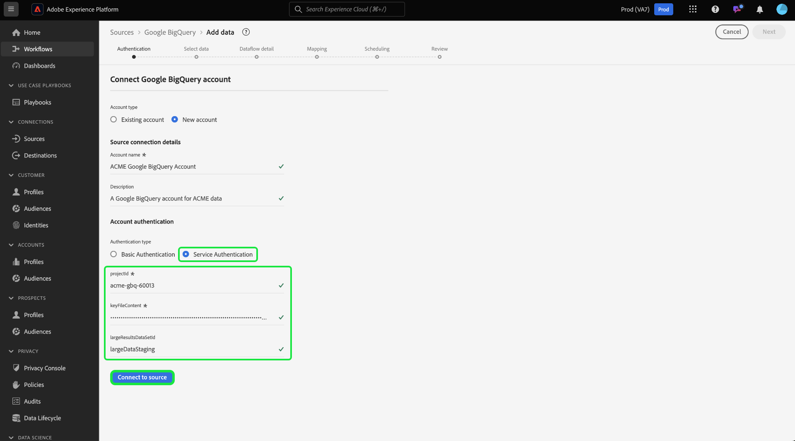

# UI での [!DNL Google BigQuery] ソース接続の作成

>[!IMPORTANT]
>
>Real-time Customer Data Platform Ultimate を購入したユーザーは、ソースカタログで [!DNL Google BigQuery] ソースを利用できます。

ユーザーインターフェイスを使用して [!DNL Google BigQuery] アカウントをAdobe Experience Platformに接続する方法については、このチュートリアルをお読みください。

## 基本を学ぶ

このチュートリアルは、 Experience Platform の次のコンポーネントを実際に利用および理解しているユーザーを対象としています。

* [[!DNL Experience Data Model (XDM)] システム](../../../../../xdm/home.md)：Experience Platform が顧客体験データの整理に使用する標準化されたフレームワーク。
   * [スキーマ構成の基本](../../../../../xdm/schema/composition.md)：スキーマ構成の主要な原則やベストプラクティスなど、XDM スキーマの基本的な構成要素について学びます。
   * [スキーマエディターのチュートリアル](../../../../../xdm/tutorials/create-schema-ui.md)：スキーマエディター UI を使用してカスタムスキーマを作成する方法を説明します。
* [[!DNL Real-Time Customer Profile]](../../../../../profile/home.md)：複数のソースからの集計データに基づいて、統合されたリアルタイムの顧客プロファイルを提供します。

既に有効な [!DNL Google BigQuery] 接続がある場合は、このドキュメントの残りの部分をスキップして、[データフローの設定](../../dataflow/databases.md)に関するチュートリアルに進むことができます。

### 必要な資格情報の収集

必要な認証情報の収集に関する詳細な手順については、[[!DNL Google BigQuery]  認証ガイド ](../../../../connectors/databases/bigquery.md#generate-your-google-bigquery-credentials) を参照してください。

## Google BigQuery アカウントを接続

Platform UI の左側のナビゲーションバーで「**[!UICONTROL ソース]**」を選択して、[!UICONTROL ソース]ワークスペースにアクセスします。[!UICONTROL  カタログ ] 画面には、アカウントを作成できる様々なソースが表示されます。 画面の左側にあるカタログから適切なカテゴリを選択することができます。または、検索バーを使用して、利用したい特定のソースを見つけることもできます。

「[!UICONTROL Databases]」カテゴリで、「**[!UICONTROL Google BigQuery]**」を選択し、「**[!UICONTROL Add data]**」を選択します。

>[!TIP]
>
>ソースカタログ内のソースは、特定のソースがまだ認証済みのアカウントを持っていない場合に「**[!UICONTROL 設定]**」オプションを表示します。 認証済みアカウントが存在すると、このオプションは **[!UICONTROL データを追加]** に変わります。

**[!UICONTROL Google Big Query に接続]** ページが表示されます。 このページでは、新しい資格情報または既存の資格情報を使用できます。

### 既存のアカウント

既存のアカウントに接続するには、接続する [!DNL Google BigQuery] アカウントを選択し、「**[!UICONTROL 次へ]**」を選択して続行します。

### 新規アカウント

新しいアカウントを作成する場合は、「**[!UICONTROL 新しいアカウント]**」を選択し、新しい [!DNL Google BigQuery] アカウントの名前と説明（オプション）を入力します。

>[!BEGINTABS]

>[!TAB  基本認証の使用 ]

基本認証を使用する場合は、「**[!UICONTROL 基本認証]**」を選択し、[ プロジェクト、クライアント ID、クライアント秘密鍵、更新トークン、（オプション）大きな結果データセット ID](../../../../connectors/databases/bigquery.md#generate-your-google-bigquery-credentials) の値を入力します。 終了したら「**[!UICONTROL ソースに接続]**」を選択し、接続が確立されるまでしばらく待ちます。

>[!TAB  サービス認証の使用 ]

サービス認証を使用するには、「**[!UICONTROL サービス認証]**」を選択し、[ プロジェクト ID、キーファイルの内容、（オプション）大きな結果データセット ID](../../../../connectors/databases/bigquery.md#generate-your-google-bigquery-credentials) の値を指定します。 終了したら「**[!UICONTROL ソースに接続]**」を選択し、接続が確立されるまでしばらく待ちます。

>[!ENDTABS]

### サンプルデータのプレビューをスキップ {#skip-preview-of-sample-data}

データ選択手順で、大きなテーブルまたはファイルのデータを取り込む際にタイムアウトが発生することがあります。 データプレビューをスキップして、タイムアウトを回避し、サンプルデータがなくてもスキーマを表示できます。 データのプレビューをスキップするには、「サンプルデータのプレビューをスキップ **[!UICONTROL 切替スイッチを有効]** します。

残りのワークフローは変わりません。 唯一の注意点は、データのプレビューをスキップすると、マッピングステップ中に計算フィールドと必須フィールドが自動検証されない可能性があり、マッピング中にこれらのフィールドを手動で検証する必要があるということです。

## 次の手順

このチュートリアルでは、[!DNL Google BigQuery] アカウントとの接続を確立しました。次のチュートリアルに進み、[データを Platform に取り込むためのデータフローの設定](../../dataflow/databases.md)を行いましょう。
