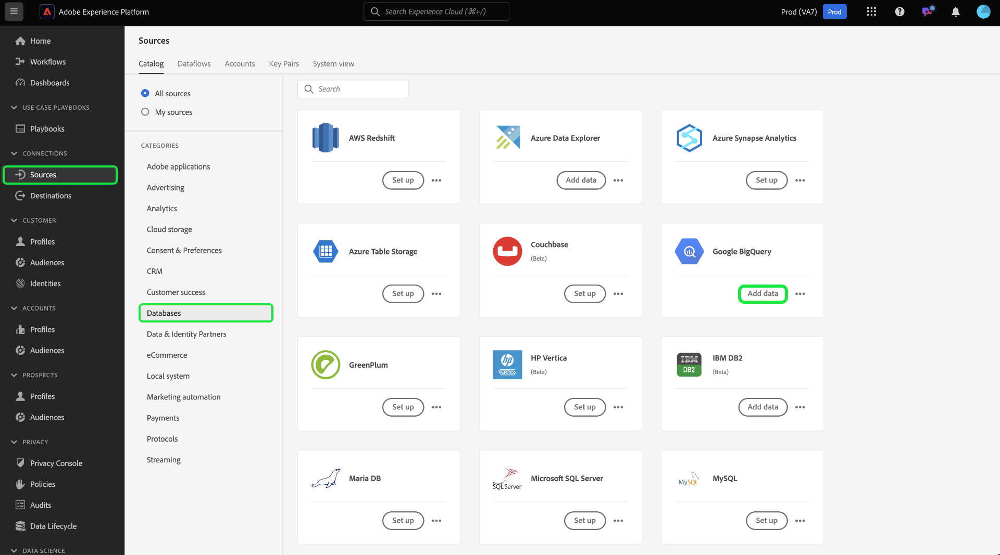

# UI での [!DNL Google Big Query] ソース接続の作成

Adobe Experience Platform のソースコネクタには、外部ソースの データを設定したスケジュールに従って取り込む機能が用意されています。 このチュートリアルでは、 [!DNL Google Big Query] Platform ユーザーインターフェイスを使用したソース接続

## はじめに

このチュートリアルは、 Experience Platform の次のコンポーネントを実際に利用および理解しているユーザーを対象としています。

* [[!DNL Experience Data Model (XDM)] システム](../../../../../xdm/home.md)：Experience Platform が顧客体験データの整理に使用する標準化されたフレームワーク。
   * [スキーマ構成の基本](../../../../../xdm/schema/composition.md)：スキーマ構成の主要な原則やベストプラクティスなど、XDM スキーマの基本的な構成要素について学びます。
   * [スキーマエディターのチュートリアル](../../../../../xdm/tutorials/create-schema-ui.md)：スキーマエディター UI を使用してカスタムスキーマを作成する方法を説明します。
* [[!DNL Real-Time Customer Profile]](../../../../../profile/home.md)：複数のソースからの集計データに基づいて、統合されたリアルタイムの顧客プロファイルを提供します。

既に有効な [!DNL Google BigQuery] 接続がある場合は、このドキュメントの残りの部分をスキップして、[データフローの設定](../../dataflow/databases.md)に関するチュートリアルに進むことができます。

### 必要な認証情報の収集

次の項目にアクセスするには、 [!DNL Google BigQuery] Platform のアカウントで、次の OAuth 2.0 認証値を指定する必要があります。

| 資格情報 | 説明 |
| ---------- | ----------- |
| `project` | デフォルトのプロジェクト ID [!DNL Google BigQuery] クエリするプロジェクト。 |
| `clientID` | 更新トークンの生成に使用する ID 値。 |
| `clientSecret` | 更新トークンの生成に使用するシークレット値。 |
| `refreshToken` | から取得した更新トークン [!DNL Google] ～へのアクセスを許可するために使用される [!DNL Google BigQuery]. |

これらの値について詳しくは、 [この [!DNL Google BigQuery] 文書](https://cloud.google.com/storage/docs/json_api/v1/how-tos/authorizing).

## Google BigQuery アカウントに接続

Platform の UI で、左側のナビゲーションバーで「**[!UICONTROL ソース]**」を選択し、[!UICONTROL ソース]ワークスペースにアクセスします。[!UICONTROL カタログ]画面には、アカウントを作成できる様々なソースが表示されます。

画面の左側にあるカタログから適切なカテゴリを選択することができます。または、検索バーを使用して、利用したい特定のソースを見つけることもできます。

以下 [!UICONTROL データベース] カテゴリ、選択 **[!UICONTROL Google BigQuery]** 次に、 **[!UICONTROL データを追加]**.

この **[!UICONTROL Google Big Query に接続]** ページが表示されます。 このページでは、新しい資格情報または既存の資格情報を使用できます。

### 既存のアカウント

既存のアカウントに接続するには、 [!DNL Google BigQuery] 接続するアカウントを選択し、 **[!UICONTROL 次へ]** をクリックして続行します。

### 新しいアカウント

新しい資格情報を使用している場合は、「**[!UICONTROL 新しいアカウント]**」を選択します。表示される入力フォームで、名前、説明（オプション）および [!DNL Google BigQuery] 資格情報。 終了したら「**[!UICONTROL ソースに接続]**」を選択し、新しい接続が確立されるまでしばらく待ちます。

## 次の手順

このチュートリアルでは、[!DNL Google BigQuery] アカウントとの接続を確立しました。次のチュートリアルに進み、[データを Platform に取り込むためのデータフローの設定](../../dataflow/databases.md)を行いましょう。
