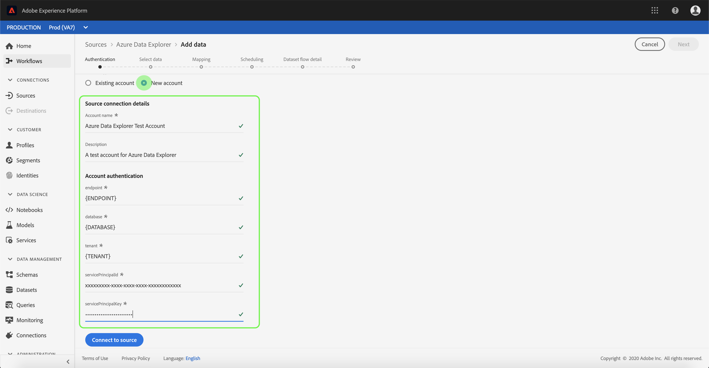

# UIにAzure Data Explorerソースコネクタを作成する

Adobe Experience Platformのソースコネクターは、外部ソースのデータをスケジュールに基づいて取り込む機能を提供します。 このチュートリアルでは、プラットフォームユーザーインターフェイスを使用してAzure Data Explorer （以下、「Data Explorer」と呼ばれる）ソースコネクタを作成する手順を説明します。

## はじめに

このチュートリアルでは、Adobe Experience Platformの次のコンポーネントについて、十分に理解している必要があります。

* [Experience Data Model(XDM)System](../../../../../xdm/home.md): エクスペリエンスプラットフォームが顧客エクスペリエンスデータを編成する際に使用する標準化されたフレームワークです。
   * [スキーマ構成の基本](../../../../../xdm/schema/composition.md): XDMスキーマの基本構成要素について説明します。この基本構成要素には、スキーマ構成の主な原則とベストプラクティスが含まれます。
   * [スキーマエディタのチュートリアル](../../../../../xdm/tutorials/create-schema-ui.md): スキーマエディターのUIを使用してカスタムスキーマを作成する方法を説明します。
* [リアルタイム顧客プロファイル](../../../../../profile/home.md): 複数のソースからの集計データに基づいて、統合されたリアルタイムの消費者プロファイルを提供します。

既に有効なData Explorer接続がある場合は、このドキュメントの残りの部分をスキップして、データフローの [設定に関するチュートリアルに進むことができます](../../dataflow/databases.md)。

### 必要な資格情報の収集

プラットフォーム上のデータエクスプローラーアカウントにアクセスするには、次の値を指定する必要があります。

| Credential | 説明 |
| ---------- | ----------- |
| `endpoint` | Data Explorerサーバーのエンドポイント。 |
| `database` | Data Explorerデータベースの名前。 |
| `tenant` | Data Explorerデータベースへの接続に使用する一意のテナントID。 |
| `servicePrincipalId` | Data Explorerデータベースへの接続に使用する一意のサービスプリンシパルID。 |
| `servicePrincipalKey` | Data Explorerデータベースへの接続に使用する一意のサービスプリンシパルキーです。 |

使い始める前に、 [このData Explorerドキュメントを参照してください](https://docs.microsoft.com/en-us/azure/data-explorer/kusto/management/access-control/how-to-authenticate-with-aad)。

## Azure Data Explorerアカウントの接続

必要な資格情報を収集したら、次の手順に従って新しいData Explorerアカウントを作成し、プラットフォームに接続します。

[Adobe Experience Platformにログインし、左のナビゲーションバーで「](https://platform.adobe.com) Sources **** 」を選択して *Sources* ワークスペースにアクセスします。 カ *[!UICONTROL タログ]* 画面には様々なソースが表示され、このソースから受信アカウントを作成できます。各ソースには既存のアカウントの数と関連するデータセットフローが表示されます。

画面の左側にあるカタログから適切なカテゴリを選択できます。 または、検索オプションを使用して、使用する特定のソースを見つけることもできます。

[ *[!UICONTROL Databases]* ]カテゴリの下で、[ **[!UICONTROL Azure Data Explorer]** ]を選択し、[+]アイコン(+) **** をクリックして新しいData Explorerコネクタを作成します。

[ *[!UICONTROL Azure Data Explorerに]* 接続]ページが表示されます。 このページでは、新しい秘密鍵証明書または既存の秘密鍵証明書を使用できます。

### 新しいアカウント

新しい資格情報を使用する場合は、「 **[!UICONTROL 新規アカウント]**」を選択します。 表示される入力フォームで、接続に名前、オプションの説明、およびデータエクスプローラの資格情報を入力します。 完了したら、[ **[!UICONTROL 接続]** ]を選択し、新しいアカウントが確立されるまでの時間を許可します。

### 既存のアカウント

既存のアカウントに接続するには、接続するデータエクスプローラアカウントを選択し、「 **[!UICONTROL 次へ]** 」を選択して次に進みます。

## 次の手順

このチュートリアルに従って、Data Explorerアカウントへの接続を確立しました。 次のチュートリアルに進み、データをプラットフォームに取り込むようにデータフローを [設定できるようになりました](../../dataflow/databases.md)。