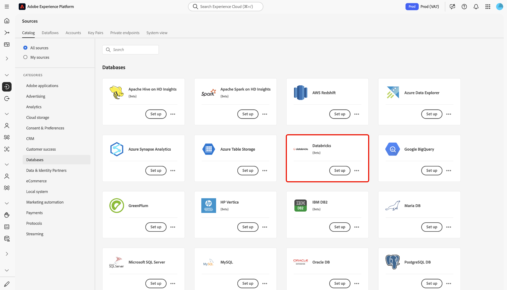
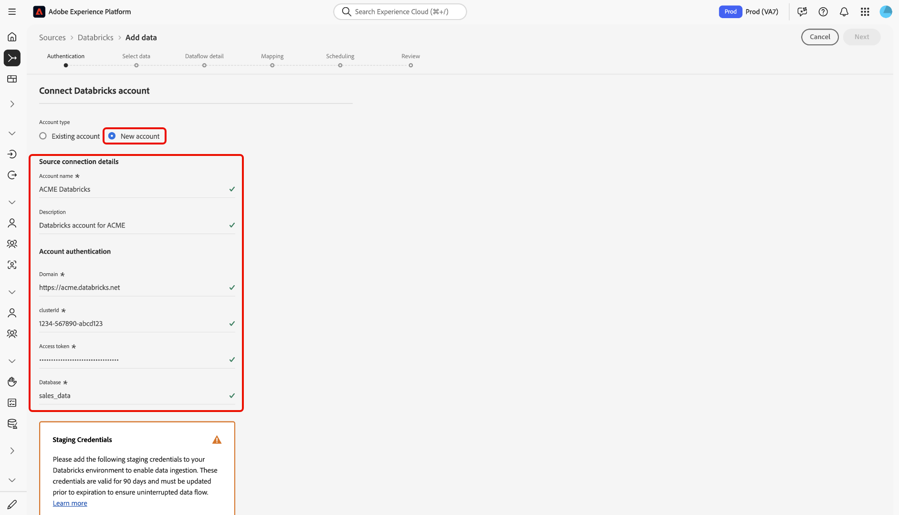
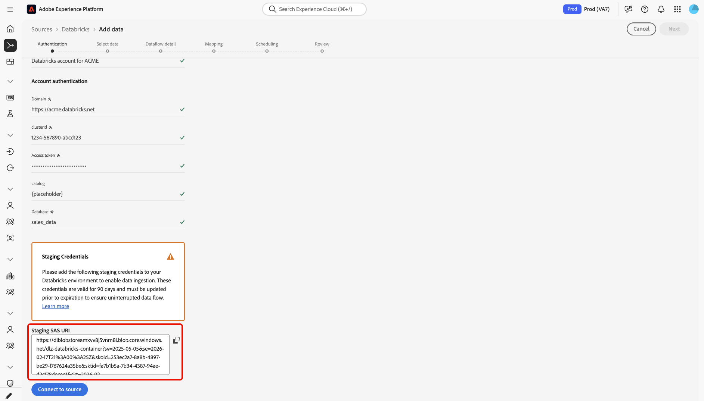

# UIで[!DNL Databricks]をExperience Platformに接続

>[!AVAILABILITY]
>
>[!DNL Databricks] ソースは、Real-Time CDP Ultimateを購入したユーザーがソースカタログで利用できます。

このガイドでは、UIでソースワークスペースを使用して[!DNL Databricks] アカウントをAdobe Experience Platformに接続する方法について説明します。

## 基本を学ぶ

このガイドは、Adobe Experience Platform の次のコンポーネントを実際に利用および理解しているユーザーを対象としています。

* [ ソース ](../../../../home.md): Experience Platformを使用すると、様々なソースからデータを取り込むことができますが、Experience Platform サービスを使用して着信データを構造化、ラベル付け、強化することができます。
* [ サンドボックス ](../../../../../sandboxes/home.md): Experience Platformは、1つのExperience Platform インスタンスを個別のバーチャル環境に分割して、デジタルエクスペリエンスアプリケーションの開発と進化に役立つバーチャルサンドボックスを提供します。

### 必要な資格情報の収集

[!DNL Databricks]をExperience Platformに接続するために、次の資格情報の値を指定してください。

| 資格情報 | 説明 |
| --- | --- |
| ドメイン | [!DNL Databricks] ワークスペースのURL。 例：`https://adb-1234567890123456.7.azuredatabricks.net` |
| クラスターID | [!DNL Databricks]のクラスターのID。 このクラスターは既に既存のクラスターである必要があり、インタラクティブクラスターである必要があります。 |
| アクセストークン | [!DNL Databricks] アカウントを認証するアクセストークン。 [!DNL Databricks] ワークスペースを使用してアクセストークンを生成できます。 |
| データベース | 差分レイク内のデータベースの名前。 |

詳しくは、[[!DNL Databricks] 概要](../../../../connectors/databases/databricks.md)を参照してください。

## ソースカタログを移動する

Experience Platform UIで、左側のナビゲーションから「**[!UICONTROL Sources]**」を選択して、*[!UICONTROL Sources]* ワークスペースにアクセスします。 カテゴリーを選択するか検索バーを使って探し出してください。

[!DNL Databricks]に接続するには、*[!UICONTROL Databases]* カテゴリに移動し、**[!UICONTROL Azure Databricks]** ソースカードを選択してから、**[!UICONTROL Set up]**&#x200B;を選択します。

>[!TIP]
>
>ソースカタログのソースには、特定のソースがまだ認証済みアカウントを持っていない場合、**[!UICONTROL Set up]** オプションが表示されます。 認証済みアカウントが作成されると、このオプションは&#x200B;**[!UICONTROL Add data]**&#x200B;に変更されます。

### 既存のアカウントの使用

既存のアカウントを使用するには、**[!UICONTROL Existing account]**&#x200B;を選択し、使用する[!DNL Azure Databricks] アカウントを選択します。

### 新しいアカウントを作成

新しいアカウントを作成するには、**[!UICONTROL New account]**&#x200B;を選択して名前を指定し、オプションでアカウントの説明を追加します。 次に、次の認証情報の値を指定します。

* ドメイン
* クラスターID
* アクセストークン
* データベース
* カタログ

さらに、[!UICONTROL Staging SAS URI]資格情報をコピーして[!DNL Azure Databricks]環境に貼り付ける必要があります。 終了したら、**[!UICONTROL Connect to source]**&#x200B;を選択し、接続が確立されるまでしばらく待ちます。

## [!DNL Azure Databricks] データのデータフローを作成

[!DNL Azure Databricks] アカウントを正常に接続したので、[ データフローを作成し、データベースからExperience Platform](../../dataflow/databases.md)にデータを取り込むことができます。
