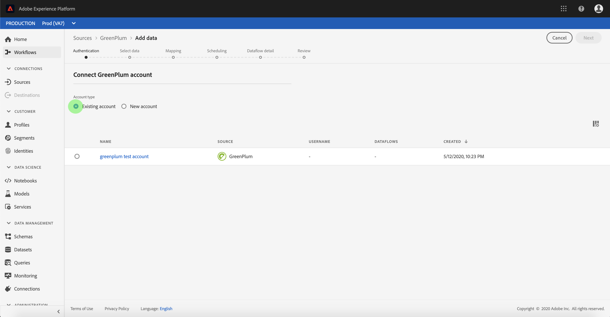

# UI での [!DNL GreenPlum] ソース接続の作成

Adobe Experience PlatformのSource コネクタには、外部ソースのデータをスケジュールに従って取り込む機能が用意されています。 このチュートリアルでは、[!DNL Experience Platform] ユーザーインターフェイスを使用して [!DNL GreenPlum] ソースコネクタを作成する手順を説明します。

## はじめに

このチュートリアルは、Adobe Experience Platform の次のコンポーネントを実際に利用および理解しているユーザーを対象としています。

* [[!DNL Experience Data Model (XDM)]  システム](../../../../../xdm/home.md)：[!DNL Experience Platform] が顧客体験データの整理に使用する標準化されたフレームワーク。
   * [スキーマ構成の基本](../../../../../xdm/schema/composition.md)：スキーマ構成の主要な原則やベストプラクティスなど、XDM スキーマの基本的な構成要素について学びます。
   * [スキーマエディターのチュートリアル](../../../../../xdm/tutorials/create-schema-ui.md)：スキーマエディター UI を使用してカスタムスキーマを作成する方法を説明します。
* [[!DNL Real-Time Customer Profile]](../../../../../profile/home.md)：複数のソースからの集計データに基づいて、統合されたリアルタイムの顧客プロファイルを提供します。

既に有効な [!DNL GreenPlum] 接続がある場合は、このドキュメントの残りの部分をスキップして、[データフローの設定](../../dataflow/databases.md)に関するチュートリアルに進むことができます。

### 必要な資格情報の収集

次の節では、[!DNL Flow Service] API を使用してに正常に接続するために必要な追加情報を示 [!DNL GreenPlum] ています。

| 資格情報 | 説明 |
| ---------- | ----------- |
| `connectionString` | [!DNL GreenPlum] インスタンスへの接続に使用する接続文字列。 [!DNL GreenPlum] の接続文字列パターンは `Server={SERVER};Port={PORT};Database={DATABASE};UID={USERNAME};PWD={PASSWORD}` です |

基本について詳しくは、[&#x200B; この GreenPlum ドキュメント &#x200B;](https://docs.greenplum.org/6-7/security-guide/topics/Authenticate.html) を参照してください。

## [!DNL GreenPlum] アカウントの接続

必要な資格情報が揃ったら、次の手順に従って、[!DNL GreenPlum] アカウントを [!DNL Experience Platform] にリンクします。

[Adobe Experience Platform](https://platform.adobe.com) にログインし、左側のナビゲーションバーから **[!UICONTROL ソース]** を選択して **[!UICONTROL ソース]** ワークスペースにアクセスします。 **[!UICONTROL カタログ]**&#x200B;画面には、アカウントを作成できる様々なソースが表示されます。

画面の左側にあるカタログから適切なカテゴリを選択することができます。または、使用する特定のソースを検索オプションを使用して探すこともできます。

**[!UICONTROL Databases]** カテゴリの下で、「**[!UICONTROL GreenPlum]**」を選択します。 このコネクタを初めて使用する場合は、「**[!UICONTROL 設定]**」を選択します。 それ以外の場合は、「**[!UICONTROL データを追加]**」を選択して、新しい [!DNL GreenPlum] コネクタを作成します。

**[!UICONTROL GreenPlum に接続]** ページが表示されます。 このページでは、新しい資格情報または既存の資格情報を使用できます。

### 新しいアカウント

新しい資格情報を使用している場合は、「**[!UICONTROL 新しいアカウント]**」を選択します。表示される入力フォームで、名前、説明（オプション）、[!DNL GreenPlum] 資格情報を入力します。 終了したら「**[!UICONTROL 接続]**」を選択し、新しい接続が確立されるまでしばらく待ちます。

### 既存のアカウント

既存のアカウントに接続するには、接続する [!DNL GreenPlum] アカウントを選択し、右上隅にある **[!UICONTROL 次へ]** を選択して続行します。

## 次の手順

このチュートリアルでは、[!DNL GreenPlum] アカウントとの接続を確立しました。次のチュートリアルに進み、[&#x200B; データをに取り込むためのデータフローの設定  [!DNL Experience Platform]](../../dataflow/databases.md) を行いましょう。
