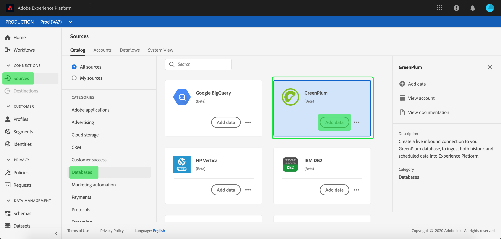

# UI での [!DNL GreenPlum] ソース接続の作成

Adobe Experience Platform のソースコネクタには、外部ソースの データを設定したスケジュールに従って取り込む機能が用意されています。 このチュートリアルでは、 [!DNL GreenPlum] を使用したソースコネクタ [!DNL Platform] ユーザーインターフェイス。

## はじめに

このチュートリアルは、Adobe Experience Platform の次のコンポーネントを実際に利用および理解しているユーザーを対象としています。

* [[!DNL Experience Data Model (XDM)]  システム](../../../../../xdm/home.md)：[!DNL Experience Platform] が顧客体験データの整理に使用する標準化されたフレームワーク。
   * [スキーマ構成の基本](../../../../../xdm/schema/composition.md)：スキーマ構成の主要な原則やベストプラクティスなど、XDM スキーマの基本的な構成要素について学びます。
   * [スキーマエディターのチュートリアル](../../../../../xdm/tutorials/create-schema-ui.md)：スキーマエディター UI を使用してカスタムスキーマを作成する方法を説明します。
* [[!DNL Real-Time Customer Profile]](../../../../../profile/home.md)：複数のソースからの集計データに基づいて、統合されたリアルタイムの顧客プロファイルを提供します。

既に有効な [!DNL GreenPlum] 接続がある場合は、このドキュメントの残りの部分をスキップして、[データフローの設定](../../dataflow/databases.md)に関するチュートリアルに進むことができます。

### 必要な認証情報の収集

次の節では、に正常に接続するために知っておく必要がある追加情報を示します。 [!DNL GreenPlum] の使用 [!DNL Flow Service] API

| 資格情報 | 説明 |
| ---------- | ----------- |
| `connectionString` | の [!DNL GreenPlum] インスタンス。 次の接続文字列パターン： [!DNL GreenPlum] が `Server={SERVER};Port={PORT};Database={DATABASE};UID={USERNAME};PWD={PASSWORD}` |

の導入について詳しくは、 [この GreenPlum ドキュメント](https://docs.greenplum.org/6-7/security-guide/topics/Authenticate.html).

## [!DNL GreenPlum] アカウントの接続

必要な認証情報が揃ったら、次の手順に従って、[!DNL GreenPlum] アカウントを [!DNL Platform] にリンクします。

にログインします。 [Adobe Experience Platform](https://platform.adobe.com) 次に、 **[!UICONTROL ソース]** 左側のナビゲーションバーから **[!UICONTROL ソース]** ワークスペース。 **[!UICONTROL カタログ]**&#x200B;画面には、アカウントを作成できる様々なソースが表示されます。

画面の左側にあるカタログから適切なカテゴリを選択することができます。または、使用する特定のソースを検索オプションを使用して探すこともできます。

以下 **[!UICONTROL データベース]** カテゴリ、選択 **[!UICONTROL GreenPlum]**. このコネクタを初めて使用する場合は、「 **[!UICONTROL 設定]**. それ以外の場合は、「 **[!UICONTROL データを追加]** 新しい [!DNL GreenPlum] コネクタ。

この **[!UICONTROL GreenPlum に接続]** ページが表示されます。 このページでは、新しい資格情報または既存の資格情報を使用できます。

### 新しいアカウント

新しい資格情報を使用している場合は、「**[!UICONTROL 新しいアカウント]**」を選択します。表示される入力フォームで、名前、説明（オプション）および [!DNL GreenPlum] 資格情報。 終了したら、「 」を選択します。 **[!UICONTROL 接続]** その後、新しい接続が確立されるまでしばらく時間をかけます。

### 既存のアカウント

既存のアカウントに接続するには、 [!DNL GreenPlum] 接続するアカウントを選択し、 **[!UICONTROL 次へ]** をクリックして次に進みます。

## 次の手順

このチュートリアルでは、[!DNL GreenPlum] アカウントとの接続を確立しました。次のチュートリアルに進み、[データを に取り込むためのデータフローの設定 [!DNL Platform]](../../dataflow/databases.md)を行いましょう。
