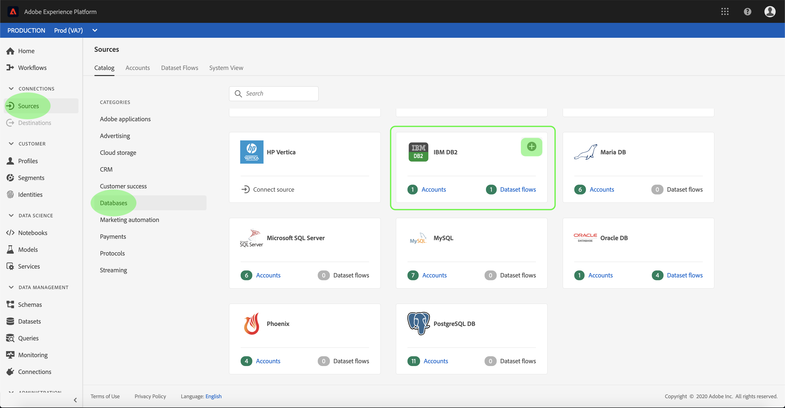

# UI でのIBM DB2 ソース接続の作成

>[!NOTE]
>
> IBM DB2 コネクタはベータ版です。 詳しくは、 [ソースの概要](../../../../home.md#terms-and-conditions) ベータ版のコネクタの使用に関する詳細

Adobe Experience Platform のソースコネクタには、外部ソースの データを設定したスケジュールに従って取り込む機能が用意されています。 このチュートリアルでは、 [!DNL Platform] ユーザーインターフェイス。

## はじめに

このチュートリアルは、Adobe Experience Platform の次のコンポーネントを実際に利用および理解しているユーザーを対象としています。

* [[!DNL Experience Data Model (XDM)]  システム](../../../../../xdm/home.md)：[!DNL Experience Platform] が顧客体験データの整理に使用する標準化されたフレームワーク。
   * [スキーマ構成の基本](../../../../../xdm/schema/composition.md)：スキーマ構成の主要な原則やベストプラクティスなど、XDM スキーマの基本的な構成要素について学びます。
   * [スキーマエディターのチュートリアル](../../../../../xdm/tutorials/create-schema-ui.md)：スキーマエディター UI を使用してカスタムスキーマを作成する方法を説明します。
* [[!DNL Real-time Customer Profile]](../../../../../profile/home.md)：複数のソースからの集計データに基づいて、統合されたリアルタイムの顧客プロファイルを提供します。

既に有効な DB2 接続がある場合は、このドキュメントの残りの部分をスキップし、次のドキュメントのチュートリアルに進んでください。 [データフローの設定](../../dataflow/databases.md).

### 必要な認証情報の収集

以下の節では、 [!DNL Flow Service] API

| 認証情報 | 説明 |
| ---------- | ----------- |
| `server` | DB2 サーバーの名前。 サーバー名の後にコロンで区切ったポート番号を指定できます。 例：server:port. |
| `database` | DB2 データベースの名前。 |
| `username` | DB2 データベースへの接続に使用するユーザー名。 |
| `password` | ユーザー名に指定したユーザーアカウントのパスワード。 |

の導入について詳しくは、 [この DB2 ドキュメント](https://www.ibm.com/support/knowledgecenter/SSFMBX/com.ibm.swg.im.dashdb.doc/connecting/connect_credentials.html).

## IBM DB2 アカウントの接続

必要な資格情報を収集したら、次の手順に従って、DB2 アカウントをにリンクできます。 [!DNL Platform].

にログインします。 [Adobe Experience Platform](https://platform.adobe.com) 次に、 **[!UICONTROL ソース]** 左側のナビゲーションバーから **[!UICONTROL ソース]** ワークスペース。 **[!UICONTROL カタログ]**&#x200B;画面には、アカウントを作成できる様々なソースが表示されます。

画面の左側にあるカタログから適切なカテゴリを選択することができます。または、使用する特定のソースを検索オプションを使用して探すこともできます。

以下 **[!UICONTROL データベース]** カテゴリ、選択 **[!UICONTROL IBM DB2]**. このコネクタを初めて使用する場合は、「 **[!UICONTROL 設定]**. それ以外の場合は、「 **[!UICONTROL データを追加]** 新しい DB2 コネクタを作成します。

この **[!UICONTROL IBM DB2 に接続]** ページが表示されます。 このページでは、新しい資格情報または既存の資格情報を使用できます。

### 新しいアカウント

新しい資格情報を使用している場合は、「 **[!UICONTROL 新しいアカウント]**. 表示される入力フォームで、名前、説明（オプション）および DB2 資格情報を入力します。 終了したら、「 」を選択します。 **[!UICONTROL 接続]** その後、新しい接続が確立されるまでしばらく時間をかけます。

### 既存のアカウント

既存のアカウントに接続するには、接続する DB2 アカウントを選択し、「 」を選択します **[!UICONTROL 次へ]** をクリックして続行します。

## 次の手順

このチュートリアルに従って、DB2 アカウントへの接続を確立しました。 次のチュートリアルに進み、[データを に取り込むためのデータフローの設定 [!DNL Platform]](../../dataflow/databases.md)を行いましょう。
