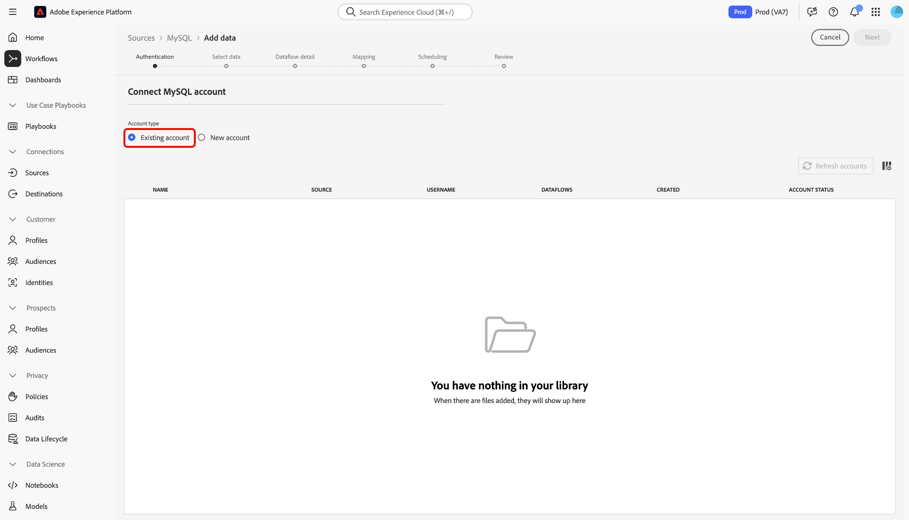

# UI での [!DNL MySQL] ソース接続の作成

Adobe Experience Platform のソースコネクタには、外部ソースの データを設定したスケジュールに従って取り込む機能が用意されています。 このチュートリアルでは、 [!DNL MySQL] Adobe Experience Platform UI を使用したソース接続

## はじめに

このチュートリアルは、Adobe Experience Platform の次のコンポーネントを実際に利用および理解しているユーザーを対象としています。

* [[!DNL Experience Data Model (XDM)] システム](../../../../../xdm/home.md)：Experience Platform が顧客体験データの整理に使用する標準化されたフレームワーク。
   * [スキーマ構成の基本](../../../../../xdm/schema/composition.md)：スキーマ構成の主要な原則やベストプラクティスなど、XDM スキーマの基本的な構成要素について学びます。
   * [スキーマエディターのチュートリアル](../../../../../xdm/tutorials/create-schema-ui.md)：スキーマエディター UI を使用してカスタムスキーマを作成する方法を説明します。
* [[!DNL Real-Time Customer Profile]](../../../../../profile/home.md)：複数のソースからの集計データに基づいて、統合されたリアルタイムの顧客プロファイルを提供します。

既に [!DNL MySQL] 接続する場合は、このドキュメントの残りの部分をスキップして、 [データフローの設定](../../dataflow/databases.md).

### 必要な資格情報の収集

次の項目にアクセスするには、 [!DNL MySQL] アカウント [!DNL Platform]に値を指定する必要があります。

| 資格情報 | 説明 |
| ---------- | ----------- |
| `connectionString` | この [!DNL MySQL] アカウントに関連付けられた接続文字列。 この [!DNL MySQL] 接続文字列のパターン： `Server={SERVER};Port={PORT};Database={DATABASE};UID={USERNAME};PWD={PASSWORD}`. 接続文字列の詳細と取得方法については、 [[!DNL MySQL] 文書](https://dev.mysql.com/doc/connector-net/en/connector-net-connections-string.html). |

## [!DNL MySQL] アカウントの接続

必要な認証情報が揃ったら、次の手順に従って、[!DNL MySQL] アカウントを [!DNL Platform] にリンクします。

にログインします。 [Adobe Experience Platform](https://platform.adobe.com) 次に、 **[!UICONTROL ソース]** 左側のナビゲーションバーから **[!UICONTROL ソース]** ワークスペース。 **[!UICONTROL カタログ]**&#x200B;画面には、アカウントを作成できる様々なソースが表示されます。

以下 **[!UICONTROL データベース]** カテゴリ、選択 **[!UICONTROL MySQL]**. このコネクタを初めて使用する場合は、「 **[!UICONTROL 設定]**. それ以外の場合は、「 **[!UICONTROL データを追加]** 新しい [!DNL MySQL] コネクタ。

この **[!UICONTROL MySQL に接続]** ページが表示されます。 このページでは、新しい資格情報または既存の資格情報を使用できます。

### 新しいアカウント

新しい資格情報を使用している場合は、「**[!UICONTROL 新しいアカウント]**」を選択します。表示される入力フォームで、名前、説明（オプション）および [!DNL MySQL] 資格情報。 終了したら、「 」を選択します。 **[!UICONTROL 接続]** その後、新しい接続が確立されるまでしばらく時間をかけます。

### 既存のアカウント

既存のアカウントに接続するには、 [!DNL MySQL] 接続するアカウントを選択し、 **[!UICONTROL 次へ]** をクリックして続行します。

## 次の手順

このチュートリアルに従って、MySQL アカウントへの接続を確立しました。 次のチュートリアルに進み、[データを に取り込むためのデータフローの設定 [!DNL Platform]](../../dataflow/databases.md)を行いましょう。
