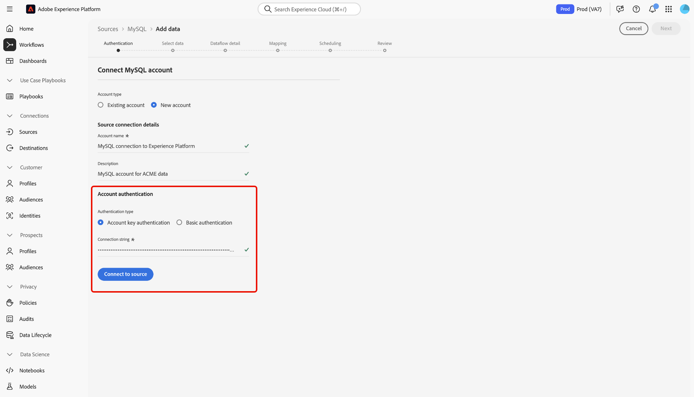

# UI を使用した [!DNL MySQL] のExperience Platformへの接続

このガイドでは、Experience Platform ユーザーインターフェイスのソースワークスペースを使用して [!DNL MySQL] データベースをAdobe Experience Platformに接続する方法について説明します。

## はじめに

このチュートリアルは、Adobe Experience Platform の次のコンポーネントを実際に利用および理解しているユーザーを対象としています。

* [[!DNL Experience Data Model (XDM)] システム](../../../../../xdm/home.md)：Experience Platform が顧客体験データの整理に使用する標準化されたフレームワーク。
   * [スキーマ構成の基本](../../../../../xdm/schema/composition.md)：スキーマ構成の主要な原則やベストプラクティスなど、XDM スキーマの基本的な構成要素について学びます。
   * [スキーマエディターのチュートリアル](../../../../../xdm/tutorials/create-schema-ui.md)：スキーマエディター UI を使用してカスタムスキーマを作成する方法を説明します。
* [[!DNL Real-Time Customer Profile]](../../../../../profile/home.md)：複数のソースからの集計データに基づいて、統合されたリアルタイムの顧客プロファイルを提供します。

既に [!DNL MySQL] 接続がある場合は、このドキュメントの残りの部分をスキップして、[ データフローの設定 ](../../dataflow/databases.md) に関するチュートリアルに進むことができます。

### 必要な資格情報の収集

認証について詳しくは、[[!DNL MySQL]  概要 ](../../../../connectors/databases/mysql.md#prerequisites) を参照してください。

## ソースカタログのナビゲート

Experience Platformの UI で、左側のナビゲーションから **[!UICONTROL Sources]** を選択し、*[!UICONTROL Sources]* ワークスペースにアクセスします。 カテゴリを選択するか、検索バーを使用してソースを検索します。

[!DNL MySQL] に接続するには、*[!UICONTROL データベース]* カテゴリに移動し、**[!UICONTROL MySQL]** ソースカードを選択してから **[!UICONTROL 設定]** を選択します。

>[!TIP]
>
>ソースカタログ内のソースは、特定のソースがまだ認証済みのアカウントを持っていない場合に「**[!UICONTROL 設定]**」オプションを表示します。 認証済みアカウントを作成すると、このオプションは **[!UICONTROL データを追加]** に変わります。

## 既存のアカウントを使用 {#existing}

既存のアカウントを使用するには、「**[!UICONTROL 既存のアカウント]**」を選択して、使用する [!DNL MySQL] アカウントを選択します。

## 新しいアカウントを作成 {#new}

新しいアカウントを作成するには、「**[!UICONTROL 新しいアカウント]**」を選択し、アカウントの名前を入力して、オプションで説明を追加します。

### Azure 上のExperience Platformへの接続 {#azure}

アカウントキーまたは基本認証を使用して、[!DNL MySQL] データベースを Azure 上のExperience Platformに接続できます。

>[!BEGINTABS]

>[!TAB  アカウントキー認証 ]

アカウントキー認証を使用するには、「**[!UICONTROL アカウントキー認証]**」を選択し、「[ 接続文字列 ](../../../../connectors/databases/mysql.md#azure)」を入力して、「**[!UICONTROL ソースに接続]**」を選択します。

>[!TAB  基本認証 ]

基本認証を使用する場合は、「**[!UICONTROL 基本認証]**」を選択し、[ 認証資格情報 ](../../../../connectors/databases/mysql.md#azure) の値を入力して「**[!UICONTROL ソースに接続]**」を選択します。

>[!ENDTABS]

### Amazon Web ServicesのExperience Platform（AWS）への接続 {#aws}

>[!AVAILABILITY]
>
>この節の内容は、Amazon Web Services（AWS）上で動作するExperience Platformの実装に適用されます。 AWS上で動作するExperience Platformは、現在、限られた数のお客様が利用できます。 サポートされるExperience Platform インフラストラクチャについて詳しくは、[Experience Platform multi-cloud overview](../../../../../landing/multi-cloud.md) を参照してください。

新しい [!DNL MySQL] アカウントを作成し、AWSでExperience Platformに接続するには、VA6 サンドボックスに属していることを確認し、必要な [ 認証用の資格情報 ](../../../../connectors/databases/mysql.md#aws) を指定します。

## データのデータフロー [!DNL MySQL] 作成

[!DNL MySQL] データベースに正常に接続できたので、[ データフローを作成し、データベースからExperience Platformにデータを取り込む ](../../dataflow/databases.md) ことができます。
