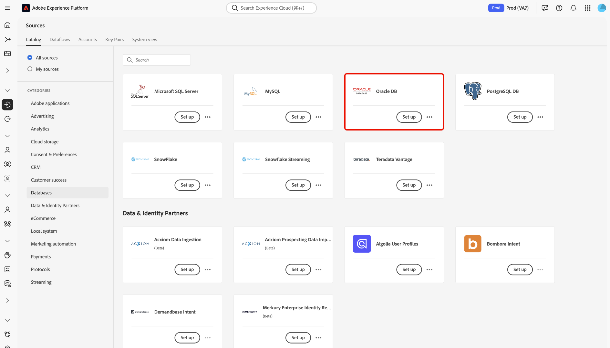
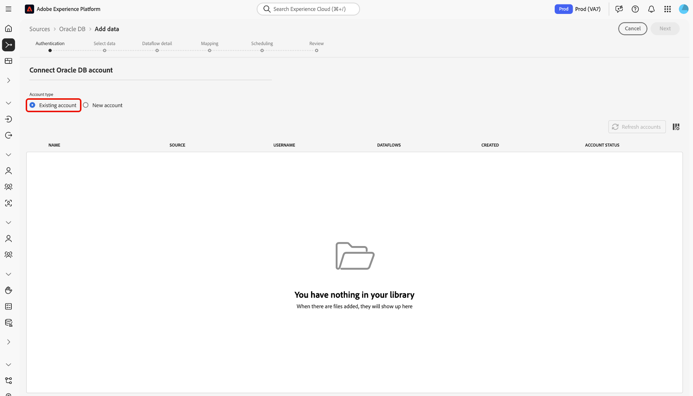

# の作成 [!DNL Oracle DB] UI のソース接続

Adobe Experience Platform のソースコネクタには、外部ソースの データを設定したスケジュールに従って取り込む機能が用意されています。 このチュートリアルでは、 [!DNL Oracle DB] を使用したソースコネクタ [!DNL Platform] ユーザーインターフェイス。

## はじめに

このチュートリアルは、Adobe Experience Platform の次のコンポーネントを実際に利用および理解しているユーザーを対象としています。

* [[!DNL Experience Data Model (XDM)]  システム](../../../../../xdm/home.md)：[!DNL Experience Platform] が顧客体験データの整理に使用する標準化されたフレームワーク。
   * [スキーマ構成の基本](../../../../../xdm/schema/composition.md)：スキーマ構成の主要な原則やベストプラクティスなど、XDM スキーマの基本的な構成要素について学びます。
   * [スキーマエディターのチュートリアル](../../../../../xdm/tutorials/create-schema-ui.md)：スキーマエディター UI を使用してカスタムスキーマを作成する方法を説明します。
* [[!DNL Real-Time Customer Profile]](../../../../../profile/home.md)：複数のソースからの集計データに基づいて、統合されたリアルタイムの顧客プロファイルを提供します。

既に有効な [!DNL Oracle DB] 接続がある場合は、このドキュメントの残りの部分をスキップして、[データフローの設定](../../dataflow/databases.md)に関するチュートリアルに進むことができます。

### 必要な認証情報の収集

 で [!DNL Oracle DB] アカウントにアクセスするには、次の値を指定する必要があります。[!DNL Platform]

| 資格情報 | 説明 |
| ---------- | ----------- |
| `connectionString` | 接続に使用する接続文字列 [!DNL Oracle DB]. この [!DNL Oracle DB] 接続文字列のパターン： `Host={HOST};Port={PORT};Sid={SID};User Id={USERNAME};Password={PASSWORD}`. |
| `connectionSpec.id` | 接続の作成に必要な一意の識別子。 の接続仕様 ID [!DNL Oracle DB] が `d6b52d86-f0f8-475f-89d4-ce54c8527328`. |

の導入について詳しくは、 [このOracle文書](https://docs.oracle.com/database/121/ODPNT/featConnecting.htm#ODPNT199).

## [!DNL Oracle DB] アカウントを接続

必要な資格情報を収集したら、次の手順に従って、 [!DNL Oracle DB] 接続するアカウント [!DNL Platform].

にログインします。 [Adobe Experience Platform](https://platform.adobe.com) 次に、 **[!UICONTROL ソース]** 左側のナビゲーションバーから **[!UICONTROL ソース]** ワークスペース。 **[!UICONTROL カタログ]**&#x200B;画面には、アカウントを作成できる様々なソースが表示されます。

画面の左側にあるカタログから適切なカテゴリを選択することができます。または、使用する特定のソースを検索オプションを使用して探すこともできます。

以下 **[!UICONTROL データベース]** カテゴリ、選択 **[!UICONTROL OracleDB]**. このコネクタを初めて使用する場合は、「 **[!UICONTROL 設定]**. それ以外の場合は、「 **[!UICONTROL データを追加]** 新しい [!DNL Oracle DB] コネクタ。

この **[!UICONTROL oracleDB に接続]** ページが表示されます。 このページでは、新しい資格情報または既存の資格情報を使用できます。

### 新しいアカウント

新しい資格情報を使用している場合は、「**[!UICONTROL 新しいアカウント]**」を選択します。表示される入力フォームで、名前、説明（オプション）および [!DNL Oracle DB] 資格情報。 終了したら、「 」を選択します。 **[!UICONTROL 接続]** その後、新しい接続が確立されるまでしばらく時間をかけます。

### 既存のアカウント

既存のアカウントに接続するには、 [!DNL Oracle DB] 接続するアカウントを選択し、 **[!UICONTROL 次へ]** をクリックして続行します。

## 次の手順

このチュートリアルでは、[!DNL Oracle DB] アカウントとの接続を確立しました。次のチュートリアルに進み、[データを に取り込むためのデータフローの設定 [!DNL Platform]](../../dataflow/databases.md)を行いましょう。
