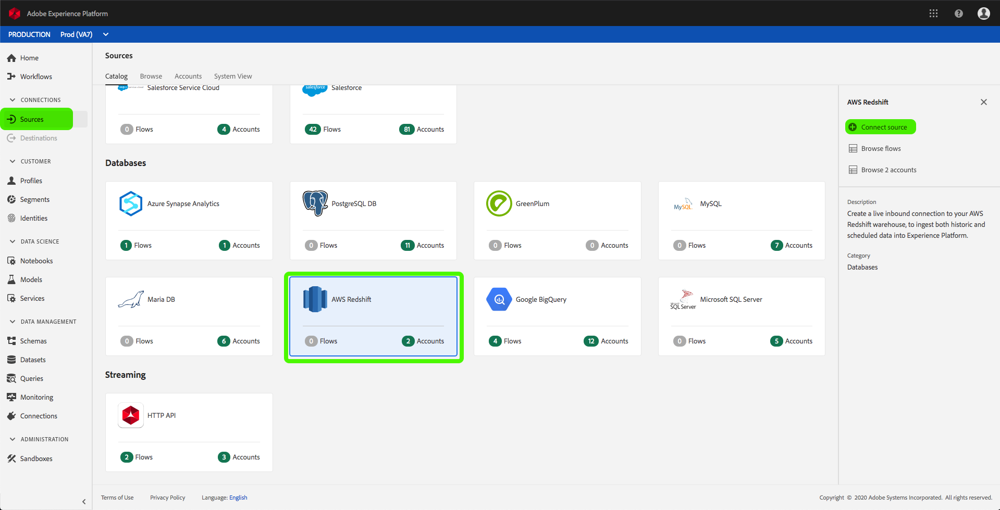
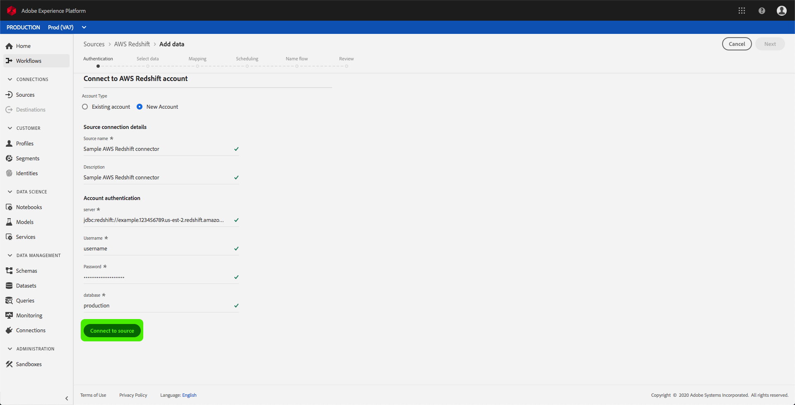

# UIでのAmazon Redshiftソースコネクタの作成

Adobe Experience Platformのソースコネクターは、外部ソースのデータをスケジュールに基づいて取り込む機能を提供します。 このチュートリアルでは、プラットフォームユーザーインターフェイスを使用してAmazon Redshift（以下「Redshift」と呼ばれる）ソースコネクタを作成する手順を説明します。

## はじめに

このチュートリアルでは、Adobe Experience Platformの次のコンポーネントについて、十分な理解を得る必要があります。

- [Experience Data Model(XDM)System](../../../../../xdm/home.md):エクスペリエンスプラットフォームが顧客エクスペリエンスデータを整理するための標準化されたフレームワーク。
   - [スキーマ構成の基本](../../../../../xdm/schema/composition.md):XDMスキーマの基本的な構成要素について説明します。この中には、主な原則や構成のベストプラクティスが含まれています。スキーマ構成の基本要素です。
   - [スキーマエディタのチュートリアル](../../../../../xdm/tutorials/create-schema-ui.md):カスタムスキーマを作成する方法についてスキーマエディターのUI。
- [リアルタイム顧客プロファイル](../../../../../profile/home.md):複数のソースからの集計データに基づいて、統合されたリアルタイムのプロファイルを顧客に提供します。

既にRedshiftベースの接続をお持ちの場合は、このドキュメントの残りの部分をスキップし、データフローの設定に関するチュートリアルに進む [ことができます](../../dataflow/databases.md)。

### 必要な資格情報の収集

プラットフォーム上のRedshiftアカウントにアクセスするには、次の値を指定する必要があります。

| **資格情報** | **説明** |
| -------------- | --------------- |
| `server` | Redshiftアカウントに関連付けられたサーバー。 |
| `username` | Redshiftアカウントに関連付けられているユーザー名。 |
| `password` | Redshiftアカウントに関連付けられているパスワードです。 |
| `database` | アクセスしているRedshiftデータベース。 |

開始方法の詳細については、このRedshiftの [ドキュメント](https://docs.aws.amazon.com/redshift/latest/gsg/getting-started.html)。

## Redshiftアカウントの接続

必要な資格情報を収集したら、次の手順に従って新しい受信ベース接続を作成し、Redshiftアカウントをプラットフォームにリンクします。

<a href="https://platform.adobe.com" target="_blank">Adobe Experience Platformにログインし</a> 、左のナビゲーションバーから「 **Sources** 」を選択して、ソースワークスペースにアク *セスします* 。 カタ *ログ画面には* 、様々なソースが表示されます。このソースを使用して受信ベース接続を作成でき、各ソースに関連付けられた既存のベース接続の数が表示されます。

「 *Databases* 」カテゴリの下で、「 **Amazon Redshift** 」を選択して、画面の右側に情報バーを表示します。 情報バーには、選択したソースの簡単な説明と、ソースまたはソースのドキュメントに接続するための表示が表示されます。 新しい受信ベース接続を作成するには、[ソースの接続] **を選択します**。

[ *Connect to Amazon Redshift* ]ページが表示されます。 このページでは、新しい秘密鍵証明書または既存の秘密鍵証明書を使用できます。

### 新しいアカウント

新しい資格情報を使用する場合は、「新規アカウント」 **を選択しま**&#x200B;す。 表示される入力フォームで、ベース接続に名前、オプションの説明、Redshiftの秘密鍵証明書を指定します。 終了したら、[接続 **** ]を選択し、新しいベース接続が確立されるまでの時間を設定します。

### 既存のアカウント

既存のアカウントに接続するには、接続するRedshiftアカウントを選択し、[次へ **** ]を選択して次に進みます。

## 次の手順

このチュートリアルに従うと、Redshiftアカウントへの基本的な接続が確立されます。 次のチュートリアルに進み、データをプラットフォームに [取り込むようにデータフローを設定できます](../../dataflow/databases.md)。