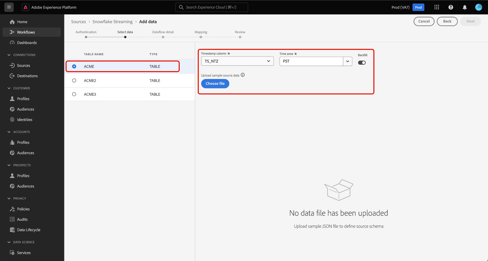

# データを [!DNL Snowflake] UI を使用してExperience Platformにデータベースを追加

ユーザーインターフェイスを使用して、 [!DNL Snowflake] データベースをAdobe Experience Platformにアップロードする場合は、このガイドに従います。

## 基本を学ぶ

このチュートリアルは、 Experience Platform の次のコンポーネントを実際に利用および理解しているユーザーを対象としています。

* [[!DNL Experience Data Model (XDM)]  システム](../../../../../xdm/home.md)：[!DNL Experience Platform] が顧客体験データの整理に使用する標準化されたフレームワーク。
   * [スキーマ構成の基本](../../../../../xdm/schema/composition.md)：スキーマ構成の主要な原則やベストプラクティスなど、XDM スキーマの基本的な構成要素について学びます。
   * [スキーマエディターのチュートリアル](../../../../../xdm/tutorials/create-schema-ui.md)：スキーマエディター UI を使用してカスタムスキーマを作成する方法を説明します。
* [[!DNL Real-Time Customer Profile]](../../../../../profile/home.md)：複数のソースからの集計データに基づいて、統合されたリアルタイムの顧客プロファイルを提供します。

### 認証

次のガイドを読む： [の前提条件の設定 [!DNL Snowflake] ストリーミングデータ](../../../../connectors/databases/snowflake-streaming.md) からストリーミングデータを取り込む前に完了する必要がある手順について説明します。 [!DNL Snowflake] をExperience Platformに追加します。

## 以下を使用します。 [!DNL Snowflake Streaming] ストリームのソース [!DNL Snowflake] データからExperience Platform

Platform UI の左側のナビゲーションバーで「**[!UICONTROL ソース]**」を選択して、[!UICONTROL ソース]ワークスペースにアクセスします。画面の左側にあるカタログから適切なカテゴリを選択することができます。または、使用する特定のソースを検索オプションを使用して探すこともできます。

の下 *データベース* カテゴリ、選択 **[!DNL Snowflake Streaming]**&#x200B;を選択し、 **[!UICONTROL データを追加]**.

>[!TIP]
>
>ソースカタログに認証済みアカウントを持たないソースには、 **[!UICONTROL 設定]** オプション。 認証済みアカウントが存在する場合、このオプションは「 **[!UICONTROL データを追加]**.

The **[!UICONTROL Snowflakeストリーミングアカウントに接続]** ページが表示されます。 このページでは、新しい資格情報または既存の資格情報を使用できます。

>[!BEGINTABS]

>[!TAB 新しいアカウントを作成]

新しいアカウントを作成するには、 **[!UICONTROL 新しいアカウント]** 名前、説明（オプション）および資格情報を入力します。

終了したら「**[!UICONTROL ソースに接続]**」を選択し、新しい接続が確立されるまでしばらく待ちます。

| 資格情報 | 説明 |
| --- | --- |
| アカウント | お客様の [!DNL Snowflake] アカウント。 |
| Warehouse | お客様の [!DNL Snowflake] 倉庫。 ウェアハウスは、次のクエリの実行を管理します： [!DNL Snowflake]. 各 [!DNL Snowflake] ウェアハウスは互いに独立しており、データをExperience Platformに取り込むには、個別にアクセスする必要があります。 |
| データベース | お客様の [!DNL Snowflake] データベース。 データベースには、Experience Platformに取り込むデータが含まれています。 |
| スキーマ | （オプション） [!DNL Snowflake] アカウント。 |
| ユーザー名 | ユーザー名 [!DNL Snowflake] アカウント。 |
| パスワード | ユーザーの [!DNL Snowflake] アカウント。 |
| 役割 | （オプション）特定の接続に対してユーザーに提供できるカスタム定義の役割。 指定しない場合、この値はデフォルトでになります。 `public`. |

アカウントの作成について詳しくは、 [ロール設定の構成](../../../../connectors/databases/snowflake-streaming.md#configure-role-settings) （内） [!DNL Snowflake Streaming] の概要。

>[!TAB 既存のアカウントを使用]

既存のアカウントを使用するには、「 」を選択します。 **[!UICONTROL 既存のアカウント]** 次に、既存のアカウントカタログから目的のアカウントを選択します。

「**[!UICONTROL 次へ]**」を選択して次に進みます。

>[!ENDTABS]

## データの選択 {#select-data}

>[!IMPORTANT]
>
>ストリーミングデータフローを作成するには、ソーステーブルにタイムスタンプ列が存在する必要があります。 データが取り込まれるタイミングと増分データがストリーミングされるタイミングをExperience Platformが知るには、タイムスタンプが必要です。 既存の接続にタイムスタンプ列を遡って追加し、新しいデータフローを作成できます。

[!UICONTROL データを選択]ステップが表示されます。この手順では、Experience Platformに読み込むデータを選択し、タイムスタンプとタイムゾーンを設定し、生データを取り込むためのサンプルソースデータファイルを指定する必要があります。

画面の左側にあるデータベースディレクトリを使用し、Experience Platformにインポートするテーブルを選択します。

次に、テーブルの timestamp 列タイプを選択します。 次の 2 種類のタイプのタイムスタンプ列から選択できます。 `TIMESTAMP_NTZ` または  `TIMESTAMP_LTZ`. 列のタイプを `TIMESTAMP_NTZ`の場合は、タイムゾーンも指定する必要があります。 列には null 以外の制約を含める必要があります。 詳しくは、 [制限事項とよくある質問]

この手順で、バックフィルの設定を行うこともできます。 バックフィルは、最初に取り込まれるデータを決定します。 バックフィルが有効な場合、指定されたパス内の現在のファイルは、最初にスケジュールされた取り込み中にすべて取り込まれます。 そうでない場合は、取り込みが最初に実行されてから開始時刻までの間に読み込まれたファイルのみが取り込まれます。 開始時刻より前に読み込まれたファイルは取り込まれません。

を選択します。 **[!UICONTROL バックフィル]** オン/オフを切り替えてバックフィルを有効にします。

最後に、 **[!UICONTROL ファイルを選択]** ：サンプルソースデータをアップロードしてマッピングセットの作成に役立てます。これは、後の手順で、元のデータをエクスペリエンスデータモデル (XDM) にマッピングするために使用されます。

終了したら、「 」を選択します。 **[!UICONTROL 次へ]** をクリックして続行します。

## データセットとデータフローの詳細を入力 {#provide-dataset-and-dataflow-details}

次に、データセットとデータフローに関する情報を指定する必要があります。

### データセットの詳細 {#dataset-details}

データセットは、スキーマ（列）とフィールド（行）で構成されるデータコレクション（通常はテーブル）を格納し管理するための構造です。Experience Platformに正常に取り込まれたデータは、データレイク内にデータセットとして保持されます。 この手順の間に、新しいデータセットを作成するか、既存のデータセットを使用できます。

>[!BEGINTABS]

>[!TAB 新しいデータセットを使用]

新しいデータセットを使用するには、「 **[!UICONTROL 新しいデータセット]**&#x200B;をクリックし、データセットの名前と説明（オプション）を入力します。 また、データセットが準拠するエクスペリエンスデータモデル (XDM) スキーマを選択する必要があります。

| 新しいデータセットの詳細 | 説明 |
| --- | --- |
| 出力データセット名 | 新しいデータセットの名前。 |
| 説明 | （オプション）新しいデータセットの概要です。 |
| スキーマ | 組織に存在するスキーマのドロップダウンリスト。 また、ソース設定プロセスの前に、独自のスキーマを作成することもできます。 詳しくは、 [UI での XDM スキーマの作成](../../../../../xdm/tutorials/create-schema-ui.md). |

>[!TAB 既存のデータセットを使用する]

既存のデータセットがある場合は、「 **[!UICONTROL 既存のデータセット]** その後、 **[!UICONTROL 詳細検索]** オプションを使用して、リアルタイム顧客プロファイルへの取り込みが有効になっているかどうかなど、組織内のすべてのデータセットのウィンドウを表示できます。

>[!ENDTABS]

+++「 」を選択して、プロファイルの取り込み、エラー診断、部分取り込みを有効にする手順を実行します。

データセットでリアルタイム顧客プロファイルが有効になっている場合、この手順の間に、 **[!UICONTROL プロファイルデータセット]** データをプロファイル取り込み用に有効にする場合。 また、この手順を使用して、 **[!UICONTROL エラー診断]** および **[!UICONTROL 部分取り込み]**.

* **[!UICONTROL エラー診断]**：を選択します。 **[!UICONTROL エラー診断]** を使用して、ソースに対してエラー診断を生成するように指示します。この診断は、データセットのアクティビティとデータフローのステータスを監視する際に、後で参照できます。
* **[!UICONTROL 部分取り込み]**：部分バッチ取得は、エラーを含むデータを、特定の設定可能なしきい値まで取得する機能です。 この機能を使用すると、正確なデータをすべてExperience Platformに正常に取り込む一方で、誤ったデータはすべて、無効な理由に関する情報と共に別々にバッチ処理されます。

+++

### データフローの詳細 {#dataflow-details}

データセットを設定したら、名前、説明（オプション）、アラート設定など、データフローの詳細を指定する必要があります。

| データフロー設定 | 説明 |
| --- | --- |
| データフロー名 | データフローの名前。  デフォルトでは、インポートされるファイルの名前が使用されます。 |
| 説明 | （オプション）データフローの簡単な説明。 |
| アラート | Experience Platformは、ユーザーが購読できるイベントベースのアラートを作成できます。 これらのオプションを使用するには、実行中のデータフローがトリガーに必要です。 詳しくは、 [アラートの概要](../../alerts.md) <ul><li>**ソースのデータフロー実行開始**：データフローの実行が開始したときに通知を受け取る場合は、このアラートを選択します。</li><li>**ソースのデータフロー実行成功**：データフローがエラーなく終了した場合に通知を受け取る場合は、このアラートを選択します。</li><li>**ソースのデータフロー実行エラー**：このアラートを選択すると、データフローの実行がエラーで終了した場合に通知を受け取ります。</li></ul> |

終了したら、「 」を選択します。 **[!UICONTROL 次へ]** をクリックして続行します。

## フィールドの XDM スキーマへのマッピング {#mapping}

「[!UICONTROL マッピング]」手順が表示されます。マッピングインターフェイスを使用して、ソースデータを適切なスキーマフィールドにマッピングしてから、そのデータをExperience Platformに取り込み、 **[!UICONTROL 次へ]**. マッピングインターフェイスの使用方法に関する詳細なガイドについては、 [データ準備 UI ガイド](../../../../../data-prep/ui/mapping.md) を参照してください。

## データフローのレビュー {#review}

データフローの作成プロセスの最後の手順は、データフローを実行する前に確認することです。 以下を使用します。 **[!UICONTROL レビュー]** 手順を参照して、新しいデータフローを実行する前に詳細を確認します。 詳細は、次のカテゴリに分類されます。

* **接続**：ソースタイプ、選択したソースファイルの関連パス、およびそのソースファイル内の列数を表示します。
* **データセットの割り当てとフィールドのマッピング**：ソースデータがどのデータセットに取り込まれるかを、そのデータセットが準拠するスキーマを含めて表示します。

データフローをレビューしたら、「**[!UICONTROL 終了]**」を選択し、データフローが作成されるまでしばらく待ちます。

## 次の手順

このチュートリアルでは、のストリーミングデータフローを正常に作成しました。 [!DNL Snowflake] データ。 その他のリソースについては、以下のドキュメントを参照してください。

### データフローの監視

データフローを作成したら、データフローを介して取り込まれているデータを監視して、取り込み率、成功、エラーに関する情報を表示できます。 ストリーミングデータフローの監視方法の詳細については、 [UI でのストリーミングデータフローの監視](../../monitor-streaming.md).

### データフローの更新

データフローのスケジュール設定、マッピング、一般情報を更新するには、次のチュートリアルを参照してください： [UI でのソースデータフローの更新](../../update-dataflows.md).

### データフローの削除

不要になったデータフローや誤って作成されたデータフローは、**[!UICONTROL データフロー]**&#x200B;ワークスペース内にある&#x200B;**[!UICONTROL 削除]**&#x200B;機能で削除できます。データフローの削除方法の詳細については、 [UI でのデータフローの削除](../../delete.md).