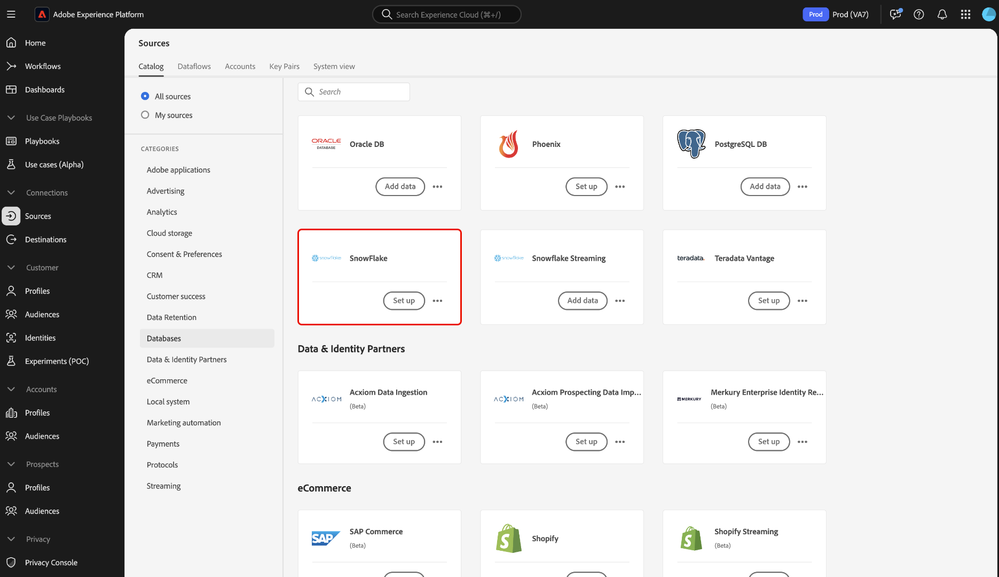

# [!DNL Snowflake]UI でのソース接続の作成

>[!NOTE]
>
> [!DNL Snowflake]コネクタがベータ版に含まれています。 ベータ版のコネクタの使用について詳しくは、ソースの概要を参照してください。

このチュートリアルでは [!DNL Snowflake] 、Adobe エクスペリエンスプラットフォームのユーザーインターフェイスを使用してソースコネクタを作成する方法について説明します。

## はじめに

このチュートリアルは、 Platform の次のコンポーネントを実際に利用および理解しているユーザーを対象としています。

* [ソース ](../../../../home.md) : [!DNL Experience Platform] 多種多様なソースからのデータの ingested を可能にするとともに、サービスを使用した受信データを構造化、ラベル付け、拡張するための機能を提供し [!DNL Platform] ます。
* [サンドボックス](../../../../../sandboxes/home.md)：[!DNL Experience Platform] は、単一の [!DNL Platform] インスタンスを別々の仮想環境に分割して、デジタルエクスペリエンスアプリケーションの開発と発展を支援する仮想サンドボックスを提供します。

### 必要な資格情報の収集

でスノーフレークアカウントにアクセスするには [!DNL Platform] 、次の認証値を入力する必要があります。

| Chap | 説明 |
| ---------- | ----------- |
| アカウント | アカウントに関連付けられた完全なアカウント名を指定 [!DNL Snowflake] します。 完全修飾アカウント名には、 [!DNL Snowflake] お客様のアカウント名、地域、およびクラウドプラットフォームが含まれています。 たとえば、`cj12345.east-us-2.azure` のように設定します。アカウント名について詳しくは、次を参照してください [[!DNL Snowflake document on account identifiers] ](https://docs.snowflake.com/en/user-guide/admin-account-identifier.html) 。 |
| Warehouse | ウェアハウスによって、 [!DNL Snowflake] アプリケーションのクエリ実行プロセスが管理されます。 各 [!DNL Snowflake] ウェアハウスは互いに独立したもので、プラットフォームにデータを取り込むときに個別にアクセスする必要があります。 |
| データベース | データベースには、 [!DNL Snowflake] プラットフォームに取り込むデータが格納されています。 |
| ユーザー名 | [!DNL Snowflake]取引先企業のユーザー名です。 |
| パスワード | ユーザーアカウントのパスワードを入力し [!DNL Snowflake] ます。 |
| 接続ストリング | インスタンスへの接続に使用する接続ストリング [!DNL Snowflake] です。 の接続ストリングパターンは、に [!DNL Snowflake] `jdbc:snowflake://{ACCOUNT_NAME}.snowflakecomputing.com/?user={USERNAME}&password={PASSWORD}&db={DATABASE}&warehouse={WAREHOUSE}` あります。 |

これらの値について詳しくは、 [ この「スノーフレークドキュメント」を参照してください ](https://docs.snowflake.com/en/user-guide/oauth-custom.html) 。

## スノーフレークアカウントへの接続

プラットフォーム UI で、左側のナビゲーションから「ソース」を選択して、 **** [!UICONTROL  ソースワークスペースにアクセスし ] ます。 カタログ画面には、  でアカウントを作成できる様々なソースが表示されます。

画面の左側のカタログから適切なカテゴリを選択できます。 検索バーを使用して目的のソースを検索することもできます。

「 [!UICONTROL  データベース ] 」カテゴリーで、「スノーフレーク」を選択し、 **** 「データを追加」を選択し **** ます。

「 **[!UICONTROL スノーフレーク「に接続」]** ページが表示されます。 このページでは、新しい資格情報を使用するか、既存の資格情報を使用することができます。

### 既存のアカウント

既存のアカウントを接続するには、接続するスノーフレークアカウントを選択し、「次へ」を選択して先 **** に進みます。

### 新しいアカウント

新しい認証情報を使用している場合は、「新規アカウント」を選択し **** ます。 表示された入力フォームに、名前、オプションの説明、およびスノーフレーククリデンシャルを指定します。 終了したら、「接続」を選択し、 **** 新しい接続が確立されるまでしばらく待ちます。

## 次の手順

このチュートリアルでは、スノーフレークアカウントへの接続を確立します。 次のチュートリアルに進み、 [ データを取り込むようにデータフローを設定し  [!DNL Platform]](../../dataflow/databases.md) ます。
