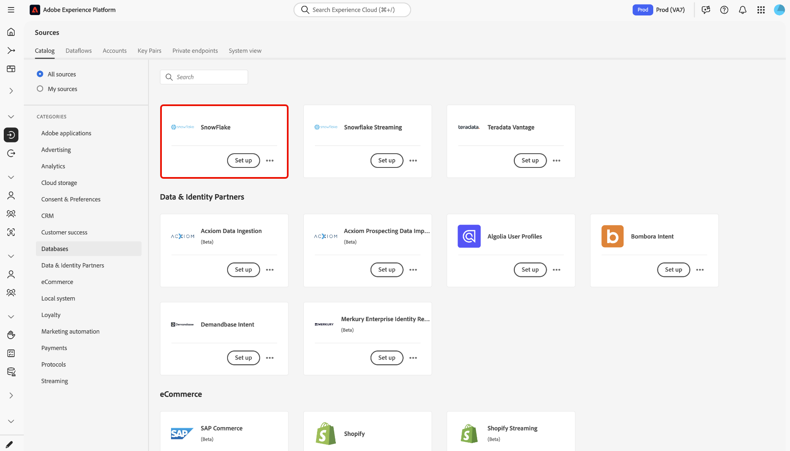
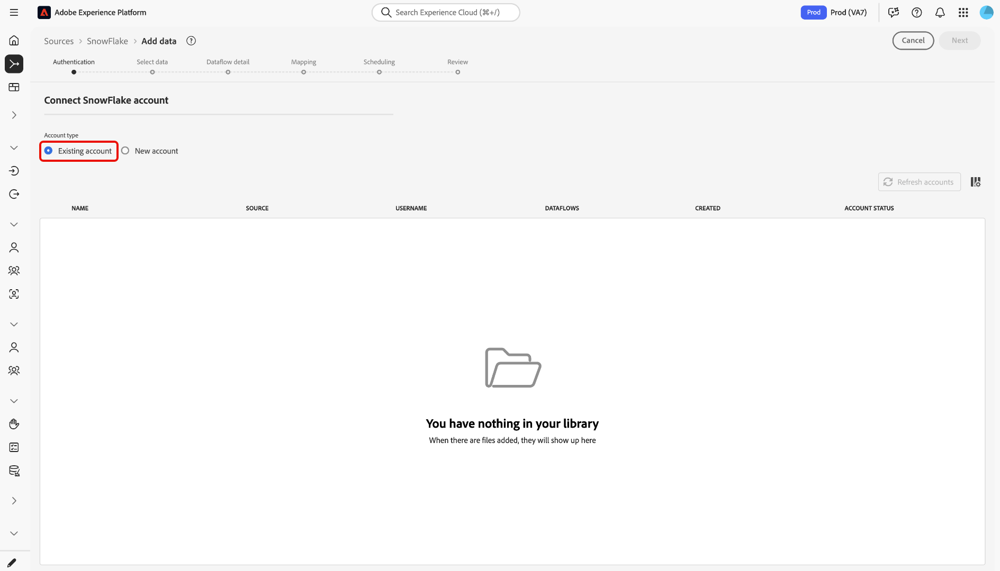
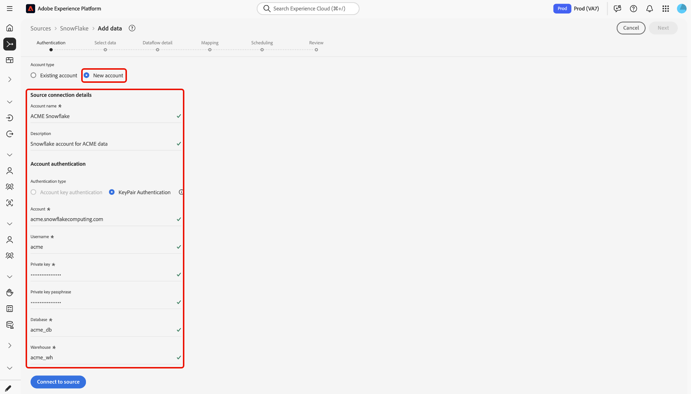
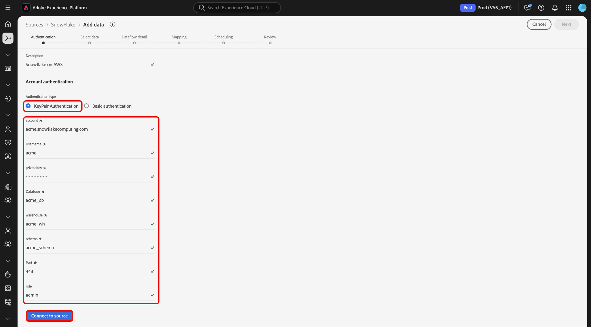
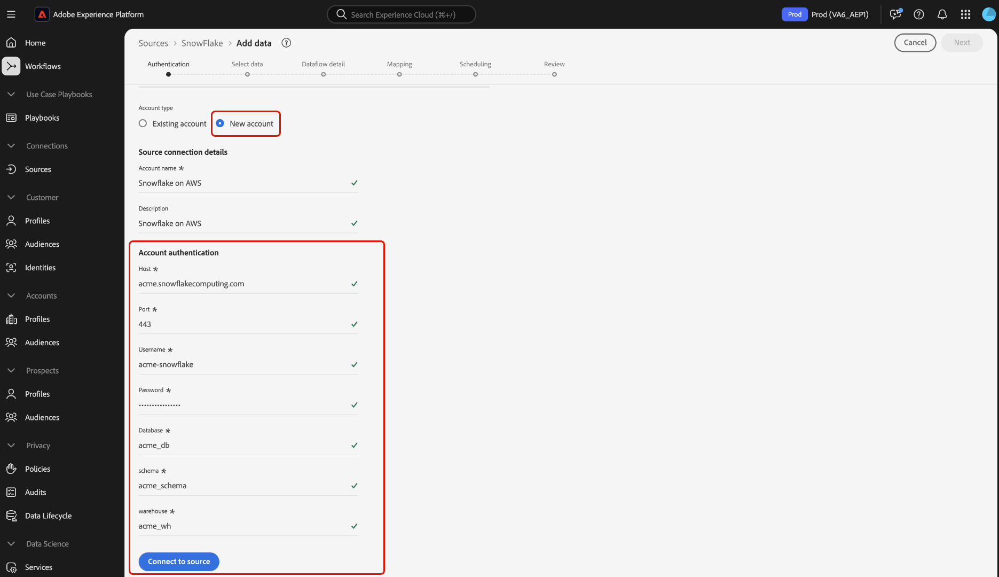

# UIを使用して[!DNL Snowflake]をExperience Platformに接続する

>[!IMPORTANT]
>
>[!DNL Snowflake] ソースは、Real-Time Customer Data Platform Ultimateを購入したユーザーがソースカタログで利用できます。

このガイドでは、ユーザーインターフェイスを使用して[!DNL Snowflake] アカウントをAdobe Experience Platformに接続する方法について説明します。

## はじめに

>[!WARNING]
>
>[!DNL Snowflake] ソースの基本認証（またはアカウントキー認証）は、2025年11月に廃止されます。 ソースを引き続き使用し、データベースからExperience Platformにデータを取り込むには、キーペアベースの認証に移行する必要があります。 非推奨（廃止予定）について詳しくは、資格情報の侵害リスクの軽減に関する[[!DNL Snowflake]  ベストプラクティスガイド &#x200B;](https://www.snowflake.com/en/resources/white-paper/best-practices-to-mitigate-the-risk-of-credential-compromise/)を参照してください。

このチュートリアルは、 Experience Platform の次のコンポーネントを実際に利用および理解しているユーザーを対象としています。

* [&#x200B; ソース &#x200B;](../../../../home.md): Experience Platformを使用すると、様々なソースからデータを取り込むことができますが、[!DNL Experience Platform] サービスを使用して、着信データを構造化、ラベル付け、強化することができます。
* [&#x200B; サンドボックス &#x200B;](../../../../../sandboxes/home.md): Experience Platformは、1つのExperience Platform インスタンスを個別のバーチャル環境に分割して、デジタルエクスペリエンスアプリケーションの開発と進化に役立つバーチャルサンドボックスを提供します。

>[!NOTE]
>
>[!DNL Snowflake] データベースからExperience Platformへのデータのアンロードを許可するには、`PREVENT_UNLOAD_TO_INLINE_URL` フラグを`FALSE`に設定する必要があります。

## ソースカタログを移動する {#navigate}

Experience Platform UIで、左側のナビゲーションから「**[!UICONTROL Sources]**」を選択して、[!UICONTROL Sources] ワークスペースにアクセスします。 画面の左側にあるカタログから適切なカテゴリを選択することができます。 または、使用する特定のソースを検索オプションを使用して探すこともできます。

「*[!UICONTROL Databases]*」カテゴリの「**[!DNL Snowflake]**」を選択し、「**[!UICONTROL Set up]**」を選択します。

>[!TIP]
>
>ソースカタログのソースには、特定のソースがまだ認証済みアカウントを持っていない場合、**[!UICONTROL Set up]** オプションが表示されます。 認証済みアカウントが存在すると、このオプションは&#x200B;**[!UICONTROL Add data]**&#x200B;に変更されます。

## 既存のアカウントの使用 {#existing}

次に、ソースワークフローの認証ステップに移動します。 ここでは、既存のアカウントを使用するか、新しいアカウントを作成できます。

既存のアカウントを使用するには、接続する[!DNL Snowflake] アカウントを選択し、**[!UICONTROL Next]**&#x200B;を選択して続行します。

## 新しいアカウントを作成 {#create}

既存のアカウントがない場合は、ソースに対応する必要な認証資格情報を指定して、新しいアカウントを作成する必要があります。

新しいアカウントを作成するには、**[!UICONTROL New account]**&#x200B;を選択し、名前を指定し、オプションでアカウントの説明を追加します。

### AzureでExperience Platformに接続する {#azure}

キーペア認証を使用して、Azure上のExperience Platformに[!DNL Snowflake] アカウントを接続できます。

キーペア認証を使用するには、**[!UICONTROL KeyPair authentication]**&#x200B;を選択し、アカウント、ユーザー名、秘密鍵、秘密鍵のパスフレーズ、データベース、およびウェアハウスの値を指定してから、**[!UICONTROL Connect to source]**&#x200B;を選択します。

キーペア認証では、2048 ビット RSA キーペアを生成し、[!DNL Snowflake] ソースのアカウントを作成する際に次の値を指定する必要があります。

| 資格情報 | 説明 |
| --- | --- |
| アカウント | アカウント名は、組織内のアカウントを一意に識別します。 この場合、異なる[!DNL Snowflake]組織のアカウントを一意に識別する必要があります。 これを行うには、アカウント名の前に組織名を付ける必要があります。 例えば、`orgname-account_name` のようになります。 追加のガイダンスについては、[&#x200B; アカウント IDの取得 [!DNL Snowflake] に関するガイドを参照してください。](../../../../connectors/databases/snowflake.md#retrieve-your-account-identifier) 詳しくは、[[!DNL Snowflake] ドキュメント](https://docs.snowflake.com/en/user-guide/admin-account-identifier#format-1-preferred-account-name-in-your-organization)を参照してください。 |
| ユーザー名 | [!DNL Snowflake] アカウントのユーザー名。 |
| 秘密鍵 | [!DNL Snowflake] アカウントの[!DNL Base64-] エンコードされた秘密鍵。 暗号化された秘密鍵または暗号化されていない秘密鍵を生成できます。 暗号化された秘密鍵を使用している場合は、Experience Platformに対する認証時に秘密鍵パスフレーズも指定する必要があります。 詳しくは、 [!DNL Snowflake] 秘密鍵[&#128279;](../../../../connectors/databases/snowflake.md)の取得に関するガイドを参照してください。 |
| 秘密鍵パスフレーズ | 秘密鍵パスフレーズは、暗号化された秘密鍵で認証する際に使用する必要がある追加のセキュリティレイヤーです。 暗号化されていない秘密鍵を使用している場合は、パスフレーズを指定する必要はありません。 |
| データベース | Experience Platformに取り込むデータを含む[!DNL Snowflake] データベース。 |
| ウェアハウス | [!DNL Snowflake] ウェアハウスは、アプリケーションのクエリ実行プロセスを管理します。 各[!DNL Snowflake] ウェアハウスは互いに独立しており、Experience Platformにデータを取り込む際に個別にアクセスする必要があります。 |

これらの値について詳しくは、[このSnowflake ドキュメント &#x200B;](https://docs.snowflake.com/en/user-guide/key-pair-auth.html)を参照してください。

### AWSでExperience Platformに接続する {#aws}

>[!AVAILABILITY]
>
>この節は、Amazon Web Services（AWS）で動作するExperience Platformの実装に適用されます。 AWS上で動作するExperience Platformは、現在、一部のお客様にご利用いただけます。 サポートされているExperience Platform インフラストラクチャについて詳しくは、[Experience Platform マルチクラウドの概要](../../../../../landing/multi-cloud.md)を参照してください。

新しい[!DNL Snowflake] アカウントを作成し、AWS上のExperience Platformに接続するには、自分がVA6 サンドボックスにいることを確認し、認証に必要な資格情報を指定します。

>[!BEGINTABS]

>[!TAB  キーペア認証]

キーペアを使用して接続するには、**[!UICONTROL KeyPair Authentication]**&#x200B;を選択し、認証資格情報を指定してから&#x200B;**[!UICONTROL Connect to source]**&#x200B;を選択します。 これらの資格情報について詳しくは、[[!DNL Snowflake]  バッチの概要](../../../../connectors/databases/snowflake.md#gather-required-credentials)を参照してください。

>[!TAB 基本認証]

>[!WARNING]
>
>[!DNL Snowflake] ソースの基本認証（またはアカウントキー認証）は、2025年11月に廃止されます。 ソースを引き続き使用し、データベースからExperience Platformにデータを取り込むには、キーペアベースの認証に移行する必要があります。 非推奨（廃止予定）について詳しくは、資格情報の侵害リスクの軽減に関する[[!DNL Snowflake]  ベストプラクティスガイド &#x200B;](https://www.snowflake.com/en/resources/white-paper/best-practices-to-mitigate-the-risk-of-credential-compromise/)を参照してください。

ユーザー名とパスワードの組み合わせを使用して接続するには、**[!UICONTROL Basic authentication]**&#x200B;を選択し、認証資格情報を指定してから&#x200B;**[!UICONTROL Connect to source]**&#x200B;を選択します。 これらの資格情報について詳しくは、[[!DNL Snowflake]  バッチの概要](../../../../connectors/databases/snowflake.md#gather-required-credentials)を参照してください。

>[!ENDTABS]

### サンプルデータのプレビューをスキップ {#skip-preview-of-sample-data}

データ選択ステップで、大きなテーブルまたはデータファイルを取り込む際にタイムアウトが発生する場合があります。 データプレビューをスキップしてタイムアウトを回避し、サンプルデータを含めなくてもスキーマを表示できます。 データのプレビューをスキップするには、**[!UICONTROL Skip previewing sample data]** トグルを有効にします。

ワークフローの残りの部分は同じままです。 唯一の注意点は、データプレビューをスキップすると、マッピングステップ中に計算フィールドと必須フィールドが自動検証されなくなる可能性があり、マッピング中にこれらのフィールドを手動で検証する必要があることです。

## 次の手順

このチュートリアルでは、Snowflake アカウントへの接続を確立しました。 次のチュートリアルに進み、[&#x200B; データフローを設定して [!DNL Experience Platform]](../../dataflow/databases.md)にデータを取り込めるようになりました。
