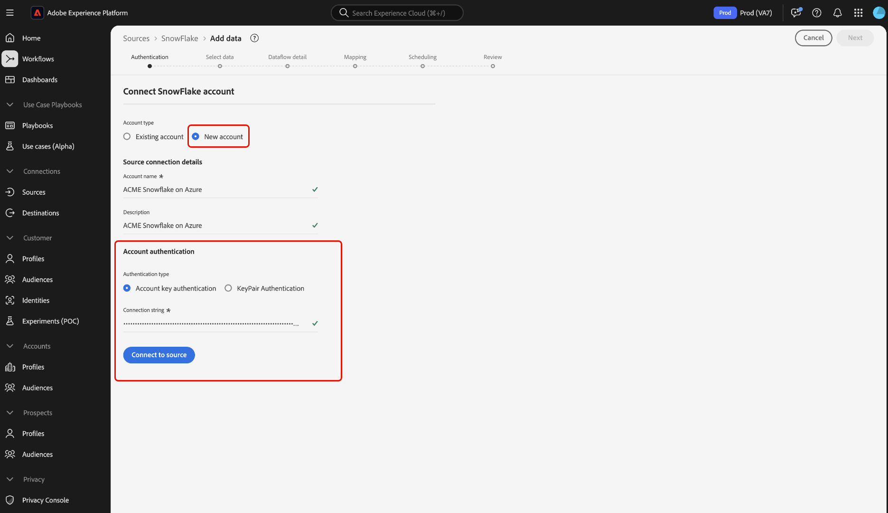

# UI を使用した [!DNL Snowflake] のExperience Platformへの接続

>[!IMPORTANT]
>
>Real-Time Customer Data Platform Ultimateを購入したユーザーは、ソースカタログで [!DNL Snowflake] ソースを利用できます。

ユーザーインターフェイスを使用して [!DNL Snowflake] アカウントをAdobe Experience Platformに接続する方法については、このガイドを参照してください。

## はじめに

>[!WARNING]
>
>[!DNL Snowflake] ソースの基本認証（またはアカウントキー認証）は、2025 年 11 月に非推奨（廃止予定）になります。 ソースの使用とデータベースからExperience Platformへのデータの取り込みを続行するには、キーペアベースの認証に移行する必要があります。 非推奨（廃止予定）について詳しくは、[[!DNL Snowflake]  資格情報の漏洩リスクの軽減に関するベストプラクティスガイド ](https://www.snowflake.com/en/resources/white-paper/best-practices-to-mitigate-the-risk-of-credential-compromise/) を参照してください。

このチュートリアルは、 Experience Platform の次のコンポーネントを実際に利用および理解しているユーザーを対象としています。

* [ ソース ](../../../../home.md):Experience Platformを使用すると、データを様々なソースから取得しながら、[!DNL Experience Platform] サービスを使用して受信データの構造化、ラベル付け、拡張を行うことができます。
* [ サンドボックス ](../../../../../sandboxes/home.md): Experience Platformには、1 つのExperience Platform インスタンスを別々の仮想環境に分割し、デジタルエクスペリエンスアプリケーションの開発と発展に役立つ仮想サンドボックスが用意されています。

>[!NOTE]
>
>`PREVENT_UNLOAD_TO_INLINE_URL` データベースからExperience Platformにデータをアンロードできるようにするには、`FALSE` フラグを [!DNL Snowflake] に設定する必要があります。

## ソースカタログのナビゲート {#navigate}

Experience Platformの UI で、左側のナビゲーションから **[!UICONTROL Sources]** を選択し、[!UICONTROL Sources] ワークスペースにアクセスします。 画面の左側にあるカタログから適切なカテゴリを選択することができます。または、使用する特定のソースを検索オプションを使用して探すこともできます。

**[!DNL Snowflake]** データベース *[!UICONTROL カテゴリの下の「]*」を選択し、「**[!UICONTROL 設定]**」を選択します。

>[!TIP]
>
>ソースカタログ内のソースは、特定のソースがまだ認証済みのアカウントを持っていない場合に「**[!UICONTROL 設定]**」オプションを表示します。 認証済みアカウントが存在すると、このオプションは **[!UICONTROL データを追加]** に変わります。

## 既存のアカウントを使用 {#existing}

次に、ソースワークフローの認証手順に進みます。 ここでは、既存のアカウントを使用するか、新しいアカウントを作成できます。

既存のアカウントを使用するには、接続する [!DNL Snowflake] アカウントを選択し、「**[!UICONTROL 次へ]**」を選択して続行します。

## 新しいアカウントを作成 {#create}

既存のアカウントがない場合は、ソースに対応する必要な認証資格情報を指定して、新しいアカウントを作成する必要があります。

新しいアカウントを作成するには、「**[!UICONTROL 新しいアカウント]**」を選択し、アカウントの名前を入力して、オプションで説明を追加します。

### Azure 上のExperience Platformへの接続 {#azure}

アカウントキー認証またはキーペア認証のいずれかを使用して、[!DNL Snowflake] アカウントを Azure 上のExperience Platformに接続できます。

>[!BEGINTABS]

>[!TAB  アカウントキー認証 ]

アカウントキー認証を使用するには、「**[!UICONTROL アカウントキー認証]**」を選択し、入力フォームに接続文字列を入力して「**[!UICONTROL ソースに接続]**」を選択します。

| 資格情報 | 説明 |
| --- | --- |
| アカウント | アカウント名は、組織内のアカウントを一意に識別します。 この場合、アカウントを異なる [!DNL Snowflake] 組織で一意に識別する必要があります。 これを行うには、アカウント名の前に組織名を追加する必要があります。 例：`orgname-account_name`。 詳しくは、[ アカウント識別子の取得  [!DNL Snowflake]  に関するガイドを参 ](../../../../connectors/databases/snowflake.md#retrieve-your-account-identifier) してください。 詳しくは、[[!DNL Snowflake] ドキュメント](https://docs.snowflake.com/en/user-guide/admin-account-identifier#format-1-preferred-account-name-in-your-organization)を参照してください。 |
| ウェアハウス | [!DNL Snowflake] ウェアハウスは、アプリケーションのクエリ実行プロセスを管理します。 各 [!DNL Snowflake] ウェアハウスは互いに独立しており、データをExperience Platformに取り込む際は個別にアクセスする必要があります。 |
| データベース | [!DNL Snowflake] データベースには、Experience Platformに取り込むデータが含まれています。 |
| ユーザー名 | [!DNL Snowflake] アカウントのユーザー名。 |
| パスワード | [!DNL Snowflake] ユーザーアカウントのパスワード。 |
| 役割 | [!DNL Snowflake] セッションで使用する既定のアクセス制御ロールです。 役割は、指定したユーザーに既に割り当てられている既存の役割である必要があります。 デフォルトの役割は `PUBLIC` です。 |
| 接続文字列 | [!DNL Snowflake] インスタンスへの接続に使用する接続文字列。 [!DNL Snowflake] の接続文字列パターンは `jdbc:snowflake://{ACCOUNT_NAME}.snowflakecomputing.com/?user={USERNAME}&password={PASSWORD}&db={DATABASE}&warehouse={WAREHOUSE}` です |

>[!TAB  キーペア認証 ]

キーペア認証を使用するには、「**[!UICONTROL キーペア認証]**」を選択し、アカウント、ユーザー名、秘密鍵、秘密鍵のパスフレーズ、データベース、ウェアハウスの値を入力して「**[!UICONTROL ソースに接続]**」を選択します。

キーペア認証を使用する場合は、[!DNL Snowflake] ソースのアカウントを作成する際に、2048 ビット RSA キーペアを生成してから、次の値を指定する必要があります。

| 資格情報 | 説明 |
| --- | --- |
| アカウント | アカウント名は、組織内のアカウントを一意に識別します。 この場合、アカウントを異なる [!DNL Snowflake] 組織で一意に識別する必要があります。 これを行うには、アカウント名の前に組織名を追加する必要があります。 例：`orgname-account_name`。 詳しくは、[ アカウント識別子の取得  [!DNL Snowflake]  に関するガイドを参 ](../../../../connectors/databases/snowflake.md#retrieve-your-account-identifier) してください。 詳しくは、[[!DNL Snowflake] ドキュメント](https://docs.snowflake.com/en/user-guide/admin-account-identifier#format-1-preferred-account-name-in-your-organization)を参照してください。 |
| ユーザー名 | [!DNL Snowflake] アカウントのユーザー名。 |
| 秘密鍵 | [!DNL Base64-] アカウントの [!DNL Snowflake] エンコードされた秘密鍵。 暗号化された秘密鍵または暗号化されていない秘密鍵のいずれかを生成できます。 暗号化された秘密鍵を使用している場合は、Experience Platformに対して認証を行う際に、秘密鍵のパスフレーズも指定する必要があります。 詳しくは、[ 秘密鍵の取得  [!DNL Snowflake]  に関す ](../../../../connectors/databases/snowflake.md) ガイドを参照してください。 |
| 秘密鍵のパスフレーズ | 秘密鍵のパスフレーズは、暗号化された秘密鍵を使用して認証を行う場合に使用する必要がある、追加のセキュリティレイヤーです。 暗号化されていない秘密鍵を使用している場合は、パスフレーズを指定する必要はありません。 |
| データベース | Experience Platformに取り込むデータを含んだ [!DNL Snowflake] データベース。 |
| ウェアハウス | [!DNL Snowflake] ウェアハウスは、アプリケーションのクエリ実行プロセスを管理します。 各 [!DNL Snowflake] ウェアハウスは互いに独立しており、データをExperience Platformに取り込む際は個別にアクセスする必要があります。 |

これらの値について詳しくは、[ このSnowflake ドキュメント ](https://docs.snowflake.com/en/user-guide/key-pair-auth.html) を参照してください。

>[!ENDTABS]

### AWS上のExperience Platformへの接続 {#aws}

>[!AVAILABILITY]
>
>この節の内容は、Amazon Web Services（AWS）上で動作するExperience Platformの実装に適用されます。 AWS上で動作するExperience Platformは、現在、限られた数のお客様が利用できます。 サポートされるExperience Platform インフラストラクチャについて詳しくは、[Experience Platform multi-cloud overview](../../../../../landing/multi-cloud.md) を参照してください。

新しい [!DNL Snowflake] アカウントを作成し、AWSでExperience Platformに接続するには、VA6 サンドボックスに属していることを確認し、認証に必要な資格情報を入力します。

>[!BEGINTABS]

>[!TAB  キーペア認証 ]

キーペアを使用して接続するには、「**[!UICONTROL キーペア認証]**」を選択し、認証資格情報を入力して、「**[!UICONTROL ソースに接続]**」を選択します。 これらの資格情報について詳しくは、[[!DNL Snowflake]  バッチの概要 ](../../../../connectors/databases/snowflake.md#gather-required-credentials) を参照してください。

>[!TAB  基本認証 ]

>[!WARNING]
>
>[!DNL Snowflake] ソースの基本認証（またはアカウントキー認証）は、2025 年 11 月に非推奨（廃止予定）になります。 ソースの使用とデータベースからExperience Platformへのデータの取り込みを続行するには、キーペアベースの認証に移行する必要があります。 非推奨（廃止予定）について詳しくは、[[!DNL Snowflake]  資格情報の漏洩リスクの軽減に関するベストプラクティスガイド ](https://www.snowflake.com/en/resources/white-paper/best-practices-to-mitigate-the-risk-of-credential-compromise/) を参照してください。

ユーザー名とパスワードの組み合わせを使用して接続するには、「**[!UICONTROL 基本認証]**」を選択し、認証資格情報を入力して「**[!UICONTROL ソースに接続]**」を選択します。 これらの資格情報について詳しくは、[[!DNL Snowflake]  バッチの概要 ](../../../../connectors/databases/snowflake.md#gather-required-credentials) を参照してください。

>[!ENDTABS]

### サンプルデータのプレビューをスキップ {#skip-preview-of-sample-data}

データ選択手順で、大きなテーブルまたはファイルのデータを取り込む際にタイムアウトが発生することがあります。 データプレビューをスキップして、タイムアウトを回避し、サンプルデータがなくてもスキーマを表示できます。 データのプレビューをスキップするには、「サンプルデータのプレビューをスキップ **[!UICONTROL 切替スイッチを有効]** します。

残りのワークフローは変わりません。 唯一の注意点は、データのプレビューをスキップすると、マッピングステップ中に計算フィールドと必須フィールドが自動検証されない可能性があり、マッピング中にこれらのフィールドを手動で検証する必要があるということです。

## 次の手順

このチュートリアルでは、Snowflake アカウントとの接続を確立しました。 次のチュートリアルに進み、[ データをに取り込むためのデータフローの設定  [!DNL Experience Platform]](../../dataflow/databases.md) を行いましょう。
