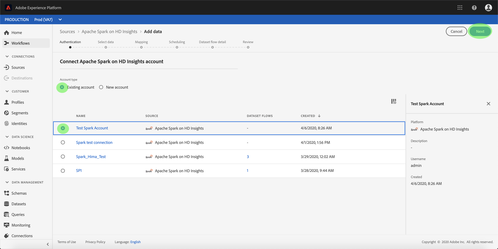

# の作成 [!DNL Apache Spark] オン [!DNL Azure HDInsights] UI のソース接続

>[!NOTE]
>
> この [!DNL Apache Spark] オン [!DNL Azure HDInsights] コネクタはベータ版です。 ベータ版のコネクタの使用に関して詳しくは、[ソースの概要](../../../../home.md#terms-and-conditions)を参照してください。

Adobe Experience Platform のソースコネクタには、外部ソースの データを設定したスケジュールに従って取り込む機能が用意されています。 このチュートリアルでは、 [!DNL Apache Spark] オン [!DNL Azure HDInsights] を使用したソースコネクタ [!DNL Platform] ユーザーインターフェイス。

## はじめに

このチュートリアルは、Adobe Experience Platform の次のコンポーネントを実際に利用および理解しているユーザーを対象としています。

* [エクスペリエンスデータモデルl（XDM）システム](../../../../../xdm/home.md)：Experience Platform が顧客体験データを整理するための標準化されたフレームワークです。
   * [スキーマ構成の基本](../../../../../xdm/schema/composition.md)：スキーマ構成の主要な原則やベストプラクティスなど、XDM スキーマの基本的な構成要素について学びます。
   * [スキーマエディターのチュートリアル](../../../../../xdm/tutorials/create-schema-ui.md)：スキーマエディター UI を使用してカスタムスキーマを作成する方法を説明します。
* [リアルタイム顧客プロファイル](../../../../../profile/home.md)：複数のソースから集計したデータに基づいて、統合されたリアルタイムの顧客プロファイルを提供します。

既に有効な [!DNL Spark] 接続する場合は、このドキュメントの残りの部分をスキップして、 [データフローの設定](../../dataflow/databases.md)

### 必要な資格情報の収集

 で [!DNL Spark] アカウントにアクセスするには、次の値を指定する必要があります。[!DNL Platform]

| 資格情報 | 説明 |
| ---------- | ----------- |
| `host` | の IP アドレスまたはホスト名 [!DNL Spark] サーバー。 |
| `username` | 次にアクセスするために使用するユーザー名 [!DNL Spark] サーバー。 |
| `password` | ユーザーに対応するパスワード。 |

の導入について詳しくは、 [この Spark ドキュメント](https://docs.microsoft.com/en-us/azure/hdinsight/spark/apache-spark-overview).

## [!DNL Spark] アカウントを接続

必要な資格情報を収集したら、次の手順に従って、 [!DNL Spark] 接続するアカウント [!DNL Platform].

にログインします。 [Adobe Experience Platform](https://platform.adobe.com) 次に、 **[!UICONTROL ソース]** 左側のナビゲーションバーから **[!UICONTROL ソース]** ワークスペース。 **[!UICONTROL カタログ]**&#x200B;画面には、アカウントを作成できる様々なソースが表示されます。

画面の左側にあるカタログから適切なカテゴリを選択することができます。または、使用する特定のソースを検索オプションを使用して探すこともできます。

以下 **[!UICONTROL データベース]** カテゴリ、選択 **[!UICONTROL Spark]**. このコネクタを初めて使用する場合は、「 **[!UICONTROL 設定]**. それ以外の場合は、「 **[!UICONTROL データを追加]** 新しい [!DNL Spark] コネクタ。

この **[!UICONTROL Spark に接続]** ページが表示されます。 このページでは、新しい資格情報または既存の資格情報を使用できます。

### 新しいアカウント

新しい資格情報を使用している場合は、「**[!UICONTROL 新しいアカウント]**」を選択します。表示される入力フォームで、名前、説明（オプション）および [!DNL Spark] 資格情報。 終了したら、「 」を選択します。 **[!UICONTROL 接続]** その後、新しい接続が確立されるまでしばらく時間をかけます。

### 既存のアカウント

既存のアカウントに接続するには、 [!DNL Spark] 接続するアカウントを選択し、 **[!UICONTROL 次へ]** をクリックして続行します。

## 次の手順

このチュートリアルでは、[!DNL Spark] アカウントとの接続を確立しました。次のチュートリアルに進み、[データを に取り込むためのデータフローの設定 [!DNL Platform]](../../dataflow/databases.md)を行いましょう。
