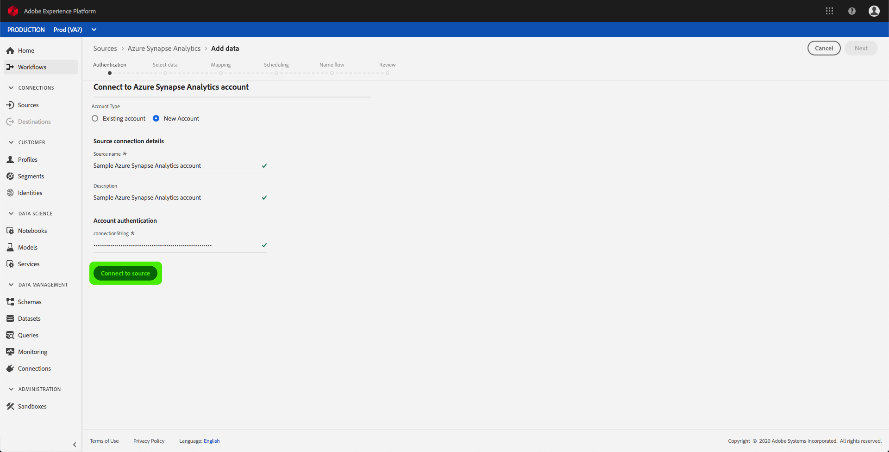

# UIにAzure Synapse Analyticsソースコネクタを作成する

> [!NOTE]
> Azure Synapse Analyticsコネクタはベータ段階です。 機能とドキュメントは、変更されることがあります。

Adobe Experience Platformのソースコネクターは、外部ソースのデータをスケジュールに基づいて取り込む機能を提供します。 このチュートリアルでは、プラットフォームユーザーインターフェイスを使用してAzure Synapse Analytics（以下「シナプス」と呼ばれる）ソースコネクタを作成する手順を説明します。

## はじめに

このチュートリアルでは、Adobe Experience Platformの次のコンポーネントについて、十分に理解している必要があります。

* [Experience Data Model(XDM)System](../../../../../xdm/home.md): エクスペリエンスプラットフォームが顧客エクスペリエンスデータを編成する際に使用する標準化されたフレームワークです。
   * [スキーマ構成の基本](../../../../../xdm/schema/composition.md): XDMスキーマの基本構成要素について説明します。この基本構成要素には、スキーマ構成における主な原則とベストプラクティスが含まれます。
   * [スキーマエディタのチュートリアル](../../../../../xdm/tutorials/create-schema-ui.md): スキーマエディターのUIを使用してカスタムスキーマを作成する方法を説明します。
* [リアルタイム顧客プロファイル](../../../../../profile/home.md): 複数のソースからの集計データに基づいて、統合されたリアルタイムの消費者プロファイルを提供します。

Synapseベースの接続が既にある場合は、このドキュメントの残りの部分をスキップして、データフローの [設定に関するチュートリアルに進むことができます](../../dataflow/databases.md)。

### 必要な資格情報の収集

プラットフォームのSynapseアカウントにアクセスするには、次の値を指定する必要があります。

| Credential | 説明 |
| ---------- | ----------- |
| `connectionString` | シナプス認証に関連付けられた接続文字列。 シナプス接続文字列パターンはで `Server=tcp:{SERVER_NAME}.database.windows.net,1433;Database={DATABASE};User ID={USERNAME}@{SERVER_NAME};Password={PASSWORD};Trusted_Connection=False;Encrypt=True;Connection Timeout=30`す。 |

この値の詳細については、 [このシナプスドキュメントを参照してください](https://docs.microsoft.com/en-us/azure/data-factory/connector-azure-sql-data-warehouse)。

## Synapseアカウントを接続します

必要な資格情報を収集したら、次の手順に従って、新しい受信ベース接続を作成し、Synapseアカウントをプラットフォームにリンクします。

<a href="https://platform.adobe.com" target="_blank">Adobe Experience Platformにログインし、左のナビゲーションバーで「</a> Sources **** 」を選択して *Sources* ワークスペースにアクセスします。 [ *カタログ* ]画面には、様々なソースが表示され、このソースを使用して受信ベース接続を作成できます。各ソースには、それらに関連付けられた既存のベース接続の数が表示されます。

「 *Databases* 」カテゴリの下で、「 **Azure Synapse Analytics** 」を選択して、画面の右側に情報バーを表示します。 情報バーには、選択したソースの簡単な説明と、ソースまたは表示のドキュメントに接続するためのオプションが表示されます。 新しい受信ベース接続を作成するには、「 **接続ソース**」を選択します。

[ *Azure Synapse Analyticsに* 接続]ページが表示されます。 このページでは、新しい秘密鍵証明書または既存の秘密鍵証明書を使用できます。

### 新しいアカウント

新しい資格情報を使用する場合は、「 **新規アカウント**」を選択します。 表示される入力フォーム上で、名前、オプションの説明、およびシナプスの資格情報を付けて、ベース接続を指定します。 終了したら、[ **接続** ]を選択し、新しいベース接続が確立されるまでの時間を許可します。

### 既存のアカウント

既存のアカウントを接続するには、接続するSynapseアカウントを選択し、 **「次へ** 」を選択して次に進みます。

## 次の手順

このチュートリアルに従うことで、Synapseアカウントへの基本的な接続を確立できました。 次のチュートリアルに進み、データをプラットフォームに取り込むようにデータフローを [設定できるようになりました](../../dataflow/databases.md)。