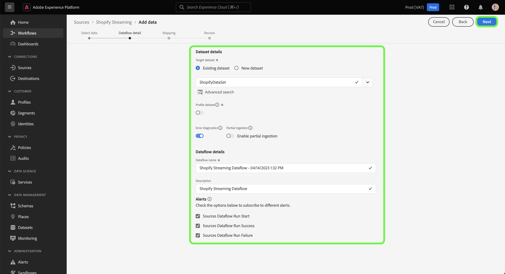

# のソース接続とデータフローの作成 [!DNL Shopify Streaming] UI を使用したデータ

このチュートリアルでは、 [!DNL Shopify Streaming] ソース接続とデータフローを設定できます。

## はじめに {#getting-started}

このチュートリアルは、 Experience Platform の次のコンポーネントを実際に利用および理解しているユーザーを対象としています。

* [[!DNL Experience Data Model (XDM)]  システム](../../../../../xdm/home.md)：[!DNL Experience Platform] が顧客体験データの整理に使用する標準化されたフレームワーク。
   * [スキーマ構成の基本](../../../../../xdm/schema/composition.md)：スキーマ構成の主要な原則やベストプラクティスなど、XDM スキーマの基本的な構成要素について学びます。
   * [スキーマエディターのチュートリアル](../../../../../xdm/tutorials/create-schema-ui.md)：スキーマエディター UI を使用してカスタムスキーマを作成する方法を説明します。
* [[!DNL Real-Time Customer Profile]](../../../../../profile/home.md)：複数のソースからの集計データに基づいて、統合されたリアルタイムの顧客プロファイルを提供します。

>[!IMPORTANT]
>
>このチュートリアルでは、 [!DNL Shopify Streaming] アカウント。 アカウントの設定手順については、 [[!DNL Shopify Streaming] 概要](../../../../connectors/ecommerce/shopify-streaming.md).

## [!DNL Shopify Streaming] アカウントの接続

Platform UI の左側のナビゲーションバーで「**[!UICONTROL ソース]**」を選択し、[!UICONTROL ソース]ワークスペースにアクセスします。[!UICONTROL カタログ]画面には、アカウントを作成できる様々なソースが表示されます。

画面の左側にあるカタログから適切なカテゴリを選択することができます。または、使用する特定のソースを検索オプションを使用して探すこともできます。

の下 **e コマース** カテゴリ、選択 [!DNL Shopify Streaming]を選択し、 **[!UICONTROL データを追加]**.

## データの選択

The **[!UICONTROL データを選択]** の手順が表示され、Platform に取り込むデータを選択するためのインターフェイスが提供されます。

* インターフェイスの左側には、アカウント内で使用可能なデータストリームを表示できるブラウザーがあります。
* インターフェイスの右側では、JSON ファイルから最大 100 行のデータをプレビューできます。

選択 **[!UICONTROL ファイルをアップロード]** をクリックして、ローカルシステムから JSON ファイルをアップロードします。 または、アップロードする JSON ファイルをにドラッグ&amp;ドロップすることもできます [!UICONTROL ファイルをドラッグ&amp;ドロップ] パネル。

ファイルがアップロードされると、プレビューインターフェイスが更新され、アップロードしたスキーマのプレビューが表示されます。 プレビューインターフェイスを使用すると、ファイルの内容と構造を検査できます。 また、 [!UICONTROL 検索フィールド] スキーマ内から特定の項目にアクセスするユーティリティ。

終了したら、「**[!UICONTROL 次へ]**」を選択します。

## データフローの詳細

The **データフローの詳細** 手順が表示され、既存のデータセットを使用するか、データフローの新しいデータセットを確立するか、およびデータフローの名前と説明を指定する機会が提供されます。 この手順では、プロファイルの取り込み、エラー診断、部分取り込み、アラートの設定も指定できます。

終了したら、「**[!UICONTROL 次へ]**」を選択します。

## マッピング

[!UICONTROL マッピング]手順が表示され、ソーススキーマのソースフィールドを、ターゲットスキーマの適切なターゲット XDM フィールドにマッピングするためのインターフェイスが提供されます。

Platform は、選択したターゲットスキーマまたはデータセットに基づいて、自動マッピングされたフィールドに対するインテリジェントな推奨事項を提供します。 マッピングルールは、ユースケースに合わせて手動で調整できます。必要に応じて、フィールドを直接マッピングするか、データ準備機能を使用してソースデータを変換して計算値を導き出すかを選択できます。マッパーインターフェイスと計算フィールドを使用した包括的な手順については、 [データ準備 UI ガイド](https://experienceleague.adobe.com/docs/experience-platform/data-prep/ui/mapping.html).

ソースデータが正常にマッピングされたら、「 」を選択します。 **[!UICONTROL 次へ]**.

## レビュー

**[!UICONTROL レビュー]**&#x200B;手順が表示され、新しいデータフローを作成する前に確認できます。詳細は、次のカテゴリに分類されます。

* **[!UICONTROL 接続]**：ソースタイプ、選択したソースファイルの関連パス、およびそのソースファイル内の列数を表示します。
* **[!UICONTROL データセットの割り当てとフィールドのマッピング]**：ソースデータがどのデータセットに取り込まれるかを、そのデータセットが準拠するスキーマを含めて表示します。

データフローをレビューしたら、「**[!UICONTROL 終了]**」を選択し、データフローが作成されるまでしばらく待ちます。

## ストリーミングエンドポイント URL を取得する

ストリーミングデータフローを作成したら、ストリーミングエンドポイント URL を取得できます。 このエンドポイントは、Webhook を購読するために使用され、ストリーミングソースとExperience Platformが通信できます。

ストリーミングエンドポイントを取得するには、 [!UICONTROL データフローアクティビティ] 作成したデータフローのページで、エンドポイントをの下部からコピーします。 [!UICONTROL プロパティ] パネル。

## 次の手順

このチュートリアルに従って、 [!DNL Shopify Streaming] アカウント。 接続方法については、 [!DNL Shopify Streaming] API を使用するアカウントについては、 [ストリーミングするソース接続とデータフローの作成 [!DNL Shopify] フローサービス API を使用したデータ](../../../api/create/ecommerce/shopify-streaming.md).
