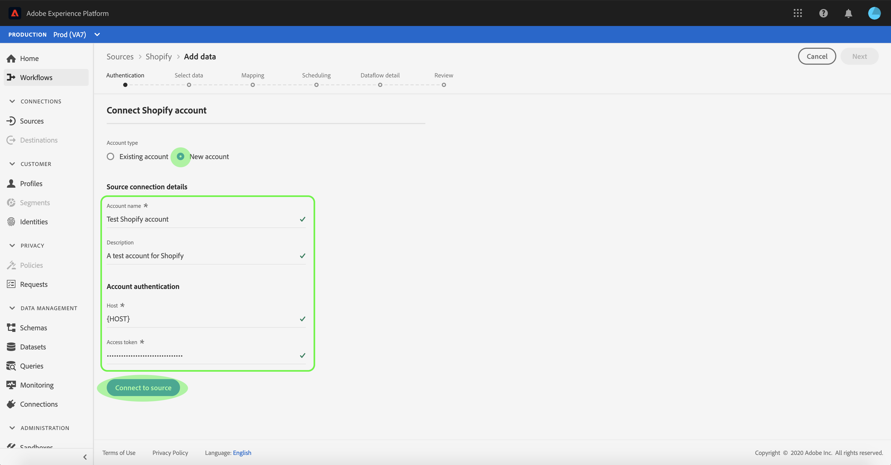

# UI での [!DNL Shopify] ソース接続の作成

Adobe Experience Platform のソースコネクタには、外部ソースの データを設定したスケジュールに従って取り込む機能が用意されています。 このチュートリアルでは、[!DNL Platform] のユーザーインターフェイスを使用して [!DNL Shopify] ソースコネクタを作成する手順を説明します。

## はじめに

このチュートリアルは、Adobe Experience Platform の次のコンポーネントを実際に利用および理解しているユーザーを対象としています。

* [エクスペリエンスデータモデルl（XDM）システム](../../../../../xdm/home.md)[!DNL Experience Platform]： が顧客体験データを整理するための標準化されたフレームワークです。
   * [スキーマ構成の基本](../../../../../xdm/schema/composition.md)：スキーマ構成の主要な原則やベストプラクティスなど、XDM スキーマの基本的な構成要素について学びます。
   * [スキーマエディターのチュートリアル](../../../../../xdm/tutorials/create-schema-ui.md)：スキーマエディター UI を使用してカスタムスキーマを作成する方法を説明します。
* [[!DNL Real-time Customer Profile]](../../../../../profile/home.md)：複数のソースからの集計データに基づいて、統合されたリアルタイムの顧客プロファイルを提供します。

既に [!DNL Shopify] 接続する場合は、このドキュメントの残りの部分をスキップして、 [e コマースコネクタのデータフローの設定](../../dataflow/ecommerce.md).

### 必要な認証情報の収集

 で [!DNL Shopify] アカウントにアクセスするには、次の値を指定する必要があります。[!DNL Platform]

| 認証情報 | 説明 |
| ---------- | ----------- |
| `host` | 次の項目のエンドポイント： [!DNL Shopify] サーバー。 |
| `accessToken` | のアクセストークン [!DNL Shopify] ユーザーアカウント。 |

導入の詳細については、 [[!DNL Shopify] 文書](https://shopify.dev/concepts/about-apis/authentication).

## [!DNL Shopify] アカウントの接続

必要な認証情報が揃ったら、次の手順に従って、[!DNL Shopify] アカウントを [!DNL Platform] にリンクします。

にログインします。 [Adobe Experience Platform](https://platform.adobe.com) 次に、 **[!UICONTROL ソース]** 左側のナビゲーションバーから **[!UICONTROL ソース]** ワークスペース。 **[!UICONTROL カタログ]**&#x200B;画面には、アカウントを作成できる様々なソースが表示されます。

画面の左側にあるカタログから適切なカテゴリを選択することができます。または、使用する特定のソースを検索オプションを使用して探すこともできます。

以下 **[!UICONTROL e コマース]** カテゴリ、選択 **[!UICONTROL Shopify]**. このコネクタを初めて使用する場合は、「 **[!UICONTROL 設定]**. それ以外の場合は、「 **[!UICONTROL データを追加]** 新しい [!DNL Shopify] コネクタ。

この **[!UICONTROL Shopify に接続]** ページが表示されます。 このページでは、新しい資格情報または既存の資格情報を使用できます。

### 新しいアカウント

新しい資格情報を使用している場合は、「 **[!UICONTROL 新しいアカウント]**. 表示される入力フォームで、名前、説明（オプション）および [!DNL Shopify] 資格情報。 終了したら、「 」を選択します。 **[!UICONTROL 接続]** その後、新しい接続が確立されるまでしばらく時間をかけます。

### 既存のアカウント

既存のアカウントに接続するには、 [!DNL Shopify] 接続するアカウントを選択し、 **[!UICONTROL 次へ]** をクリックして続行します。

## 次の手順

このチュートリアルでは、[!DNL Shopify] アカウントとの接続を確立しました。次のチュートリアルに進み、 [e コマースデータをに取り込むためのデータフローの設定 [!DNL Platform]](../../dataflow/ecommerce.md).
