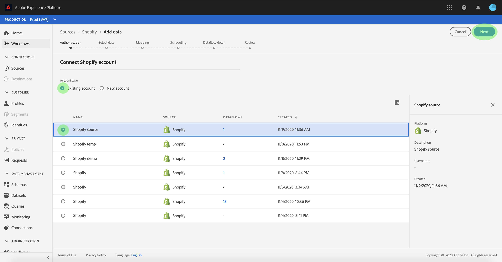

# UI での [!DNL Shopify] ソース接続の作成

Adobe Experience Platformのソースコネクタは、外部ソースのデータをスケジュールに従って取り込む機能を提供します。 このチュートリアルでは、[!DNL Platform] ユーザーインターフェイスを使用して [!DNL Shopify] ソースコネクタを作成する手順を説明します。

## はじめに

このチュートリアルは、Adobe Experience Platform の次のコンポーネントを実際に利用および理解しているユーザーを対象としています。

* [エクスペリエンスデータモデルl（XDM）システム](../../../../../xdm/home.md)[!DNL Experience Platform]： が顧客体験データを整理するための標準化されたフレームワークです。
   * [スキーマ構成の基本](../../../../../xdm/schema/composition.md)：スキーマ構成の主要な原則やベストプラクティスなど、XDM スキーマの基本的な構成要素について学びます。
   * [スキーマエディターのチュートリアル](../../../../../xdm/tutorials/create-schema-ui.md):スキーマエディターの UI を使用してカスタムスキーマを作成する方法を説明します。
* [[!DNL Real-time Customer Profile]](../../../../../profile/home.md)：複数のソースからの集計データに基づいて、統合されたリアルタイムの顧客プロファイルを提供します。

既に [!DNL Shopify] 接続がある場合は、このドキュメントの残りの部分をスキップし、[e コマースコネクタのデータフローの設定 ](../../dataflow/ecommerce.md) に関するチュートリアルに進んでください。

### 必要な資格情報の収集

[!DNL Platform] の [!DNL Shopify] アカウントにアクセスするには、次の値を指定する必要があります。

| 資格情報 | 説明 |
| ---------- | ----------- |
| `host` | [!DNL Shopify] サーバーのエンドポイント。 |
| `accessToken` | [!DNL Shopify] ユーザーアカウントのアクセストークン。 |

使い始める方法については、この [[!DNL Shopify]  ドキュメント ](https://shopify.dev/concepts/about-apis/authentication) を参照してください。

## [!DNL Shopify] アカウントに接続

必要な資格情報を収集したら、以下の手順に従って [!DNL Shopify] アカウントを [!DNL Platform] にリンクします。

[Adobe Experience Platform](https://platform.adobe.com) にログインし、左側のナビゲーションバーから「**[!UICONTROL ソース]**」を選択して、「**[!UICONTROL ソース]**」ワークスペースにアクセスします。 **[!UICONTROL カタログ]** 画面には、アカウントを作成するための様々なソースが表示されます。

画面の左側にあるカタログから適切なカテゴリを選択できます。 または、検索オプションを使用して、目的の特定のソースを見つけることもできます。

「**[!UICONTROL e コマース]**」カテゴリで、「**[!UICONTROL Shopify]**」を選択します。 このコネクタを初めて使用する場合は、「**[!UICONTROL 設定]**」を選択します。 それ以外の場合は、「**[!UICONTROL データを追加]**」を選択して新しい [!DNL Shopify] コネクタを作成します。

**[!UICONTROL Shopify]** に接続ページが表示されます。 このページでは、新しい資格情報または既存の資格情報を使用できます。

### 新規アカウント

新しい資格情報を使用する場合は、「**[!UICONTROL 新しいアカウント]**」を選択します。 表示される入力フォームで、名前、説明（オプション）、[!DNL Shopify] 資格情報を入力します。 終了したら、[**[!UICONTROL 接続]**] を選択し、新しい接続が確立されるまでしばらく時間をかけます。

### 既存のアカウント

既存のアカウントに接続するには、接続する [!DNL Shopify] アカウントを選択し、**[!UICONTROL 次へ]** を選択して次に進みます。

## 次の手順

このチュートリアルに従って、[!DNL Shopify] アカウントへの接続を確立しました。 次のチュートリアルに進み、e コマースデータを  [!DNL Platform]](../../dataflow/ecommerce.md) に取り込むように [ データフローを設定します。
