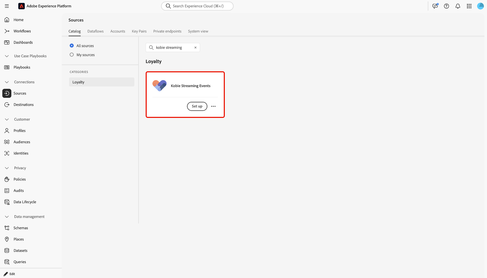
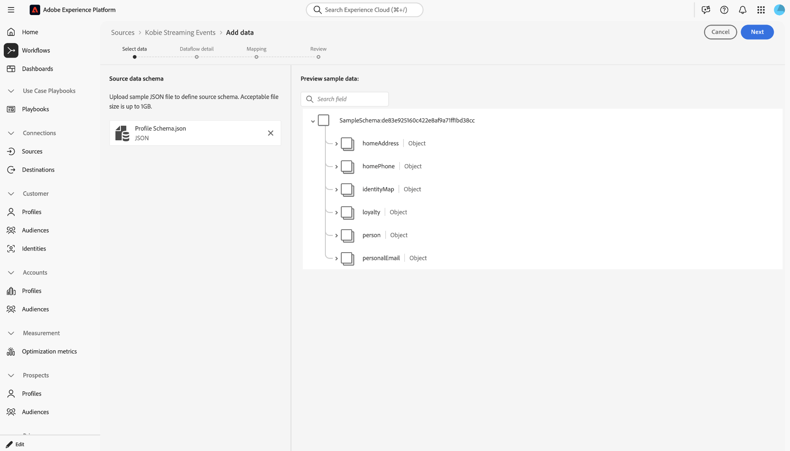
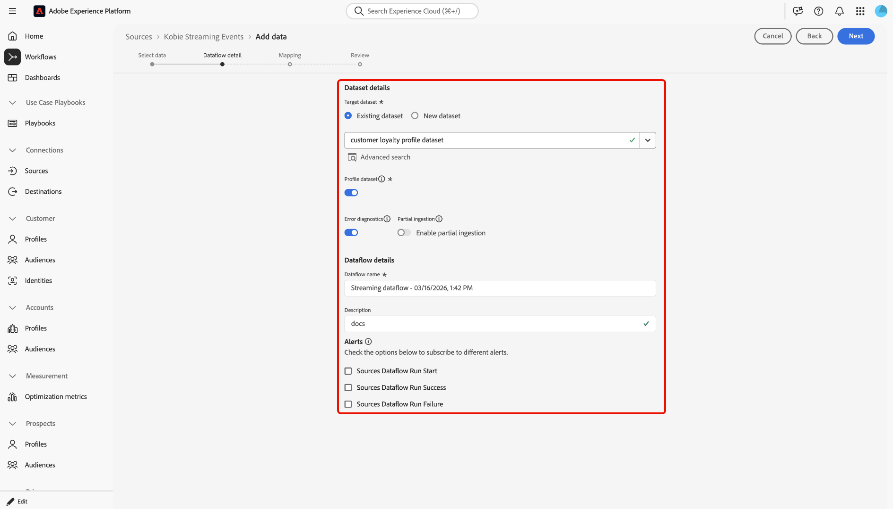
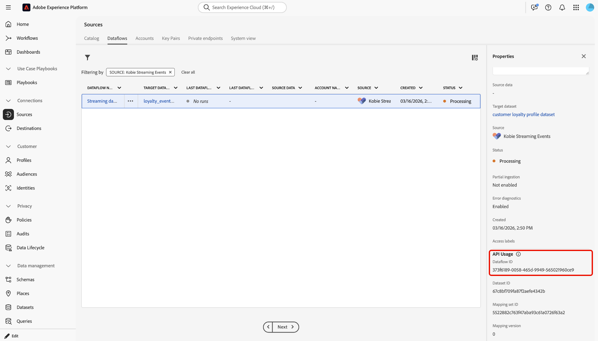

# UIを使用して[!DNL Kobie Streaming Events]からExperience Platformにデータをストリーミング

[!DNL Kobie Alchemy Loyalty Cloud (KALC)]は、エンタープライズレベルのガバナンスにより、価値実現までの時間の短縮、効率性の向上、ブランドの保護など、ロイヤルティ戦略に適応する、構成が容易で安全、かつスケーラブルなMACH プラットフォームです。 [!DNL KALC]では、CDP、CRM、CMSなどのシームレスな統合により、マーケターがあらゆるチャネルでリアルタイムのパーソナライゼーションを提供できるようにするとともに、ブランドロイヤルティの向上に合わせて進化できる柔軟性とトレーサビリティを提供します。

このガイドでは、UIのソースワークスペースを使用して、[!DNL Kobie Streaming Events]からAdobe Experience Platformにデータを接続してストリーミングする方法について説明します。

>[!IMPORTANT]
>
>前提条件の設定とマッピングについて詳しくは、[!DNL Kobie Client Services]担当者に直接お問い合わせください。

## はじめに

このチュートリアルは、 Experience Platform の次のコンポーネントを実際に利用および理解しているユーザーを対象としています。

* [[!DNL Experience Data Model (XDM)] システム](../../../../../xdm/home.md)：Experience Platform が顧客体験データの整理に使用する標準化されたフレームワーク。
   * [スキーマ構成の基本](../../../../../xdm/schema/composition.md)：スキーマ構成の主要な原則やベストプラクティスなど、XDM スキーマの基本的な構成要素について学びます。
   * [スキーマエディターのチュートリアル](../../../../../xdm/tutorials/create-schema-ui.md)：スキーマエディター UI を使用してカスタムスキーマを作成する方法を説明します。
* [[!DNL Real-Time Customer Profile]](../../../../../profile/home.md)：複数のソースからの集計データに基づいて、統合されたリアルタイムの顧客プロファイルを提供します。

## ソースカタログを移動する

Experience Platform UIで、左側のナビゲーションから「**[!UICONTROL Sources]**」を選択して、*[!UICONTROL Sources]* ワークスペースにアクセスします。 *[!UICONTROL Categories]* パネルで適切なカテゴリを選択します。 または、検索バーを使用して、使用する特定のソースに移動します。

[!DNL Kobie]からデータをストリーミングするには、*[!UICONTROL Loyalty]*&#x200B;の下にある&#x200B;**[!UICONTROL Kobie Streaming Events]** ソースカードを選択し、**[!UICONTROL Add data]**&#x200B;を選択します。

>[!TIP]
>
>ソースカタログのソースには、特定のソースがまだ認証済みアカウントを持っていない場合、**[!UICONTROL Set up]** オプションが表示されます。 認証済みアカウントが作成されると、このオプションは&#x200B;**[!UICONTROL Add data]**&#x200B;に変更されます。

## データの選択

次に、*[!UICONTROL Select data]* インターフェイスを使用して、サンプル JSON ファイルをアップロードし、ソーススキーマを定義します。 この手順では、プレビューインターフェイスを使用して、ペイロードのファイル構造を表示できます。 終了したら「**[!UICONTROL Next]**」を選択します。

## データフローの詳細

次に、データセットとデータフローに関する情報を提供する必要があります。

### データセットの詳細

データセットとは、スキーマ（列/フィールド）とレコード（行）を含むデータのコレクション（通常はテーブル）のストレージおよび管理構造です。 Experience Platformに正常に取り込まれたデータは、データセットとしてデータレイク内に保持されます。

この手順では、既存のデータセットを使用するか、新しいデータセットを作成できます。

>[!NOTE]
>
>既存のデータセットを使用するか、新しいデータセットを作成するかに関係なく、プロファイル **の取り込みに対してデータセットが**&#x200B;有効になっていることを確認する必要があります。

+++プロファイルの取り込み、エラー診断、および部分取り込みを有効にする手順を選択します。

データセットがリアルタイム顧客プロファイルに対して有効になっている場合、この手順では、**[!UICONTROL Profile dataset]**&#x200B;を切り替えて、プロファイル取り込み用のデータを有効にできます。 この手順を使用して、**[!UICONTROL Error diagnostics]**&#x200B;と&#x200B;**[!UICONTROL Partial ingestion]**&#x200B;を有効にすることもできます。

* **[!UICONTROL Error diagnostics]**: データセットのアクティビティとデータフローのステータスを監視する際に、後で参照できるエラー診断を生成するようにソースに指示するには、**[!UICONTROL Error diagnostics]**&#x200B;を選択します。
* **[!UICONTROL Partial ingestion]**：部分的なバッチ取り込みは、特定の設定可能なしきい値まで、エラーを含むデータを取り込む機能です。 この機能を使用すると、正確なデータをすべてExperience Platformに正常に取り込むことができますが、誤ったデータはすべて、無効な理由に関する情報とともに個別にバッチ化されます。

+++

### データフローの詳細

データセットを設定したら、名前、オプションの説明、アラート設定など、データフローの詳細を指定する必要があります。

| データフロー設定 | 説明 |
| --- | --- |
| データフロー名 | データフローの名前。 デフォルトでは、読み込まれるファイルの名前が使用されます。 |
| 説明 | （オプション）データフローの簡単な説明。 |
| アラート | Experience Platformは、ユーザーが購読できるイベントベースのアラートを生成できます。これらのオプションを使用すると、実行中のデータフローがこれらのアラートをトリガーできます。  詳しくは、[ アラートの概要](../../alerts.md)を参照してください <ul><li>**ソースデータフロー実行開始**：このアラートを選択すると、データフロー実行が開始されたときに通知を受け取ります。</li><li>**ソースデータフローの実行成功**：このアラートを選択すると、データフローがエラーなしで終了した場合に通知を受け取ります。</li><li>**ソースデータフロー実行エラー**: データフロー実行がエラーで終了した場合に通知を受け取るには、このアラートを選択します。</li></ul> |

{style="table-layout:auto"}

## マッピング

マッピングインターフェイスを使用して、Experience Platformにデータを取り込む前に、ソースデータを適切なスキーマフィールドにマッピングします。 詳しくは、UI](../../../../../data-prep/ui/mapping.md)の[ マッピングガイドを参照してください。

## レビュー

*[!UICONTROL Review]* ステップが表示され、データフローを作成する前にデータフローの詳細を確認できます。 詳細は、次のカテゴリに分類されます。

* **[!UICONTROL Connection]**: アカウント名、ソースプラットフォーム、およびソース名を表示します。
* **[!UICONTROL Assign dataset and map fields]**: ターゲットデータセットと、データセットが準拠しているスキーマを表示します。

詳細が正しいことを確認したら、**[!UICONTROL Finish]**&#x200B;を選択します。

## ストリーミングエンドポイント URLの取得

接続を作成すると、ソースの詳細ページが表示されます。 このページには、以前に実行したデータフロー、ID、ストリーミングエンドポイント URLなど、新しく作成した接続の詳細が表示されます。

## データフローの監視

データフローを作成したら、そのデータフローを通じて取り込まれるデータをモニターすると、取り込み速度、成功、エラーに関する情報を確認できます。 データフローを監視する方法について詳しくは、[UIでのアカウントとデータフローの監視に関するチュートリアル ](../../monitor-streaming.md)を参照してください。
