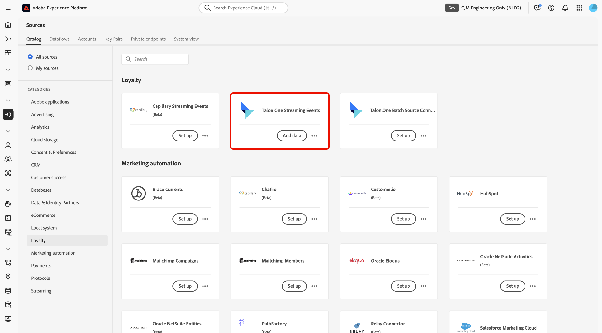
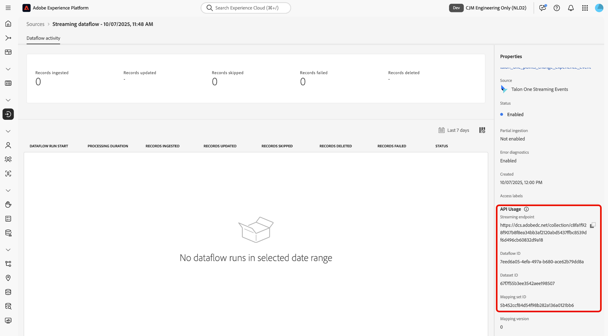

# UI を使用したExperience Platformへの [!DNL Talon.One] データのストリーミング

>[!AVAILABILITY]
>
>[!DNL Talon.One] ソースはベータ版です。ベータラベル付きソースの使用について詳しくは、ソースの概要の [&#x200B; 利用条件 &#x200B;](../../../../home.md#terms-and-conditions) を参照してください。

UI のソースワークスペースを使用して、[!DNL Talon.One] からAdobe Experience Platformにデータを接続し、ストリーミングする方法については、このガイドを参照してください。

## はじめに

このチュートリアルは、 Experience Platform の次のコンポーネントを実際に利用および理解しているユーザーを対象としています。

* [[!DNL Experience Data Model (XDM)] システム](../../../../../xdm/home.md)：Experience Platform が顧客体験データの整理に使用する標準化されたフレームワーク。
   * [スキーマ構成の基本](../../../../../xdm/schema/composition.md)：スキーマ構成の主要な原則やベストプラクティスなど、XDM スキーマの基本的な構成要素について学びます。
   * [スキーマエディターのチュートリアル](../../../../../xdm/tutorials/create-schema-ui.md)：スキーマエディター UI を使用してカスタムスキーマを作成する方法を説明します。
* [[!DNL Real-Time Customer Profile]](../../../../../profile/home.md)：複数のソースからの集計データに基づいて、統合されたリアルタイムの顧客プロファイルを提供します。

>[!IMPORTANT]
>
>アカウントをExperience Platformに接続する前に完了する必要がある前提条件の手順については、[[!DNL Talon.One]  概要 &#x200B;](../../../../connectors/loyalty/talon-one.md) を参照してください。

## ソースカタログのナビゲート

Experience Platformの UI で、左側のナビゲーションから **[!UICONTROL Sources]** を選択し、*[!UICONTROL Sources]* ワークスペースにアクセスします。 *[!UICONTROL カテゴリ]* パネルで適切なカテゴリを選択します。 または、検索バーを使用して、使用する特定のソースに移動します。

[!DNL Talon.One] からデータをストリーミングするには、「**[!UICONTROL ロイヤルティ]**」の下の「*[!UICONTROL Talon.One ストリーミングイベント]* ソースカードを選択し、「**[!UICONTROL データを追加]**」を選択します。

>[!TIP]
>
>ソースカタログ内のソースは、特定のソースがまだ認証済みのアカウントを持っていない場合に「**[!UICONTROL 設定]**」オプションを表示します。 認証済みアカウントを作成すると、このオプションは **[!UICONTROL データを追加]** に変わります。

## データの選択

次に、*[!UICONTROL データを選択]* インターフェイスを使用して、サンプルの JSON ファイルをアップロードし、ソーススキーマを定義します。 この手順では、プレビューインターフェイスを使用して、ペイロードのファイル構造を表示できます。 終了したら、「**[!UICONTROL 次へ]**」を選択します。

## データフローの詳細

次に、データセットとデータフローに関する情報を指定する必要があります。

### データセットの詳細

データセットは、スキーマ（列/フィールド）とレコード（行）を含んだデータコレクション（通常はテーブル）のストレージおよび管理用の構成体です。 Experience Platformに正常に取り込まれたデータは、データレイク内にデータセットとして保持されます。

この手順では、既存のデータセットを使用するか、新しいデータセットを作成します。

>[!NOTE]
>
>既存のデータセットを使用するか、新しいデータセットを作成するかに関係なく、データセットが取り込み **プロファイルに対して有効** になっていることを確認する必要があります。

+++プロファイル取り込み、エラー診断、部分取り込みを有効にする手順を選択します。

データセットがリアルタイム顧客プロファイルに対して有効になっている場合、この手順の間に **[!UICONTROL プロファイルデータセット]** を切り替えて、プロファイル取り込み用のデータを有効にすることができます。 また、この手順を使用して、**[!UICONTROL エラー診断]** および **[!UICONTROL 部分取り込み]** を有効にすることもできます。

* **[!UICONTROL エラー診断]**: **[!UICONTROL エラー診断]** を選択して、データセットアクティビティとデータフローステータスを監視する際に後で参照できるエラー診断を生成するようにソースに指示します。
* **[!UICONTROL 部分取り込み]**：部分バッチ取り込みは、設定可能な特定のしきい値まで、エラーを含んだデータを取り込む機能です。 この機能を使用すると、正確なデータをすべてExperience Platformに正常に取り込みながら、不正なデータがすべて無効な理由に関する情報と共に個別にバッチ処理されます。

+++

### データフローの詳細

データセットを設定したら、名前、説明（オプション）、アラート設定など、データフローの詳細を指定する必要があります。

| データフロー設定 | 説明 |
| --- | --- |
| データフロー名 | データフローの名前。 デフォルトでは、読み込まれるファイルの名前が使用されます。 |
| 説明 | （任意）データフローの簡単な説明です。 |
| アラート | Experience Platformでは、ユーザーが登録できるイベントベースのアラートを作成できます。これらのオプションを使用すると、実行中のデータフローでこれらのアラートをトリガーできます。  詳しくは、[&#x200B; アラートの概要 &#x200B;](../../alerts.md) を参照してください <ul><li>**ソースデータフロー実行開始**：データフロー実行が開始したときに通知を受け取るには、このアラートを選択します。</li><li>**ソースデータフロー実行成功**：データフローがエラーなく終了した場合に通知を受け取るには、このアラートを選択します。</li><li>**ソースデータフロー実行の失敗**：データフローの実行がエラーで終了した場合に通知を受け取るには、このアラートを選択します。</li></ul> |

{style="table-layout:auto"}

## マッピング

マッピングインターフェイスを使用して、データをExperience Platformに取り込む前に、ソースデータを適切なスキーマフィールドにマッピングします。 詳しくは、UI の [&#x200B; マッピングガイド &#x200B;](../../../../../data-prep/ui/mapping.md) を参照してください。

<!--
>[!TIP]
>
>You can download the [Events and Profile mappings](../../../../images/tutorials/create/capillary/mappings.zip) for [!DNL Capillary] and [import the files to Data Prep](../../../../../data-prep/ui/mapping.md#import-mapping) when you are ready to map your data.
-->

## レビュー

*[!UICONTROL レビュー]* 手順が表示され、データフローを作成する前に詳細をレビューできます。 詳細は、次のカテゴリに分類されます。

* **[!UICONTROL 接続]**：アカウント名、ソースプラットフォーム、ソース名が表示されます。
* **[!UICONTROL データセットの割り当てとフィールドのマッピング]**：ターゲットデータセットと、そのデータセットが準拠するスキーマを表示します。

詳細が正しいことを確認したら、「**[!UICONTROL 終了]**」を選択します。

## ストリーミングエンドポイント URL の取得

接続が作成されると、ソースの詳細ページが表示されます。 このページには、以前に実行したデータフロー、ID、ストリーミングエンドポイント URL など、新しく作成した接続の詳細が表示されます。

## データフローの監視

データフローを作成したら、そのデータフローを通じて取り込まれるデータをモニターすると、取り込み速度、成功、エラーに関する情報を確認できます。データフローのモニタリング方法について詳しくは、[UI でのアカウントとデータフローのモニタリング &#x200B;](../../monitor-streaming.md) を参照してください。