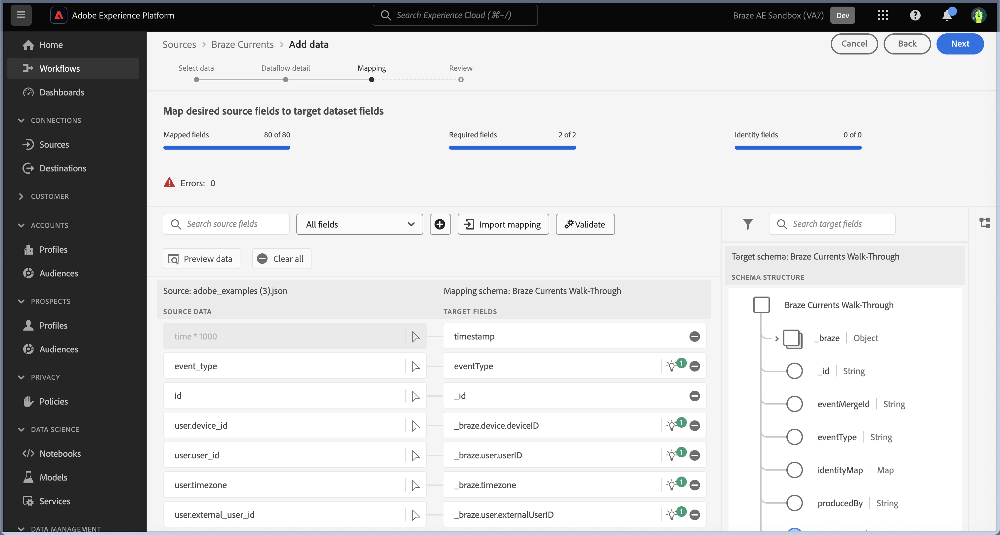

# UI での [!DNL Braze Currents] ソース接続の作成

>[!NOTE]
>
>[!DNL Braze Currents] ソースはベータ版です。ベータラベル付きソースの使用について詳しくは、[ ソースの概要 ](../../../../home.md#terms-and-conditions) を参照してください。

[!DNL Braze] は、消費者とブランドの間で、顧客中心のやり取りをリアルタイムで強化します。 [!DNL Braze Currents] は、Braze プラットフォームからのエンゲージメントイベントのリアルタイムデータストリームです。これは、[!DNL Braze] プラットフォームからの最も堅牢かつ詳細な書き出しです。

UI で [!DNL Braze] アカウントからAdobe Experience Platformにエンゲージメントイベントデータを取り込む方法については、次のチュートリアルを参照してください。

## 前提条件

このガイドの手順を完了するには、以下が必要です。

* [Adobe Experience Platformにログインし ](https://platform.adobe.com) 新しいストリーミングソース接続を作成する権限。
* [[!DNL Braze]  ダッシュボード ](https://dashboard.braze.com/sign_in) へのログイン、未使用の [Current Connector ライセンス ](https://www.braze.com/docs/user_guide/data_and_analytics/braze_currents)、コネクタを作成するための権限。 詳しくは、[ 設定の要件  [!DNL Currents]](https://www.braze.com/docs/user_guide/data_and_analytics/braze_currents/setting_up_currents/#requirements) を参照してください。

## はじめに

このチュートリアルは、Adobe Experience Platform の次のコンポーネントを実際に利用および理解しているユーザーを対象としています。

* [[!DNL Experience Data Model (XDM)]  システム](../../../../../xdm/home.md)：[!DNL Experience Platform] が顧客体験データの整理に使用する標準化されたフレームワーク。
   * [スキーマ構成の基本](../../../../../xdm/schema/composition.md)：スキーマ構成の主要な原則やベストプラクティスなど、XDM スキーマの基本的な構成要素について学びます。
   * [スキーマエディターのチュートリアル](../../../../../xdm/tutorials/create-schema-ui.md)：スキーマエディター UI を使用してカスタムスキーマを作成する方法を説明します。
* [[!DNL Real-Time Customer Profile]](../../../../../profile/home.md)：複数のソースからの集計データに基づいて、統合されたリアルタイムの顧客プロファイルを提供します。

このチュートリアルでは、[[!DNL Braze]  電流 ](https://www.braze.com/docs/user_guide/data_and_analytics/braze_currents) に関する十分な知識も必要です。

既に [!DNL Braze] 接続がある場合は、このドキュメントの残りの部分をスキップして、[ データフローの設定 ](../../dataflow/marketing-automation.md) に関するチュートリアルに進むことができます。

## XDM スキーマの作成

>[!TIP]
>
>[!DNL Braze Currents] 接続を初めて作成する場合は、エクスペリエンスデータモデル（XDM）スキーマを作成する必要があります。 [!DNL Braze Currents] のスキーマを既に作成している場合は、この手順をスキップして、[ アカウントのExperience Platformへの接続 ](#connect) に進むことができます。

Experience Platform UI で、左側のナビゲーションを使用し、「**[!UICONTROL スキーマ]**」を選択して、「[!UICONTROL  スキーマ ] ワークスペースにアクセスします。 次に、「**[!UICONTROL スキーマを作成]**」を選択し、「**[!UICONTROL エクスペリエンスイベント]**」を選択します。 続行するには、「**[!UICONTROL 次へ]**」を選択します。

スキーマの名前と説明を指定します。 次に、[!UICONTROL  構成 ] パネルを使用して、スキーマ属性を設定します。 [!UICONTROL  フィールドグループ ] の下で「**[!UICONTROL 追加]**」を選択し、「[!UICONTROL Braze Currents User Event]」フィールドグループを追加します。 完了したら「**[!UICONTROL 保存]**」を選択します。

スキーマについて詳しくは、[UI でのスキーマの作成 ](../../../../../xdm/tutorials/create-schema-ui.md) ガイドを参照してください。

## [!DNL Braze] アカウントのExperience Platformへの接続 {#connect}

Experience Platformの UI で、左側のナビゲーションから **[!UICONTROL Sources]** を選択し、[!UICONTROL Sources] ワークスペースにアクセスします。 画面の左側にあるカタログから適切なカテゴリを選択することができます。または、使用する特定のソースを検索オプションを使用して探すこともできます。

*マーケティングオートメーション* カテゴリで、**[!UICONTROL Braze Currents]** を選択し、次に **[!UICONTROL データを追加]** を選択します。

次に、提供された [Braze Currents サンプルファイル ](https://github.com/Appboy/currents-examples/blob/master/sample-data/Adobe/adobe_examples.json) をアップロードします。 このファイルには、Braze がイベントの一部として送信する可能性のあるすべてのフィールドが含まれています。

ファイルがアップロードされたら、データセットやマッピング先のスキーマに関する情報など、データフローの詳細を指定する必要があります。  Braze Current ソースを初めて接続する場合は、新しいデータセットを作成します。  それ以外の場合は、Braze スキーマを参照する既存のデータセットを使用できます。  新しいデータセットを作成する場合は、前の節で作成したスキーマを使用します。

次に、マッピングインターフェイスを使用して、データのマッピングを設定します。

マッピングには、解決が必要な次の問題があります。

ソースデータでは、*id* が誤って *_braze.appID* にマッピングされます。 ターゲットマッピングフィールドをスキーマのルートレベルで *_id* に変更する必要があります。 次に、*properties.is_amp* が *_braze.messaging.email.isAMP* にマッピングされていることを確認します。

次に、*time* を *timestamp* マッピングに削除し、追加（`+`）アイコンを選択してから、**[!UICONTROL 計算フィールドを追加]** を選択します。 表示されたボックスに *time \* 1000* と入力して **[!UICONTROL Save]** を選択します。

新しい計算フィールドを追加したら、新しいソースフィールドの横にある **[!UICONTROL ターゲットフィールドをマッピング]** を選択し、スキーマのルートレベルで *タイムスタンプ* にマッピングします。 次に、「**[!UICONTROL 検証]**」を選択して、エラーがなくなったことを確認します。

>[!IMPORTANT]
>
>Braze タイムスタンプはミリ秒単位ではなく、秒単位で表現されます。 Experience Platformのタイムスタンプを正確に反映するには、計算フィールドをミリ秒単位で作成する必要があります。 「time * 1000」の計算は、Experience Platform内のタイムスタンプフィールドへのマッピングに適した、ミリ秒に適切に変換されます。
>
> の計算フィールドの作成

終了したら、「**[!UICONTROL 次へ]**」を選択します。 レビューページを使用してデータフローの詳細を確認し、「**[!UICONTROL 完了]**」を選択します。

### 必要な資格情報の収集

接続が作成されたら、次の資格情報の値を収集する必要があります。この値は、Braze Dashboard でExperience Platformにデータを送信するために提供されます。 詳しくは、[!DNL Braze][ 電流への移動に関するガイド ](https://www.braze.com/docs/user_guide/data_and_analytics/braze_currents/setting_up_currents/#step-2-navigate-to-currents) を参照してください。

| フィールド | 説明 |
| --- | --- |
| クライアント ID | Experience Platform ソースに関連付けられたクライアント ID。 |
| クライアント秘密鍵 | Experience Platform ソースに関連付けられたクライアントシークレット。 |
| テナント ID | Experience Platform ソースに関連付けられたテナント ID。 |
| サンドボックス名 | Experience Platform ソースに関連付けられたサンドボックス。 |
| データフロー ID | Experience Platform ソースに関連付けられたデータフロー ID。 |
| ストリーミングエンドポイント | Experience Platform ソースに関連付けられたストリーミングエンドポイント。 **メモ**:[!DNL Braze] はこれをバッチストリーミングエンドポイントに自動的に変換します。 |

### データソースにデータをストリーミングするための [!DNL Braze Currents] の設定

[!DNL Braze Dashboard] 内で、「Partner Integrations **-> 「** Data Export」に移動し、「**[!DNL Create New Current]**」を選択します。 コネクタの名前、コネクタに関する通知の連絡先情報、および上記の資格情報を入力するように求められます。 受け取るイベントを選択し、必要に応じてフィールドの除外/変換を設定して、「**[!DNL Launch Current]**」を選択します。

## 次の手順

このチュートリアルでは、[!DNL Braze] アカウントとの接続を確立しました。次のチュートリアルに進み、[ マーケティング自動化システムデータをに取り込むためのデータフローの設定  [!DNL Experience Platform]](../../dataflow/marketing-automation.md) を行いましょう。
