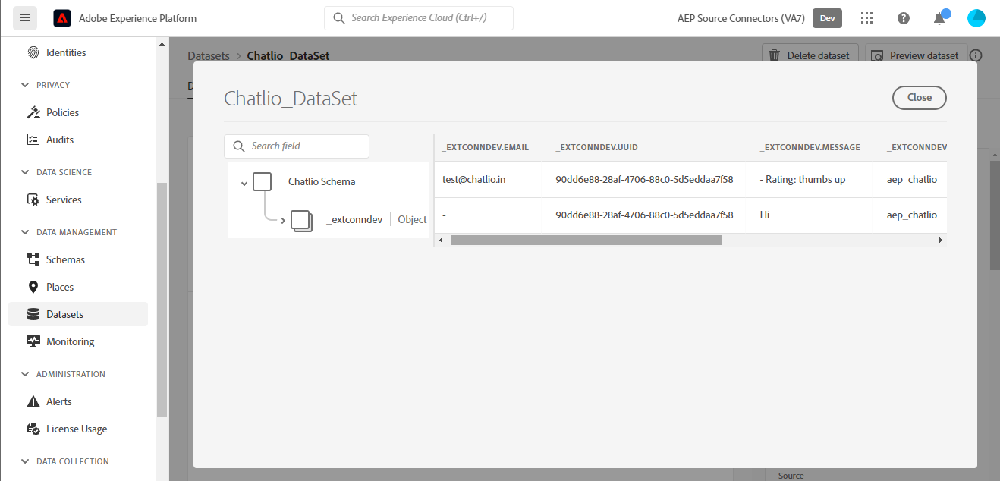

# UI での [!DNL Chatlio] ソース接続の作成

このチュートリアルでは、 [!DNL Chatlio] Adobe Experience Platformユーザーインターフェイスを使用したソース接続

## はじめに {#getting-started}

このチュートリアルは、 Experience Platform の次のコンポーネントを実際に利用および理解しているユーザーを対象としています。

* [[!DNL Experience Data Model (XDM)]  システム](../../../../../xdm/home.md)：[!DNL Experience Platform] が顧客体験データの整理に使用する標準化されたフレームワーク。
   * [スキーマ構成の基本](../../../../../xdm/schema/composition.md)：スキーマ構成の主要な原則やベストプラクティスなど、XDM スキーマの基本的な構成要素について学びます。
   * [スキーマエディターのチュートリアル](../../../../../xdm/tutorials/create-schema-ui.md)：スキーマエディター UI を使用してカスタムスキーマを作成する方法を説明します。
* [[!DNL Real-Time Customer Profile]](../../../../../profile/home.md)：複数のソースからの集計データに基づいて、統合されたリアルタイムの顧客プロファイルを提供します。

## 前提条件 {#prerequisites}

次の節では、 [!DNL Chatlio] ソース接続。

### のソーススキーマを定義するサンプル JSON [!DNL Chatlio] {#prerequisites-json-schema}

を作成する前に [!DNL Chatlio] ソース接続の場合は、ソーススキーマを指定する必要があります。 以下の JSON を使用できます。

```
{
  "visitor": {
    "email": "test@example.com",
    "UUID": "2d3f4260-2235-903b-0a82-a23d326cc257"
  },
   "message": "Hi",
  "channelId": "C04J7M7LCMQ",
  "slackChannelName": "aep",
  "slackChannelId": "C04JVR71WKS"
}
```

### 用の Platform スキーマの作成 [!DNL Chatlio] {#create-platform-schema}

また、ソースに使用する Platform スキーマを作成する必要があります。 に関するチュートリアルをお読みください。 [Platform スキーマの作成](../../../../../xdm/schema/composition.md) スキーマの作成方法に関する包括的な手順を参照してください。


## [!DNL Chatlio] アカウントを接続 {#connect-account}

Platform UI で、「 」を選択します。 **[!UICONTROL ソース]** 左側のナビゲーションから、 [!UICONTROL ソース] workspace を参照し、Experience Platformで使用可能なソースのカタログを確認します。

以下を使用します。 *[!UICONTROL カテゴリ]* メニューを使用して、ソースをカテゴリでフィルタリングできます。 または、検索バーにソース名を入力して、カタログから特定のソースを検索します。

次に移動： [!UICONTROL マーケティングの自動化] 表示するカテゴリ [!DNL Chatlio] ソースカード。 最初に、「 」を選択します。 **[!UICONTROL データを追加]**.


## データの選択 {#select-data}

The **[!UICONTROL データを選択]** の手順が表示され、Platform に取り込むデータを選択するためのインターフェイスが提供されます。

* インターフェイスの左側には、アカウント内で使用可能なデータストリームを表示できるブラウザーがあります。
* インターフェイスの右側では、JSON ファイルから最大 100 行のデータをプレビューできます。

選択 **[!UICONTROL ファイルをアップロード]** をクリックして、ローカルシステムから JSON ファイルをアップロードします。 または、アップロードする JSON ファイルをにドラッグ&amp;ドロップすることもできます [!UICONTROL ファイルをドラッグ&amp;ドロップ] パネル。


ファイルがアップロードされると、プレビューインターフェイスが更新され、アップロードしたスキーマのプレビューが表示されます。 プレビューインターフェイスを使用すると、ファイルの内容と構造を検査できます。 また、 [!UICONTROL 検索フィールド] スキーマ内から特定の項目にアクセスするユーティリティ。

終了したら、「**[!UICONTROL 次へ]**」を選択します。


## データフローの詳細 {#dataflow-detail}

The **データフローの詳細** 手順が表示され、既存のデータセットを使用するか、データフローの新しいデータセットを確立するか、およびデータフローの名前と説明を指定する機会が提供されます。 この手順では、プロファイルの取り込み、エラー診断、部分取り込み、アラートの設定も指定できます。

終了したら、「**[!UICONTROL 次へ]**」を選択します。


## マッピング {#mapping}

[!UICONTROL マッピング]手順が表示され、ソーススキーマのソースフィールドを、ターゲットスキーマの適切なターゲット XDM フィールドにマッピングするためのインターフェイスが提供されます。

Platform は、選択したターゲットスキーマまたはデータセットに基づいて、自動マッピングされたフィールドに対するインテリジェントなレコメンデーションを提供します。 マッピングルールは、ユースケースに合わせて手動で調整できます。必要に応じて、フィールドを直接マッピングするか、データ準備機能を使用してソースデータを変換して計算値を導き出すかを選択できます。マッパーインターフェイスと計算フィールドを使用した包括的な手順については、 [データ準備 UI ガイド](../../../../../data-prep/ui/mapping.md).

以下に示すマッピングは必須で、 [!UICONTROL レビュー] ステージ。

| ターゲットフィールド | 説明 |
| --- | --- |
| `UUID` | The [!DNL Chatlio] イベントの識別子。 |

ソースデータが正常にマッピングされたら、「 」を選択します。 **[!UICONTROL 次へ]**.


## レビュー {#review}

**[!UICONTROL レビュー]**&#x200B;手順が表示され、新しいデータフローを作成する前に確認できます。詳細は、次のカテゴリに分類されます。

* **[!UICONTROL 接続]**：ソースのタイプ、選択したソースファイルの関連パスおよびそのソースファイル内の列の数を表示します。
* **[!UICONTROL データセットの割り当てとフィールドのマッピング]**：ソースデータがどのデータセットに取り込まれるかを、そのデータセットが準拠するスキーマを含めて表示します。

データフローをレビューしたら、「**[!UICONTROL 終了]**」を選択し、データフローが作成されるまでしばらく待ちます。


## ストリーミングエンドポイント URL を取得する {#get-streaming-endpoint-url}

ストリーミングデータフローを作成したら、ストリーミングエンドポイント URL を取得できます。 このエンドポイントは、Webhook を購読するために使用され、ストリーミングソースとExperience Platformが通信できます。

Webhook の設定に使用する URL を構築するために [!DNL Chatlio] 次を取得する必要があります。

* **[!UICONTROL データフロー ID]**
* **[!UICONTROL ストリーミングエンドポイント]**

次の手順で **[!UICONTROL データフロー ID]** および **[!UICONTROL ストリーミングエンドポイント]**、に移動します。 [!UICONTROL データフローアクティビティ] 作成したデータフローのページを開き、詳細を [!UICONTROL プロパティ] パネル。


ストリーミングエンドポイントとデータフロー ID を取得したら、次のパターンに基づいて URL を作成します。 ```{STREAMING_ENDPOINT}?x-adobe-flow-id={DATAFLOW_ID}```. 例えば、生成される Webhook URL は次のようになります。 ``https://dcs.adobedc.net/collection/d56b47ee3985104beaf724efcd78a3e1a863d720471a482bebac0acc1ab95983``

## で Webhook を設定します。 [!DNL Chatlio] {#set-up-webhook}

Webhook URL を作成すると、 [!DNL Chatlio] ユーザーインターフェイス。

にログインします。 [[!DNL Chatlio]](https://chatlio.com/) アカウントとフォロー [セットアップとインストールに関するガイド](https://chatlio.com/docs/setup/) ウィジェットを作成します。

ウィジェットを作成したら、ウィジェットの設定ページに移動して、そのウィジェットに Webhook の URL を追加します。


次に、 **[!DNL Behavior]** 」タブをクリックし、Webhook URL を *[!DNL Webhook when a new conversation starts]* フィールドおよび購読するその他の webhook イベントフィールド。


>[!TIP]
>
>様々なイベントを購読できます [!DNL Chatlio] Webhook. 各イベントについて詳しくは、 [[!DNL Chatlio] イベントドキュメント](https://chatlio.com/docs/webhooks/).

## 次の手順 {#next-steps}

このチュートリアルに従うことで、 [!DNL Chatlio] データをExperience Platformに送信します。 取り込まれるデータを監視するには、 [Platform UI を使用したストリーミングデータフローの監視](../../monitor-streaming.md).

## その他のリソース {#additional-resources}

以下の節では、 [!DNL Chatlio] ソース。

### 検証 {#validation}

ソースとが正しく設定されていることを検証するには、以下を実行します。 [!DNL Chatlio] メッセージを取り込むには、次の手順に従います。

* 次の項目を確認できます。 [!DNL Chatlio] **[!UICONTROL レポート]** > **[!UICONTROL チャット履歴]** がキャプチャしたイベントを識別するページ [!DNL Chatlio].


* Platform UI で、「 」を選択します。 **[!UICONTROL データフローを表示]** の横に [!DNL Chatlio] ソースカタログのカードメニュー 次に、「 **[!UICONTROL データセットをプレビュー]** で設定した web フック用に取り込まれたデータを検証するには、以下を実行します。 [!DNL Chatlio].



詳しくは、 [!DNL Chatlio]、 [[!DNL Chatlio] ドキュメント](https://chatlio.com/docs/) および [FAQ](https://chatlio.com/pricing/#FAQ).
