# UIで[!DNL Oracle Eloqua] （V2）をExperience Platformに接続

[!DNL Oracle Eloqua (V2)] ソースコネクタを使用すると、Oracle Eloqua アカウントとAdobe Experience Platformを接続でき、連絡先、アカウント、キャンペーン、エンゲージメント活動などの主要なB2B マーケティングデータの自動かつスケーラブルな取り込みが可能になります。

このソースコネクタを使用して、安全な認証を設定し、必要なEloqua データエンティティを正確に選択し、標準化されたExperience Data Model （XDM）スキーマにマッピングします。 柔軟なスケジューリングオプションにより、最初のデータの読み込みと定期的な増分同期の両方を設定し、マーケティングデータを最新かつ実用的なものにすることができます。

Adobeのエンタープライズ取り込みフレームワークに基づいて構築された[!DNL Oracle Eloqua (V2)] ソースコネクタは、キャンペーンの最適化、パフォーマンス測定、クロスチャネルのパーソナライゼーションのための信頼性の高い拡張可能な基盤を提供します。

このガイドでは、Experience Platform ユーザーインターフェイスのsources Workspaceを使用して[!DNL Oracle Eloqua] アカウントをAdobe Experience Platformに接続する方法について説明します。

## 基本を学ぶ

このチュートリアルは、 Experience Platform の次のコンポーネントを実際に利用および理解しているユーザーを対象としています。

* [[!DNL Experience Data Model (XDM)] システム](../../../../../xdm/home.md)：Experience Platform が顧客体験データの整理に使用する標準化されたフレームワーク。
   * [スキーマ構成の基本](../../../../../xdm/schema/composition.md)：スキーマ構成の主要な原則やベストプラクティスなど、XDM スキーマの基本的な構成要素について学びます。
   * [スキーマエディターのチュートリアル](../../../../../xdm/tutorials/create-schema-ui.md)：スキーマエディター UI を使用してカスタムスキーマを作成する方法を説明します。
* [[!DNL Real-Time Customer Profile]](../../../../../profile/home.md)：複数のソースからの集計データに基づいて、統合されたリアルタイムの顧客プロファイルを提供します。

### 必要な資格情報の収集 {#credentials}

認証について詳しくは、[[!DNL Eloqua] 概要](../../../../connectors/marketing-automation/eloqua.md)を参照してください。

## ソースカタログを移動する {#catalog}

Experience Platform UIで、左側のナビゲーションから「**[!UICONTROL Sources]**」を選択して、*[!UICONTROL Sources]* ワークスペースにアクセスします。 カテゴリーを選択するか検索バーを使って探し出してください。

[!DNL Eloqua]に接続するには、*[!UICONTROL Marketing Automation]* カテゴリに移動し、**[!UICONTROL (V2) Oracle Eloqua]** ソースカードを選択してから、**[!UICONTROL Set up]**&#x200B;を選択します。

>[!TIP]
>
>ソースカタログのソースには、特定のソースがまだ認証済みアカウントを持っていない場合、**[!UICONTROL Set up]** オプションが表示されます。 認証済みアカウントが作成されると、このオプションは&#x200B;**[!UICONTROL Add data]**&#x200B;に変更されます。

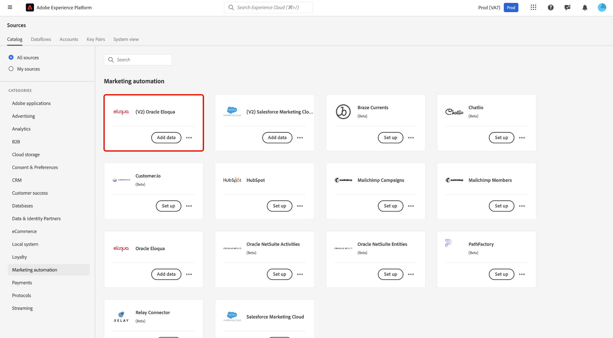

## 既存のアカウントの使用 {#existing}

既存のアカウントを使用するには、**[!UICONTROL Existing account]**&#x200B;を選択し、使用する[!DNL Eloqua] アカウントを選択します。

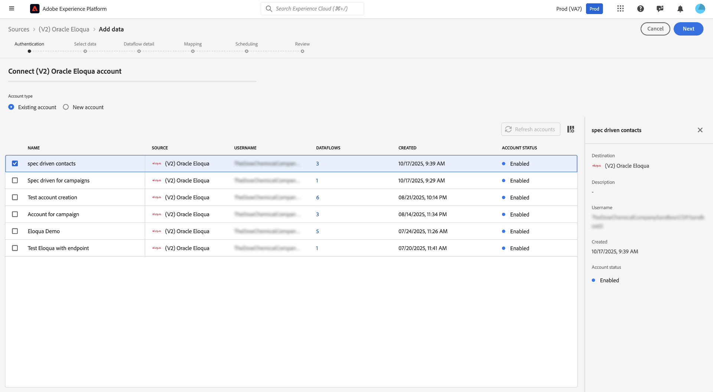

## 新しいアカウントを作成 {#new}

新しいアカウントを作成するには、**[!UICONTROL New account]**&#x200B;を選択し、[!UICONTROL Source connection details]の下に名前と説明を入力します。 次に、[!UICONTROL Account authentication]の下で、**クライアント ID**、**クライアントシークレット**、**ユーザー名**、**パスワード**、および&#x200B;**ベースエンドポイント**&#x200B;の値を指定します。 これらの資格情報について詳しくは、[認証ガイド &#x200B;](../../../../connectors/marketing-automation/eloqua.md)を参照してください。 終了したら、**[!UICONTROL Connect to source]**&#x200B;を選択し、接続が確立されるまでに数秒間許可します。

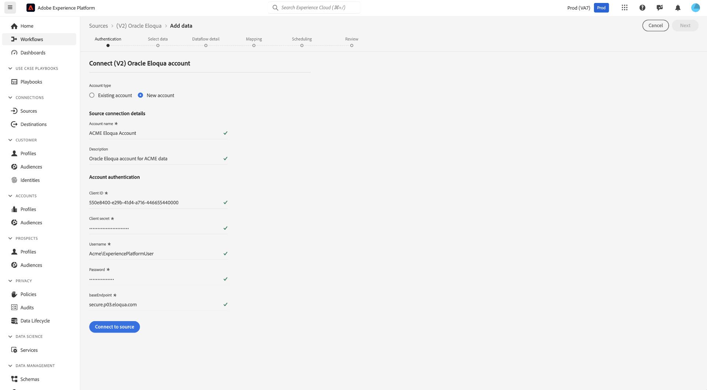

## データの選択

データを選択インターフェイスを使用して、Experience Platformに取り込む[!DNL Eloqua] エンティティを選択します。

>[!TIP]
>
>データを選択すると、キャンペーンを除く他のエンティティに代表的なサンプルデータが表示されることがわかります。 このアプローチでは、利用可能なフィールドと構造をプレビューできます。現在、[!DNL Eloqua]個のパブリック APIがキャンペーンの実際のデータのみを取得しています。 残りのエンティティについては、設定ワークフローをサポートするためにサンプルデータが提供されます。

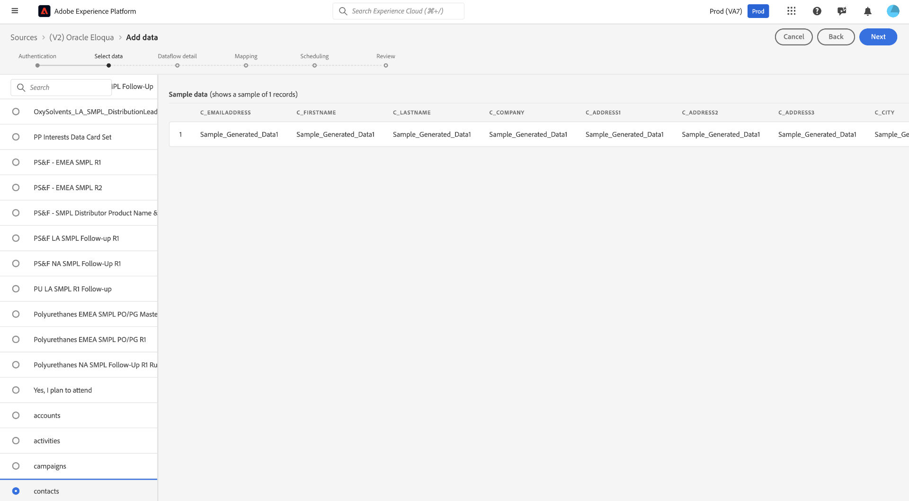

## データセットとデータフローの詳細 {#details}

次に、データセットとデータフローに関する情報を提供する必要があります。 この手順では、既存のデータセットを使用するか、新しいデータセットを作成できます。 さらに、この手順では、リアルタイム顧客プロファイルへの取り込み用にデータセットをオプションで有効にすることもできます。

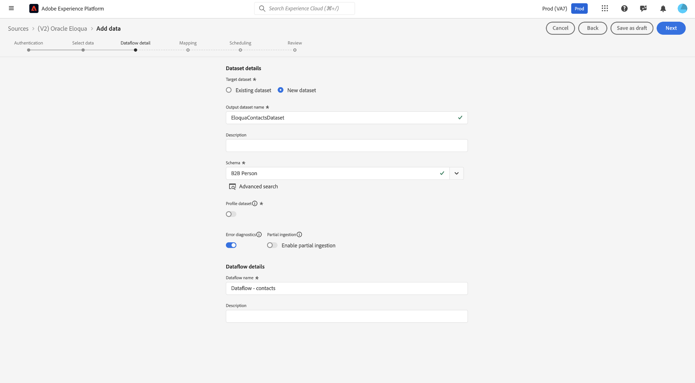

## マッピング {#mapping}

[!DNL Eloqua]のマッピングは、次の4つの主なエンティティ タイプに整理されています。

* **アカウント** - [!DNL Eloqua]の会社/組織レコード。
* **アクティビティ** - [!DNL Eloqua]からのマーケティング活動とエンゲージメントイベント。
* **キャンペーン** - [!DNL Eloqua]のマーケティングキャンペーンレコード。
* **連絡先** - [!DNL Eloqua]の個人レコード。

デフォルトで提供されているフィールド以外のフィールドにアクセスする必要がある場合は、Experience Platformのデータ準備マッピングプロセスを使用してこれらのフィールドを追加できます。 デフォルト（標準）のスキーマが必須フィールドの一部をサポートしていない場合は、Experience Platformでカスタムスキーマを定義するオプションがあります。 この機能を使用して、必要なフィールドを作成およびマッピングし、[!DNL Eloqua]からExperience Platformにすべての関連データをシームレスに取り込むことができます。

次の手順の概要：

* 統合で使用できるデフォルトのマッピング済みフィールドを確認します。
* マッピング手順の間に、[!DNL Eloqua]から必要な追加フィールドを含めます。
* 標準スキーマに新しいフィールドが存在しない場合は、これらのフィールドを含むカスタムスキーマをExperience Platformで拡張または作成します。
* マッピングを完了して、必要なデータがすべて取り込まれることを確認します。

外部CRM情報が正確に反映されるようにするには、データ準備の計算フィールド関数を使用して、ソースデータフィールドの特定のCRM インスタンス IDで`{CRM_INSTANCE_ID}` プレースホルダーを更新するだけです。 これにより、組織の独自の設定に合わせて統合を柔軟に調整できます。

計算フィールドエディターを使用するには、更新するソースフィールドを選択します。

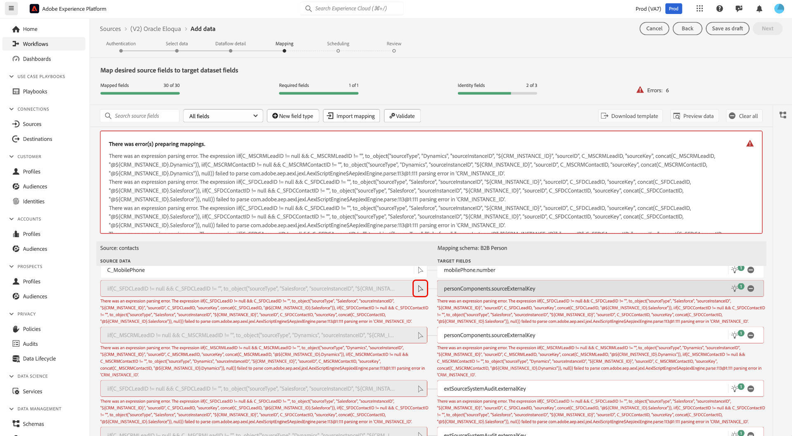

>[!BEGINTABS]

>[!TAB Salesforce]

[!DNL Salesforce] ユーザーの場合、計算フィールドエディターを使用し、適切なインスタンス IDで`{CRM_INSTANCE_ID}`を更新します。

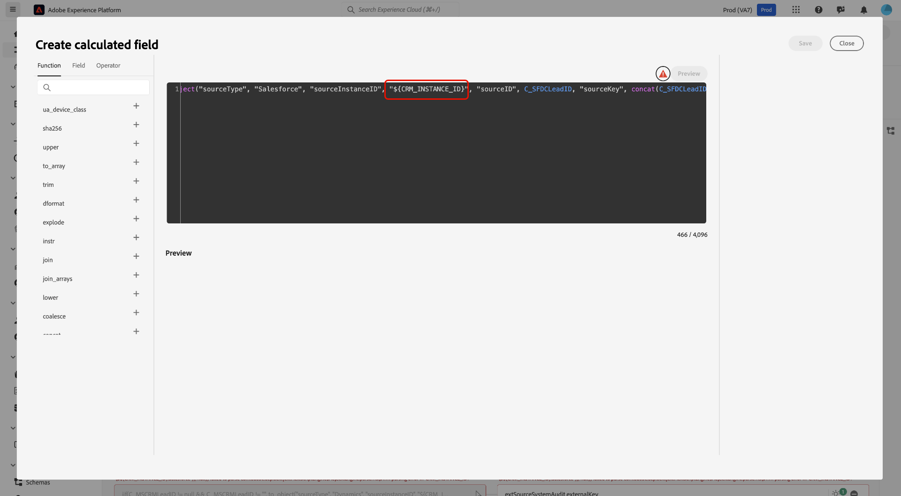

>[!TAB Microsoft Dynamics]

[!DNL Microsoft] ユーザーの場合、計算フィールドエディターを使用し、適切なインスタンス IDで`{CRM_INSTANCE_ID}`を更新します。

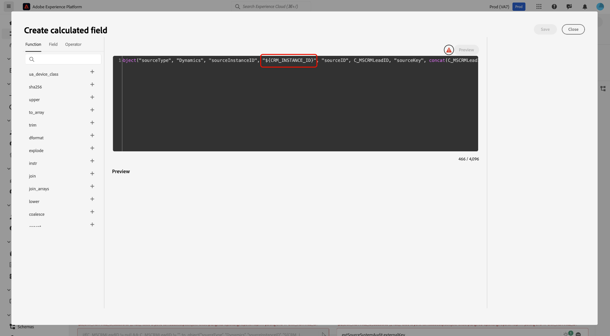

>[!ENDTABS]

計算フィールドの更新が完了したら、**[!UICONTROL Next]**&#x200B;を選択して続行します。

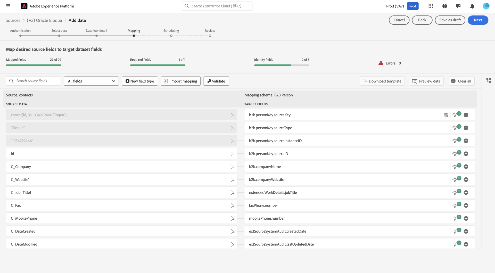

## スケジュール設定

>[!NOTE]
>
>増分データ読み込みに内部的に使用される差分フィールドは次のとおりです。
>
>* **連絡先：** `C_DateModified`
>* **アカウント：** `M_DateModified`
>* **アクティビティ：** `CreatedAt`
>* **キャンペーン：** `updatedAt`

マッピングが完了したら、データフローの取り込みスケジュールを設定できるようになります。 1回限りの取り込み実行を設定するには、[!UICONTROL Frequency]を`Once`に設定します。 増分取り込みでは、[!UICONTROL Frequency]を`Hour`、`Day`または`Week`に設定できます。 増分取り込みを使用する場合は、取り込み実行間に発生する時間を定義するように[!UICONTROL Interval]も設定する必要があります。 例えば、取り込み頻度が`Day`に設定され、間隔が`15`に設定されている場合、データフローは15日ごとにデータを取り込むようにスケジュールされています。

[!DNL Eloqua] ソースでは、1分あたりの取り込み頻度は使用できません。 選択できる最も頻繁なスケジュールは時間単位です。 データの鮮度ニーズに合ったスケジュールを選択します。 より頻繁なスケジュールを選択すると、計算コストが増加することに留意してください。

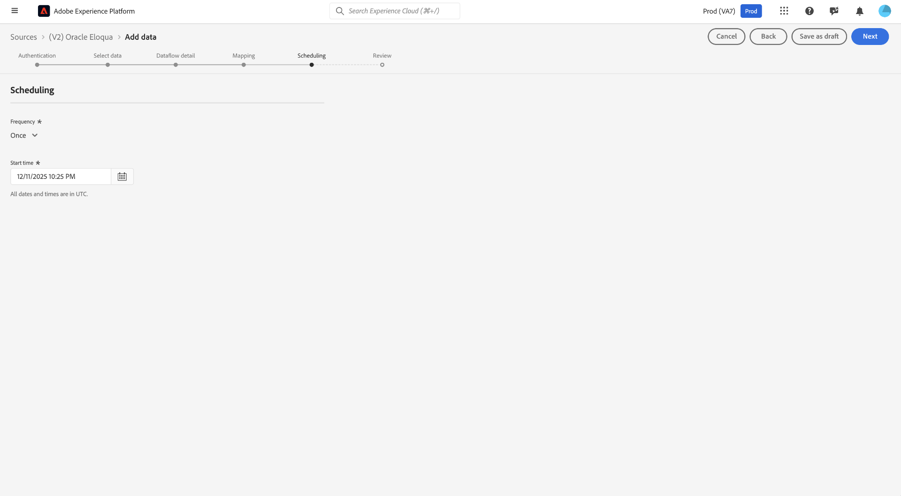

## レビュー

取り込みスケジュールを設定した状態で、[!UICONTROL Review] インターフェイスを使用して、データフローの詳細を確認します。 **[!UICONTROL Finish]**&#x200B;を選択して設定を完了し、データフローが開始されるまでしばらく待ちます。

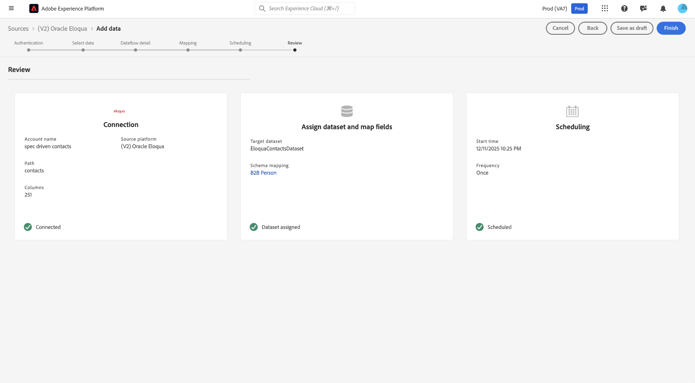

## 監視

データフローを選択すると、1回限りのデータのバックフィルと、指定したスケジュールに対するその後の増分同期が行われます。 同期のステータスは、データフローに移動して監視できます。 詳しくは、[UIでのソースデータフローの監視に関するガイド &#x200B;](../../../../../dataflows/ui/monitor-sources.md)を参照してください。

## 次の手順

これで、Experience Platformでの[!DNL Eloqua] ソースの設定と設定が完了しました。 データフローが確立されると、選択したスケジュールに従って[!DNL Eloqua] データが取り込まれ、標準のExperience Data Model （XDM）スキーマにマッピングされます。 データフローを継続的に監視し、Adobe Experience Platform内で取り込まれたデータを分析することで、インサイトを促進し、マーケティングのユースケースを活用できます。 より高度な設定とトラブルシューティングについては、関連ドキュメントを参照するか、Adobe サポートリソースにお問い合わせください。

詳しくは、次のドキュメントを参照してください。

* [ソースの概要](../../../../home.md)
* [Real-Time CDP B2B エディション](../../../../../rtcdp/b2b-overview.md)
