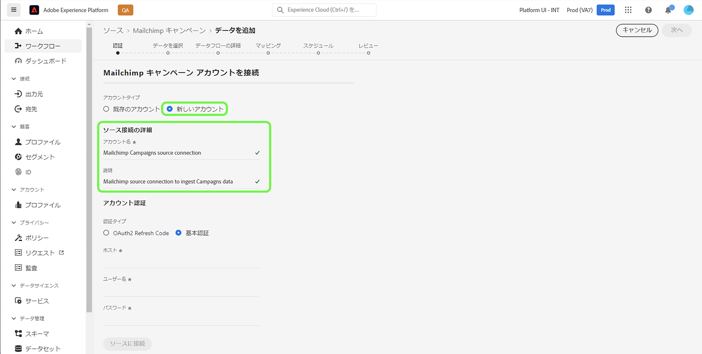

# の作成 [!DNL Mailchimp Campaigns] Platform UI を使用したソース接続

このチュートリアルでは、 [!DNL Mailchimp] 取り込むソースコネクタ [!DNL Mailchimp Campaigns] ユーザーインターフェイスを使用してAdobe Experience Platformにデータを送信する。

## はじめに

このガイドでは、Adobe Experience Platform の次のコンポーネントに関する作業を理解している必要があります。

* [ソース](../../../../home.md):Platform を使用すると、様々なソースからデータを取り込みながら、 [!DNL Platform] サービス。
* [サンドボックス](../../../../../sandboxes/home.md):Platform は、単一の Platform インスタンスを別々の仮想環境に分割し、デジタルエクスペリエンスアプリケーションの開発と発展を支援する仮想サンドボックスを提供します。

## 必要な資格情報の収集

お客様の [!DNL Mailchimp Campaigns] データを Platform に送信する場合、まず、 [!DNL Mailchimp] アカウント

この [!DNL Mailchimp Campaigns] ソースは、OAuth 2 更新コードと基本認証の両方をサポートしています。これらの認証タイプの詳細については、以下の表を参照してください。

### OAuth 2 更新コード

| 資格情報 | 説明 |
| --- | --- |
| ホスト | MailChimp API への接続に使用するルート URL です。 ルート URL の形式は、 `https://{DC}.api.mailchimp.com`で、 `{DC}` は、お使いのアカウントに対応するデータセンターを表します。 |
| 認証テスト URL | 認証テスト URL は、接続時に資格情報を検証するために使用されます [!DNL Mailchimp] を Platform に送信します。 これを指定しない場合、代わりに、ソース接続の作成手順で資格情報が自動的に確認されます。 |
| アクセストークン | ソースの認証に使用された、対応するアクセストークン。 これは、OAuth ベースの認証に必要です。 |

OAuth 2 を使用した認証について詳しくは、 [!DNL Mailchimp] アカウントを Platform に送信する場合は、以下を参照してください [[!DNL Mailchimp] OAuth 2 の使用に関するドキュメント](https://mailchimp.com/developer/marketing/guides/access-user-data-oauth-2/).

### 基本認証

| 資格情報 | 説明 |
| --- | --- |
| ホスト | MailChimp API への接続に使用するルート URL です。 ルート URL の形式は、 `https://{DC}.api.mailchimp.com`で、 `{DC}` は、お使いのアカウントに対応するデータセンターを表します。 |
| ユーザー名 | MailChimp アカウントに対応するユーザー名。 これは、基本認証に必要です。 |
| パスワード | MailChimp アカウントに対応するパスワードです。 これは、基本認証に必要です。 |

## 接続 [!DNL Mailchimp Campaigns] プラットフォームへのアカウント

Platform UI で、「 **[!UICONTROL ソース]** 左側のナビゲーションバーから [!UICONTROL ソース] ワークスペース。 この [!UICONTROL カタログ] 画面には、アカウントを作成できる様々なソースが表示されます。

画面の左側にあるカタログから適切なカテゴリを選択できます。 または、使用する特定のソースを検索オプションを使用して探すこともできます。

以下 [!UICONTROL マーケティングの自動化] カテゴリ、選択 **[!UICONTROL Mailchimp キャンペーン]**&#x200B;を選択し、 **[!UICONTROL データを追加]**.

この **[!UICONTROL Mailchimp キャンペーンアカウントの接続]** ページが表示されます。 このページでは、既存のアカウントにアクセスするか、新しいアカウントの作成を選択するかを選択できます。

### 既存のアカウント

既存のアカウントを使用するには、 [!DNL Mailchimp Campaigns] 新しいデータフローを作成するアカウントを選択し、 **[!UICONTROL 次へ]** をクリックして続行します。

### 新しいアカウント

新しいアカウントを作成する場合は、「 **[!UICONTROL 新しいアカウント]**&#x200B;をクリックし、 [!DNL Mailchimp Campaigns] ソース接続の詳細。

#### OAuth 2 を使用した認証

OAuth 2 を使用するには、 [!UICONTROL OAuth 2 更新コード]、ホスト、認証テスト URL、アクセストークンの値を指定して、 **[!UICONTROL ソースに接続]**. 資格情報が検証されるまでしばらく待ってから、を選択します。 **[!UICONTROL 次へ]** をクリックして続行します。

#### 基本認証を使用した認証

基本認証を使用する場合は、 [!UICONTROL 基本認証]、ホスト、ユーザー名およびパスワードの値を入力し、「 」を選択します。 **[!UICONTROL ソースに接続]**. 資格情報が検証されるまでしばらく待ってから、を選択します。 **[!UICONTROL 次へ]** をクリックして続行します。

### 選択 [!DNL Mailchimp Campaigns] データ

ソースが認証されたら、 `campaignId` は、 [!DNL Mailchimp Campaigns] アカウント

の [!UICONTROL データを選択] ページに、 `campaignId` 次に、 **[!UICONTROL 参照]**.

ページがインタラクティブスキーマツリーに更新され、データの階層を調べたり調べたりできます。 選択 **[!UICONTROL 次へ]** をクリックして続行します。

## 次の手順

を [!DNL Mailchimp] 認証済みのアカウントと [!DNL Mailchimp Campaigns] データを選択した場合、データフローの作成を開始して、データを Platform に取り込むことができるようになりました。 データフローの作成方法に関する詳細な手順については、 [マーケティング自動化データを Platform に取り込むためのデータフローの作成](../../dataflow/marketing-automation.md).
