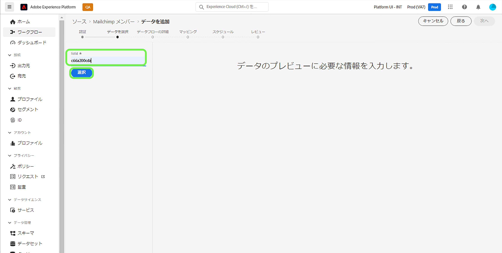

# Platform UI を使用した [!DNL Mailchimp Members] ソース接続の作成

このチュートリアルでは、ユーザーインターフェイスを使用して [!DNL Mailchimp] ソースコネクタを作成し、[!DNL Mailchimp Members] データを Adobe Experience Platform に取り込む手順について説明します。

## はじめに

このガイドでは、Adobe Experience Platform の次のコンポーネントに関する十分な知識が必要です。

* [ソース](../../../../home.md)：Platform では、さまざまなソースからデータを取り込むと同時に、[!DNL Platform] サービスを使用して取り込んだデータを構造化、ラベル付け、拡張できます。
* [サンドボックス](../../../../../sandboxes/home.md)：Platform は、単一の Platform インスタンスを個別の仮想環境に分割する仮想サンドボックスを提供し、デジタル体験アプリケーションの開発および進化を支援します。

## 必要な認証情報の収集

[!DNL Mailchimp Members] データを Platform に取り込むには、まず、[!DNL Mailchimp] アカウントに対応する適切な認証情報を提供する必要があります。

[!DNL Mailchimp Members] ソースは、OAuth 2 更新コードと基本認証の両方をサポートしています。 これらの認証タイプの詳細については、次の表を参照してください。　

### OAuth 2 更新コード

| 認証情報 | 説明 |
| --- | --- |
| ドメイン | MailChimp API への接続に使用するルート URL です。 ルート URL の形式は `https://{DC}.api.mailchimp.com` で、 `{DC}` はお使いのアカウントに対応するデータセンターを表します。 |
| 認証テスト URL | 認証テスト URL は、[!DNL Mailchimp] を Platform に接続する際に認証情報を検証するために使用されます。 これを指定しない場合、代わりにソース接続の作成手順の間に認証情報が自動的にチェックされます。 |
| アクセストークン | ソースの認証に使用された、対応するアクセストークン。これは、OAuth ベースの認証に必要です。 |

OAuth 2 を使用した Platform への [!DNL Mailchimp] アカウント認証の詳細については、こちらの [[!DNL Mailchimp] OAuth 2 の使用に関するドキュメント](https://mailchimp.com/developer/marketing/guides/access-user-data-oauth-2/)を参照してください。

### 基本認証

| 認証情報 | 説明 |
| --- | --- |
| ドメイン | MailChimp API への接続に使用するルート URL です。 ルート URL の形式は `https://{DC}.api.mailchimp.com` で、`{DC}` はお使いのアカウントに対応するデータセンターを表します。 |
| ユーザー名 | MailChimp アカウントに対応するユーザー名。 これは、基本認証に必要です。 |
| パスワード | MailChimp アカウントに対応するパスワードです。 これは、基本認証に必要です。 |

## Platform に [!DNL Mailchimp Members] アカウントを接続

Platform UI で、左側のナビゲーションバーから「**[!UICONTROL ソース]**」を選択し、「[!UICONTROL ソース]」ワークスペースにアクセスします。 [!UICONTROL カタログ]画面には、アカウントを作成できる様々なソースが表示されます。

画面の左側にあるカタログから適切なカテゴリを選択することができます。または、使用する特定のソースを検索オプションを使用して探すこともできます。

[!UICONTROL マーケティング自動化]のカテゴリで、「**[!UICONTROL Mailchimp キャンペーン]**」、「**[!UICONTROL データを追加]**」の順に選択します。

**[!UICONTROL Mailchimp キャンペーンアカウントの接続]**&#x200B;ページが表示されます。 このページでは、既存のアカウントにアクセスするか、新しいアカウントを作成するかを選択することができます。

### 既存のアカウント

既存のアカウントを使用するには、新しいデータフローを作成する [!DNL Mailchimp Members] アカウントを選択し、「**[!UICONTROL 次へ]**」を選択して続行します。

### 新しいアカウント

新しいアカウントを作成する場合は、「**[!UICONTROL 新しいアカウント]**」を選択し、[!DNL Mailchimp Members]ソース接続の詳細の名前と説明を入力します。

#### OAuth 2 を使用した認証

OAuth 2 を使用するには、 [!UICONTROL OAuth 2 更新コード]で、ドメイン、認証テスト URL、アクセストークンの値を指定して、 **[!UICONTROL ソースに接続]**. 認証情報が検証されるまでしばらく待ってから、「**[!UICONTROL 次へ]**」を選択して続行します。

#### 基本認証を使用した認証

基本認証を使用する場合は、 [!UICONTROL 基本認証]で、ドメイン、ユーザー名およびパスワードの値を入力し、「 」を選択します。 **[!UICONTROL ソースに接続]**. 認証情報が検証されるまでしばらく待ってから、「**[!UICONTROL 次へ]**」をクリックして続行します。

### [!DNL Mailchimp Members] データを選択

ソースが認証されたら、[!DNL Mailchimp Members] アカウントに対応する `listId` を提供する必要があります。

[!UICONTROL データを選択]ページで`listId` を入力して「**[!UICONTROL 参照]**」を選択します。

ページが更新されてインタラクティブスキーマツリーに変わり、データの階層を調べることができます。「**[!UICONTROL 次へ]**」を選択して次に進みます。

## 次の手順

[!DNL Mailchimp] アカウントが認証され、[!DNL Mailchimp Members] データが選択されたので、データフローの作成を開始して、Platform にデータを取り込むことができます。 データフローの作成方法に関する詳細な手順については、 [マーケティング自動化データを Platform に取り込むためのデータフローの作成](../../dataflow/marketing-automation.md)のドキュメントを参照してください。
