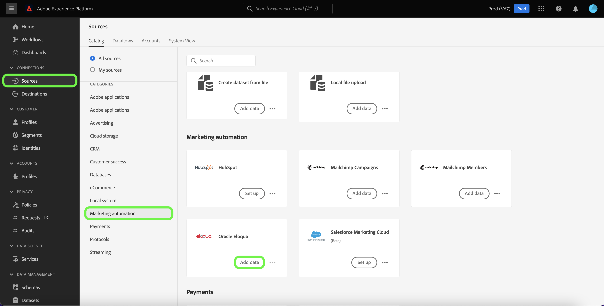

# Experience Platform UI を使用した [!DNL Oracle Eloqua] ソース接続の作成

>[!WARNING]
>
>[!DNL Oracle Eloqua] ソースは 2026 年 1 月に非推奨（廃止予定）になります。 新しいソースは、代替手段として今年後半にリリースされる予定です。 新しいソースがリリースされたら、2026 年 1 月末までに、新しいアカウント接続とデータフローを作成して、新しいソースに移行する計画を立てる必要があります。

このチュートリアルでは、Adobe Experience Platform ユーザーインターフェイスを使用して [!DNL Oracle Eloqua] ソース接続を作成する手順について説明します。

## はじめに

このガイドは、Adobe Experience Platform の次のコンポーネントを実際に利用および理解しているユーザーを対象としています。

* [ ソース ](../../../../home.md):Experience Platformを使用すると、データを様々なソースから取得しながら、Experience Platform サービスを使用して受信データの構造化、ラベル付け、拡張を行うことができます。
* [ サンドボックス ](../../../../../sandboxes/home.md): Experience Platformには、1 つのExperience Platform インスタンスを別々の仮想環境に分割し、デジタルエクスペリエンスアプリケーションの開発と発展に役立つ仮想サンドボックスが用意されています。

認証済みの [!DNL Oracle Eloqua] アカウントが既にExperience Platformにある場合は、このドキュメントの残りの部分をスキップし、[ データフローを作成してExperience Platformにマーケティング自動化データを取り込む ](../../dataflow/marketing-automation.md) に関するチュートリアルに進むことができます。

### 必要な資格情報の収集

[!DNL Oracle Eloqua] をExperience Platformに接続するには、次の認証プロパティの値を指定する必要があります。

| 資格情報 | 説明 |
| --- | --- |
| エンドポイント | [!DNL Oracle Eloqua] サーバーのエンドポイント。 [!DNL Oracle Eloqua] は複数のデータセンターをサポートしています。 エンドポイントを見つけるには、資格情報を使用して [[!DNL Oracle Eloqua]  インターフェイス ](https://login.eloqua.com) にログインし、リダイレクト URL からベース URL の部分をコピーします。 URL パターンの形式は `xxx.xx.eloqua.com` で、`http` または `https` を付けずに入力する必要があります。 |
| ユーザー名 | [!DNL Oracle Eloqua] サーバーのユーザー名。 ユーザー名は `siteName + \\ + username` の形式にする必要があります。`siteName` は、[!DNL Oracle Eloqua] へのログインに使用した会社名で、`username` はユーザー名です。 例えば、ログインのユーザー名は `Eloqua\Andy` のようになります。 **注意**: Experience Platform UI では、ユーザー名を入力するとバックスラッシュ（`\`）が自動的に追加されるので、UI を使用する場合はバックスラッシュ（`\`）を 1 つ使用する必要があります。 |
| パスワード | [!DNL Oracle Eloqua] ユーザー名に対応するパスワード。 |

[!DNL Oracle Eloqua] の認証資格情報について詳しくは、[[!DNL Oracle Eloqua] 認証に関するガイド](https://docs.oracle.com/en/cloud/saas/marketing/eloqua-rest-api/Authentication_Basic.html)を参照してください。

必要な資格情報を収集したら、次の手順に従って [!DNL Oracle Eloqua] アカウントをExperience Platformにリンクできます。

## [!DNL Oracle Eloqua] アカウントを接続

Experience Platformの UI で、左側のナビゲーションから **[!UICONTROL Sources]** を選択し、[!UICONTROL Sources] ワークスペースにアクセスします。 [!UICONTROL カタログ]画面には、アカウントを作成できる様々なソースが表示されます。

画面の左側にあるカタログから適切なカテゴリを選択することができます。または、使用する特定のソースを検索オプションを使用して探すこともできます。

[!UICONTROL  マーケティング自動化 ] カテゴリで、「**[!UICONTROL Oracle Eloqua]**」を選択し、次に「**[!UICONTROL データを追加]**」を選択します。

**[!UICONTROL Oracle Eloqua アカウントを接続]** ページが表示されます。 このページでは、新しい資格情報または既存の資格情報を使用できます。

### 既存のアカウント

既存のアカウントを使用するには、新しいデータフローを作成する [!DNL Oracle Eloqua] アカウントを選択し、「**[!UICONTROL 次へ]**」を選択して続行します。

### 新しいアカウント

新しいアカウントを作成する場合は、「**[!UICONTROL 新しいアカウント]**」を選択し、[!DNL Oracle Eloqua] しい資格情報の名前、説明（オプション）、適切な値を入力します。 終了したら「**[!UICONTROL ソースに接続]**」を選択し、新しい接続が確立されるまでしばらく待ちます。

## 次の手順

このチュートリアルでは、認証を行い、お使いの [!DNL Oracle Eloqua] アカウントとExperience Platformとのソース接続を作成しました。 次のチュートリアルに進み、[ マーケティング自動化データをExperience Platformに取り込むためのデータフローを作成する ](../../dataflow/marketing-automation.md) ことができるようになりました。
