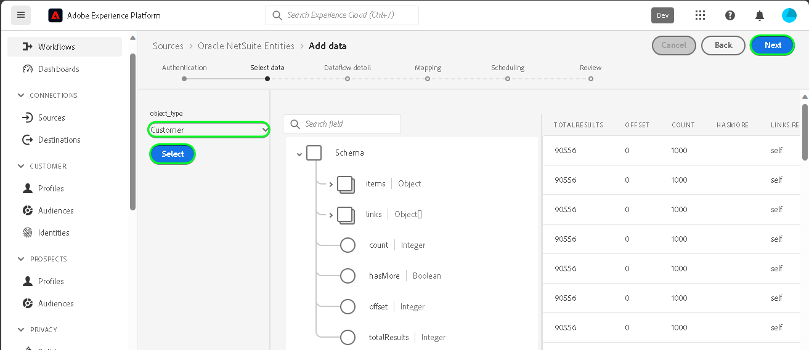

# UI での [!DNL Oracle NetSuite Entities] ソース接続の作成

UI で [!DNL Oracle NetSuite Entities] アカウントからAdobe Experience Platformに連絡先や顧客データを取り込む方法については、次のチュートリアルを参照してください。

## はじめに {#getting-started}

このチュートリアルは、 Experience Platform の次のコンポーネントを実際に利用および理解しているユーザーを対象としています。

* [[!DNL Experience Data Model (XDM)]  システム](../../../../../xdm/home.md)：[!DNL Experience Platform] が顧客体験データの整理に使用する標準化されたフレームワーク。
   * [スキーマ構成の基本](../../../../../xdm/schema/composition.md)：スキーマ構成の主要な原則やベストプラクティスなど、XDM スキーマの基本的な構成要素について学びます。
   * [スキーマエディターのチュートリアル](../../../../../xdm/tutorials/create-schema-ui.md)：スキーマエディター UI を使用してカスタムスキーマを作成する方法を説明します。
* [[!DNL Real-Time Customer Profile]](../../../../../profile/home.md)：複数のソースからの集計データに基づいて、統合されたリアルタイムの顧客プロファイルを提供します。

有効な [!DNL Oracle NetSuite] アカウントを既にお持ちの場合は、このドキュメントの残りの部分をスキップし、[データフローの設定](../../dataflow/marketing-automation.md)に関するチュートリアルに進んでください。

>[!TIP]
>
>認証資格情報の取得方法について詳しくは、[[!DNL Oracle NetSuite]  概要 &#x200B;](../../../../connectors/marketing-automation/oracle-netsuite.md) を参照してください。

## [!DNL Oracle NetSuite Activities] アカウントを接続 {#connect-account}

Experience Platformの UI で、左側のナビゲーションから **[!UICONTROL Sources]** を選択し、[!UICONTROL Sources] ワークスペースにアクセスします。 画面の左側にあるカタログから適切なカテゴリを選択することができます。または、使用する特定のソースを検索オプションを使用して探すこともできます。

*マーケティング自動化* カテゴリで、「**[!DNL Oracle NetSuite Entities]**」を選択し、次に **[!UICONTROL データを追加]** を選択します。

**[!UICONTROL Oracle NetSuite エンティティアカウントの接続]** ページが表示されます。 このページでは、新しい資格情報または既存の資格情報を使用できます。

>[!IMPORTANT]
>
>更新トークンは 7 日後に有効期限が切れます。 トークンの有効期限が切れたら、更新したトークンを使用してExperience Platformにアカウントを作成する必要があります。 更新したトークンで新しいアカウントを作成しない場合は、次のエラーメッセージが表示される場合があります。`The request could not be processed. Error from flow provider: The request could not be processed. Rest call failed with client error, status code 401 Unauthorized, please check your activity settings.`

### 既存のアカウント {#existing-account}

既存のアカウントを使用するには、新しいデータフローを作成する [!DNL Oracle NetSuite Entities] アカウントを選択し、「**[!UICONTROL 次へ]**」を選択して続行します。

### 新規アカウント {#new-account}

新しいアカウントを作成する場合は、「**[!UICONTROL 新しいアカウント]**」を選択し、続けて名前、説明（オプション）、の認証情報を指定します。 終了したら「**[!UICONTROL ソースに接続]**」を選択し、新しい接続が確立されるまでしばらく待ちます。

### データの選択

次に、Experience Platformに取り込むオブジェクトタイプを選択します。

| エンティティタイプ | 説明 |
| --- | --- |
| 連絡先 | 連絡先名、メール、電話番号、顧客に関連付けられたカスタム連絡先関連フィールドを取得します。 |
| 顧客 | 顧客名、住所、キー識別子などの詳細を含む、特定の顧客データを取得します。 |

>[!BEGINTABS]

>[!TAB  連絡先 ]

>[!TAB  顧客 ]

>[!ENDTABS]

## 次の手順 {#next-steps}

このチュートリアルでは、[!DNL Oracle NetSuite Entities] アカウントとの接続を確立しました。次のチュートリアルに進み、[&#x200B; マーケティング自動化データをExperience Platformに取り込むためのデータフローの設定 &#x200B;](../../dataflow/marketing-automation.md) を行いましょう。

## その他のリソース {#additional-resources}

以下の節では、[!DNL Oracle NetSuite Entities] ソースを使用する際に参照できるその他のリソースを示します。

### マッピング {#mapping}

Experience Platformは、選択したターゲットスキーマまたはデータセットに基づいて、自動マッピングされたフィールドに対してインテリジェントなレコメンデーションを提供します。 マッピングルールは、ユースケースに合わせて手動で調整できます。 必要に応じて、フィールドを直接マッピングするか、データ準備機能を使用してソースデータを変換して計算値を導き出すかを選択できます。マッパーインターフェイスと計算フィールドの使用に関する包括的な手順については、[&#x200B; データ準備 UI ガイド &#x200B;](../../../../../data-prep/ui/mapping.md) を参照してください。

>[!NOTE]
>
>表示されるフィールドは、[!DNL Oracle NetSuite] アカウントがアクセスできる購読によって異なります。 例えば、請求へのアクセス権がない場合、請求関連フィールドは表示されません。

### スケジュール設定 {#scheduling}

[!DNL Oracle NetSuite Entities] データフローを取り込み用にスケジュールする場合、次の頻度と間隔の設定を選択する必要があります。

| 頻度 | 間隔 |
| --- | --- |
| `Once` | 1 |

データを取得する際、[!DNL Oracle NetSuite] は、タイムスタンプではなく日付形式として、最終変更日または作成日で応答します。 したがって、スケジュールは 1 日に制限されます。

スケジュールの値を指定したら、「**[!UICONTROL 次へ]**」を選択します。

