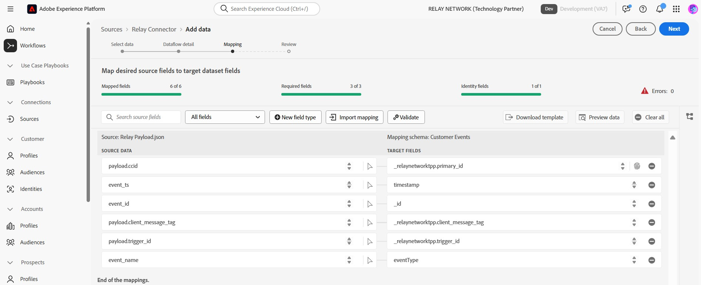

# UI でリレーをExperience Platformに接続

>[!NOTE]
>
>[!DNL Relay Connector] ソースはベータ版です。ベータラベル付きソースの使用について詳しくは、[&#x200B; ソースの概要 &#x200B;](../../../../home.md#terms-and-conditions) を参照してください。

[!DNL Relay Connector] を使用すると、ジャーニーの最も重要な瞬間に、パーソナライズされたエクスペリエンスを顧客に提供できます。[!DNL Relay Network] 統合からAdobe Experience Platformにイベントをストリーミングするインバウンド接続を作成することで、より強力な関係を構築し、ロイヤルティと価値を高めるのに役立ちます。

このガイドを読んで、Experience Platform UI のソースワークスペース内で [!DNL Relay Connector] を使用する方法を学びます。

>[!IMPORTANT]
>
>このドキュメントページは、*[!DNL Relay Network]* チームが管理しています。 お問い合わせや更新のリクエストについては、*[[!DNL Relay Network]](https://www.relaynetwork.com/) まで直接ご連絡いただくか、[info@relaynetwork.com](mailto:info@relaynetwork.com)* までメールでお問い合わせください。

## [!DNL Relay Connector] ソースを接続

Experience Platformの UI で、左側のナビゲーションバーから **[!UICONTROL Sources]** を選択して、[!UICONTROL Sources] ワークスペースにアクセスします。 [!UICONTROL Catalog] 画面には、アカウントを作成できる様々なソースが表示されます。 画面の左側にあるカタログから適切なカテゴリを選択するか、検索オプションを使用して特定のソースを検索できます。

*[!UICONTROL Marketing automation]* カテゴリの下で、[!DNL Relay Connector] ソースカードを選択し、**[!UICONTROL Add data]** を選択します。

>[!TIP]
>
>認証済みアカウントが存在しない場合、ソースカタログ内のソースに「**[!UICONTROL Set up]**」オプションが表示されます。 アカウントが認証されると、このオプションは **[!UICONTROL Add data]** に変わります。

### データの選択

**[!UICONTROL Connect Relay Connector source]** インターフェイスが表示されます。 *[!UICONTROL Select data]* インターフェイスを使用して、ソースデータスキーマを参照または指定します。 または、サンプル JSON ファイルをアップロードして、ソーススキーマを定義することもできます。

>[!NOTE]
>
>許容されるファイルサイズは最大 1 GB です。

データがアップロードされたら、「[!UICONTROL Preview sample data]」セクションを使用してデータをプレビューできます。

### データフローの詳細

次に、*[!UICONTROL Dataflow details]* インターフェイスを使用して、データフローの **名前** と **オプションの説明** を入力します。 さらに、使用する **[!UICONTROL Target dataset]** を選択します。 新しいデータセットを作成するか、既存のデータセットを使用できます。

### マッピング

自動マップ機能を使用してソースフィールドを XDM スキーマフィールドにマッピングできます。自動マップ機能では、名前に基づいてフィールドを照合したり、カスタムマッピングを作成して、より正確に制御したりできます。 必要に応じて、連結、書式設定、名前変更などの変換を適用して、データがターゲットスキーマに完全に適合するようにすることもできます。 マッピングについて詳しくは、[&#x200B; データ準備 UI ガイド &#x200B;](../../../../../data-prep/ui/mapping.md) を参照してください。

>[!TIP]
>
>リレーがソースに送信するイベントとデータ値のタイプについて詳しくは、[[!DNL Relay Network]  プッシュイベント &#x200B;](https://docs.relaynetwork.com/docs/push-events) ドキュメントを参照してください。 この情報は、**エクスペリエンスイベントスキーマ** を適切にデザインするのに役立ちます。

### レビュー

最後に、**ソース、データセット、マッピング** を含むすべての設定を確認します。 終了したら、「**終了**」を選択して、データフローを作成します。

### ストリーミングエンドポイント URL の取得

データフローを作成すると、データフローページの右側にある *プロパティ* セクションに **ストリーミングエンドポイント URL** およびその他の関連する詳細が表示されます。

これらの値を使用して、**リレーコンソール** で Webhook を設定します。 プッシュの設定手順について詳しくは、リレーのドキュメント [&#x200B; プッシュ API の設定 &#x200B;](https://docs.relaynetwork.com/docs/configuring-the-push-api) を参照してください。

## その他のリソース

* [Flow Service API を使用して新しい接続仕様を作成する &#x200B;](https://experienceleague.adobe.com/ja/docs/experience-platform/sources/sdk/streaming-sdk/create)
* [UI を使用したソースへの接続 &#x200B;](https://experienceleague.adobe.com/ja/docs/experience-platform/sources/sdk/streaming-sdk/submit#test-your-source-using-the-ui)
