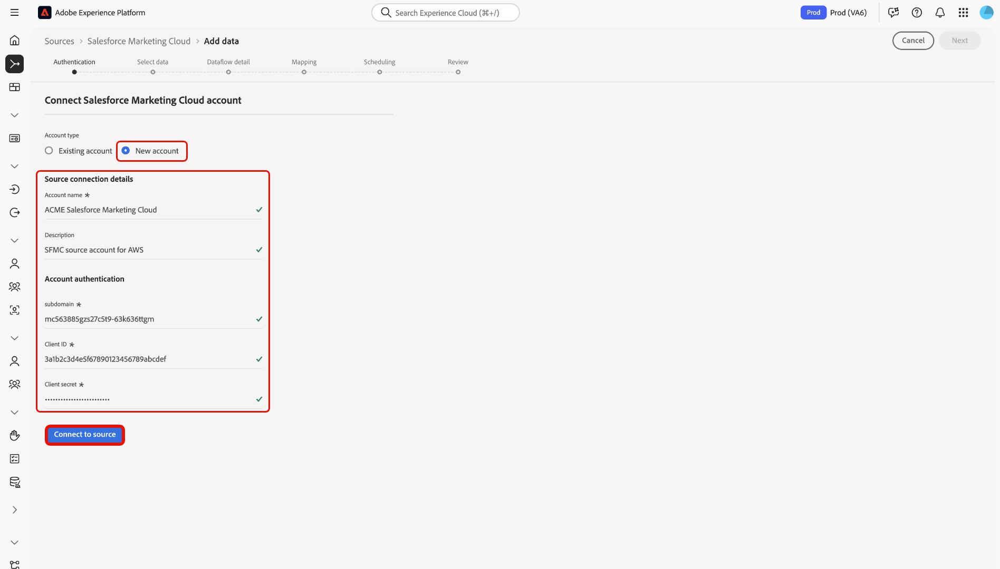

# UI を使用した [!DNL Salesforce Marketing Cloud] アカウントのExperience Platformへの接続

>[!WARNING]
>
>[!DNL Salesforce Marketing Cloud] ソースは 2026 年 1 月に非推奨（廃止予定）になります。 新しいソースは、代替手段として今年後半にリリースされる予定です。 新しいソースがリリースされたら、2026 年 1 月末までに、新しいアカウント接続とデータフローを作成して、新しいソースに移行する計画を立てる必要があります。

このガイドでは、Experience Platform ユーザーインターフェイスのソースワークスペースを使用して [!DNL Salesforce Marketing Cloud] アカウントをAdobe Experience Platformに接続する方法について説明します。

## 基本を学ぶ

このチュートリアルは、 Experience Platform の次のコンポーネントを実際に利用および理解しているユーザーを対象としています。

* [[!DNL Experience Data Model (XDM)]  システム](../../../../../xdm/home.md)：[!DNL Experience Platform] が顧客体験データの整理に使用する標準化されたフレームワーク。
   * [スキーマ構成の基本](../../../../../xdm/schema/composition.md)：スキーマ構成の主要な原則やベストプラクティスなど、XDM スキーマの基本的な構成要素について学びます。
   * [スキーマエディターのチュートリアル](../../../../../xdm/tutorials/create-schema-ui.md)：スキーマエディター UI を使用してカスタムスキーマを作成する方法を説明します。
* [[!DNL Real-Time Customer Profile]](../../../../../profile/home.md)：複数のソースからの集計データに基づいて、統合されたリアルタイムの顧客プロファイルを提供します。

既に [!DNL Salesforce Marketing Cloud] アカウントを持っている場合は、このドキュメントの残りの部分をスキップし、[UI を使用したExperience Platformへのマーケティング自動化データの取り込み &#x200B;](../../dataflow/marketing-automation.md) に関するチュートリアルに進むことができます。

### 必要な資格情報の収集

認証について詳しくは、[[!DNL Salesforce Marketing Cloud]  概要 &#x200B;](../../../../connectors/marketing-automation/salesforce-marketing-cloud.md#prerequisites) を参照してください。

## ソースカタログのナビゲート

>[!IMPORTANT]
>
>カスタムオブジェクトの取り込みは、現在、[!DNL Salesforce Marketing Cloud] ソース統合ではサポートされていません。

Experience Platformの UI で、左側のナビゲーションから **[!UICONTROL Sources]** を選択し、*[!UICONTROL Sources]* ワークスペースにアクセスします。 カテゴリを選択するか、検索バーを使用してソースを検索します。

[!DNL Salesforce Marketing Cloud] に接続するには、「*[!UICONTROL マーケティング自動化]*」カテゴリに移動し、「**[!UICONTROL Salesforce Marketing Cloud]**」ソースカードを選択して、「**[!UICONTROL 設定]**」を選択します。

>[!TIP]
>
>ソースカタログ内のソースは、特定のソースがまだ認証済みのアカウントを持っていない場合に「**[!UICONTROL 設定]**」オプションを表示します。 認証済みアカウントを作成すると、このオプションは **[!UICONTROL データを追加]** に変わります。

## 既存のアカウントを使用 {#existing}

既存のアカウントを使用するには、「**[!UICONTROL 既存のアカウント]**」を選択して、使用する [!DNL Salesforce Marketing Cloud] アカウントを選択します。

## 新しいアカウントを作成 {#new}

[!DNL Salesforce Marketing Cloud] ソースを使用して、[!DNL Azure] または [!DNL Amazon Web Services] 上のExperience Platform（AWS）に接続できます。

### [!DNL Azure] でExperience Platformに接続する {#azure}

[!DNL Azure] でExperience Platformに接続するには、アカウント名、説明（オプション）、[&#x200B; アカウント認証資格情報 &#x200B;](../../../../connectors/marketing-automation/salesforce-marketing-cloud.md#azure) を入力します。 終了したら「**[!UICONTROL ソースに接続]**」を選択し、接続が確立されるまでしばらく待ちます。

### Amazon Web ServicesのExperience Platform（AWS）への接続 {#aws}

>[!AVAILABILITY]
>
>この節の内容は、Amazon Web Services（AWS）上で動作するExperience Platformの実装に適用されます。 AWS上で動作するExperience Platformは、現在、限られた数のお客様が利用できます。 サポートされるExperience Platform インフラストラクチャについて詳しくは、[Experience Platform multi-cloud overview](../../../../../landing/multi-cloud.md) を参照してください。

[!DNL AWS] でExperience Platformに接続するには、VA6 サンドボックスにいることを確認し、アカウント名、説明（オプション）、[&#x200B; アカウント認証資格情報 &#x200B;](../../../../connectors/marketing-automation/salesforce-marketing-cloud.md#aws) を入力します。 終了したら「**[!UICONTROL ソースに接続]**」を選択し、接続が確立されるまでしばらく待ちます。

## データのデータフロー [!DNL Salesforce Marketing Cloud] 作成

[!DNL Salesforce Marketing Cloud] への接続が正常に完了したので、[&#x200B; データフローを作成し、マーケティング自動化プロバイダーからExperience Platformにデータを取り込む &#x200B;](../../dataflow/marketing-automation.md) ことができます。
