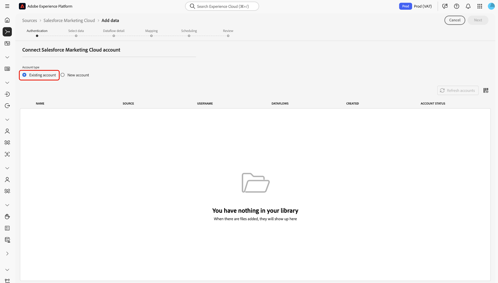

# UI での [!DNL Salesforce Marketing Cloud] ソース接続の作成

>[!NOTE]
>
> [!DNL Salesforce Marketing Cloud] ソースはベータ版です。 ベータラベル付きのソースの使用について詳しくは、[ ソースの概要 ](../../../../home.md#terms-and-conditions) を参照してください。

Adobe Experience Platformのソースコネクタは、外部ソースのデータをスケジュールに従って取り込む機能を提供します。 このチュートリアルでは、Platform ユーザーインターフェイスを使用して [!DNL Salesforce Marketing Cloud] ソースコネクタを作成する手順を説明します。

## はじめに

このチュートリアルは、Adobe Experience Platform の次のコンポーネントを実際に利用および理解しているユーザーを対象としています。

* [[!DNL Experience Data Model (XDM)] システム](../../../../../xdm/home.md):顧客体験データを整理する際に使用す [!DNL Experience Platform] る標準化されたフレームワーク。
   * [スキーマ構成の基本](../../../../../xdm/schema/composition.md)：スキーマ構成の主要な原則やベストプラクティスなど、XDM スキーマの基本的な構成要素について学びます。
   * [スキーマエディターのチュートリアル](../../../../../xdm/tutorials/create-schema-ui.md):スキーマエディターの UI を使用してカスタムスキーマを作成する方法を説明します。
* [[!DNL Real-time Customer Profile]](../../../../../profile/home.md)：複数のソースからの集計データに基づいて、統合されたリアルタイムの顧客プロファイルを提供します。

既に [!DNL Salesforce Marketing Cloud] 接続がある場合は、このドキュメントの残りの部分をスキップし、[ データフローの設定 ](../../dataflow/marketing-automation.md) に関するチュートリアルに進んでください。

### 必要な資格情報の収集

Platform の [!DNL Salesforce Marketing Cloud] アカウントにアクセスするには、次の値を指定する必要があります。

| 資格情報 | 説明 |
| ---------- | ----------- |
| `host` | アプリケーションのホストサーバー。 多くの場合、サブドメインです。 |
| `clientId` | [!DNL Salesforce Marketing Cloud] アプリケーションに関連付けられているクライアント ID。 |
| `clientSecret` | [!DNL Salesforce Marketing Cloud] アプリケーションに関連付けられているクライアントの秘密鍵。 |

使い始める方法については、この [[!DNL Salesforce Marketing Cloud]  ドキュメント ](https://developer.salesforce.com/docs/atlas.en-us.mc-apis.meta/mc-apis/authentication.htm) を参照してください。

## [!DNL Salesforce Marketing Cloud] アカウントに接続

必要な資格情報を収集したら、以下の手順に従って [!DNL Salesforce Marketing Cloud] アカウントを Platform にリンクできます。

Platform UI で、左のナビゲーションから「 **[!UICONTROL ソース]** 」を選択して、「 [!UICONTROL  ソース ] 」ワークスペースにアクセスします。 [!UICONTROL  カタログ ] 画面には、アカウントを作成するための様々なソースが表示されます。

画面の左側にあるカタログから適切なカテゴリを選択できます。 検索バーを使用して、表示されるコネクタを絞り込むこともできます。

「[!UICONTROL  マーケティングの自動化 ]」カテゴリで、「**[!UICONTROL Salesforce のMarketing Cloud]**」を選択し、「**[!UICONTROL 設定]**」を選択します。

「**[!UICONTROL SalesforceMarketing Cloudに接続]**」ページが表示されます。 このページでは、新しい資格情報または既存の資格情報を使用できます。

### 新規アカウント

新しい資格情報を使用する場合は、「**[!UICONTROL 新しいアカウント]**」を選択します。 表示される入力フォームで、名前、説明（オプション）、[!DNL Salesforce Marketing Cloud] 資格情報を入力します。 終了したら、[**[!UICONTROL 接続]**] を選択し、新しい接続が確立されるまでしばらく時間をかけます。

### 既存のアカウント

既存のアカウントに接続するには、接続する [!DNL Salesforce Marketing Cloud] アカウントを選択し、**[!UICONTROL 次へ]** を選択して次に進みます。

## 次の手順

このチュートリアルに従って、[!DNL Salesforce Marketing Cloud] アカウントへの接続を確立しました。 次のチュートリアルに進み、マーケティング自動化システムデータを Platform](../../dataflow/marketing-automation.md) に取り込むように [ データフローを設定できます。
