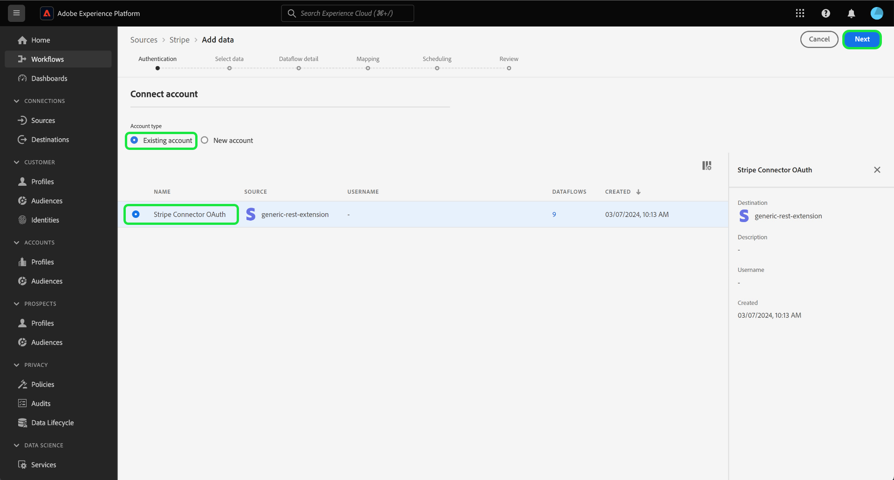
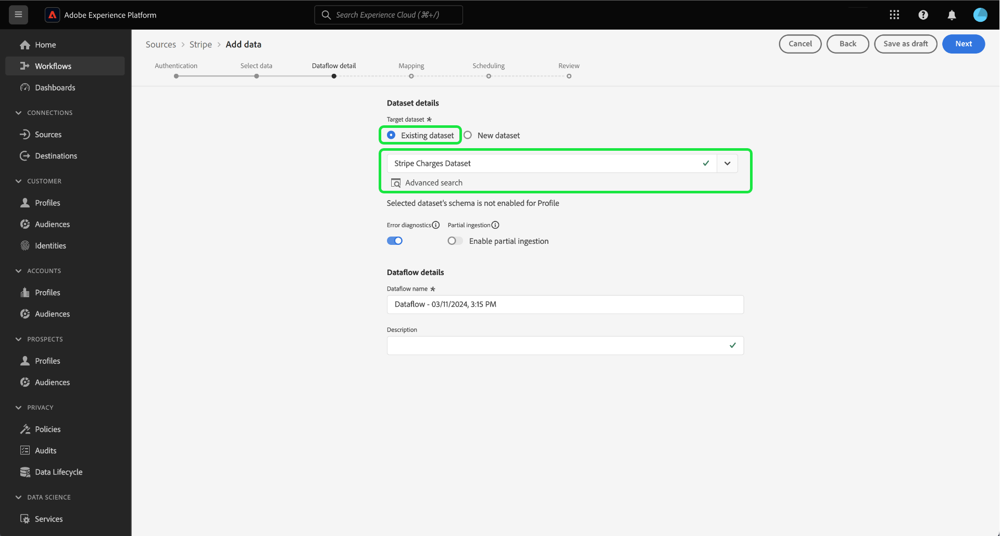

# ユーザーインターフェイスを使用した、[!DNL Stripe] アカウントからExperience Platformへの支払いデータの取り込み

>[!NOTE]
>
>[!DNL Stripe] ソースはベータ版です。ベータラベル付きソースの使用について詳しくは、ソースの概要の [ 利用条件 ](../../../../home.md#terms-and-conditions) を参照してください。

ユーザーインターフェイスを使用して [!DNL Stripe] アカウントからAdobe Experience Platformに支払いデータを取り込む方法については、次のチュートリアルを参照してください。

## 基本を学ぶ

このチュートリアルは、 Experience Platform の次のコンポーネントを実際に利用および理解しているユーザーを対象としています。

* [[!DNL Experience Data Model (XDM)]  システム](../../../../../xdm/home.md)：[!DNL Experience Platform] が顧客体験データの整理に使用する標準化されたフレームワーク。
   * [スキーマ構成の基本](../../../../../xdm/schema/composition.md)：スキーマ構成の主要な原則やベストプラクティスなど、XDM スキーマの基本的な構成要素について学びます。
   * [スキーマエディターのチュートリアル](../../../../../xdm/tutorials/create-schema-ui.md)：スキーマエディター UI を使用してカスタムスキーマを作成する方法を説明します。
* [[!DNL Real-Time Customer Profile]](../../../../../profile/home.md)：複数のソースからの集計データに基づいて、統合されたリアルタイムの顧客プロファイルを提供します。

### 認証

認証資格情報の取得方法について詳しくは、[[!DNL Stripe]  概要 ](../../../../connectors/payments/stripe.md) を参照してください。

## [!DNL Stripe] アカウントを接続 {#connect}

Experience Platformの UI で、左側のナビゲーションから **[!UICONTROL Sources]** を選択し、[!UICONTROL Sources] ワークスペースにアクセスします。 画面の左側にあるカタログから適切なカテゴリを選択することができます。または、使用する特定のソースを検索オプションを使用して探すこともできます。

*支払い* カテゴリで、「**[!DNL Stripe]**」を選択し、**[!UICONTROL 設定]** を選択します。

>[!TIP]
>
>ソースカタログ内のソースは、特定のソースがまだ認証済みのアカウントを持っていない場合に「**[!UICONTROL 設定]**」オプションを表示します。 認証済みアカウントが存在すると、このオプションは **[!UICONTROL データを追加]** に変わります。

**[!UICONTROL Stripe アカウントの接続]** ページが表示されます。 このページでは、新しい資格情報または既存の資格情報を使用できます。

>[!BEGINTABS]

>[!TAB  新規アカウントの作成 ]

新しいアカウントを作成するには、「**[!UICONTROL 新しいアカウント]**」を選択し、名前、説明（オプション）、の資格情報を入力します。

終了したら「**[!UICONTROL ソースに接続]**」を選択し、新しい接続が確立されるまでしばらく待ちます。

| 資格情報 | 説明 |
| --- | --- |
| アクセストークン | [!DNL Stripe] アクセストークン。 アクセストークンの取得方法について詳しくは、[[!DNL Stripe]  認証ガイド ](../../../../connectors/payments/stripe.md) を参照してください。 |

>[!TAB  既存のアカウントを使用 ]

既存のアカウントを使用するには、「**[!UICONTROL 既存のアカウント]**」を選択し、既存のアカウントカタログから使用するアカウントを選択します。

「**[!UICONTROL 次へ]**」を選択して次に進みます。

>[!ENDTABS]

## データの選択 {#select-data}

アカウントにアクセスできるようになったので、取り込む [!DNL Stripe] データへの適切なパスを特定する必要があります。 **[!UICONTROL リソースパス]** を選択してから、データを取り込むエンドポイントを選択します。 使用できる [!DNL Stripe] エンドポイントは次のとおりです。

* 料金
* 購読
* 払戻
* 残高トランザクション
* 顧客
* 価格

エンドポイントが選択されると、インターフェイスがプレビュー画面に更新され、選択した [!DNL Stripe] エンドポイントのデータ構造が表示されます。 「**[!UICONTROL 次へ]**」を選択して次に進みます。

## データセットとデータフローの詳細の指定 {#provide-dataset-and-dataflow-details}

次に、データセットとデータフローに関する情報を指定する必要があります。

### データセットの詳細 {#dataset-details}

データセットは、スキーマ（列）とフィールド（行）で構成されるデータコレクション（通常はテーブル）を格納し管理するための構造です。Experience Platformに正常に取り込まれたデータは、データセットとしてデータレイク内に保存されます。 この手順では、新しいデータセットを作成するか、既存のデータセットを使用します。

>[!BEGINTABS]

>[!TAB  新しいデータセットを使用する ]

新しいデータセットを使用するには、「**[!UICONTROL 新しいデータセット]**」を選択し、データセットの名前とオプションの説明を入力します。 また、データセットが準拠するエクスペリエンスデータモデル（XDM）スキーマを選択する必要があります。

| 新しいデータセットの詳細 | 説明 |
| --- | --- |
| 出力データセット名 | 新規データセットの名前。 |
| 説明 | （任意）新しいデータセットの簡単な説明。 |
| スキーマ | 組織に存在するスキーマのドロップダウンリスト。 ソース設定プロセスの前に、独自のスキーマを作成することもできます。 詳しくは、[UI での XDM スキーマの作成 ](../../../../../xdm/tutorials/create-schema-ui.md) に関するガイドを参照してください。 |

>[!TAB 既存のデータセットを使用する]

既存のデータセットがある場合は、「**[!UICONTROL 既存のデータセット]**」を選択し、「**[!UICONTROL 詳細検索]**」オプションを使用すると、組織内のすべてのデータセットのウィンドウが表示されます。これには、リアルタイム顧客プロファイルへの取り込みが有効になっているかどうかなど、それぞれの詳細が含まれます。

>[!ENDTABS]

+++プロファイル取り込み、エラー診断、部分取り込みを有効にする手順を選択します。

データセットがリアルタイム顧客プロファイルに対して有効になっている場合、この手順の間に **[!UICONTROL プロファイルデータセット]** を切り替えて、プロファイル取り込み用のデータを有効にすることができます。 また、この手順を使用して、**[!UICONTROL エラー診断]** および **[!UICONTROL 部分取り込み]** を有効にすることもできます。

* **[!UICONTROL エラー診断]**: **[!UICONTROL エラー診断]** を選択して、データセットアクティビティとデータフローステータスを監視する際に後で参照できるエラー診断を生成するようにソースに指示します。
* **[!UICONTROL 部分取り込み]**：部分バッチ取り込みは、設定可能な特定のしきい値まで、エラーを含んだデータを取り込む機能です。 この機能を使用すると、正確なデータをすべてExperience Platformに正常に取り込みながら、不正なデータがすべて無効な理由に関する情報と共に個別にバッチ処理されます。

+++

### データフローの詳細 {#dataflow-details}

データセットを設定したら、名前、説明（オプション）、アラート設定など、データフローの詳細を指定する必要があります。

| データフロー設定 | 説明 |
| --- | --- |
| データフロー名 | データフローの名前。  デフォルトでは、読み込まれるファイルの名前が使用されます。 |
| 説明 | （任意）データフローの簡単な説明です。 |
| アラート | Experience Platformでは、ユーザーが登録できるイベントベースのアラートを作成できます。 これらのオプションをトリガーするには、すべて実行中のデータフローが必要です。  詳しくは、[ アラートの概要 ](../../alerts.md) を参照してください <ul><li>**ソースデータフロー実行開始**：データフロー実行が開始したときに通知を受け取るには、このアラートを選択します。</li><li>**ソースデータフロー実行成功**：データフローがエラーなく終了した場合に通知を受け取るには、このアラートを選択します。</li><li>**ソースデータフロー実行の失敗**：データフローの実行がエラーで終了した場合に通知を受け取るには、このアラートを選択します。</li></ul> |

終了したら、「**[!UICONTROL 次へ]** を選択して続行します。

## XDM スキーマへのフィールドのマッピング {#mapping}

「**[!UICONTROL マッピング]**」手順が表示されます。マッピングインターフェイスを使用して、ソースデータをExperience Platformに取り込む前に、そのデータを適切なスキーマフィールドにマッピングします。 マッピングインターフェイスの使用方法に関するガイドについては、[ データ準備 UI ガイド ](../../../../../data-prep/ui/mapping.md) を参照してください。

## 取り込みスケジュールを設定 {#scheduling}

次に、スケジュールインターフェイスを使用して、データフローの取り込みスケジュールを作成します。

頻度ドロップダウンを選択して、データフローの取り込み頻度を設定します。

また、カレンダーアイコンを選択し、ポップアップカレンダーを使用して取り込み開始時刻を設定することもできます。

| スケジュール設定 | 説明 |
| --- | --- |
| 頻度 | 頻度を設定して、データフローの実行頻度を示します。 頻度は次のように設定できます。 <ul><li>**1 回**：頻度を `once` に設定して、1 回限りの取り込みを作成します。 1 回限りの取り込みデータフローを作成する場合、間隔とバックフィルの設定は使用できません。 デフォルトでは、スケジュールの頻度は 1 回に設定されています。</li><li>**分**：頻度を `minute` に設定して、1 分ごとにデータを取り込むようにデータフローをスケジュールします。</li><li>**時間**：頻度を `hour` に設定して、1 時間ごとにデータを取り込むようにデータフローをスケジュールします。</li><li>**日**：頻度を `day` に設定して、1 日にデータを取り込むようにデータフローをスケジュールします。</li><li>**週**：頻度を `week` に設定して、データフローが週ごとにデータを取り込むようにスケジュールします。</li></ul> |
| 間隔 | 頻度を選択したら、間隔設定を指定して、各取り込み間の時間枠を確立できます。 例えば、頻度を日に設定し、間隔を 15 に設定すると、データフローは 15 日ごとに実行されます。 間隔をゼロに設定することはできません。 各頻度で許容される最小のインターバル値は次のとおりです。<ul><li>**1 回**：なし</li><li>**分**: 15</li><li>**時間**: 1</li><li>**日**: 1</li><li>**週**: 1</li></ul> |
| 開始時間 | 見込み実行のタイムスタンプ（UTC タイムゾーンで表示）。 |
| バックフィル | バックフィルは、最初に取り込むデータを決定します。 バックフィルが有効になっている場合、指定されたパス内の現在のすべてのファイルが、最初にスケジュールされた取り込み時に取り込まれます。 バックフィルが無効になっている場合は、最初の取り込みの実行から開始時刻の間に読み込まれたファイルのみが取り込まれます。 開始時間より前に読み込まれたファイルは取り込まれません。 |

データフローの取り込みスケジュールを設定したら、「**[!UICONTROL 次へ]**」を選択します。

## データフローのレビュー

データフロー作成プロセスの最後の手順は、データフローを実行する前に確認することです。 **[!UICONTROL レビュー]** ステップを使用すると、新しいデータフローを実行する前に詳細をレビューできます。 詳細は、次のカテゴリにグループ化されます。

* **接続**：ソースのタイプ、選択したソースファイルの関連パスおよびそのソースファイル内の列の数を表示します。
* **データセットの割り当てとフィールドのマッピング**：ソースデータがどのデータセットに取り込まれるかを、そのデータセットが準拠するスキーマを含めて表示します。
* **スケジュール**：取り込みスケジュールのアクティブな期間、頻度、間隔を表示します。

データフローをレビューしたら、「**[!UICONTROL 終了]**」を選択し、データフローが作成されるまでしばらく待ちます。

## 次の手順

このチュートリアルでは、支払いデータを [!DNL Stripe] ソースからExperience Platformに取り込むデータフローを正常に作成しました。 その他のリソースについては、以下に概要を説明するドキュメントを参照してください。

### データフローの監視

データフローを作成したら、そのデータフローを通じて取り込まれるデータを監視し、取り込み率、成功、エラーに関する情報を表示できます。 データフローのモニタリング方法について詳しくは、[UI でのアカウントとデータフローのモニタリング ](../../../../../dataflows/ui/monitor-sources.md) のチュートリアルを参照してください。

### データフローの更新

データフローのスケジュール、マッピング、一般情報の設定を更新するには、[UI でのソースデータフローの更新 ](../../update-dataflows.md) に関するチュートリアルを参照してください。

### データフローの削除

不要になったデータフローや誤って作成されたデータフローは、**[!UICONTROL データフロー]**&#x200B;ワークスペース内にある&#x200B;**[!UICONTROL 削除]**&#x200B;機能で削除できます。データフローの削除方法について詳しくは、[UI でのデータフローの削除 ](../../delete.md) のチュートリアルを参照してください。
