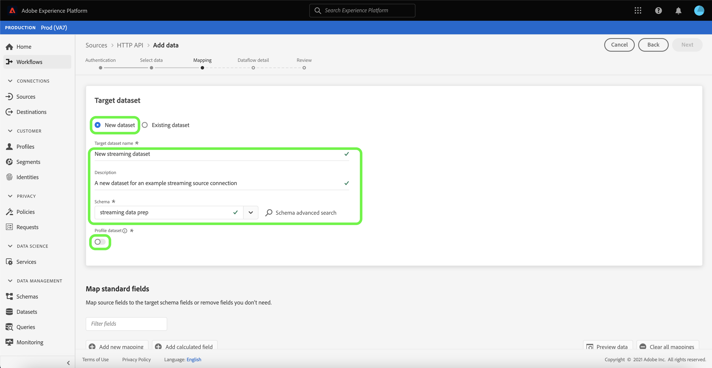

# UI を使用したストリーミング接続の作成

このチュートリアルでは、[!UICONTROL  ソース ] ワークスペースを使用してストリーミングソース接続を作成する手順を説明します。

## はじめに

このチュートリアルは、Adobe Experience Platform の次のコンポーネントを実際に利用および理解しているユーザーを対象としています。

- [[!DNL Experience Data Model (XDM)] システム](../../../../../xdm/home.md):顧客体験データを整理する際に使用す [!DNL Experience Platform] る標準化されたフレームワーク。
   - [スキーマ構成の基本](../../../../../xdm/schema/composition.md)：スキーマ構成の主要な原則やベストプラクティスなど、XDM スキーマの基本的な構成要素について学びます。
   - [スキーマエディターのチュートリアル](../../../../../xdm/tutorials/create-schema-ui.md):スキーマエディターの UI を使用してカスタムスキーマを作成する方法を説明します。
- [[!DNL Real-time Customer Profile]](../../../../../profile/home.md)：複数のソースからの集計データに基づいて、統合されたリアルタイムの顧客プロファイルを提供します。

## ストリーミング接続の作成

Platform UI で、左のナビゲーションから「 **[!UICONTROL ソース]** 」を選択して、「 [!UICONTROL  ソース ] 」ワークスペースにアクセスします。 [!UICONTROL  カタログ ] 画面には、アカウントを作成できる様々なソースが表示されます。

画面の左側にあるカタログから適切なカテゴリを選択できます。 または、検索オプションを使用して、目的の特定のソースを見つけることもできます。

「**[!UICONTROL ストリーミング]**」カテゴリで「**[!UICONTROL HTTP API]**」を選択し、「**[!UICONTROL データを追加]**」を選択します。

「**[!UICONTROL HTTP API アカウントに接続]**」ページが表示されます。 このページでは、新しい資格情報または既存の資格情報を使用できます。

### 既存のアカウント

既存のアカウントを使用するには、新しいデータフローを作成する HTTP API アカウントを選択し、**[!UICONTROL 次へ]** を選択して次に進みます。

### 新規アカウント

新しいアカウントを作成する場合は、「**[!UICONTROL 新しいアカウント]**」を選択します。 表示される入力フォームで、アカウント名とオプションの説明を入力します。 また、次の設定プロパティを指定するオプションも提供されます。

- **[!UICONTROL 認証]:** このプロパティは、ストリーミング接続で認証を必要とするかどうかを指定します。認証を実行すると、データは信頼できるソースから収集されます。個人を特定できる情報 (PII) を扱う場合は、このプロパティを有効にする必要があります。 デフォルトでは、このプロパティはオフになっています。
- **[!UICONTROL XDM 互換]:** このプロパティは、このストリーミング接続が XDM スキーマと互換性のあるイベントを送信するかどうかを示します。デフォルトでは、このプロパティはオフになっています。

終了したら、「**[!UICONTROL ソースに接続]**」を選択し、「**[!UICONTROL 次へ]**」を選択して次に進みます。

## データの選択

HTTP API 接続を作成した後、**[!UICONTROL データを選択]** 手順が表示され、データをアップロードおよびプレビューするためのインターフェイスが表示されます。

「**[!UICONTROL ファイルをアップロード]**」を選択して、データをアップロードします。 または、インターフェイスの「[!UICONTROL  ファイルをドラッグ&amp;ドロップ ]」セクションにデータをドラッグ&amp;ドロップできます。

データをアップロードしたら、インターフェイスの右側を使用して、ファイル階層をプレビューできます。 「**[!UICONTROL 次へ]**」を選択して次に進みます。

## データフィールドの XDM スキーマへのマッピング

[!UICONTROL  マッピング ] 手順が表示され、ソースデータを Platform データセットにマッピングするためのインターフェイスが提供されます。

Parquet ファイルは XDM に準拠している必要があり、手動でマッピングを設定する必要はありません。CSV ファイルでは、マッピングを明示的に設定する必要がありますが、マッピングするソースデータフィールドを選択できます。 JSON ファイルは、XDM に準拠しているとマークされている場合、手動設定は必要ありません。 ただし、XDM 準拠としてマークされていない場合は、マッピングを明示的に設定する必要があります。

取り込む受信データのデータセットを選択します。 既存のデータセットを使用するか、新しく作成できます。

### 新しいデータセットの作成

新しいデータセットを作成するには、「**[!UICONTROL 新しいデータセット]**」を選択します。 表示されるフォームで、名前、説明（オプション）、データセットのターゲットスキーマを入力します。 [!DNL Profile] が有効なスキーマを選択した場合、データセットを [!DNL Profile] が有効にする必要があるかどうかを選択できます。

### 既存のデータセットを使用する

既存のデータセットを使用するには、「**[!UICONTROL 既存のデータセット]**」を選択します。 表示されるフォームで、使用するデータセットを選択します。 データセットを選択したら、データセットを [!DNL Profile] 有効にするかどうかを選択できます。

### 標準フィールドのマッピング

必要に応じて、フィールドを直接マッピングするか、データ準備関数を使用してソース・データを変換し、計算済値または計算済値を取得できます。 マッパー関数と計算フィールドの詳細については、『[ データ準備関数ガイド ](../../../../../data-prep/functions.md)』または『[ 計算フィールドガイド ](../../../../../data-prep/calculated-fields.md)』を参照してください。

新しいソースフィールドを追加するには、「**[!UICONTROL 新しいマッピングを追加]**」を選択します。

新しいソースフィールドとターゲットフィールドのペアリングが表示されます。 新しいソースフィールドを追加するには、[!UICONTROL  ソースフィールドを選択 ] 入力バーの横にある矢印アイコンを選択します。

[!UICONTROL  属性を選択 ] パネルを使用すると、ファイル階層を調べ、特定のソースフィールドを選択してターゲット XDM フィールドにマッピングできます。 マップするソースフィールドを選択したら、「**[!UICONTROL 選択]**」を選択して次に進みます。

ソースフィールドを選択した状態で、マッピング先の適切なターゲット XDM フィールドを識別できるようになりました。 「ターゲットフィールド」セクションの下のスキーマアイコンを選択します。

[!UICONTROL  ソースフィールドをターゲットフィールドにマッピング ] ウィンドウが開き、ターゲットデータセットのスキーマを調べるためのインターフェイスが表示されます。 ソースフィールドに一致するターゲットフィールドを選択し、「**[!UICONTROL 選択]**」を選択して次に進みます。

ソースフィールドがすべて適切なターゲット XDM フィールドにマッピングされたら、**[!UICONTROL 次へ]** を選択します。

## データフローの詳細

**[!UICONTROL データフローの詳細]** 手順が表示されます。 このページでは、名前とオプションの説明を指定して、作成したデータフローの詳細を指定できます。

データフローの詳細を指定したら、「**[!UICONTROL 次へ]**」を選択します。

## レビュー

**[!UICONTROL レビュー]** 手順が表示され、データフローの作成前に詳細を確認できます。 詳細は、次のカテゴリにグループ化されます。

- **[!UICONTROL 接続]**:アカウント名、ソースプラットフォーム、ソース名が表示されます。
- **[!UICONTROL データセットとマップのフィールドの割り当て]**:ターゲットデータセットと、データセットが準拠するスキーマを表示します。

詳細が正しいことを確認したら、「**[!UICONTROL 完了]**」を選択します。

## ストリーミングエンドポイント URL の取得

接続が作成されると、ソースの詳細ページが表示されます。 このページには、以前に実行したデータフロー、ID、ストリーミングエンドポイント URL を含む、新しく作成した接続の詳細が表示されます。

## 次の手順

このチュートリアルに従って、ストリーミング HTTP 接続を作成し、ストリーミングエンドポイントを使用して様々な [!DNL Data Ingestion] API にアクセスできるようにしました。 API でストリーミング接続を作成する手順については、[ストリーミング接続の作成に関するチュートリアル](../../../api/create/streaming/http.md)を参照してください。

データを Platform にストリーミングする方法については、[ 時系列データのストリーミング ](../../../../../ingestion/tutorials/streaming-time-series-data.md) に関するチュートリアル、または [ レコードデータのストリーミング ](../../../../../ingestion/tutorials/streaming-record-data.md) に関するチュートリアルを参照してください。
