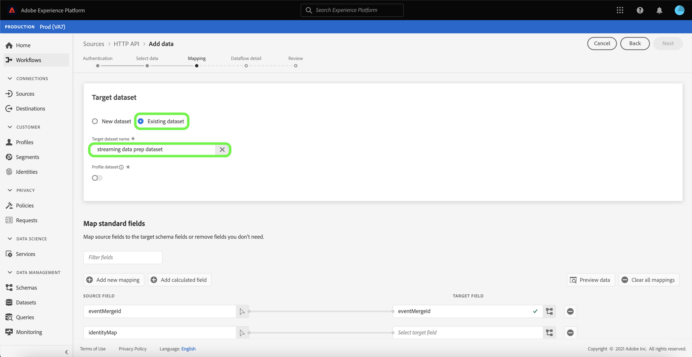

# UI を使用したストリーミング接続の作成

この UI ガイドは、Adobe Experience Platform を使用してストリーミング接続を作成する際に役立ちます。

## はじめに

このチュートリアルは、Adobe Experience Platform の次のコンポーネントを実際に利用および理解しているユーザーを対象としています。

- [[!DNL Experience Data Model (XDM)] システム](../../../../../xdm/home.md):顧客体験データを [!DNL Experience Platform] 編成する際に使用される標準化されたフレームワーク。
   - [スキーマ構成の基本](../../../../../xdm/schema/composition.md)：スキーマ構成の主要な原則やベストプラクティスなど、XDM スキーマの基本的な構成要素について学びます。
   - [スキーマエディタのチュートリアル](../../../../../xdm/tutorials/create-schema-ui.md):スキーマエディターのUIを使用してカスタムスキーマを作成する方法を説明します。
- [[!DNL Real-time Customer Profile]](../../../../../profile/home.md):複数のソースからの集計データに基づいて、統合されたリアルタイムの消費者プロファイルを提供します。

## ストリーミング接続の作成

[!DNL Experience Platform] UIにログインした後、左のナビゲーションバーで「**[!UICONTROL ソース]**」を選択して&#x200B;**[!UICONTROL ソース]**&#x200B;ワークスペースにアクセスします。 **[!UICONTROL カタログ]**&#x200B;画面には様々なソースが表示され、このソースを使用してアカウントを作成できます。

画面の左側にあるカタログから適切なカテゴリを選択できます。 または、検索オプションを使用して、使用する特定のソースを見つけることもできます。

**[!UICONTROL ストリーミング]**&#x200B;カテゴリの下で、**[!UICONTROL HTTP API]**&#x200B;を選択します。 このコネクタを初めて使用する場合は、**[!UICONTROL 設定]**&#x200B;を選択します。 それ以外の場合は、**[!UICONTROL 追加data]**&#x200B;を選択して、新しいHTTPストリーミングコネクタを作成します。

「**[!UICONTROL Connect HTTP API account]**」ページが表示されます。 このページでは、新しい秘密鍵証明書または既存の秘密鍵証明書を使用できます。

### 新しいアカウント

新しい資格情報を使用する場合は、「**[!UICONTROL 新しいアカウント]**」を選択します。 表示される入力フォームで、アカウント名とオプションの説明を入力します。 また、次の設定プロパティを指定するオプションも提供されます。

- **[!UICONTROL 認証]:** このプロパティは、ストリーミング接続に認証が必要かどうかを指定します。認証を実行すると、データは信頼できるソースから収集されます。個人識別情報(PII)を扱う場合は、このプロパティを有効にする必要があります。 デフォルトでは、このプロパティはオフになっています。
- **[!UICONTROL XDMスキーマの互換性]:** このプロパティは、XDMスキーマと互換性のあるイベントをこのストリーミング接続が送信するかどうかを示します。デフォルトでは、このプロパティはオンになっています。

終了したら、「**[!UICONTROL ソース]**&#x200B;に接続」を選択し、続けて「**[!UICONTROL 次へ]**」を選択します。

### 既存のアカウント

既存の資格情報を使用して接続するには、使用するHTTP API接続を選択し、「**[!UICONTROL 次へ]**」を選択して次に進みます。

## データの選択

HTTP API接続を作成すると、**[!UICONTROL データを選択]**&#x200B;の手順が表示され、接続するデータセットを選択するためのインターフェイスが表示されます。 新しいデータセットを作成するか、既存のデータセットに接続するかを選択できます。

### 新しいデータセットの作成

新しいデータセットを作成するには、**[!UICONTROL 新しいデータセット]**&#x200B;を選択します。 表示されるフォーム上で、名前、オプションで説明を入力し、データセットのターゲットスキーマを指定します。 「プロファイル対応」スキーマを選択した場合は、プロファイルも有効にする必要があるかどうかを選択できます。

### 既存のデータセットを使用する

既存のデータセットを使用する場合は、「**[!UICONTROL 既存のデータセット]**」を選択します。 表示されるフォーム上で、使用するデータセットを選択します。 データセットを選択したら、プロファイルを有効にするかどうかを選択できます。

## データフローの詳細

**[!UICONTROL Dataflow detail]**&#x200B;ステップが表示されます。 このページでは、名前とオプションの説明を指定することで、作成したデータフローの詳細を指定できます。

データフローの詳細を入力したら、「**[!UICONTROL 次へ]**」を選択します。

## レビュー

「**[!UICONTROL レビュー]**」ステップが表示され、データフローの作成前に詳細を確認できます。 詳細は、次のカテゴリー内にグループ化されます。

- **[!UICONTROL 接続]**:アカウント名、ソースプラットフォーム、およびソース名を表示します。
- **[!UICONTROL データセットとマップのフィールドの割り当て]**:ターゲットデータセットと、そのデータセットが付属するスキーマを表示します。

詳細が正しいことを確認したら、「**[!UICONTROL 完了]**」を選択します。

## ストリーミングエンドポイントURLの取得

接続が作成されると、ソースの詳細ページが表示されます。 このページには、以前に実行したデータフロー、ID、ストリーミングエンドポイントURLなど、新しく作成した接続の詳細が表示されます。

## 次の手順

このチュートリアルに従って、ストリーミングHTTP接続を作成し、ストリーミングエンドポイントを使用して様々な[!DNL Data Ingestion] APIにアクセスできるようにします。 API でストリーミング接続を作成する手順については、[ストリーミング接続の作成に関するチュートリアル](../../../api/create/streaming/http.md)を参照してください。

プラットフォームにデータをストリーミングする方法を学ぶには、[ストリーミング時系列データ](../../../../../ingestion/tutorials/streaming-time-series-data.md)のチュートリアルか、[ストリーミングレコードデータ](../../../../../ingestion/tutorials/streaming-record-data.md)のチュートリアルをお読みください。
