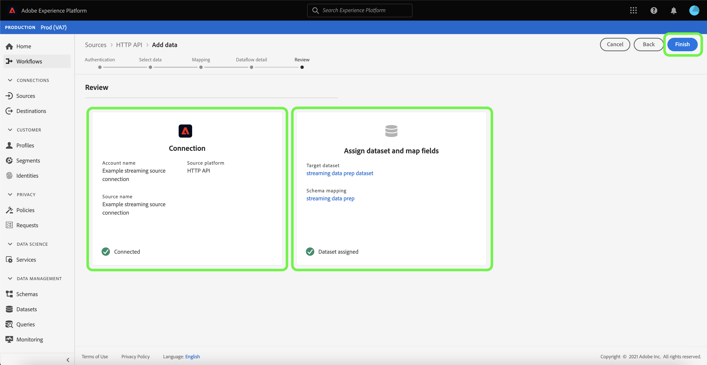

# UI を使用した [!DNL HTTP API] ストリーミング接続の作成

このチュートリアルでは、[!UICONTROL &#x200B; ソース &#x200B;] ワークスペースを使用してストリーミングソース接続を作成する手順を説明します。

## はじめに

このチュートリアルは、Adobe Experience Platform の次のコンポーネントを実際に利用および理解しているユーザーを対象としています。

- [[!DNL Experience Data Model (XDM)]  システム](../../../../../xdm/home.md)：[!DNL Experience Platform] が顧客体験データの整理に使用する標準化されたフレームワーク。
   - [スキーマ構成の基本](../../../../../xdm/schema/composition.md)：スキーマ構成の主要な原則やベストプラクティスなど、XDM スキーマの基本的な構成要素について学びます。
   - [スキーマエディターのチュートリアル](../../../../../xdm/tutorials/create-schema-ui.md)：スキーマエディター UI を使用してカスタムスキーマを作成する方法を説明します。
- [[!DNL Real-Time Customer Profile]](../../../../../profile/home.md)：複数のソースからの集計データに基づいて、統合されたリアルタイムの顧客プロファイルを提供します。

## ストリーミング接続の作成

Experience Platformの UI で、左側のナビゲーションから **[!UICONTROL Sources]** を選択し、[!UICONTROL Sources] ワークスペースにアクセスします。 [!UICONTROL カタログ]画面には、アカウントを作成できる様々なソースが表示されます。

画面の左側にあるカタログから適切なカテゴリを選択することができます。または、使用する特定のソースを検索オプションを使用して探すこともできます。

**[!UICONTROL ストリーミング]** カテゴリで、「**[!UICONTROL HTTP API]**」を選択し、次に「**[!UICONTROL データを追加]**」を選択します。

**[!UICONTROL HTTP API アカウントを接続]** ページが表示されます。 このページでは、新しい資格情報または既存の資格情報を使用できます。

### 既存のアカウント

既存のアカウントを使用するには、新しいデータフローの作成に使用する HTTP API アカウントを選択し、「**[!UICONTROL 次へ]**」を選択して続行します。

### 新しいアカウント

新しいアカウントを作成する場合は、「**[!UICONTROL 新しいアカウント]**」を選択します。表示される入力フォームで、アカウント名と説明（オプション）を入力します。 また、次の設定プロパティを指定するオプションも利用できます。

- **[!UICONTROL Authentication]:** このプロパティは、ストリーミング接続で認証が必要かどうかを決定します。 認証を実行すると、データは信頼できるソースから収集されます。個人情報（PII）を扱う場合は、このプロパティをオンにする必要があります。 デフォルトでは、このプロパティはオフになっています。
- **[!UICONTROL XDM 互換 &#x200B;]:** このプロパティは、このストリーミング接続が XDM スキーマと互換性のあるイベントを送信するかどうかを示します。 デフォルトでは、このプロパティはオフになっています。

終了したら **[!UICONTROL ソースに接続]** を選択し、「**[!UICONTROL 次へ]** を選択して続行します。

## データの選択

HTTP API 接続を作成すると、**[!UICONTROL データを選択]** 手順が表示され、データをアップロードおよびプレビューするためのインターフェイスが表示されます。

**[!UICONTROL ファイルをアップロード]** を選択して、データをアップロードします。 または、データをインターフェイスの [!UICONTROL &#x200B; ファイルをドラッグ&amp;ドロップ &#x200B;] セクションにドラッグ&amp;ドロップすることもできます。

データをアップロードした状態で、インターフェイスの右側を使用してファイル階層をプレビューできます。 「**[!UICONTROL 次へ]**」を選択して次に進みます。

## XDM スキーマへのデータフィールドのマッピング

[!UICONTROL &#x200B; マッピング &#x200B;] 手順が表示され、ソースデータをExperience Platform データセットにマッピングするためのインターフェイスが表示されます。

[!DNL HTTP API] ソースは JSON ファイルの取り込みをサポートしています。 JSON ファイルが XDM 準拠としてマークされている場合、手動設定は必要ありません。 そうでない場合、マッピングを明示的に設定する必要があります。

取り込むインバウンドデータのデータセットを選択します。既存のデータセットを使用することも、新しいデータセットを作成することもできます。

### 新しいデータセットの作成

新しいデータセットを作成するには、「**[!UICONTROL 新しいデータセット]**」を選択します。 表示されるフォームで、データセットの名前、説明（オプション）、ターゲットスキーマを入力します。 [!DNL Profile] 対応スキーマを選択した場合、データセットも [!DNL Profile] 対応にする必要があるかどうかを選択できます。

### 既存のデータセットを使用する

既存のデータセットを使用するには、「**[!UICONTROL 既存のデータセット]**」を選択します。 表示されるフォームで、使用するデータセットを選択します。 データセットを選択したら、データセットを [!DNL Profile] 有効にする必要があるかどうかを選択できます。

### 標準フィールドをマッピング

必要に応じて、フィールドを直接マッピングするか、データ準備機能を使用してソースデータを変換して計算値を導き出すかを選択できます。マッパーインターフェイスと計算フィールドの使用に関する包括的な手順については、[&#x200B; データ準備 UI ガイド &#x200B;](../../../../../data-prep/ui/mapping.md) を参照してください。

新しいソースフィールドを追加するには、「**[!UICONTROL 新しいマッピングを追加]**」を選択します。

新しいソースフィールドとターゲットフィールドのペアが表示されます。 新しいソースフィールドを追加するには、「ソースフィールドを選択 [!UICONTROL &#x200B; 入力バーの横にある矢印アイコンを選択し &#x200B;] す。

[!UICONTROL &#x200B; 属性を選択 &#x200B;] パネルを使用すると、ファイル階層を調べ、ターゲット XDM フィールドにマッピングする特定のソースフィールドを選択できます。 マッピングするソースフィールドを選択したら、「**[!UICONTROL 選択]** をクリックして続行します。

ソースフィールドを選択した状態で、マッピング先の適切なターゲット XDM フィールドを特定できるようになりました。 「ターゲットフィールド」セクションでスキーマアイコンを選択します。

[!UICONTROL &#x200B; ソースフィールドをターゲットフィールドにマッピング &#x200B;] ウィンドウが開き、ターゲットデータセットのスキーマを調べるためのインターフェイスが表示されます。 ソースフィールドに一致するターゲットフィールドを選択し、「**[!UICONTROL 選択]** をクリックして続行します。

ソースフィールドがすべて適切なターゲット XDM フィールドにマッピングされたら、「次へ **[!UICONTROL を選択します]**

## データフローの詳細

**[!UICONTROL データフロー詳細]** 手順が表示されます。 このページでは、名前とオプションの説明を指定して、作成したデータフローの詳細を指定できます。

データフローの詳細を入力したら、「**[!UICONTROL 次へ]**」を選択します。

## レビュー

**[!UICONTROL レビュー]** 手順が表示され、データフローを作成する前に詳細をレビューできます。 詳細は、次のカテゴリ内でグループ化されます。

- **[!UICONTROL 接続]**：アカウント名、ソースプラットフォーム、ソース名が表示されます。
- **[!UICONTROL データセットの割り当てとフィールドのマッピング]**：ターゲットデータセットと、そのデータセットが準拠するスキーマを表示します。

詳細が正しいことを確認したら、「**[!UICONTROL 終了]**」を選択します。

## ストリーミングエンドポイント URL を取得

接続が作成されると、ソースの詳細ページが表示されます。 このページには、以前に実行したデータフロー、ID、ストリーミングエンドポイント URL など、新しく作成した接続の詳細が表示されます。

## 次の手順

このチュートリアルでは、ストリーミング HTTP 接続を作成し、ストリーミングエンドポイントを使用して様々な [!DNL Data Ingestion] API にアクセスできるようになりました。 API でストリーミング接続を作成する手順については、[ストリーミング接続の作成に関するチュートリアル](../../../api/create/streaming/http.md)を参照してください。

データをExperience Platformにストリーミングする方法については、[&#x200B; 時系列データのストリーミング &#x200B;](../../../../../ingestion/tutorials/streaming-time-series-data.md) または [&#x200B; レコードデータのストリーミング &#x200B;](../../../../../ingestion/tutorials/streaming-record-data.md) に関するチュートリアルを参照してください。
