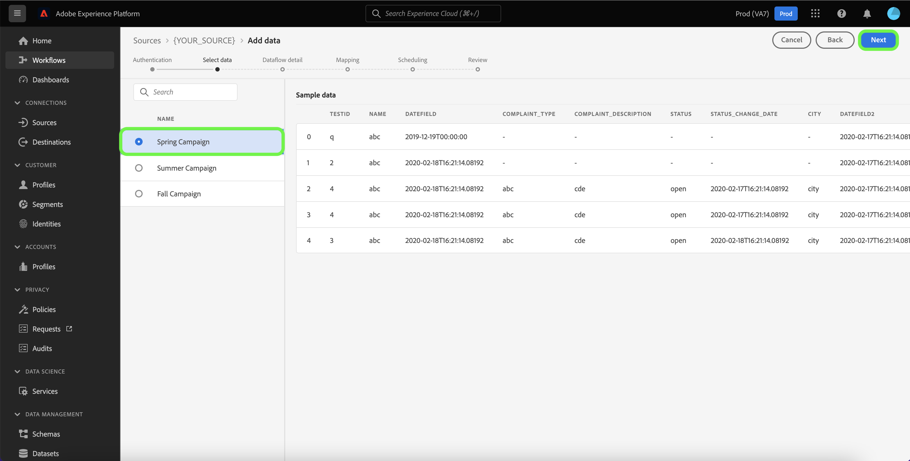
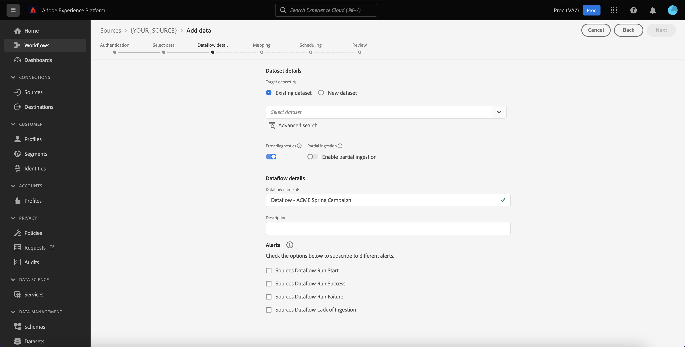
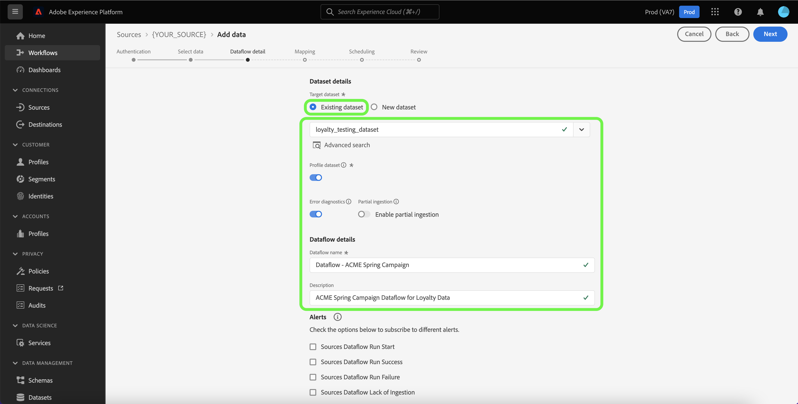
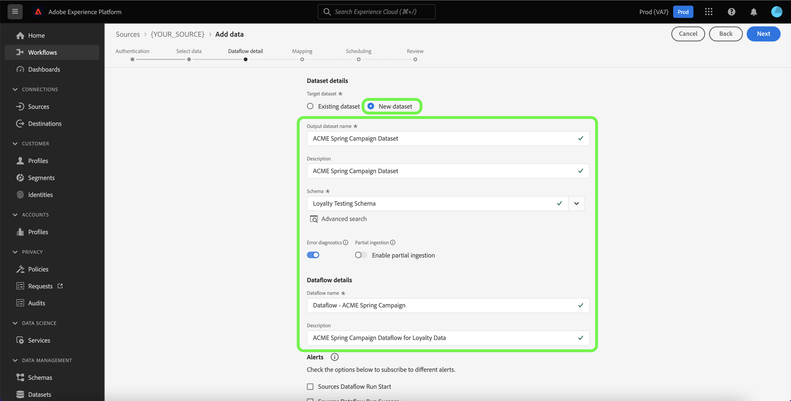
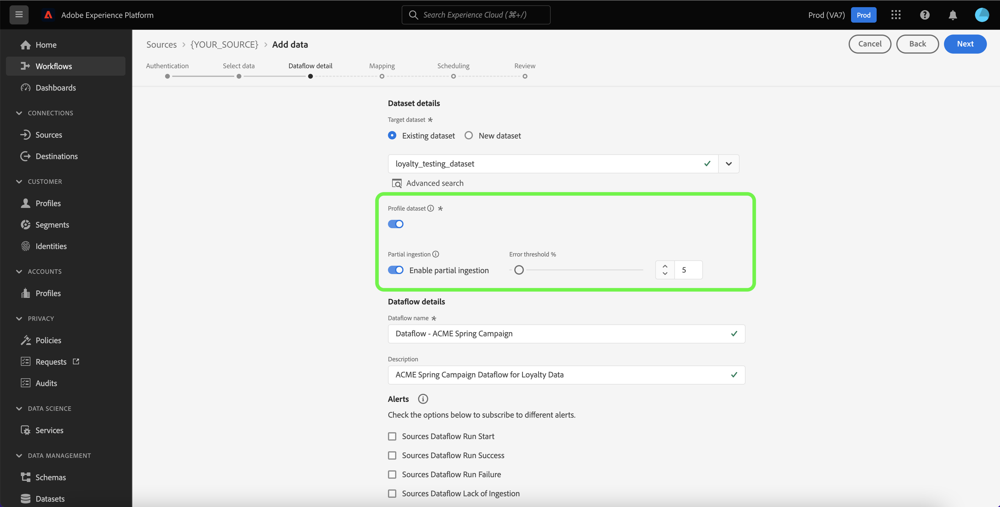
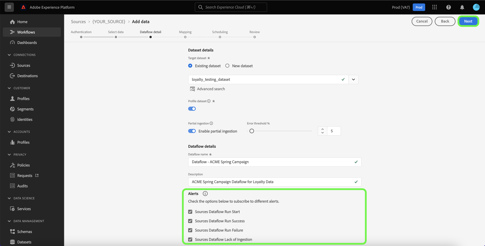
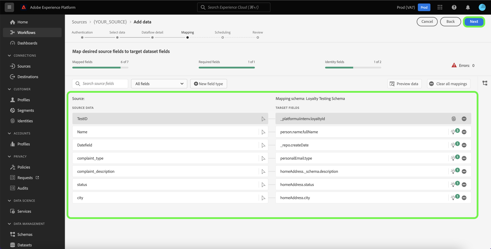
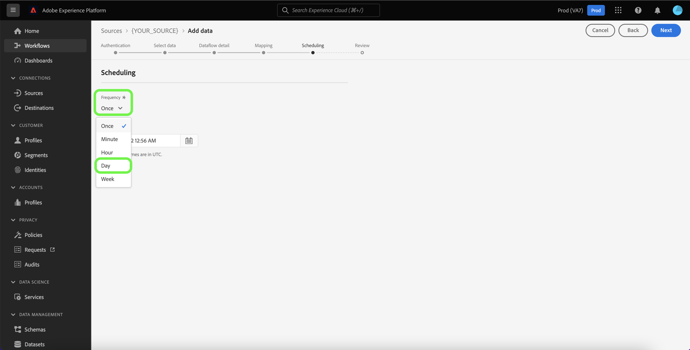
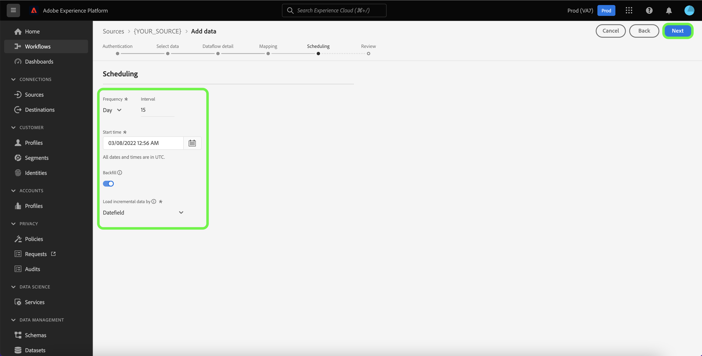
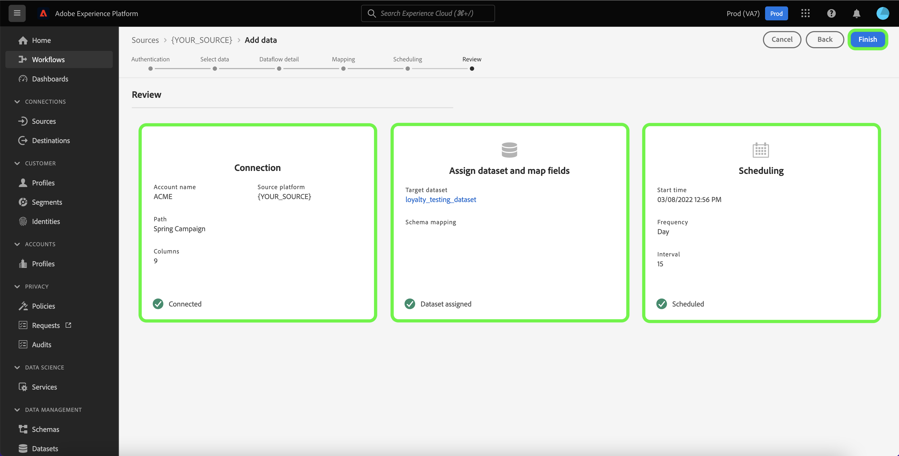

# UIで分析ソースを使用してデータフローを作成する

データフローは、ソースからAdobe Experience Platformのデータセットにデータを取得して取り込むスケジュールされたタスクです。 このチュートリアルでは、Experience Platform UIを使用してAnalytics ソースのデータフローを作成する手順を説明します。

>[!NOTE]
>
>データフローを作成するには、[!DNL Mixpanel] ソースを持つ認証済みアカウントが既に必要です。 詳しくは、[UIでの [!DNL Mixpanel]  ソース接続の作成](../../ui/create/analytics/mixpanel.md)に関するチュートリアルを参照してください。

## はじめに

このチュートリアルは、 Experience Platform の次のコンポーネントを実際に利用および理解しているユーザーを対象としています。

* [ ソース ](../../../home.md): Experience Platformを使用すると、様々なソースからデータを取り込むことができますが、[!DNL Experience Platform] サービスを使用して、着信データを構造化、ラベル付け、強化することができます。
* [[!DNL Experience Data Model (XDM)] システム](../../../../xdm/home.md)：Experience Platform が顧客体験データの整理に使用する標準化されたフレームワーク。
   * [スキーマ構成の基本](../../../../xdm/schema/composition.md)：スキーマ構成の主要な原則やベストプラクティスなど、XDM スキーマの基本的な構成要素について学びます。
   * [スキーマエディターのチュートリアル](../../../../xdm/tutorials/create-schema-ui.md)：スキーマエディター UI を使用してカスタムスキーマを作成する方法を説明します。
* [[!DNL Real-Time Customer Profile]](../../../../profile/home.md)：複数のソースからの集計データに基づいて、統合されたリアルタイムの顧客プロファイルを提供します。
* [[!DNL Data Prep]](../../../../data-prep/home.md): データ エンジニアは、Experience Data Model （XDM）との間でデータをマッピング、変換、検証できます。

<!-- 
## Add data

After creating your analytics source account, the **[!UICONTROL Add data]** step appears, providing an interface for you to explore your analytics account's table hierarchy.

* The left half of the interface is a browser, displaying a list of data tables contained in your account. The interface also includes a search option that allows you to quickly identify the source data you intend to use.
* The right half of the interface is a preview panel, allowing you to preview up to 100 rows of data.

>[!NOTE]
>
>The search source data option is available to all table-based sources excluding the Adobe Analytics, [!DNL Amazon Kinesis], and [!DNL Azure Event Hubs].

Once you find the source data, select the table, then select **[!UICONTROL Next]**.

 
-->

## データフローの詳細を入力

[!UICONTROL Dataflow detail] ページでは、既存のデータセットと新しいデータセットのどちらを使用するかを選択できます。 このプロセスでは、[!UICONTROL Profile dataset]、[!UICONTROL Error diagnostics]、[!UICONTROL Partial ingestion]、[!UICONTROL Alerts]の設定も行うことができます。

### 既存のデータセットを使用する

既存のデータセットにデータを取り込むには、**[!UICONTROL Existing dataset]**&#x200B;を選択します。 [!UICONTROL Advanced search] オプションを使用するか、ドロップダウンメニューで既存のデータセットのリストをスクロールして、既存のデータセットを取得できます。 データセットを選択したら、データフローの名前と説明を入力します。

### 新しいデータセットの使用

新しいデータセットに取り込むには、**[!UICONTROL New dataset]**&#x200B;を選択し、出力データセット名とオプションの説明を指定します。 次に、[!UICONTROL Advanced search] オプションを使用するか、ドロップダウンメニューで既存のスキーマのリストをスクロールして、マッピングするスキーマを選択します。 スキーマを選択したら、データフローの名前と説明を指定します。

### [!DNL Profile] とエラー診断の有効化

次に、**[!UICONTROL Profile dataset]** トグルを選択して、[!DNL Profile]のデータセットを有効にします。 これにより、エンティティの属性と動作の全体像を把握できます。[!DNL Profile] が有効化されたすべてのデータセットのデータは [!DNL Profile] に含まれ、変更はデータフローを保存するときに適用されます。

[!UICONTROL Error diagnostics]では、データフローで発生する誤ったレコードの詳細なエラーメッセージ生成が有効になり、[!UICONTROL Partial ingestion]では、手動で定義した特定のしきい値まで、エラーを含むデータを取り込むことができます。 詳しくは、[バッチ取り込みの概要](../../../../ingestion/batch-ingestion/partial.md)を参照してください。

### アラートの有効化

アラートを有効にすると、データフローのステータスに関する通知を受け取ることができます。リストからアラートを選択して、データフローのステータスに関する通知を受け取るよう登録します。アラートについて詳しくは、[UI を使用したソースアラートの購読](../alerts.md)についてのガイドを参照してください。

データフローへの詳細の提供が終了したら、**[!UICONTROL Next]**&#x200B;を選択します。

## XDM スキーマへのデータフィールドのマッピング

>[!IMPORTANT]
>
>動的キーペアの値を[!DNL OneTrust]からExperience Platformにオブジェクトとしてマッピングすることはできません。取り込み中にデータをマッピングするには、ターゲットスキーマでこれらのキーを指定する必要があります。

[!UICONTROL Mapping] ステップが表示され、ソーススキーマのソースフィールドをターゲットスキーマの適切なターゲット XDM フィールドにマッピングするためのインターフェイスが提供されます。

Experience Platformでは、選択したターゲットスキーマまたはデータセットに基づいて、自動マッピングされたフィールドに関するインテリジェントな推奨事項が提供されます。 マッピングルールは、ユースケースに合わせて手動で調整できます。 必要に応じて、フィールドを直接マッピングするか、データ準備機能を使用してソースデータを変換して計算値を導き出すかを選択できます。マッパーインターフェイスと計算フィールドの使用に関する包括的な手順については、[ データ準備UI ガイド ](../../../../data-prep/ui/mapping.md)を参照してください。

ソースデータが正常にマッピングされたら、**[!UICONTROL Next]**&#x200B;を選択します。

## 取り込み実行のスケジュール

[!UICONTROL Scheduling] ステップが表示され、設定されたマッピングを使用して、選択したソースデータを自動的に取り込むように取り込みスケジュールを設定できます。 デフォルトでは、スケジュールは`Once`に設定されています。 取り込み頻度を調整するには、**[!UICONTROL Frequency]**&#x200B;を選択し、ドロップダウンメニューからオプションを選択します。

>[!TIP]
>
>インターバルとバックフィルは、1回限りの取り込み中には表示されません。

取り込み頻度を`Minute`、`Hour`、`Day`、または`Week`に設定する場合は、取り込みごとに設定された時間枠を確立するための間隔を設定する必要があります。 例えば、取り込み頻度が`Day`に設定され、間隔が`15`に設定されている場合、データフローは15日ごとにデータを取り込むようにスケジュールされています。

この手順では、**バックフィル**&#x200B;を有効にし、データの増分取り込み用の列を定義することもできます。 バックフィルは履歴データの取り込みに使用され、増分取り込みのために定義した列では、新しいデータを既存のデータと区別できます。

スケジュール設定について詳しくは、次の表を参照してください。

| スケジュール設定 | 説明 |
| --- | --- |
| 頻度 | データフローを実行する頻度を指定する頻度を設定します。 頻度は次のように設定できます。 <ul><li>**1回**:1回限りの取り込みを作成するには、頻度を`once`に設定します。 1回限りの取り込みデータフローを作成する場合、間隔とバックフィルの設定は使用できません。 デフォルトでは、スケジュール頻度は1回に設定されます。</li><li>**分**:1分ごとにデータフローを取り込むようにスケジュールする頻度を`minute`に設定します。</li><li>**時間**:1時間ごとにデータを取り込むようにデータフローをスケジュールする頻度を`hour`に設定します。</li><li>**日**: 1日ごとにデータフローを取り込むようにスケジュールする頻度を`day`に設定します。</li><li>**週**：週ごとにデータフローを取り込むようにスケジュールする頻度を`week`に設定します。</li></ul> |
| 間隔 | 頻度を選択したら、インターバル設定を設定して、取り込みごとに時間枠を設定できます。 例えば、頻度を1日に設定し、間隔を15に設定した場合、データフローは15日ごとに実行されます。 間隔を0に設定することはできません。 各周波数に対して許容される最小区間値は次のとおりです。<ul><li>**1回**：なし</li><li>**分**: 15</li><li>**時間**: 1</li><li>**日**: 1</li><li>**週**: 1</li></ul> |
| 開始時間 | 予測された実行のタイムスタンプ。UTC タイムゾーンで表示されます。 |
| バックフィル | バックフィルによって、最初に取り込むデータが決まります。 バックフィルが有効になっている場合、指定したパス内のすべての現在のファイルが、最初のスケジュールされた取り込み中に取り込まれます。 バックフィルが無効になっている場合、取り込みの最初の実行時から開始時までの間に読み込まれたファイルのみが取り込まれます。 開始時刻より前に読み込まれたファイルは取り込まれません。 |
| 増分データの読み込み基準 | ソーススキーマフィールドの種類、日付、時刻がフィルタリングされたセットを持つオプション。 増分データを正しく読み込むには、**[!UICONTROL Load incremental data by]**&#x200B;用に選択したフィールドの日時の値がUTC タイムゾーンにある必要があります。 すべてのテーブルベースのバッチソースは、差分カラムのタイムスタンプ値を対応するフロー実行ウィンドウ UTC時間と比較し、UTC時間ウィンドウ内に新しいデータが見つかった場合に、ソースからデータをコピーすることで、増分データを選択します。 |

## データフローのレビュー

**[!UICONTROL Review]** ステップが表示され、新しいデータフローを作成する前に確認できます。 詳細は、次のカテゴリに分類されます。

* **[!UICONTROL Connection]**: ソースタイプ、選択したソースファイルの関連パス、およびそのソースファイル内の列の量を表示します。
* **[!UICONTROL Assign dataset & map fields]**: ソースデータが取り込まれるデータセットを表示します。これには、データセットが準拠しているスキーマも含まれます。
* **[!UICONTROL Scheduling]**：取り込みスケジュールのアクティブな期間、頻度、間隔を表示します。

データフローをレビューしたら、**[!UICONTROL Finish]**&#x200B;を選択し、データフローの作成に時間を割いてください。

## データフローの監視

データフローを作成したら、そのデータフローを通じて取り込まれるデータをモニターすると、取り込み速度、成功、エラーに関する情報を確認できます。データフローを監視する方法について詳しくは、[UIでのアカウントとデータフローの監視に関するチュートリアル ](../monitor.md)を参照してください。

## データフローの削除

**[!UICONTROL Delete]** ワークスペースで使用できる&#x200B;**[!UICONTROL Dataflows]**&#x200B;関数を使用して、不要になったデータフローや誤って作成されたデータフローを削除できます。 データフローの削除方法について詳しくは、[UI でのデータフローの削除](../delete.md)のチュートリアルを参照してください。

## 次の手順

このチュートリアルでは、Analytics ソースからExperience Platformにデータを取り込むためのデータフローを正常に作成しました。 [!DNL Real-Time Customer Profile] や [!DNL Data Science Workspace] など、ダウンストリームの [!DNL Experience Platform] サービスで受信データを使用できるようになりました。詳しくは、次のドキュメントを参照してください。

* [[!DNL Real-Time Customer Profile] 概要](../../../../profile/home.md)
* [[!DNL Data Science Workspace] 概要](../../../../data-science-workspace/home.md)

>[!WARNING]
>
> 次のビデオに示すExperience Platform UIは古くなっています。 最新の UI のスクリーンショットと機能については、上記のドキュメントを参照してください。
>
>[!VIDEO](https://video.tv.adobe.com/v/29711?quality=12&learn=on)
