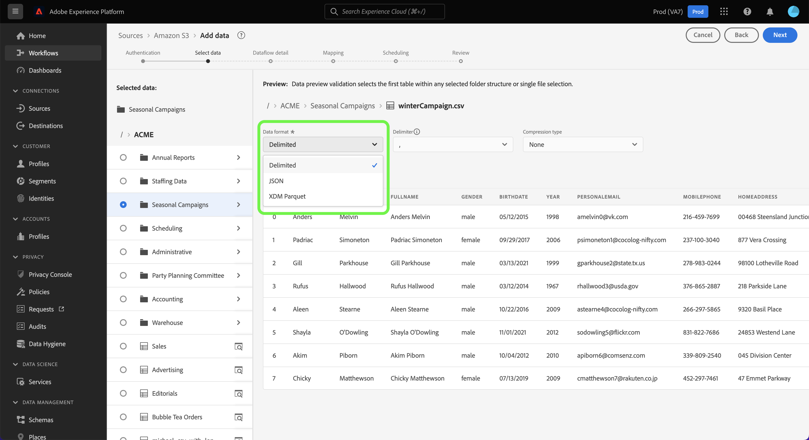
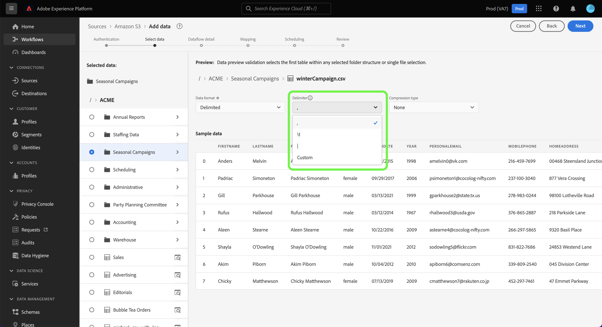
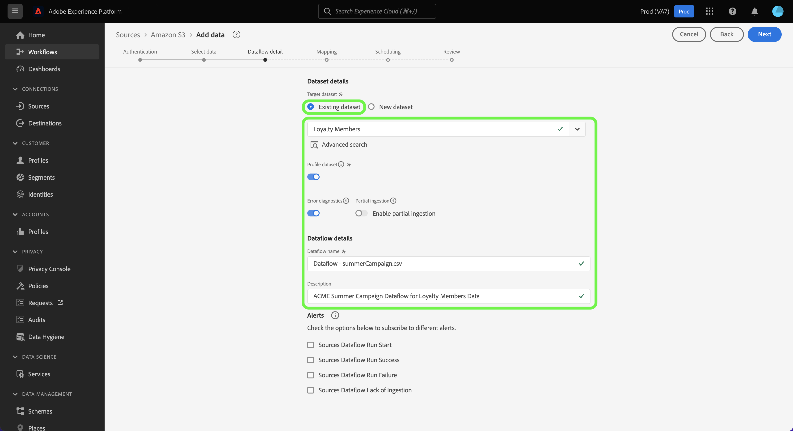

# UI でクラウドストレージソースからバッチデータを取り込むようにデータフローを設定する

このチュートリアルでは、クラウドストレージソースからAdobe Experience Platformにバッチデータを取り込むようにデータフローを設定する手順を説明します。

## はじめに

>[!NOTE]
>
>データフローを作成してクラウドストレージからバッチデータを取り込むには、認証済みのクラウドストレージソースに対するアクセス権が必要です。 アクセス権がない場合は、 [ソースの概要](../../../../home.md#cloud-storage) アカウントを作成できるクラウドストレージソースのリスト。

このチュートリアルは、 Experience Platform の次のコンポーネントを実際に利用および理解しているユーザーを対象としています。

* [[!DNL Experience Data Model (XDM)] システム](../../../../../xdm/home.md):Experience Platformが顧客体験データを整理する際に使用する標準化されたフレームワーク。
   * [スキーマ構成の基本](../../../../../xdm/schema/composition.md)：スキーマ構成の主要な原則やベストプラクティスなど、XDM スキーマの基本的な構成要素について学びます。
   * [スキーマエディターのチュートリアル](../../../../../xdm/tutorials/create-schema-ui.md)：スキーマエディター UI を使用してカスタムスキーマを作成する方法を説明します。
* [[!DNL Real-time Customer Profile]](../../../../../profile/home.md)：複数のソースからの集計データに基づいて、統合されたリアルタイムの顧客プロファイルを提供します。

### サポートされているファイル形式

バッチデータ用のクラウドストレージソースでは、次のファイル形式の取り込みがサポートされています。

* 区切り文字区切り値 (DSV):DSV 形式のデータ・ファイルの区切り文字として、任意の 1 文字の値を使用できます。
* [!DNL JavaScript Object Notation] (JSON):JSON 形式のデータファイルは、XDM に準拠している必要があります。
* [!DNL Apache Parquet]:Parquet 形式のデータファイルは、XDM に準拠している必要があります。
* 圧縮ファイル：JSON と区切り文字付きのファイルは、次のように圧縮できます。 `bzip2`, `gzip`, `deflate`, `zipDeflate`, `tarGzip`、および `tar`.

## データの追加

クラウドストレージアカウントを作成した後、 **[!UICONTROL データを追加]** の手順が表示され、クラウドストレージのファイル階層を参照し、Platform に取り込むフォルダーまたは特定のファイルを選択するためのインターフェイスが提供されます。

* インターフェイスの左側には、クラウドストレージファイル階層を表示するディレクトリブラウザーが表示されます。
* インターフェイスの右側では、互換性のあるフォルダーまたはファイルから最大 100 行のデータをプレビューできます。

ルートフォルダーを選択して、フォルダー階層にアクセスします。 ここから、1 つのフォルダーを選択して、フォルダー内のすべてのファイルを再帰的に取り込むことができます。 フォルダー全体を取り込む場合は、そのフォルダー内のすべてのファイルが同じデータ形式とスキーマを共有していることを確認する必要があります。

フォルダーを選択すると、右側のインターフェイスが更新され、選択したフォルダー内の最初のファイルのコンテンツと構造のプレビューが表示されます。

この手順の間、先に進む前に、データに対して複数の設定をおこなうことができます。 まず、「 」を選択します。 **[!UICONTROL データフォーマット]** 次に、表示されるドロップダウンパネルで、ファイルに適したデータ形式を選択します。

次の表に、サポートされているファイルタイプに適したデータ形式を示します。

| ファイルタイプ | データ形式 |
| --- | --- |
| CSV | [!UICONTROL 区切り] |
| JSON | [!UICONTROL JSON] |
| PARQUET | [!UICONTROL XDM Parquet] |

### 列の区切り文字を選択

データフォーマットを設定した後、区切りファイルを取り込む際に列区切り文字を設定できます。 を選択します。 **[!UICONTROL 区切り]** 」オプションを選択し、ドロップダウンメニューから区切り文字を選択します。 メニューには、区切り文字に最も頻繁に使用されるオプション ( コンマ (`,`)、タブ (`\t`) とパイプ (`|`) をクリックします。

カスタム区切り文字を使用する場合は、 **[!UICONTROL カスタム]** をクリックし、ポップアップ入力バーに任意の 1 文字の区切り文字を入力します。

### 圧縮ファイルの取り込み

圧縮タイプを指定して、圧縮 JSON または区切り形式のファイルを取り込むこともできます。

内 [!UICONTROL データを選択] 手順：取り込む圧縮ファイルを選択し、適切なファイルタイプと、XDM に準拠しているかどうかを選択します。 次に、 **[!UICONTROL 圧縮タイプ]** 次に、ソースデータに適した圧縮ファイルのタイプを選択します。

特定のファイルを Platform に取り込むには、フォルダーを選択し、取り込むファイルを選択します。 この手順では、ファイル名の横にあるプレビューアイコンを使用して、特定のフォルダー内にある他のファイルのファイルコンテンツをプレビューすることもできます。

終了したら、「**[!UICONTROL 次へ]**」を選択します。

## データフローの詳細を入力

[!UICONTROL データフロー詳細]ページでは、既存のデータセットと新しいデータセットのどちらを使用するかを選択できます。このプロセスの間に、データをプロファイルに取り込むように設定し、次のような設定を有効にすることもできます。 [!UICONTROL エラー診断], [!UICONTROL 部分取り込み]、および [!UICONTROL アラート].

### 既存のデータセットを使用する

データを既存のデータセットに取り込むには、**[!UICONTROL 既存のデータセット]**&#x200B;を選択します。「[!UICONTROL 詳細検索]」オプションを使用するか、ドロップダウンメニューで既存のデータセットのリストをスクロールすると、既存のデータセットを取得できます。データセットを選択したら、データフローの名前と説明を入力します。

### 新しいデータセットの使用

データを新しいデータセットに取り込むには、「**[!UICONTROL 新しいデータセット]**」を選択して、出力データセット名とオプションの説明を入力します。次に、「[!UICONTROL 詳細検索]」オプションを使用するか、ドロップダウンメニューで既存のスキーマのリストをスクロールして、マッピングするスキーマを選択します。スキーマを選択したら、データフローの名前と説明を指定します。

### プロファイルとエラー診断を有効にする

次に、 **[!UICONTROL プロファイルデータセット]** を切り替えて、プロファイルのデータセットを有効にします。 これにより、エンティティの属性と動作の全体像を把握できます。プロファイルが有効なすべてのデータセットのデータは、プロファイルに含まれ、変更はデータフローを保存する際に適用されます。

[!UICONTROL エラー診断]は、データフローで発生するエラーレコードに対して、詳細なエラーメッセージ生成を有効にします。[!UICONTROL 部分取り込み]では、手動で定義した特定のしきい値に到達するまで、エラーを含むデータを取り込むことができます。詳しくは、[バッチ取り込みの概要](../../../../../ingestion/batch-ingestion/partial.md)を参照してください。

### アラートの有効化

アラートを有効にすると、データフローのステータスに関する通知を受け取ることができます。リストからアラートを選択して、データフローのステータスに関する通知を受け取るよう登録します。アラートについて詳しくは、[UI を使用したソースアラートの購読](../../alerts.md)についてのガイドを参照してください。

データフローへの詳細の入力を終えたら「**[!UICONTROL 次へ]** 」を選択します。

## XDM スキーマへのデータフィールドのマッピング

[!UICONTROL マッピング]手順が表示され、ソーススキーマのソースフィールドを、ターゲットスキーマの適切なターゲット XDM フィールドにマッピングするためのインターフェイスが提供されます。

Platform は、選択したターゲットスキーマまたはデータセットに基づいて、自動マッピングされたフィールドに対するインテリジェントなレコメンデーションを提供します。 マッピングルールは、使用例に合わせて手動で調整できます。 必要に応じて、フィールドを直接マッピングするか、データ準備機能を使用してソースデータを変換して計算値を導き出すかを選択できます。マッパーインターフェイスと計算フィールドを使用した包括的な手順については、 [データ準備 UI ガイド](../../../../../data-prep/ui/mapping.md).

ソースデータが正常にマッピングされたら、「 」を選択します。 **[!UICONTROL 次へ]**.

## 取り込み実行のスケジュール設定

>[!IMPORTANT]
>
>を使用する際に、1 回限りの取り込みでデータフローをスケジュールすることを強くお勧めします。 [FTP ソース](../../../../connectors/cloud-storage/ftp.md).

この [!UICONTROL スケジュール] 手順が表示され、設定済みのマッピングを使用して選択したソースデータを自動的に取り込むように取り込むように、取り込みスケジュールを設定できます。 デフォルトでは、スケジュールはに設定されています。 `Once`. 取り込み頻度を調整するには、「 」を選択します **[!UICONTROL 頻度]** 次に、ドロップダウンメニューからオプションを選択します。

>[!TIP]
>
>1 回限りの取り込みでは、間隔とバックフィルは表示されません。

取り込み頻度を `Minute`, `Hour`, `Day`または `Week`を設定した場合は、取り込みのたびに設定時間枠を設定する間隔を設定する必要があります。 例えば、取り込み頻度を `Day` 間隔は `15` は、データフローが 15 日ごとにデータを取り込むようにスケジュールされていることを意味します。

この手順の間に、 **バックフィル** およびは、データの増分取り込みの列を定義します。 バックフィルは、履歴データを取り込むために使用されます。一方、増分取り込み用に定義する列では、新しいデータを既存のデータと区別することができます。

スケジュール設定について詳しくは、次の表を参照してください。

| フィールド | 説明 |
| --- | --- |
| 頻度 | 取り込みが発生する頻度。 選択可能な頻度には次のものが含まれます `Once`, `Minute`, `Hour`, `Day`、および `Week`. |
| 間隔 | 選択した頻度の間隔を設定する整数。 間隔の値は、ゼロ以外の整数で、15 以上に設定する必要があります。 |
| 開始時間 | 最初の取り込みがいつ行われるかを示す UTC タイムスタンプ。 開始時間は、現在の UTC 時間以上である必要があります。 |
| バックフィル | 最初に取り込まれるデータを決定する boolean 値です。 バックフィルが有効な場合、指定されたパス内の現在のファイルは、最初にスケジュールされた取り込み中にすべて取り込まれます。 バックフィルが無効になっている場合、取り込みの最初の実行から開始時刻までの間に読み込まれたファイルのみが取り込まれます。 開始時より前に読み込まれたファイルは取り込まれません。 |

>[!NOTE]
>
>バッチ取り込みの場合、その後のデータフローでは、ソースから取り込まれるファイルが&#x200B;**最終変更日**&#x200B;のタイムスタンプに基づいて選択されます。つまり、バッチデータフローでは、新しいフローまたは最後のフロー実行以降に変更されたファイルをソースから選択します。 また、ファイルのアップロードからフローの実行までに十分な時間がかかることを確認する必要があります。予定フローの実行時間より前に、クラウドストレージアカウントに完全にアップロードされていないファイルは取り込み対象から除外されます。

取り込みスケジュールの設定が完了したら、「 **[!UICONTROL 次へ]**.

## データフローのレビュー

**[!UICONTROL レビュー]**&#x200B;手順が表示され、新しいデータフローを作成する前に確認できます。詳細は、次のカテゴリに分類されます。

* **[!UICONTROL 接続]**:ソースのタイプ、選択したソースファイルの関連パス、およびそのソースファイル内の列数を表示します。
* **[!UICONTROL データセットの割り当てとフィールドのマッピング]**：ソースデータがどのデータセットに取り込まれるかを、そのデータセットが準拠するスキーマを含めて表示します。
* **[!UICONTROL スケジュール]**:取り込みスケジュールのアクティブな期間、頻度、間隔を表示します。

データフローをレビューしたら、「 」をクリックします。 **[!UICONTROL 完了]** とは、データフローが作成されるまでしばらく時間をかけます。

## 次の手順

このチュートリアルに従うことで、データフローを作成して、外部クラウドストレージからデータを取り込み、データセットの監視に関するインサイトを得ることができました。 データフローの作成について詳しくは、以下のビデオを見て、学習を補完できます。 さらに、受信データをダウンストリームで使用できるようになりました [!DNL Platform] 次のようなサービス： [!DNL Real-time Customer Profile] および [!DNL Data Science Workspace]. 詳しくは、次のドキュメントを参照してください。

* [[!DNL Real-time Customer Profile] 概要](../../../../../profile/home.md)
* [[!DNL Data Science Workspace] 概要](../../../../../data-science-workspace/home.md)

>[!WARNING]
>
> 次のビデオに示す [!DNL Platform] UI は旧式のものです。最新の UI のスクリーンショットと機能については、上記のドキュメントを参照してください。

>[!VIDEO](https://video.tv.adobe.com/v/29695?quality=12&learn=on)

## 付録

次の節では、ソースコネクタの操作に関する追加情報を示します。

## データフローの監視

データフローを作成したら、データフローを介して取り込まれているデータを監視して、取り込み率、成功、エラーに関する情報を表示できます。 データフローの監視方法の詳細については、次のチュートリアルを参照してください： [UI でのアカウントとデータフローの監視](../../monitor.md).

## データフローの更新

データフローのスケジュール設定、マッピング、一般情報を更新するには、次のチュートリアルを参照してください： [UI でのソースデータフローの更新](../../update-dataflows.md)

## データフローの削除

不要になったデータフローや誤って作成されたデータフローは、**[!UICONTROL データフロー]**&#x200B;ワークスペース内にある&#x200B;**[!UICONTROL 削除]**&#x200B;機能で削除できます。データフローの削除方法の詳細については、 [UI でのデータフローの削除](../../delete.md).