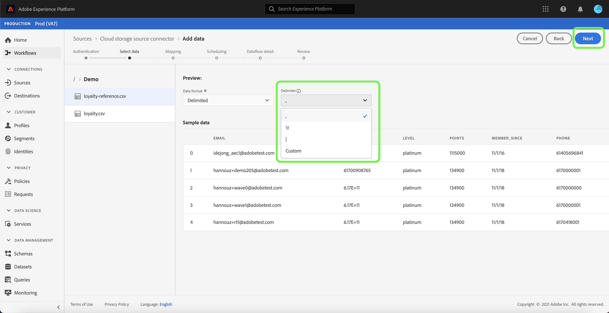

# UI でのクラウドストレージバッチ接続のデータフローの設定

データフローは、ソースからにデータを取得して取り込むスケジュール済みタスクです [!DNL Platform] データセット。 このチュートリアルでは、クラウドストレージアカウントを使用して新しいデータフローを設定する手順を説明します。

## はじめに

このチュートリアルは、Adobe Experience Platform の次のコンポーネントを実際に利用および理解しているユーザーを対象としています。

* [[!DNL Experience Data Model (XDM)] システム](../../../../../xdm/home.md):標準化されたフレームワーク [!DNL Experience Platform] は顧客体験データを整理します。
   * [スキーマ構成の基本](../../../../../xdm/schema/composition.md)：スキーマ構成の主要な原則やベストプラクティスなど、XDM スキーマの基本的な構成要素について学びます。
   * [スキーマエディターのチュートリアル](../../../../../xdm/tutorials/create-schema-ui.md):スキーマエディター UI を使用してカスタムスキーマを作成する方法を説明します。
* [[!DNL Real-time Customer Profile]](../../../../../profile/home.md)：複数のソースからの集計データに基づいて、統合されたリアルタイムの顧客プロファイルを提供します。

さらに、このチュートリアルでは、クラウドストレージアカウントを確立している必要があります。 UI で様々なクラウドストレージアカウントを作成するためのチュートリアルの一覧は、 [ソースコネクタの概要](../../../../home.md).

### サポートされているファイル形式

[!DNL Experience Platform] は、次のファイル形式を外部ストレージから取り込むことができます。

* 区切り文字区切り値 (DSV):DSV 形式のデータ・ファイルの区切り文字として、任意の 1 文字の値を使用できます。
* [!DNL JavaScript Object Notation] (JSON):JSON 形式のデータファイルは、XDM に準拠している必要があります。
* [!DNL Apache Parquet]:Parquet 形式のデータファイルは、XDM に準拠している必要があります。
* 圧縮ファイル：JSON と区切り文字付きのファイルは、次のように圧縮できます。 `bzip2`, `gzip`, `deflate`, `zipDeflate`, `tarGzip`、および `tar`.

## データを選択

クラウドストレージアカウントを作成した後、 **[!UICONTROL データを選択]** 「 」手順が表示され、クラウドストレージファイル階層を調査するためのインターフェイスが提供されます。

* インターフェイスの左側には、クラウドストレージファイルとディレクトリが表示されるディレクトリブラウザーがあります。
* インターフェイスの右側では、互換性のあるファイルから最大 100 行のデータをプレビューできます。

リストに表示されたフォルダーを選択すると、フォルダー階層をより深いフォルダーに移動できます。 1 つのフォルダーを選択して、そのフォルダー内のすべてのファイルを再帰的に取り込むことができます。 フォルダー全体を取り込む場合は、フォルダー内のすべてのファイルが同じスキーマを共有していることを確認する必要があります。

互換性のあるファイルまたはフォルダーを選択したら、対応するデータ形式を [!UICONTROL データ形式を選択] ドロップダウンメニュー。

次の表に、サポートされているファイルタイプに適したデータ形式を示します。

| ファイルタイプ | データフォーマット |
| --- | --- |
| CSV | [!UICONTROL 区切り] |
| JSON | [!UICONTROL JSON] |
| Parquet | [!UICONTROL XDM Parquet] |

選択 **[!UICONTROL JSON]** プレビューインターフェイスが設定されるまで、数秒待ちます。

>[!NOTE]
>
>区切り形式や JSON 形式のファイルとは異なり、Parquet 形式のファイルはプレビューできません。

プレビューインターフェイスを使用すると、ファイルの内容と構造を検査できます。 デフォルトでは、プレビューインターフェイスには、選択したフォルダー内の最初のファイルが表示されます。

別のファイルをプレビューするには、検査するファイル名の横にあるプレビューアイコンを選択します。

フォルダー内のファイルの内容と構造を調べたら、「 」を選択します。 **[!UICONTROL 次へ]** フォルダー内のすべてのファイルを再帰的に取り込みます。

特定のファイルを選択する場合は、取り込むファイルを選択し、「 」を選択します。 **[!UICONTROL 次へ]**.

### 区切り文字ファイルのカスタム区切り文字の設定

区切り文字ファイルの取り込み時に、カスタム区切り文字を設定できます。 を選択します。 **[!UICONTROL 区切り]** 」オプションを選択し、ドロップダウンメニューから区切り文字を選択します。 メニューには、区切り文字に最も頻繁に使用されるオプション ( コンマ (`,`)、タブ (`\t`) とパイプ (`|`) をクリックします。 カスタム区切り文字を使用する場合は、 **[!UICONTROL カスタム]** をクリックし、ポップアップ入力バーに任意の 1 文字の区切り文字を入力します。

データ形式を選択して区切り文字を設定したら、「 」を選択します。 **[!UICONTROL 次へ]**.

### 圧縮ファイルの取り込み

圧縮 JSON または区切り形式のファイルの圧縮タイプを指定して、取り込むことができます。

内 [!UICONTROL データを選択] 手順：取り込む圧縮ファイルを選択し、適切なファイルタイプと、XDM に準拠しているかどうかを選択します。 次に、 **[!UICONTROL 圧縮タイプ]** 次に、ソースデータに適した圧縮ファイルのタイプを選択します。

圧縮ファイルのタイプを識別したら、「 」を選択します。 **[!UICONTROL 次へ]** をクリックして続行します。

## XDM スキーマへのデータフィールドのマッピング

この **[!UICONTROL マッピング]** 手順が表示され、ソースデータを [!DNL Platform] データセット。 Parquet 形式のソースファイルは XDM に準拠している必要があり、手動でマッピングを設定する必要はありません。一方、CSV ファイルではマッピングを明示的に設定する必要がありますが、マッピングするソースデータフィールドを選択できます。 JSON ファイルは、XDM に対する苦情としてマークされている場合、手動での設定は必要ありません。 ただし、XDM 準拠としてマークされていない場合は、マッピングを明示的に設定する必要があります。

取り込むインバウンドデータのデータセットを選択します。 既存のデータセットを使用するか、新しく作成することができます。

**既存のデータセットを使用する**

既存のデータセットにデータを取り込むには、「 」を選択します。 **[!UICONTROL 既存のデータセット]**「 」、「 」の順に選択し、データセットアイコンを選択します。

この **[!UICONTROL データセットを選択]** ダイアログが表示されます。 使用するデータセットを見つけ、選択して、 **[!UICONTROL 続行]**.

**新しいデータセットを使用**

データを新しいデータセットに取り込むには、「 **[!UICONTROL 新しいデータセット]** をクリックし、提供されたフィールドにデータセットの名前と説明を入力します。 スキーマを追加するには、 **[!UICONTROL スキーマを選択]** ダイアログボックス または、 **[!UICONTROL スキーマの詳細検索]** をクリックして、適切なスキーマを検索します。

この手順の間に、 [!DNL Real-time Customer Profile] エンティティの属性と行動を総合的に把握できます。 すべての有効なデータセットのデータは、 [!DNL Profile] および変更は、データフローを保存する際に適用されます。

切り替え **[!UICONTROL プロファイルデータセット]** ボタンを使用して [!DNL Profile].

この **[!UICONTROL スキーマを選択]** ダイアログが表示されます。 新しいデータセットに適用するスキーマを選択し、「 」を選択します。 **[!UICONTROL 完了]**.

必要に応じて、フィールドを直接マッピングするか、データ準備関数を使用してソースデータを変換し、計算値または計算値を導出できます。 マッパーインターフェイスと計算フィールドを使用した包括的な手順については、 [データ準備 UI ガイド](../../../../../data-prep/ui/mapping.md).

JSON ファイルの場合、フィールドを他のフィールドに直接マッピングする以外に、他のオブジェクトや配列にオブジェクトを直接マッピングできます。また、クラウドのストレージソースコネクタを使用して、JSON ファイル内の配列などの複雑なデータ型をプレビューおよびマッピングできます。

異なるタイプ間でマッピングすることはできません。 例えば、オブジェクトを配列やフィールドにマッピングすることはできません。

>[!TIP]
>
>Platform は、選択したターゲットスキーマまたはデータセットに基づいて、自動マッピングされたフィールドに対するインテリジェントなレコメンデーションを提供します。 マッピングルールは、使用例に合わせて手動で調整できます。

選択 **[!UICONTROL データをプレビュー]** ：選択したデータセットから最大 100 行のサンプルデータのマッピング結果を確認します。

プレビュー中、ID 列は、マッピング結果を検証する際に必要な重要な情報なので、最初のフィールドとして優先付けされます。

ソースデータをマッピングしたら、 **[!UICONTROL 閉じる]**.

## 取り込み実行のスケジュール設定

この **[!UICONTROL スケジュール]** 手順が表示され、設定済みのマッピングを使用して選択したソースデータを自動的に取り込むように取り込むように、取り込みスケジュールを設定できます。 次の表に、スケジュール設定用の様々な設定可能フィールドの概要を示します。

| フィールド | 説明 |
| --- | --- |
| 頻度 | 選択可能な頻度には次のものが含まれます `Once`, `Minute`, `Hour`, `Day`、および `Week`. |
| 間隔 | 選択した頻度の間隔を設定する整数。 |
| 開始時間 | 最初の取り込みがいつ行われるかを示す UTC タイムスタンプ。 |
| バックフィル | 最初に取り込まれるデータを決定する boolean 値です。 If **[!UICONTROL バックフィル]** が有効になっている場合、指定されたパス内の現在のすべてのファイルが、最初にスケジュールされた取り込み中に取り込まれます。 If **[!UICONTROL バックフィル]** が無効になっている場合は、最初の取り込み実行から開始時刻までの間に読み込まれたファイルのみが取り込まれます。 開始時より前に読み込まれたファイルは取り込まれません。 |

データフローは、スケジュールに従ってデータを自動的に取り込むように設計されています。 まず、取り込み頻度を選択します。 次に、2 つのフロー実行の間隔を指定する間隔を設定します。 間隔の値は、ゼロ以外の整数で、15 以上に設定する必要があります。

取り込みの開始時間を設定するには、開始時間ボックスに表示される日時を調整します。 または、カレンダーアイコンを選択して開始時間の値を編集できます。 開始時刻は、UTC での現在の時刻以上である必要があります。

スケジュールの値を指定し、 **[!UICONTROL 次へ]**.

>[!NOTE]
>
>バッチ取り込みの場合、その後のデータフローでは、それぞれの **最終変更日** タイムスタンプ。 つまり、バッチデータフローでは、新しいフローまたは最後のフロー実行以降に変更されたファイルをソースから選択します。 また、ファイルのアップロードからフローの実行までに十分な時間がかかることを確認する必要があります。予定フローの実行時間より前に、クラウドストレージアカウントに完全にアップロードされていないファイルは取り込み対象から除外されます。

### 1 回限りの取り込みデータフローの設定

1 回限りの取り込みを設定するには、「頻度」ドロップダウン矢印を選択し、「 **[!UICONTROL 1 回]**. 開始時間が将来になる限り、1 回限りの頻度で取り込むためにデータフローセットを引き続き編集できます。 開始時間が過ぎると、1 回限りの頻度の値は編集できなくなります。 **[!UICONTROL 間隔]** および **[!UICONTROL バックフィル]** は、1 回限りの取り込みデータフローの設定時には表示されません。

>[!IMPORTANT]
>
>を使用する際に、1 回限りの取り込みでデータフローをスケジュールすることを強くお勧めします。 [FTP コネクタ](../../../../connectors/cloud-storage/ftp.md).

スケジュールに適切な値を指定したら、「 」を選択します。 **[!UICONTROL 次へ]**.

## データフローの詳細を入力

この **[!UICONTROL データフローの詳細]** 手順が表示され、新しいデータフローに名前を付け、簡単な説明を入力できます。

このプロセスの間に、 **[!UICONTROL 部分取り込み]** および **[!UICONTROL エラー診断]**. 有効化 **[!UICONTROL 部分取り込み]** では、設定可能なしきい値まで、エラーを含むデータを取り込むことができます。 有効化 **[!UICONTROL エラー診断]** は、別々にバッチ処理される誤ったデータの詳細を提供します。 詳しくは、 [部分バッチ取得の概要](../../../../../ingestion/batch-ingestion/partial.md).

データフローの値を指定し、「 」を選択します。 **[!UICONTROL 次へ]**.

## データフローの確認

この **[!UICONTROL レビュー]** 手順が表示され、新しいデータフローを作成する前に確認できます。 詳細は、次のカテゴリに分類されます。

* **[!UICONTROL 接続]**:ソースのタイプ、選択したソースファイルの関連パス、およびそのソースファイル内の列数を表示します。
* **[!UICONTROL データセットの割り当てとフィールドのマッピング]**:データセットが準拠するスキーマを含め、ソースデータの取り込み先のデータセットを示します。
* **[!UICONTROL スケジュール]**:取り込みスケジュールのアクティブな期間、頻度、間隔を表示します。

データフローをレビューしたら、「 」をクリックします。 **[!UICONTROL 完了]** とは、データフローが作成されるまでしばらく時間をかけます。

## データフローの監視

データフローを作成したら、そのデータフローを通じて取り込まれるデータを監視して、取り込み率、成功、エラーに関する情報を確認できます。 データフローの監視方法の詳細については、 [UI でのアカウントとデータフローの監視](../../monitor.md).

## データフローを削除

不要になったデータフローや、 **[!UICONTROL 削除]** 関数 **[!UICONTROL データフロー]** ワークスペース。 データフローの削除方法の詳細については、 [UI でのデータフローの削除](../../delete.md).

## 次の手順

このチュートリアルに従うことで、データフローを作成して、外部クラウドストレージからデータを取り込み、データセットの監視に関するインサイトを得ることができました。 データフローの作成について詳しくは、以下のビデオを見て、学習を補完できます。 さらに、受信データをダウンストリームで使用できるようになりました [!DNL Platform] 次のようなサービス： [!DNL Real-time Customer Profile] および [!DNL Data Science Workspace]. 詳しくは、次のドキュメントを参照してください。

* [[!DNL Real-time Customer Profile] の概要](../../../../../profile/home.md)
* [[!DNL Data Science Workspace] の概要](../../../../../data-science-workspace/home.md)

>[!WARNING]
>
> 次のビデオに示す [!DNL Platform] UI は古くなっています。最新の UI のスクリーンショットと機能については、上記のドキュメントを参照してください。

>[!VIDEO](https://video.tv.adobe.com/v/29695?quality=12&learn=on)

## 付録

次の節では、ソースコネクタの操作に関する追加情報を示します。

### データフローの無効化

データフローを作成すると、そのデータフローは直ちにアクティブになり、指定されたスケジュールに従ってデータを取り込みます。 以下の手順に従うことで、いつでもアクティブなデータフローを無効にできます。

内 **[!UICONTROL ソース]** ワークスペースで、 **[!UICONTROL 参照]** タブをクリックします。 次に、無効にするアクティブなデータフローに関連付けられているアカウントの名前をクリックします。

この **[!UICONTROL ソースアクティビティ]** ページが表示されます。 リストからアクティブなデータフローを選択して、開きます。 **[!UICONTROL プロパティ]** 」列が表示されます ( この列には **[!UICONTROL 有効]** 切り替えボタン。 切り替えボタンをクリックして、データフローを無効にします。 同じ切り替えを使用して、無効にした後でデータフローを再度有効にすることができます。

### のインバウンドデータをアクティブ化 [!DNL Profile] 母集団

ソースコネクタからの受信データは、 [!DNL Real-time Customer Profile] データ。 の [!DNL Real-time Customer Profile] データについては、次のチュートリアルを参照してください： [プロファイル母集団](../../profile.md).
