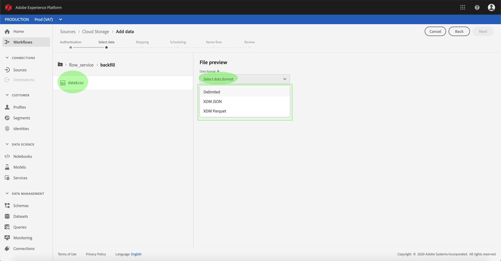
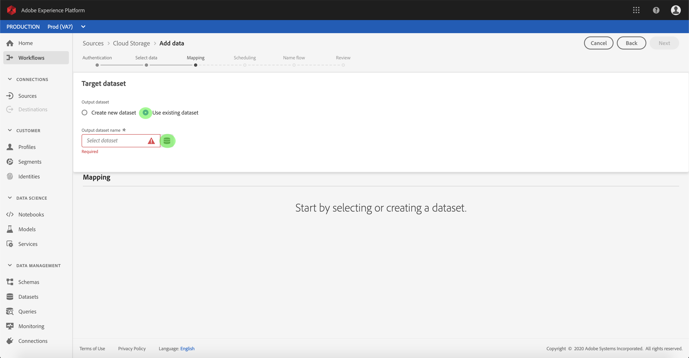
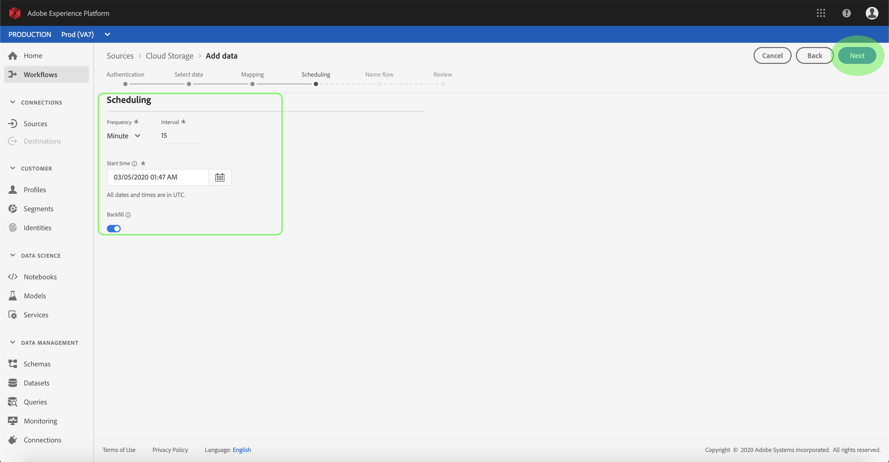
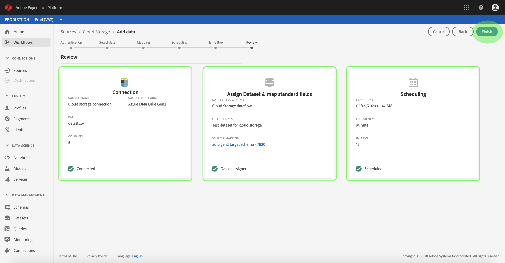
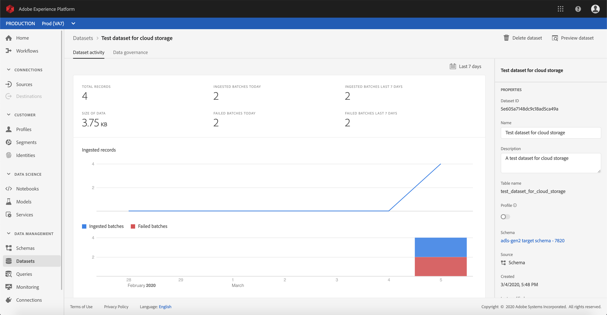

# UIでのクラウドストレージコネクタのデータフローの設定

データフローとは、ソースからタスクデータセットにデータを取得し、取り込むスケジュール済みのプラットフォームです。 このチュートリアルでは、クラウドのデータベースコネクタを使用して新しいデータフローをストレージする手順を説明します。

## はじめに

このチュートリアルでは、Adobe Experience Platformの次のコンポーネントについて、十分な理解を得る必要があります。

* [Experience Data Model(XDM)System](../../../../xdm/home.md):エクスペリエンスプラットフォームが顧客エクスペリエンスデータを整理するための標準化されたフレームワーク。
   * [スキーマ構成の基本](../../../../xdm/schema/composition.md):XDMスキーマの基本的な構成要素について説明します。この中には、主な原則や構成のベストプラクティスが含まれています。スキーマ構成の基本要素です。
   * [スキーマエディタのチュートリアル](../../../../xdm/tutorials/create-schema-ui.md):カスタムスキーマを作成する方法についてスキーマエディターのUI。
* [リアルタイム顧客プロファイル](../../../../profile/home.md):複数のソースからの集計データに基づいて、統合されたリアルタイムのプロファイルを顧客に提供します。

また、このチュートリアルでは、既にクラウドストレージコネクタを作成済みです。 UIで異なるクラウドストレージコネクタを作成するためのチュートリアルのリストは、ソースコネクタの概要 [を参照してくださ](../../../home.md)い。

### サポートされているファイル形式

Experience Platformは、外部プラットフォームから取り込む次のファイル形式をサポートしています。ストレージ

* 区切り文字区切り値(DSV):DSV形式のデータ・ファイルのサポートは、現在、コンマ区切り値に制限されています。 DSV形式のファイル内のフィールド・ヘッダーの値は、英数字とアンダースコアのみで構成する必要があります。 将来、一般的なDSVファイルのサポートが提供されます。
* JavaScript Object Notation (JSON):JSON形式のデータファイルはXDMに準拠している必要があります。
* Apache Parket:パーケ形式のデータファイルはXDMに準拠している必要があります。

## データの選択

クラウドストレージコネクタを作成すると、 *Select data* （データの選択）ステップが表示され、クラウドストレージの階層を調べるためのインタラクティブなインターフェイスが提供されます。

* インターフェイスの左半分はディレクトリブラウザで、サーバーのファイルとディレクトリが表示されます。
* インターフェイスの右半分を使用すると、互換性のあるファイルから最大100行のプレビューを取得できます。

一覧のフォルダーをクリックすると、フォルダー階層をより深いフォルダーに移動できます。 互換性のあるファイルまたはフォルダを選択すると、[ **Select data format** ]ドロップダウンが表示され、データを表示する形式をプレビューウィンドウで選択できます。

プレビューウィンドウが表示されたら、「 **Next** 」をクリックして、選択したフォルダ内のすべてのファイルをアップロードできます。 特定のファイルにアップロードする場合は、「次へ」をクリックする前に、リストからそのファイルを選択 **します**。

>[!NOTE] CSV、JSON、Parketなどのファイル形式がサポートされています。 JSONファイルとParketファイルはXDMに準拠している必要があります。

## データフィールドのXDMへのマッピングスキーマ

マッピ *ング手順が表示され* 、ソースデータをプラットフォームデータセットにマッピングするインタラクティブなインターフェイスが提供されます。 JSONまたはParquet形式のソースファイルはXDMに準拠している必要があり、手動でマッピングを設定する必要はありません。 逆に、CSVファイルでは、マッピングを明示的に設定する必要がありますが、マッピングするソースデータフィールドを選択できます。

取り込む受信データのデータセットを選択します。 既存のデータセットを使用するか、新しいデータセットを作成できます。

**既存のデータセットの使用**

既存のデータセットにデータを取り込むには、「既存のデータセッ **トを使用」を選択し**、データセットアイコンをクリックします。

データセッ _トの選択_ ダイアログが表示されます。 使用するデータセットを探し、選択して「続行」をクリック **します**。

**新しいデータセットの使用**

データを新しいデータセットに取り込むには、「 **Create new dataset** 」を選択し、表示されるフィールドにデータセットの名前と説明を入力します。 次に、アイコンをスキーマします。

[ _スキーマ_ ]ダイアログが表示されます。 新しいスキーマセットに適用するデータセットを選択し、「完了」をクリッ **クしま**&#x200B;す。

必要に応じて、フィールドを直接マップするか、マッパー関数を使用してソースデータを変換し、計算値または計算値を抽出することができます。 データマッピングおよびマッパーの機能について詳しくは、CSVデータのXDMスキーマフィールドへのマッピ [ングに関するチュートリアルを参照してくださ](../../../../ingestion/tutorials/map-a-csv-file.md)い。

ソースデータがマッピングされたら、「 **Next**」をクリックします。

## インジェストの実行のスケジュール

[スケジ *ュール* ]ステップが表示され、設定済みのマッピングを使用して選択したソースデータを自動的に取り込むように取り込みスケジュールを設定できます。 次の表に、スケジュールの様々な設定可能フィールドの概要を示します。

| フィールド | 説明 |
| --- | --- |
| 頻度 | 選択可能な頻度には、分、時間、日、週があります。 |
| 間隔 | 選択した頻度の間隔を設定する整数。 |
| 開始時間 | 最初の取り込みが発生するUTCタイムスタンプ。 |
| バックフィル | 最初に取り込むデータを決定するboolean値です。 [バッ *クフィル* ]が有効な場合、指定したパス内の現在のファイルは、最初にスケジュールされたインジェスト中にすべてインジェストされます。 [バッ *クフィル* ]を無効にすると、最初のインジェスト実行から *開始時間の間に読み込まれたファイルのみが取り込まれます* 。 読み込まれたファイルは *開始時間* （秒）より前に読み込まれるので、取り込まれません。 |

データフローは、スケジュールに基づいてデータを自動的に取り込むように設計されています。 このワークフローを1回だけ取り込む場合は、 **Frequency** （頻度）を「Day」（日）に設定し、 **Interval（間隔）に非常に大きな数（10000など）を適用することで取り込むことができます**。

スケジュールの値を指定し、「 **Next**」をクリックします。

## データフローに名前を付ける

名前フ *ロー手順が表示され* 、新しいデータフローに名前を付け、簡単に説明を付けることができます。

データフローの値を指定し、「 **Next**」をクリックします。

### データフローの確認

「 *Review* 」手順が表示され、新しいデータフローを作成する前に確認できます。 詳細は、次のカテゴリでグループ化されます。

* *ソースの詳細*:ソースの種類、選択したソースファイルの関連パス、およびそのソースファイル内の列数を表示します。
* *ターゲットの詳細*:データセットが適合するスキーマを含む、ソースデータの取り込み先のデータセットを示します。
* *スケジュールの詳細*:取り込みスケジュールのアクティブな期間、頻度、間隔を表示します。

データフローを確認したら、「 **Finish** 」をクリックし、データフローを作成する時間を設定します。

## データフローの監視

クラウドストレージのデータフローが作成されたら、データを通じて取り込まれるデータを監視できます。 次の手順に従って、データフローのデータセットモニターにアクセスします。

ソースワー *クスペース内で* 、「参照」タブをク **リックして** 、ベース接続をリストします。 表示されたリストで、監視するデータフローを含む接続を探し、名前をクリックします。

ソース *アクティビティ* 画面が表示されます。 ここから、監視するデータセットのアクティビティ名をクリックします。

データセッ *トアクティビティ* 画面が表示されます。 このページには、グラフの形で消費されるメッセージの割合が表示されます。

グラフの下に、データセットに取り込まれたバッチのリストが表示され、そのステータス（成功または失敗）と取り込まれたレコード数が示されます。 バッチがプロファイル対応のデータセットに取り込まれると、取り込まれたプロファイルとIDの数が表示されます。

一覧表示された表示のIDをクリックして、その他の詳細情報を選択できます。

データセットの監視と取り込みの詳細については、ストリーミングデータフローの監視に関するチュートリ [アルを参照してくださ](../../../../ingestion/quality/monitor-data-flows.md)い。

## 次の手順

このチュートリアルに従うと、外部のクラウドストレージからデータを取り込むためのデータフローが正しく作成され、データセットの監視に関する洞察が得られます。 受信データは、リアルタイム顧客情報やData Science Workspaceなどのダウンストリームプラットフォームサービスで使用できるようになりました。 詳しくは、次のドキュメントを参照してください。

* [リアルタイム顧客プロファイルの概要](../../../../profile/home.md)
* [Data Science Workspaceの概要](../../../../data-science-workspace/home.md)

## 付録

次の節では、ソースコネクタの操作に関する追加情報を示します。

### データフローの無効化

データフローが作成されると、そのデータフローはすぐにアクティブになり、指定されたスケジュールに従ってデータを取り込みます。 アクティブなデータフローは、次の手順に従っていつでも無効にできます。

ソースワー *クスペース* で、「参照」タブをク **リックします** 。 次に、無効にするアクティブなデータフローに関連付けられているベース接続の名前をクリックします。

「ソース *アクティビティ* 」ページが表示されます。 アクティブなデータフローをリストから選択し、 *Properties* （プロパティ）列を画面の右側に開きます。この列には「 **Enabled** 」切り替えボタンが含まれています。 切り替えボタンをクリックして、データフローを無効にします。 同じ切り替えを使用して、データフローを無効にした後で再び有効にすることができます。

### プロファイル母集団の受信データの有効化

ソースコネクタからの受信データは、リアルタイム顧客データを豊富にし、埋め込むために使用できます。プロファイルは、 実際の顧客データの入力に関する詳細は、プロファイルの入力に関するチュートリアルを参照 [してください](../profile.md)。
