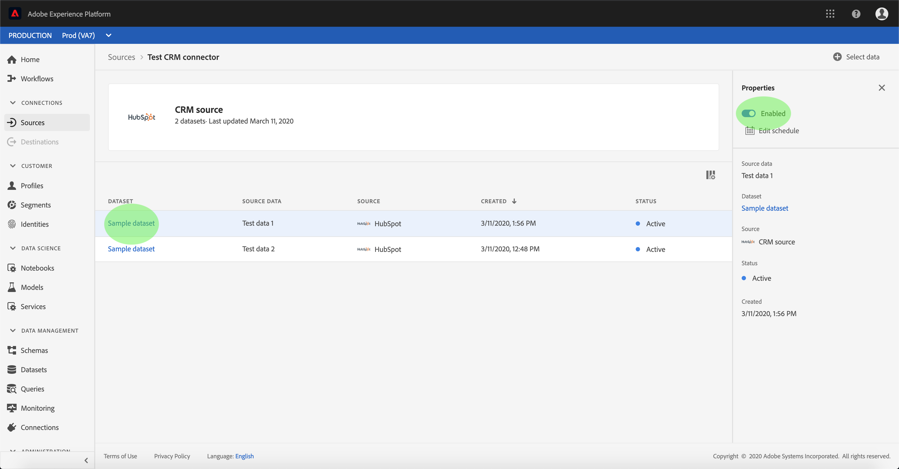

# UIでのCRMコネクタのデータフローの設定

データフローとは、ソースからデータセットにデータを取得し、取り込むスケジュール済みのタスク [!DNL Platform] です。 このチュートリアルでは、CRMコネクタを使用して新しいデータフローを設定する手順を説明します。

## はじめに

このチュートリアルは、Adobe Experience Platform の次のコンポーネントを実際に利用および理解しているユーザーを対象としています。

* [エクスペリエンスデータモデルl（XDM）システム](../../../../xdm/home.md)[!DNL Experience Platform]： が顧客体験データを整理するための標準化されたフレームワークです。
   * [スキーマ構成の基本](../../../../xdm/schema/composition.md)：スキーマ構成の主要な原則やベストプラクティスなど、XDM スキーマの基本的な構成要素について学びます。
   * [スキーマエディタのチュートリアル](../../../../xdm/tutorials/create-schema-ui.md): スキーマエディターのUIを使用してカスタムスキーマを作成する方法を説明します。
* [リアルタイム顧客プロファイル](../../../../profile/home.md)：複数のソースから集約されたデータに基づいて、統合されたリアルタイムのコンシューマープロファイルを提供します。

さらに、このチュートリアルでは、CRMコネクタを既に作成済みである必要があります。 UIで異なるCRMコネクタを作成するためのチュートリアルのリストは、 [ソースコネクタの概要](../../../home.md)。

## データの選択

CRMコネクタの作成後、 *データの選択* 手順が表示され、ファイル階層を調べるためのインタラクティブインターフェイスが提供されます。

* インターフェイスの左半分はディレクトリブラウザーで、サーバーのファイルとディレクトリが表示されます。
* インターフェイスの右半分を使用すると、互換性のあるファイルから最大100行のデータをプレビューできます。

使用するディレクトリを選択し、「 **[!UICONTROL 次へ]**」をクリックします。

## データフィールドのXDMスキーマへのマッピング

「 *マッピング* 」の手順が表示され、ソースデータをデータセットにマッピングするインタラクティブなインターフェイスが提供され [!DNL Platform] ます。

取り込む受信データのデータセットを選択します。 既存のデータセットを使用することも、新しいデータセットを作成することもできます。

### 既存のデータセットを使用する

既存のデータセットにデータを取り込むには、「 **[!UICONTROL Use existing dataset]**」を選択し、データセットアイコンをクリックします。

The _Select dataset_ dialog appears. 使用するデータセットを見つけて選択し、「 **[!UICONTROL 続行]**」をクリックします。

### 新しいデータセットの使用

データを新しいデータセットに取り込むには、「 **[!UICONTROL 新しいデータセットを]** 作成」を選択し、表示されるフィールドにデータセットの名前と説明を入力します。 次に、スキーマアイコンをクリックします。

The _Select schema_ dialog appears. 新しいデータセットに適用するスキーマを選択し、「 **[!UICONTROL 完了]**」をクリックします。

必要に応じて、フィールドを直接マップするか、マッパー関数を使用してソースデータを変換し、計算値や計算値を抽出することができます。 データマッピングおよびマッパーの機能について詳しくは、CSVデータのXDMスキーマフィールドへの [マッピングに関するチュートリアルを参照してください](../../../../ingestion/tutorials/map-a-csv-file.md)。

ソースデータがマッピングされたら、「 **[!UICONTROL 次へ]**」をクリックします。

## インジェストのスケジュール設定

[ *[!UICONTROL スケジュール]* ]ステップが表示され、設定済みのマッピングを使用して選択したソースデータを自動的に取り込むように取り込みスケジュールを設定できます。 次の表に、スケジュール設定用の様々な設定可能フィールドの概要を示します。

| フィールド | 説明 |
| --- | --- |
| 頻度 | 選択可能な頻度には、1回、分、時間、日、週があります。 |
| 間隔 | 選択した頻度の間隔を設定する整数。 |
| 開始時間 | 最初の取り込みがいつ行われるかを示すUTCタイムスタンプ。 |
| 埋め戻し | 最初に取り込まれるデータを決定するboolean値です。 [ *バックフィル* ]を有効にすると、指定したパスにある現在のファイルは、最初にスケジュールされた取り込み中にすべて取り込まれます。 [ *バックフィル* ]を無効にすると *、最初の取り込み実行から* 開始時間の間に読み込まれたファイルだけが取り込まれます。 *開始時間より前に読み込まれたファイルは取り込まれません* 。 |
| 差分列 | タイプ、日付または時間のフィルターされたソーススキーマフィールドセットを含むオプションです。 このフィールドは、新規データと既存データを区別するために使用します。 増分データは、選択した列のタイムスタンプに基づいて取り込まれます。 |

データフローは、スケジュールに基づいてデータを自動的に取り込むように設計されています。 開始するには、取り込み頻度を選択します。 次に、2つのフローの実行間隔を指定する間隔を設定します。 間隔の値は、0以外の整数で、15以上に設定する必要があります。

取り込みの開始時間を設定するには、開始時間ボックスに表示される日時を調整します。 または、カレンダーアイコンを選択して、開始時間の値を編集することもできます。 開始時刻は、現在のUTC時刻以上にする必要があります。

「 **[!UICONTROL Load incremental data by]** 」を選択して、delta列を割り当てます。 このフィールドは、新規データと既存データの区別を示します。

### 1回のみの取り込みデータフローの設定

1回のみの取り込みを設定するには、頻度ドロップダウン矢印を選択し、「 **[!UICONTROL 1回]**」を選択します。

>[!TIP] **[!UICONTROL 1回限りの取り込みでは]** 、Intervalと **[!UICONTROL Backfill]** は表示されません。

スケジュールに適切な値を入力したら、「 **[!UICONTROL 次へ]**」を選択します。

## データフローに名前を付ける

「 *名前フロー* 」ステップが表示されます。このステップでは、データフローの名前とオプションの説明を指定する必要があります。 終了したら「**[!UICONTROL 次へ]**」をクリックします。

## データフローの確認

「 *レビュー* 」ステップが表示され、新しいデータフローを作成前に確認できます。 詳細は次のカテゴリに分類されます。

* *[!UICONTROL 接続の詳細]*: ソースの種類、選択したソースファイルの関連パス、およびそのソースファイル内の列数が表示されます。
* *[!UICONTROL マッピングの詳細]*: ソースデータが取り込まれるデータセット(データセットに従うスキーマなど)を示します。
* *[!UICONTROL スケジュールの詳細]*: 取り込みスケジュールの有効期間、頻度、間隔を表示します。

データフローをレビューしたら、 **[!UICONTROL 「Finish]** 」をクリックし、データフローを作成するまでの時間を設定します。

## データフローの監視と削除

データフローを作成したら、データフローを介して取り込まれるデータを監視できます。 データフローの監視および削除方法の詳細については、「データフローの [監視および削除に関するチュートリアル](../monitor.md)」を参照してください。

## 次の手順

このチュートリアルに従うと、データフローを正しく作成してCRMからデータを取り込み、監視データセットに関する洞察を得ることができます。 データフローの作成について詳しくは、以下のビデオを参照して学習を補うことができます。 また、入力データは、やなどの下流の [!DNL Platform] サービスで使用でき [!DNL Real-time Customer Profile] るようになり [!DNL Data Science Workspace]ました。 詳しくは、次のドキュメントを参照してください。

* [リアルタイム顧客プロファイルの概要](../../../../profile/home.md)
* [Data Science ワークスペースの概要](../../../../data-science-workspace/home.md)

>[!WARNING]
>
> 次のビデオに示す [!DNL Platform] UIは古いです。 最新のUIのスクリーンショットと機能については、上記のドキュメントを参照してください。

>[!VIDEO](https://video.tv.adobe.com/v/29711?quality=12&learn=on)

## 付録

以下の節では、ソースコネクタを使用する場合の追加情報について説明します。

### データフローの無効化

データフローが作成されると、そのデータはすぐにアクティブになり、指定されたスケジュールに従ってデータを取り込みます。 アクティブなデータフローは、次の手順に従っていつでも無効にできます。

認証 *[!UICONTROL 画面で]* 、無効にするデータフローに関連付けられているベース接続の名前を選択します。

「 _ソースアクティビティ_ 」ページが表示されます。 リストからアクティブなデータフローを選択し、画面の右側に *[!UICONTROL 「Properties]* 」列を開きます。この列には「 **[!UICONTROL Enabled]** 」トグル・ボタンが含まれています。 切り替えボタンをクリックして、データフローを無効にします。 同じ切り替えを使用して、データフローを無効にした後で再び有効にできます。

### 母集団の受信データを有効にし [!DNL Profile] ます

ソースコネクタから受信するデータは、データの富化と埋め込みに使用でき [!DNL Real-time Customer Profile] ます。 データの入力について詳しくは、 [!DNL Real-time Customer Profile][プロファイルの入力に関するチュートリアルを参照してください](../profile.md)。