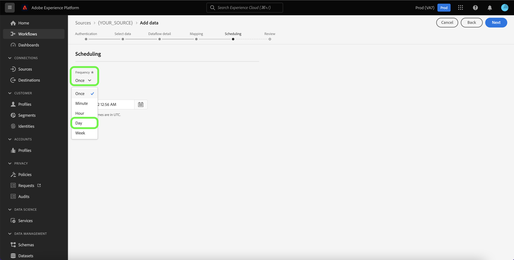

# UI の CRM ソースを使用したデータフローの作成

データフローは、ソースからAdobe Experience Platformのデータセットにデータを取得して取り込む、スケジュールされたタスクです。 このチュートリアルでは、Experience Platform UI を使用して CRM （Customer Relationship Management）ソースのデータフローを作成する手順を説明します。

>[!NOTE]
>
>* データフローを作成するには、CRM ソースとの認証済みアカウントが必要です。 UI で様々な CRM ソースアカウントを作成するチュートリアルのリストについては、[ ソースの概要 ](../../../home.md#crm) を参照してください。
>* Experience Platformでデータを取り込むには、すべてのテーブルベースのバッチソースのタイムゾーンを UTC に設定する必要があります。

## はじめに

このチュートリアルは、 Experience Platform の次のコンポーネントを実際に利用および理解しているユーザーを対象としています。

* [ ソース ](../../../home.md):Experience Platformを使用すると、データを様々なソースから取得しながら、[!DNL Experience Platform] サービスを使用して受信データの構造化、ラベル付け、拡張を行うことができます。
* [[!DNL Experience Data Model (XDM)] システム](../../../../xdm/home.md)：Experience Platform が顧客体験データの整理に使用する標準化されたフレームワーク。
   * [スキーマ構成の基本](../../../../xdm/schema/composition.md)：スキーマ構成の主要な原則やベストプラクティスなど、XDM スキーマの基本的な構成要素について学びます。
   * [スキーマエディターのチュートリアル](../../../../xdm/tutorials/create-schema-ui.md)：スキーマエディター UI を使用してカスタムスキーマを作成する方法を説明します。
* [[!DNL Real-Time Customer Profile]](../../../../profile/home.md)：複数のソースからの集計データに基づいて、統合されたリアルタイムの顧客プロファイルを提供します。
* [[!DNL Data Prep]](../../../../data-prep/home.md)：データエンジニアが Experience Data Model （XDM）との間でデータのマッピング、変換、検証をおこなえるようにします。

## データの追加

CRM ソースアカウントを作成すると、**[!UICONTROL データを追加]** 手順が表示され、CRM アカウントのテーブル階層を調べるためのインターフェイスが表示されます。

* インターフェイスの左半分はブラウザーで、アカウントに含まれるデータテーブルのリストが表示されます。 このインターフェイスには、使用するソースデータをすばやく識別できる検索オプションも含まれています。
* インターフェイスの右半分はプレビューパネルであり、最大 100 行のデータをプレビューできます。

>[!NOTE]
>
>「ソースデータを検索」オプションは、Adobe Analytics、[!DNL Amazon Kinesis]、[!DNL Azure Event Hubs] を除くすべてのテーブルベースのソースで使用できます。

ソースデータが見つかったら、テーブルを選択して、「**[!UICONTROL 次へ]**」を選択します。

## データフローの詳細を入力

[!UICONTROL データフロー詳細]ページでは、既存のデータセットと新しいデータセットのどちらを使用するかを選択できます。このプロセスでは、[!UICONTROL プロファイルデータセット]、[!UICONTROL エラー診断]、[!UICONTROL 部分取り込み]、および[!UICONTROL アラート]の設定も指定できます。

### 既存のデータセットを使用する

データを既存のデータセットに取り込むには、**[!UICONTROL 既存のデータセット]**&#x200B;を選択します。「[!UICONTROL 詳細検索]」オプションを使用するか、ドロップダウンメニューで既存のデータセットのリストをスクロールすると、既存のデータセットを取得できます。データセットを選択したら、データフローの名前と説明を入力します。

### 新しいデータセットの使用

データを新しいデータセットに取り込むには、「**[!UICONTROL 新しいデータセット]**」を選択して、出力データセット名とオプションの説明を入力します。次に、「[!UICONTROL 詳細検索]」オプションを使用するか、ドロップダウンメニューで既存のスキーマのリストをスクロールして、マッピングするスキーマを選択します。スキーマを選択したら、データフローの名前と説明を指定します。

### [!DNL Profile] とエラー診断の有効化

次に、 **[!UICONTROL プロファイルデータセット]**&#x200B;切り替えスイッチを選択して、[!DNL Profile] のデータセットを有効にします。これにより、エンティティの属性と動作の全体像を把握できます。[!DNL Profile] が有効化されたすべてのデータセットのデータは [!DNL Profile] に含まれ、変更はデータフローを保存するときに適用されます。

[!UICONTROL エラー診断]は、データフローで発生するエラーレコードに対して、詳細なエラーメッセージ生成を有効にします。[!UICONTROL 部分取り込み]では、手動で定義した特定のしきい値に到達するまで、エラーを含むデータを取り込むことができます。詳しくは、[バッチ取り込みの概要](../../../../ingestion/batch-ingestion/partial.md)を参照してください。

### アラートの有効化

アラートを有効にすると、データフローのステータスに関する通知を受け取ることができます。リストからアラートを選択して、データフローのステータスに関する通知を受け取るよう登録します。アラートについて詳しくは、[UI を使用したソースアラートの購読](../alerts.md)についてのガイドを参照してください。

データフローへの詳細の入力を終えたら「**[!UICONTROL 次へ]** 」を選択します。

## XDM スキーマへのデータフィールドのマッピング

[!UICONTROL マッピング]手順が表示され、ソーススキーマのソースフィールドを、ターゲットスキーマの適切なターゲット XDM フィールドにマッピングするためのインターフェイスが提供されます。

Experience Platformは、選択したターゲットスキーマまたはデータセットに基づいて、自動マッピングされたフィールドに対してインテリジェントなレコメンデーションを提供します。 マッピングルールは、ユースケースに合わせて手動で調整できます。 必要に応じて、フィールドを直接マッピングするか、データ準備機能を使用してソースデータを変換して計算値を導き出すかを選択できます。マッパーインターフェイスと計算フィールドの使用に関する包括的な手順については、[ データ準備 UI ガイド ](../../../../data-prep/ui/mapping.md) を参照してください。

>[!NOTE]
>
>Adobe Real-Time Customer Data Platform B2B editionの一部として [!DNL Salesforce] を使用している場合は、[[!DNL Salesforce]  フィールドマッピングドキュメント ](../../../connectors/adobe-applications/mapping/salesforce.md) を参照して、ソースフィールドを適切な XDM ターゲットフィールド [!DNL Salesforce] マッピングするガイダンスを参照してください。

ソースデータが正常にマッピングされたら、「**[!UICONTROL 次へ]**」を選択します。

## 取り込み実行のスケジュール

[!UICONTROL &#x200B; スケジュール &#x200B;] 手順が表示され、設定されたマッピングを使用して選択したソースデータを自動的に取り込むための取り込みスケジュールを設定できます。 デフォルトでは、スケジュールは `Once` に設定されています。 取り込み頻度を調整するには、「**[!UICONTROL 頻度]** を選択し、ドロップダウンメニューからオプションを選択します。

>[!TIP]
>
>1 回限りの取り込み中は、インターバルとバックフィルは表示されません。

取り込み頻度を `Minute`、`Hour`、`Day`、`Week` のいずれかに設定した場合は、取り込みごとに設定された時間枠を確立する間隔を設定する必要があります。 例えば、取り込み頻度を `Day` に設定し、間隔を `15` に設定すると、データフローは 15 日ごとにデータを取り込むようにスケジュールされます。

この手順の間に、**バックフィル** を有効にし、データの増分取り込みの列を定義することもできます。 バックフィルは履歴データの取り込みに使用しますが、増分取り込みのために定義した列を使用すると、新しいデータを既存のデータと区別することができます。

スケジュール設定について詳しくは、次の表を参照してください。

| スケジュール設定 | 説明 |
| --- | --- |
| 頻度 | 頻度を設定して、データフローの実行頻度を示します。 頻度は次のように設定できます。 <ul><li>**1 回**：頻度を `once` に設定して、1 回限りの取り込みを作成します。 1 回限りの取り込みデータフローを作成する場合、間隔とバックフィルの設定は使用できません。 デフォルトでは、スケジュールの頻度は 1 回に設定されています。</li><li>**分**：頻度を `minute` に設定して、1 分ごとにデータを取り込むようにデータフローをスケジュールします。</li><li>**時間**：頻度を `hour` に設定して、1 時間ごとにデータを取り込むようにデータフローをスケジュールします。</li><li>**日**：頻度を `day` に設定して、1 日にデータを取り込むようにデータフローをスケジュールします。</li><li>**週**：頻度を `week` に設定して、データフローが週ごとにデータを取り込むようにスケジュールします。</li></ul> |
| 間隔 | 頻度を選択したら、間隔設定を指定して、各取り込み間の時間枠を確立できます。 例えば、頻度を日に設定し、間隔を 15 に設定すると、データフローは 15 日ごとに実行されます。 間隔をゼロに設定することはできません。 各頻度で許容される最小のインターバル値は次のとおりです。<ul><li>**1 回**：なし</li><li>**分**: 15</li><li>**時間**: 1</li><li>**日**: 1</li><li>**週**: 1</li></ul> |
| 開始時間 | 見込み実行のタイムスタンプ（UTC タイムゾーンで表示）。 |
| バックフィル | バックフィルは、最初に取り込むデータを決定します。 バックフィルが有効になっている場合、指定されたパス内の現在のすべてのファイルが、最初にスケジュールされた取り込み時に取り込まれます。 バックフィルが無効になっている場合は、最初の取り込みの実行から開始時刻の間に読み込まれたファイルのみが取り込まれます。 開始時間より前に読み込まれたファイルは取り込まれません。 |
| 増分データの読み込み基準 | タイプ、日付、時刻のソーススキーマフィールドのフィルタリングセットを含むオプション。 このフィールドは、新しいデータと既存のデータを区別するために使用されています。選択した列のタイムスタンプに基づいて、増分データが取り込まれます。 |

## データフローのレビュー

**[!UICONTROL レビュー]**&#x200B;手順が表示され、新しいデータフローを作成する前に確認できます。詳細は、次のカテゴリに分類されます。

* **[!UICONTROL 接続]**：ソースのタイプ、選択したソースファイルの関連パスおよびそのソースファイル内の列の数を表示します。
* **[!UICONTROL データセットの割り当てとフィールドのマッピング]**：ソースデータがどのデータセットに取り込まれるかを、そのデータセットが準拠するスキーマを含めて表示します。
* **[!UICONTROL スケジュール]**：取り込みスケジュールのアクティブな期間、頻度、間隔を表示します。

データフローをレビューしたら、「**[!UICONTROL 終了]**」を選択し、データフローが作成されるまでしばらく待ちます。

## データフローの監視

データフローを作成したら、そのデータフローを通じて取り込まれるデータをモニターすると、取り込み速度、成功、エラーに関する情報を確認できます。データフローのモニタリング方法について詳しくは、[UI でのアカウントとデータフローのモニタリング ](../monitor.md) のチュートリアルを参照してください。

## データフローの削除

不要になったデータフローや誤って作成されたデータフローは、**[!UICONTROL データフロー]**&#x200B;ワークスペース内にある&#x200B;**[!UICONTROL 削除]**&#x200B;機能で削除できます。データフローの削除方法について詳しくは、[UI でのデータフローの削除](../delete.md)のチュートリアルを参照してください。

## 次の手順

このチュートリアルでは、CRM ソースからExperience Platformにデータを取り込むデータフローを正常に作成しました。 [!DNL Real-Time Customer Profile] や [!DNL Data Science Workspace] など、ダウンストリームの [!DNL Experience Platform] サービスで受信データを使用できるようになりました。詳しくは、次のドキュメントを参照してください。

* [[!DNL Real-Time Customer Profile] 概要](../../../../profile/home.md)
* [[!DNL Data Science Workspace] 概要](../../../../data-science-workspace/home.md)

>[!WARNING]
>
> 次のビデオに示すExperience Platform UI は旧式のものです。 最新の UI のスクリーンショットと機能については、上記のドキュメントを参照してください。
>
>[!VIDEO](https://video.tv.adobe.com/v/29711?quality=12&learn=on)
