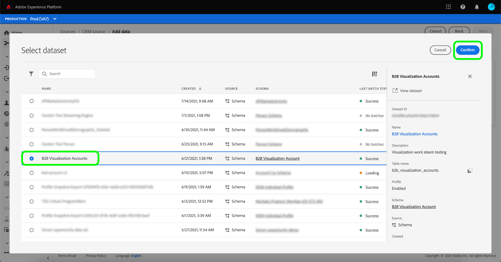

# UI での CRM 接続用のデータフローの設定

データフローは、ソースから Platform データセットにデータを取得して取り込むスケジュール済みタスクです。 このチュートリアルでは、CRM アカウントを使用して新しいデータフローを設定する手順を説明します。

## はじめに

このチュートリアルは、Adobe Experience Platform の次のコンポーネントを実際に利用および理解しているユーザーを対象としています。

* [[!DNL Experience Data Model (XDM)] システム](../../../../xdm/home.md):顧客体験データを整理する際に使用す [!DNL Experience Platform] る標準化されたフレームワーク。
   * [スキーマ構成の基本](../../../../xdm/schema/composition.md)：スキーマ構成の主要な原則やベストプラクティスなど、XDM スキーマの基本的な構成要素について学びます。
   * [スキーマエディターのチュートリアル](../../../../xdm/tutorials/create-schema-ui.md):スキーマエディターの UI を使用してカスタムスキーマを作成する方法を説明します。
* [[!DNL Real-time Customer Profile]](../../../../profile/home.md)：複数のソースからの集計データに基づいて、統合されたリアルタイムの顧客プロファイルを提供します。

さらに、このチュートリアルでは、既に CRM アカウントを作成している必要があります。 UI で様々な CRM コネクタを作成するためのチュートリアルのリストは、[ ソースコネクタの概要 ](../../../home.md) に記載されています。

## データの選択

CRM アカウントを作成した後、「[!UICONTROL  データを選択 ]」手順が表示され、ファイル階層を調べるためのインターフェイスが提供されます。

* インターフェイスの左半分はディレクトリブラウザーで、CRM のファイルとディレクトリが表示されます。
* インターフェイスの右半分で、互換性のあるファイルから最大 100 行のデータをプレビューできます。

ページ上部の「**[!UICONTROL 検索]**」オプションを使用して、使用するソースデータをすばやく特定できます。

>[!NOTE]
>
>ソースデータの検索オプションは、Analytics、分類、Event Hubs、Kinesisコネクタを除く、すべての表形式ベースのソースコネクタで使用できます。

ソースデータを見つけたら、ディレクトリを選択し、「**[!UICONTROL 次へ]**」を選択します。

## データフィールドの XDM スキーマへのマッピング

**[!UICONTROL マッピング]** 手順が表示され、ソースデータを Platform データセットにマッピングするためのインターフェイスが提供されます。

取り込む受信データのデータセットを選択します。 既存のデータセットを使用するか、新しいデータセットを作成できます。

### 既存のデータセットを使用する

データを既存のデータセットに取り込むには、**[!UICONTROL 既存のデータセット]** を選択し、入力バーの横にあるデータアイコン  を選択します。

**[!UICONTROL データセットの選択]** ダイアログが表示されます。 使用するデータセットを見つけて選択し、「**[!UICONTROL 続行]**」をクリックします。

### 新しいデータセットの使用

データを新しいデータセットに取り込むには、**[!UICONTROL New dataset]** を選択し、指定したフィールドにデータセットの名前と説明を入力します。

**[!UICONTROL スキーマを選択]** 検索バーにスキーマ名を入力して、スキーマフィールドを添付できます。 また、ドロップダウンアイコンを選択して、既存のスキーマのリストを表示することもできます。 または、「**[!UICONTROL 詳細検索]**」を選択して、既存のスキーマの画面にそれぞれの詳細を含めてアクセスできます。

この手順の間に、[!DNL Real-time Customer Profile] のデータセットを有効にし、エンティティの属性と動作の全体像を作成できます。 有効なすべてのデータセットのデータは [!DNL Profile] に含まれ、変更はデータフローの保存時に適用されます。

「**[!UICONTROL プロファイルデータセット]**」ボタンを切り替えて、[!DNL Profile] のターゲットデータセットを有効にします。

**[!UICONTROL スキーマを選択]** ダイアログが表示されます。 新しいデータセットに適用するスキーマを選択し、「**[!UICONTROL 完了]**」をクリックします。

必要に応じて、フィールドを直接マッピングするか、データ準備関数を使用してソース・データを変換し、計算済値または計算済値を取得できます。 マッパー関数と計算フィールドの詳細については、『[ データ準備関数ガイド ](../../../../data-prep/functions.md)』または『[ 計算フィールドガイド ](../../../../data-prep/calculated-fields.md)』を参照してください。

<!--
>[!TIP]
>
>If you are using the [!DNL Salesforce] source as part of B2B CDP, refer to the [[!DNL Salesforce] field mapping tables](../../../connectors/adobe-applications/mapping/salesforce.md) for a guide on the appropriate mapping sets between [!DNL Salesforce] source fields and XDM target fields.
-->

Platform は、選択したターゲットスキーマまたはデータセットに基づいて、自動マッピングされたフィールドに対してインテリジェントな推奨事項を提供します。 マッピングルールは、使用例に合わせて手動で調整できます。

「**[!UICONTROL データのプレビュー]**」を選択すると、選択したデータセットから最大 100 行のサンプルデータのマッピング結果が表示されます。

プレビュー時、ID 列は最初のフィールドとして優先付けされます。マッピング結果を検証する際に必要な重要な情報です。

ソースデータがマッピングされたら、「**[!UICONTROL 閉じる]**」を選択します。

次に、「[!UICONTROL  マッピング ]」画面から「**[!UICONTROL 次へ]**」を選択して次に進みます。

## 取得の実行のスケジュール

**[!UICONTROL スケジュール]** 手順が表示され、設定済みのマッピングを使用して選択したソースデータを自動的に取り込むように取り込みスケジュールを設定できます。 次の表に、スケジュール設定用の様々な設定可能フィールドの概要を示します。

| フィールド | 説明 |
| --- | --- |
| 頻度 | 選択可能な周波数は、`Once`、`Minute`、`Hour`、`Day`、`Week` です。 |
| 間隔 | 選択した頻度の間隔を設定する整数。 |
| 開始時間 | 最初の取り込みがいつおこなわれるかを示す UTC タイムスタンプ。 |
| バックフィル | 最初に取り込まれるデータを決定する boolean 値です。 **[!UICONTROL バックフィル]** が有効になっている場合、指定されたパス内の現在のファイルは、最初にスケジュールされた取り込みの間にすべて取り込まれます。 **[!UICONTROL バックフィル]** が無効になっている場合は、最初の取り込み実行から **[!UICONTROL 開始時刻]** までの間に読み込まれたファイルのみが取り込まれます。 **[!UICONTROL 開始時刻]** より前に読み込まれたファイルは取り込まれません。 |
| デルタ列 | フィルターを適用した、タイプ、日付、時間のソーススキーマフィールドセットを含むオプション。 このフィールドは、新しいデータと既存のデータを区別するために使用されます。 増分データは、選択した列のタイムスタンプに基づいて取り込まれます。 |

データフローは、スケジュールに従ってデータを自動的に取り込むように設計されています。 まず、取得頻度を選択します。 次に、2 つのフロー実行間隔を指定する間隔を設定します。 間隔の値はゼロ以外の整数で、15 以上に設定する必要があります。

取り込みの開始時間を設定するには、開始時間ボックスに表示される日時を調整します。 または、カレンダーアイコンを選択して開始時間の値を編集できます。 開始時刻は、現在の UTC 時刻以上にする必要があります。

「**[!UICONTROL 増分データを]** で読み込む」を選択して、差分列を割り当てます。 このフィールドは、新しいデータと既存のデータの違いを示します。

### 1 回限りの取得データフローの設定

1 回限りの取り込みを設定するには、頻度ドロップダウン矢印を選択し、「**[!UICONTROL 1 回]**」を選択します。

>[!TIP]
>
>**** 1 回限り **** の取り込みでは、インターバランドバックフィルは表示されません。

スケジュールに適切な値を指定したら、「**[!UICONTROL 次へ]**」を選択します。

## データフローの詳細の入力

**[!UICONTROL データフローの詳細]** 手順が表示され、新しいデータフローに名前を付け、簡単な説明を入力できます。

このプロセスの間に、**[!UICONTROL 部分取得]** と **[!UICONTROL エラー診断]** を有効にすることもできます。 **[!UICONTROL 部分取得]** を有効にすると、エラーを含むデータを特定のしきい値まで取り込むことができます。 **[!UICONTROL 部分取得]** を有効にしたら、**[!UICONTROL エラーしきい値%]** ダイヤルをドラッグして、バッチのエラーしきい値を調整します。 または、入力ボックスを選択して手動でしきい値を調整することもできます。 詳しくは、「[ バッチ取得の部分の概要 ](../../../../ingestion/batch-ingestion/partial.md)」を参照してください。

データフローの値を指定し、「**[!UICONTROL 次へ]**」を選択します。

## データフローの確認

「*レビュー*」手順が表示され、新しいデータフローを作成前に確認できます。 詳細は、次のカテゴリに分類されます。

* **[!UICONTROL 接続]**:ソースアカウント名、ソースプラットフォーム、選択したソースファイルの関連パス、およびそのソースファイル内の列数が表示されます。
* **[!UICONTROL データセットとマップのフィールドの割り当て]**:データセットが準拠するスキーマを含め、ソースデータの取り込み先のターゲットデータセットを表示します。
* **[!UICONTROL スケジュール]**:データフローの開始時間と頻度レートを表示します。

データフローをレビューしたら、「**[!UICONTROL 完了]**」をクリックし、データフローの作成に時間を割きます。

## データフローの監視

データフローを作成したら、データフローを介して取り込まれるデータを監視して、取り込み率、成功、エラーに関する情報を確認できます。 データフローの監視方法の詳細については、UI での [ アカウントとデータフローの監視に関するチュートリアル ](../monitor.md) を参照してください。

## データフローの削除

不要になったデータフローや誤って作成されたデータフローは、**[!UICONTROL Dataflows]** ワークスペースの **[!UICONTROL Delete]** 関数を使用して削除できます。 データフローの削除方法の詳細については、[UI でのデータフローの削除 ](../delete.md) に関するチュートリアルを参照してください。

## 次の手順

このチュートリアルでは、CRM からデータを取り込むためのデータフローを正常に作成し、監視データセットに関するインサイトを得ました。 データフローの作成の詳細については、以下のビデオを見て学習を補完できます。 さらに、受信データは、[!DNL Real-time Customer Profile] や [!DNL Data Science Workspace] など、ダウンストリームの Platform サービスで使用できるようになりました。 詳しくは、次のドキュメントを参照してください。

* [リアルタイム顧客プロファイルの概要](../../../../profile/home.md)
* [Data Science Workspace の概要](../../../../data-science-workspace/home.md)

>[!WARNING]
>
> 次のビデオに示す Platform UI は最新ではありません。 最新の UI スクリーンショットと機能については、上記のドキュメントを参照してください。
>
>[!VIDEO](https://video.tv.adobe.com/v/29711?quality=12&learn=on)
