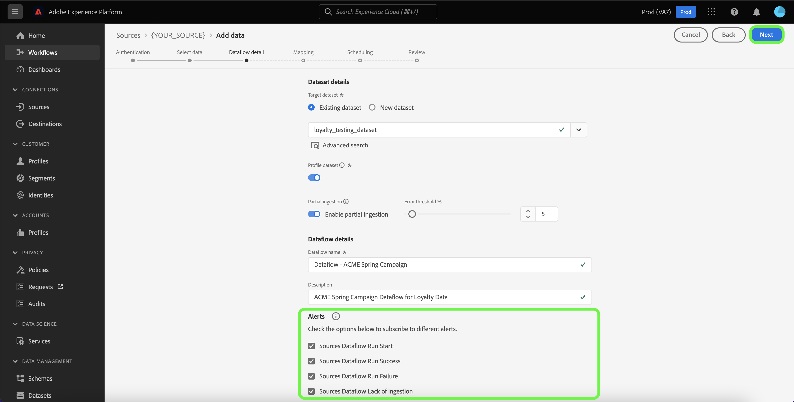
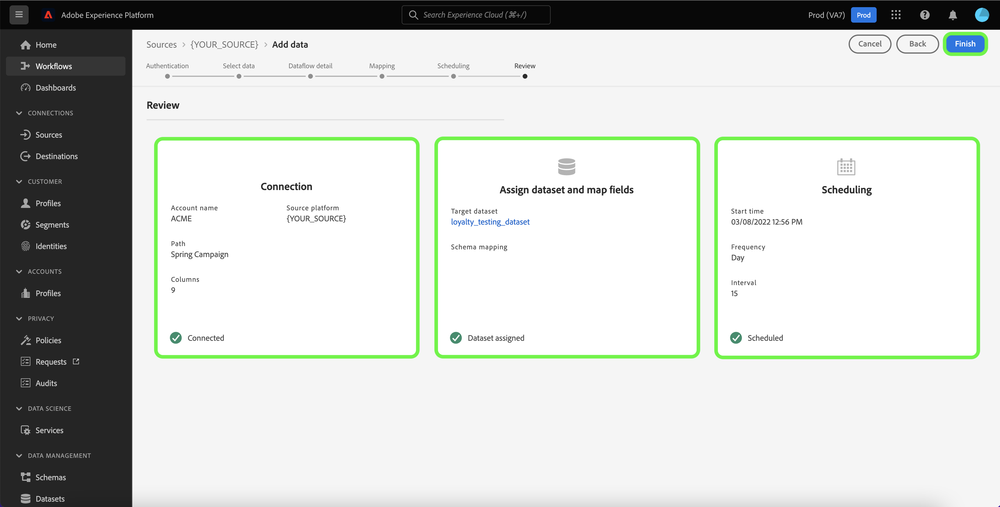

# UI での e コマースソースを使用したデータフローの作成

データフローは、ソースからAdobe Experience Platformのデータセットにデータを取得して取り込むスケジュール済みタスクです。 このチュートリアルでは、Platform UI を使用して e コマースソースのデータフローを作成する手順を説明します。

>[!NOTE]
>
>データフローを作成するには、e コマースソースで認証済みのアカウントが必要です。 UI で様々な e コマースソースアカウントを作成するためのチュートリアルのリストは、 [ソースの概要](../../../home.md#ecommerce).

## はじめに

このチュートリアルは、  Platform の次のコンポーネントを実際に利用および理解しているユーザーを対象としています。

* [ソース](../../../home.md)：Platform を使用すると、様々なソースからデータを取り込みながら、[!DNL Platform] サービスを使用して受信データの構造化、ラベル付け、拡張を行うことができます。
* [[!DNL Experience Data Model (XDM)] システム](../../../../xdm/home.md)：Experience Platform が顧客体験データの整理に使用する標準化されたフレームワーク。
   * [スキーマ構成の基本](../../../../xdm/schema/composition.md)：スキーマ構成の主要な原則やベストプラクティスなど、XDM スキーマの基本的な構成要素について学びます。
   * [スキーマエディターのチュートリアル](../../../../xdm/tutorials/create-schema-ui.md)：スキーマエディター UI を使用してカスタムスキーマを作成する方法を説明します。
* [[!DNL Real-Time Customer Profile]](../../../../profile/home.md)：複数のソースからの集計データに基づいて、統合されたリアルタイムの顧客プロファイルを提供します。
* [[!DNL Data Prep]](../../../../data-prep/home.md):データエンジニアが Experience Data Model(XDM) との間でデータのマッピング、変換、検証をおこなえるようにします。

## データの追加

e コマースソースアカウントを作成した後、 **[!UICONTROL データを追加]** 手順が表示され、e コマースソースアカウントのテーブル階層を調べるためのインターフェイスが表示されます。

* インターフェイスの左半分はブラウザーで、アカウントに含まれるデータテーブルのリストが表示されます。 また、このインターフェイスには、使用するソースデータをすばやく識別できる検索オプションも含まれています。
* インターフェイスの右半分はプレビューパネルで、最大 100 行のデータをプレビューできます。

>[!NOTE]
>
>「ソースデータを検索」オプションは、Adobe Analytics、 [!DNL Amazon Kinesis]、および [!DNL Azure Event Hubs].

ソースデータを見つけたら、テーブルを選択し、「 」を選択します。 **[!UICONTROL 次へ]**.

## データフローの詳細を入力

[!UICONTROL データフロー詳細]ページでは、既存のデータセットと新しいデータセットのどちらを使用するかを選択できます。このプロセスでは、[!UICONTROL プロファイルデータセット]、[!UICONTROL エラー診断]、[!UICONTROL 部分取り込み]、および[!UICONTROL アラート]の設定も指定できます。

### 既存のデータセットを使用する

データを既存のデータセットに取り込むには、**[!UICONTROL 既存のデータセット]**&#x200B;を選択します。「[!UICONTROL 詳細検索]」オプションを使用するか、ドロップダウンメニューで既存のデータセットのリストをスクロールすると、既存のデータセットを取得できます。データセットを選択したら、データフローの名前と説明を入力します。

### 新しいデータセットの使用

データを新しいデータセットに取り込むには、「**[!UICONTROL 新しいデータセット]**」を選択して、出力データセット名とオプションの説明を入力します。次に、「[!UICONTROL 詳細検索]」オプションを使用するか、ドロップダウンメニューで既存のスキーマのリストをスクロールして、マッピングするスキーマを選択します。スキーマを選択したら、データフローの名前と説明を指定します。

### [!DNL Profile] とエラー診断の有効化

次に、 **[!UICONTROL プロファイルデータセット]**&#x200B;切り替えスイッチを選択して、[!DNL Profile] のデータセットを有効にします。これにより、エンティティの属性と動作の全体像を把握できます。[!DNL Profile] が有効化されたすべてのデータセットのデータは [!DNL Profile] に含まれ、変更はデータフローを保存するときに適用されます。

[!UICONTROL エラー診断]は、データフローで発生するエラーレコードに対して、詳細なエラーメッセージ生成を有効にします。[!UICONTROL 部分取り込み]では、手動で定義した特定のしきい値に到達するまで、エラーを含むデータを取り込むことができます。詳しくは、[バッチ取り込みの概要](../../../../ingestion/batch-ingestion/partial.md)を参照してください。

### アラートの有効化

アラートを有効にすると、データフローのステータスに関する通知を受け取ることができます。リストからアラートを選択して、データフローのステータスに関する通知を受け取るよう登録します。アラートについて詳しくは、[UI を使用したソースアラートの購読](../alerts.md)についてのガイドを参照してください。

データフローへの詳細の入力を終えたら「**[!UICONTROL 次へ]** 」を選択します。

## XDM スキーマへのデータフィールドのマッピング

[!UICONTROL マッピング]手順が表示され、ソーススキーマのソースフィールドを、ターゲットスキーマの適切なターゲット XDM フィールドにマッピングするためのインターフェイスが提供されます。

Platform は、選択したターゲットスキーマまたはデータセットに基づいて、自動マッピングされたフィールドに対するインテリジェントなレコメンデーションを提供します。 マッピングルールは、ユースケースに合わせて手動で調整できます。必要に応じて、フィールドを直接マッピングするか、データ準備機能を使用してソースデータを変換して計算値を導き出すかを選択できます。マッパーインターフェイスと計算フィールドを使用した包括的な手順については、 [データ準備 UI ガイド](../../../../data-prep/ui/mapping.md).

ソースデータが正常にマッピングされたら、「 」を選択します。 **[!UICONTROL 次へ]**.

## 取り込み実行のスケジュール設定

この [!UICONTROL スケジュール] 手順が表示され、設定済みのマッピングを使用して選択したソースデータを自動的に取り込むように取り込むように、取り込みスケジュールを設定できます。 デフォルトでは、スケジュールはに設定されています。 `Once`. 取り込み頻度を調整するには、「 」を選択します **[!UICONTROL 頻度]** 次に、ドロップダウンメニューからオプションを選択します。

>[!TIP]
>
>1 回限りの取り込みでは、間隔とバックフィルは表示されません。

取り込み頻度を `Minute`, `Hour`, `Day`または `Week`を設定した場合は、取り込みのたびに設定時間枠を設定する間隔を設定する必要があります。 例えば、取り込み頻度を `Day` 間隔は `15` は、データフローが 15 日ごとにデータを取り込むようにスケジュールされていることを意味します。

この手順の間に、 **バックフィル** およびは、データの増分取り込みの列を定義します。 バックフィルは、履歴データを取り込むために使用されます。一方、増分取り込み用に定義する列では、新しいデータを既存のデータと区別することができます。

スケジュール設定について詳しくは、次の表を参照してください。

| フィールド | 説明 |
| --- | --- |
| 頻度 | 取り込みが発生する頻度。 選択可能な頻度には次のものが含まれます `Once`, `Minute`, `Hour`, `Day`、および `Week`. |
| 間隔 | 選択した頻度の間隔を設定する整数。 間隔の値は、ゼロ以外の整数で、15 以上に設定する必要があります。 |
| 開始時間 | 最初の取り込みがいつ行われるかを示す UTC タイムスタンプ。 開始時間は、現在の UTC 時間以上である必要があります。 |
| バックフィル | 最初に取り込まれるデータを決定する boolean 値です。 バックフィルが有効な場合、指定されたパス内の現在のファイルは、最初にスケジュールされた取り込み中にすべて取り込まれます。 バックフィルが無効になっている場合、取り込みの最初の実行から開始時刻までの間に読み込まれたファイルのみが取り込まれます。 開始時より前に読み込まれたファイルは取り込まれません。 |
| 増分データの読み込み基準 | フィルターされた一連のソーススキーマフィールド（タイプ、日付、時間）を含むオプション。 このフィールドは、新しいデータと既存のデータを区別するために使用されます。 増分データは、選択した列のタイムスタンプに基づいて取り込まれます。  |

## データフローのレビュー

**[!UICONTROL レビュー]**&#x200B;手順が表示され、新しいデータフローを作成する前に確認できます。詳細は、次のカテゴリに分類されます。

* **[!UICONTROL 接続]**：ソースのタイプ、選択したソースファイルの関連パスおよびそのソースファイル内の列の数を表示します。
* **[!UICONTROL データセットの割り当てとフィールドのマッピング]**：ソースデータがどのデータセットに取り込まれるかを、そのデータセットが準拠するスキーマを含めて表示します。
* **[!UICONTROL スケジュール]**:取り込みスケジュールのアクティブな期間、頻度、間隔を表示します。

データフローをレビューしたら、「**[!UICONTROL 終了]**」を選択し、データフローが作成されるまでしばらく待ちます。

## データフローの監視

データフローを作成したら、そのデータフローを通じて取り込まれるデータをモニターすると、取り込み速度、成功、エラーに関する情報を確認できます。データフローの監視方法の詳細については、 [UI でのアカウントとデータフローの監視](../monitor.md).

## データフローの削除

不要になったデータフローや誤って作成されたデータフローは、**[!UICONTROL データフロー]**&#x200B;ワークスペース内にある&#x200B;**[!UICONTROL 削除]**&#x200B;機能で削除できます。データフローの削除方法について詳しくは、[UI でのデータフローの削除](../delete.md)のチュートリアルを参照してください。

## 次の手順

このチュートリアルに従うことで、e コマースソースから Platform にデータを取り込むためのデータフローを正常に作成しました。 [!DNL Real-Time Customer Profile] や [!DNL Data Science Workspace] など、ダウンストリームの [!DNL Platform] サービスで受信データを使用できるようになりました。詳しくは、次のドキュメントを参照してください。

* [[!DNL Real-Time Customer Profile] 概要](../../../../profile/home.md)
* [[!DNL Data Science Workspace] 概要](../../../../data-science-workspace/home.md)

>[!WARNING]
>
> 次のビデオに示す Platform UI は最新ではありません。 最新の UI のスクリーンショットと機能については、上記のドキュメントを参照してください。
>
>[!VIDEO](https://video.tv.adobe.com/v/29711?quality=12&learn=on)

