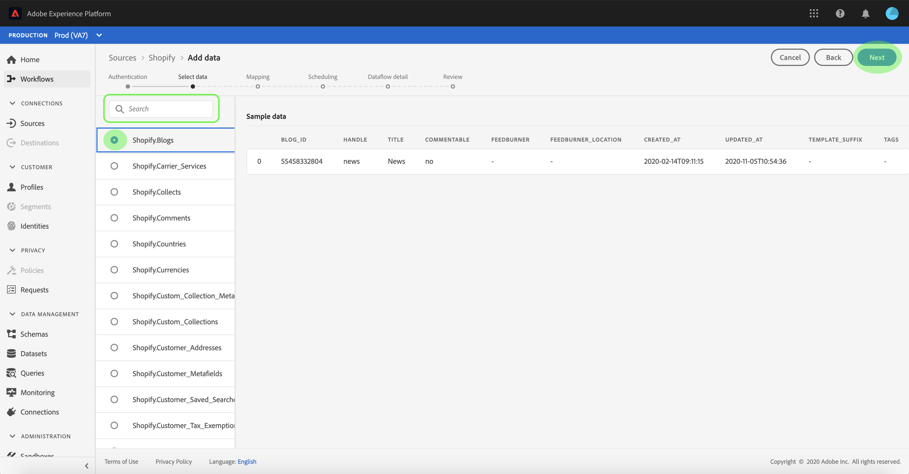
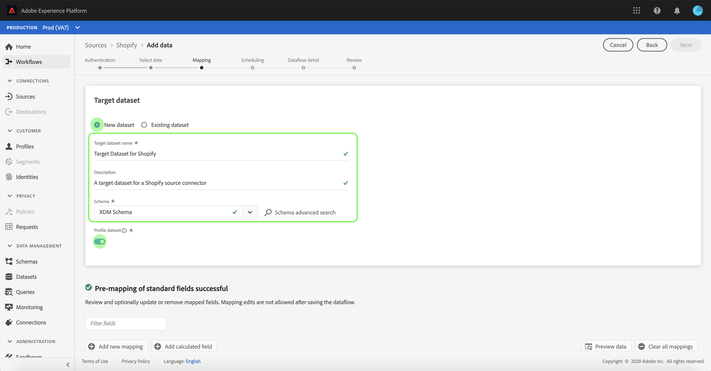

# UI での e コマース接続のデータフローの設定

データフローは、ソースからにデータを取得して取り込むスケジュール済みタスクです [!DNL Platform] データセット。 このチュートリアルでは、 **[!UICONTROL e コマース]** アカウント

## はじめに

このチュートリアルは、Adobe Experience Platform の次のコンポーネントを実際に利用および理解しているユーザーを対象としています。

- [[!DNL Experience Data Model (XDM)] システム](../../../../xdm/home.md):標準化されたフレームワーク [!DNL Experience Platform] は顧客体験データを整理します。
   - [スキーマ構成の基本](../../../../xdm/schema/composition.md)：スキーマ構成の主要な原則やベストプラクティスなど、XDM スキーマの基本的な構成要素について学びます。
   - [スキーマエディターのチュートリアル](../../../../xdm/tutorials/create-schema-ui.md):スキーマエディター UI を使用してカスタムスキーマを作成する方法を説明します。
- [[!DNL Real-time Customer Profile]](../../../../profile/home.md)：複数のソースからの集計データに基づいて、統合されたリアルタイムの顧客プロファイルを提供します。

また、このチュートリアルでは、 **[!UICONTROL e コマース]** アカウント 様々な **[!UICONTROL e コマース]** UI のコネクタは、 [ソースコネクタの概要](../../../home.md).

## データを選択

作成後、 **[!UICONTROL e コマース]** アカウント、 **[!UICONTROL データを選択]** 手順が表示され、ファイル階層を参照できるインタラクティブインターフェイスが提供されます。

- インターフェイスの左半分はディレクトリブラウザで、サーバーのファイルとディレクトリが表示されます。
- インターフェイスの右半分を使用すると、互換性のあるファイルから最大 100 行のデータをプレビューできます。

以下を使用して、 **[!UICONTROL 検索]** オプションを使用して、使用するソースデータをすばやく識別できます。

>[!NOTE]
>
>ソースデータの検索オプションは、Analytics、分類、イベントハブ、Kinesisコネクタを除く、すべての表形式ベースのソースコネクタで使用できます。

ソースデータを見つけたら、ディレクトリを選択し、「 」を選択します。 **[!UICONTROL 次へ]**.

## XDM スキーマへのデータフィールドのマッピング

この **[!UICONTROL マッピング]** 手順が表示され、ソースデータを [!DNL Platform] データセット。

取り込むインバウンドデータのデータセットを選択します。 既存のデータセットを使用するか、新しいデータセットを作成できます。

### 既存のデータセットを使用する

既存のデータセットにデータを取り込むには、「 」を選択します。 **[!UICONTROL 既存のデータセットを使用]**&#x200B;をクリックし、データセットアイコンをクリックします。

この **[!UICONTROL データセットを選択]** ダイアログが表示されます。 使用するデータセットを見つけ、選択して、 **[!UICONTROL 続行]**.

### 新しいデータセットを使用

データを新しいデータセットに取り込むには、「 **[!UICONTROL 新しいデータセットを作成]** をクリックし、提供されたフィールドにデータセットの名前と説明を入力します。

スキーマフィールドを添付するには、 **[!UICONTROL スキーマを選択]** 検索バー。 また、ドロップダウンアイコンを選択して、既存のスキーマのリストを表示することもできます。 または、 **[!UICONTROL 詳細検索]** 既存のスキーマの画面（それぞれの詳細を含む）にアクセスする。

この手順の間に、 [!DNL Real-time Customer Profile] エンティティの属性と行動を総合的に把握できます。 すべての有効なデータセットのデータは、 [!DNL Profile] および変更は、データフローを保存する際に適用されます。

切り替え **[!UICONTROL プロファイルデータセット]** ボタンを使用して [!DNL Profile].

この **[!UICONTROL スキーマを選択]** ダイアログが表示されます。 新しいデータセットに適用するスキーマを選択し、 **[!UICONTROL 完了]**.

必要に応じて、フィールドを直接マッピングするか、データ準備関数を使用してソースデータを変換し、計算値または計算値を導出できます。 マッパーインターフェイスと計算フィールドを使用した包括的な手順については、 [データ準備 UI ガイド](../../../../data-prep/ui/mapping.md).

>[!TIP]
>
>Platform は、選択したターゲットスキーマまたはデータセットに基づいて、自動マッピングされたフィールドに対するインテリジェントなレコメンデーションを提供します。 マッピングルールは、使用例に合わせて手動で調整できます。

選択 **[!UICONTROL データをプレビュー]** ：選択したデータセットから最大 100 行のサンプルデータのマッピング結果を確認します。

プレビュー中、ID 列は、マッピング結果を検証する際に必要な重要な情報なので、最初のフィールドとして優先付けされます。

ソースデータをマッピングしたら、 **[!UICONTROL 閉じる]**.

## 取り込み実行のスケジュール設定

この **[!UICONTROL スケジュール]** 手順が表示され、設定済みのマッピングを使用して選択したソースデータを自動的に取り込むように取り込むように、取り込みスケジュールを設定できます。 次の表に、スケジュール設定用の様々な設定可能フィールドの概要を示します。

| フィールド | 説明 |
| --- | --- |
| 頻度 | 選択可能な頻度には次のものが含まれます `Once`, `Minute`, `Hour`, `Day`、および `Week`. |
| 間隔 | 選択した頻度の間隔を設定する整数。 |
| 開始時間 | 最初の取り込みがいつ行われるかを示す UTC タイムスタンプ。 |
| バックフィル | 最初に取り込まれるデータを決定する boolean 値です。 If **[!UICONTROL バックフィル]** が有効になっている場合、指定されたパス内の現在のすべてのファイルが、最初にスケジュールされた取り込み中に取り込まれます。 If **[!UICONTROL バックフィル]** が無効になっている場合は、最初の取り込み実行から開始時刻までの間に読み込まれたファイルのみが取り込まれます。 開始時より前に読み込まれたファイルは取り込まれません。 |
| 差分列 | フィルターされた一連のソーススキーマフィールド（タイプ、日付、時間）を含むオプション。 このフィールドは、新しいデータと既存のデータを区別するために使用されます。 増分データは、選択した列のタイムスタンプに基づいて取り込まれます。 |

データフローは、スケジュールに従ってデータを自動的に取り込むように設計されています。 まず、取り込み頻度を選択します。 次に、2 つのフロー実行の間隔を指定する間隔を設定します。 間隔の値は、ゼロ以外の整数で、15 以上に設定する必要があります。

取り込みの開始時間を設定するには、開始時間ボックスに表示される日時を調整します。 または、カレンダーアイコンを選択して開始時間の値を編集できます。 開始時間は、現在の UTC 時間以上である必要があります。

選択 **[!UICONTROL 増分データの読み込み基準]** 」をクリックしてデルタ列を割り当てます。 このフィールドには、新しいデータと既存のデータの違いが表示されます。

### 1 回限りの取り込みデータフローの設定

1 回限りの取り込みを設定するには、「頻度」ドロップダウン矢印を選択し、「 **[!UICONTROL 1 回]**.

>[!TIP]
>
>**[!UICONTROL 間隔]** および **[!UICONTROL バックフィル]** は、1 回限りの取り込みでは表示されません。

スケジュールに適切な値を指定したら、「 」を選択します。 **[!UICONTROL 次へ]**.

## データフローの詳細を入力

この **[!UICONTROL データフローの詳細]** 手順が表示され、新しいデータフローに名前を付け、簡単な説明を入力できます。

このプロセスの間に、 **[!UICONTROL 部分取り込み]** および **[!UICONTROL エラー診断]**. 有効化 **[!UICONTROL 部分取り込み]** は、エラーを含むデータを特定のしきい値まで取り込む機能を提供します。 1 回 **[!UICONTROL 部分取り込み]** が有効な場合、 **[!UICONTROL エラーしきい値%]** バッチのエラーしきい値を調整するためにダイヤルします。 または、入力ボックスを選択して手動でしきい値を調整することもできます。 詳しくは、 [部分バッチ取得の概要](../../../../ingestion/batch-ingestion/partial.md).

データフローの値を指定し、「 」を選択します。 **[!UICONTROL 次へ]**.

## データフローの確認

この **[!UICONTROL レビュー]** 手順が表示され、新しいデータフローを作成する前に確認できます。 詳細は、次のカテゴリに分類されます。

- **[!UICONTROL 接続]**:ソースのタイプ、選択したソースファイルの関連パス、およびそのソースファイル内の列数を表示します。
- **[!UICONTROL データセットの割り当てとフィールドのマッピング]**:データセットが準拠するスキーマを含め、ソースデータの取り込み先のデータセットを示します。
- **[!UICONTROL スケジュール]**:取り込みスケジュールのアクティブな期間、頻度、間隔を表示します。

データフローをレビューしたら、「 」をクリックします。 **[!UICONTROL 完了]** とは、データフローが作成されるまでしばらく時間をかけます。

## データフローの監視

データフローを作成したら、そのデータフローを通じて取り込まれるデータを監視して、取り込み率、成功、エラーに関する情報を確認できます。 データフローの監視方法の詳細については、 [UI でのアカウントとデータフローの監視](../monitor.md).

## データフローを削除

不要になったデータフローや、 **[!UICONTROL 削除]** 関数 **[!UICONTROL データフロー]** ワークスペース。 データフローの削除方法の詳細については、 [UI でのデータフローの削除](../delete.md).

## 次の手順

このチュートリアルに従うことで、を取り込むためのデータフローを正常に作成できました **[!UICONTROL e コマース]** データを取得し、監視データセットに関するインサイトを得ました。 受信データをダウンストリームで使用できるようになりました [!DNL Platform] 次のようなサービス： [!DNL Real-time Customer Profile] および [!DNL Data Science Workspace]. 詳しくは、次のドキュメントを参照してください。

- [[!DNL Real-time Customer Profile] の概要](../../../../profile/home.md)
- [[!DNL Data Science Workspace] の概要](../../../../data-science-workspace/home.md)
