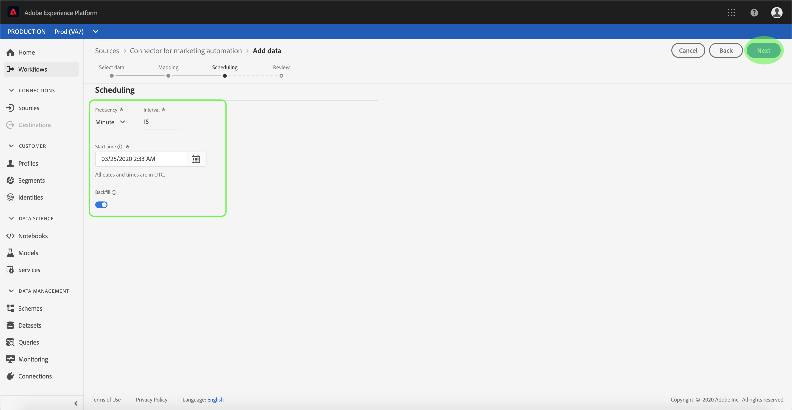
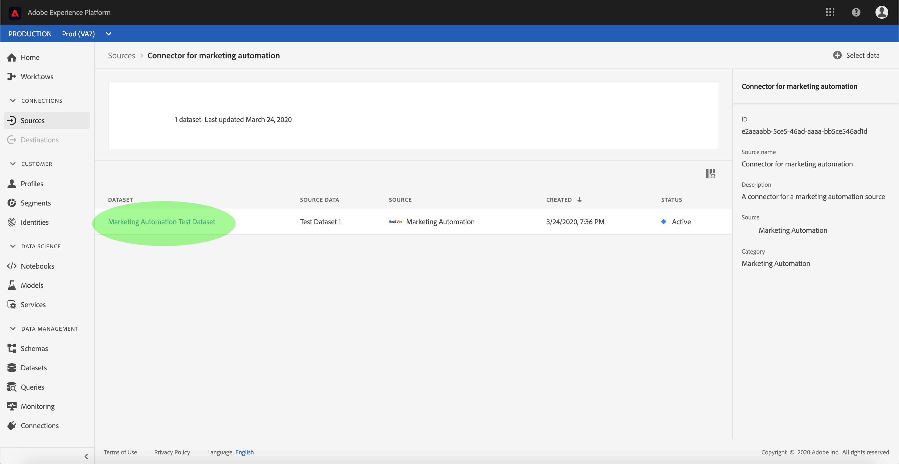

# UIでのマーケティング自動化コネクタのデータフローの設定

データフローとは、ソースからデータセットにデータを取得し、取り込むスケジュール済みのタスク [!DNL Platform] です。 このチュートリアルでは、マーケティング自動化アカウントを使用して新しいデータフローを設定する手順を説明します。

## はじめに

このチュートリアルでは、次のAdobe Experience Platformのコンポーネントについて十分に理解している必要があります。

- [Experience Data Model(XDM)System](../../../../xdm/home.md): 顧客体験データを [!DNL Experience Platform] 整理するための標準化されたフレームワーク。
   - [スキーマ構成の基本](../../../../xdm/schema/composition.md): XDMスキーマの基本構成要素について説明します。この基本構成要素には、スキーマ構成の主な原則とベストプラクティスが含まれます。
   - [スキーマエディタのチュートリアル](../../../../xdm/tutorials/create-schema-ui.md): スキーマエディターのUIを使用してカスタムスキーマを作成する方法を説明します。
- [リアルタイム顧客プロファイル](../../../../profile/home.md): 複数のソースからの集計データに基づいて、統合されたリアルタイムの消費者プロファイルを提供します。

さらに、このチュートリアルでは、既にMarketing Automationアカウントを作成している必要があります。 UIで様々なマーケティング自動化コネクタを作成するためのチュートリアルのリストは、 [source connectorsの概要](../../../home.md)。

## データの選択

マーケティング自動化アカウントを作成すると、「データ *の選択* 」の手順が表示され、ファイル階層を調査するためのインタラクティブなインターフェイスが提供されます。

- インターフェイスの左半分はディレクトリブラウザーで、サーバーのファイルとディレクトリが表示されます。
- インターフェイスの右半分を使用すると、互換性のあるファイルから最大100行のデータをプレビューできます。

使用するディレクトリを選択し、「 **[!UICONTROL 次へ]**」をクリックします。

## データフィールドのXDMスキーマへのマッピング

「 *[!UICONTROL マッピング]* 」の手順が表示され、ソースデータをデータセットにマッピングするインタラクティブなインターフェイスが提供され [!DNL Platform] ます。

取り込む受信データのデータセットを選択します。 既存のデータセットを使用することも、新しいデータセットを作成することもできます。

### 既存のデータセットの使用

既存のデータセットにデータを取り込むには、「 **[!UICONTROL Use existing dataset]**」を選択し、データセットアイコンをクリックします。

[ _データセットの選択_ ]ダイアログが表示されます。 使用するデータセットを見つけて選択し、「 **[!UICONTROL 続行]**」をクリックします。

### 新しいデータセットの使用

データを新しいデータセットに取り込むには、「 **[!UICONTROL 新しいデータセットを]** 作成」を選択し、表示されるフィールドにデータセットの名前と説明を入力します。

このプロセス中に、 *[!UICONTROL 部分的な取り込み]* 、 *[!UICONTROL エラー診断も有効にできます]*。 「 *[!UICONTROL 部分的な取り込み]* 」を有効にすると、エラーを含むデータを取り込むことができ、設定可能な特定のしきい値まで取り込むことができます。 エラー診断を有効にすると、誤ったデータに関する詳細が表示され、個別にバッチ処理が行われます。 詳しくは、 [部分的なバッチインジェストの概要を参照してください](../../../../ingestion/batch-ingestion/partial.md)。

終了したら、スキーマアイコンをクリックします。

[ *[!UICONTROL スキーマの]* 選択]ダイアログが表示されます。 新しいデータセットに適用するスキーマを選択し、「 **[!UICONTROL 完了]**」をクリックします。

必要に応じて、フィールドを直接マップするか、マッパー関数を使用してソースデータを変換し、計算値や計算値を抽出することができます。 データマッピングおよびマッパーの機能について詳しくは、CSVデータのXDMスキーマフィールドへの [マッピングに関するチュートリアルを参照してください](../../../../ingestion/tutorials/map-a-csv-file.md)。

ソースデータがマッピングされたら、「 **[!UICONTROL 次へ]**」をクリックします。

## インジェストのスケジュール設定

[ *[!UICONTROL スケジュール]* ]ステップが表示され、設定済みのマッピングを使用して選択したソースデータを自動的に取り込むように取り込みスケジュールを設定できます。 次の表に、スケジュール設定用の様々な設定可能フィールドの概要を示します。

| フィールド | 説明 |
| --- | --- |
| 頻度 | 選択可能な頻度には、分、時間、日、週があります。 |
| 間隔 | 選択した頻度の間隔を設定する整数。 |
| 開始時間 | 最初の取り込みが行われるUTCタイムスタンプ。 |
| 埋め戻し | 最初に取り込まれるデータを決定するboolean値です。 [ *[!UICONTROL バックフィル]* ]を有効にすると、指定したパスにある現在のファイルは、最初にスケジュールされた取り込み中にすべて取り込まれます。 [ *[!UICONTROL バックフィル]* ]を無効にすると *[!UICONTROL 、最初の取り込み実行から]* 開始時間の間に読み込まれたファイルだけが取り込まれます。 *[!UICONTROL 開始時間より前に読み込まれたファイルは取り込まれません]* 。 |

データフローは、スケジュールに基づいてデータを自動的に取り込むように設計されています。 このワークフローで1回だけ取り込む場合は、 **[!UICONTROL 頻度]** 「日」を設定し、 ****&#x200B;間隔に非常に大きな数値（例：10000）を適用することで、これを行うことができます。

スケジュールの値を指定し、「 **[!UICONTROL 次へ]**」をクリックします。

## データフローの確認

「 *[!UICONTROL レビュー]* 」ステップが表示され、新しいデータフローを作成前に確認できます。 詳細は次のカテゴリに分類されます。

- *[!UICONTROL 接続]*: ソースの種類、選択したソースファイルの関連パス、およびそのソースファイル内の列数が表示されます。
- *[!UICONTROL データセットとマップのフィールドの割り当て]*: ソースデータが取り込まれるデータセット(データセットに従うスキーマなど)を示します。
- *[!UICONTROL スケジュール]*: 取り込みスケジュールの有効期間、頻度、間隔を表示します。

データフローをレビューしたら、 **[!UICONTROL 「Finish]** 」をクリックし、データフローを作成するまでの時間を設定します。

## データフローの監視

データフローを作成したら、データフローを介して取り込まれるデータを監視できます。 次の手順に従って、データフローのデータセットモニターにアクセスします。

[ *[!UICONTROL ソース]**ワークスペース内の[マーケティング自動化]* ]カテゴリで、表示するマーケティング自動化ソースを選択します。 「 *[!UICONTROL Connect Source]* 」を選択して、認証インターフェイスを起動します。 既存のデータフローを表示するには、「 *[!UICONTROL 既存のアカウント]* 」を選択し、アクセスするアカウントを選択します。

[ *[!UICONTROL ソースアクティビティ]* ]画面が表示されます。 アクティビティを監視するデータセットの名前をここからクリックします。

[ *[!UICONTROL データセットアクティビティ]* ]画面が表示されます。 このページには、グラフの形式で消費されるメッセージの割合が表示されます。

データセットの監視と取り込みの詳細については、ストリーミングデータフローの [監視に関するチュートリアルを参照してください](../../../../ingestion/quality/monitor-data-flows.md)。

## 次の手順

このチュートリアルに従うと、マーケティング自動化システムからデータを取り込むためのデータフローが正しく作成され、監視データセットに関する洞察が得られます。 受信データは、やなどのダウンストリーム [!DNL Platform] サービスで使用でき [!DNL Real-time Customer Profile] るようになり [!DNL Data Science Workspace]ました。 詳しくは、次のドキュメントを参照してください。

- [リアルタイム顧客プロファイルの概要](../../../../profile/home.md)
- [Data Science Workspaceの概要](../../../../data-science-workspace/home.md)

## 付録

以下の節では、ソースコネクタを使用する場合の追加情報について説明します。

### データフローの無効化

データフローが作成されると、そのデータはすぐにアクティブになり、指定されたスケジュールに従ってデータを取り込みます。 アクティブなデータフローは、次の手順に従っていつでも無効にできます。

[ *[!UICONTROL 認証]* ]画面で、無効にするデータフローに関連付けられているベース接続の名前を選択します。

「 _ソースアクティビティ_ 」ページが表示されます。 リストからアクティブなデータフローを選択し、画面の右側に *[!UICONTROL 「Properties]* 」列を開きます。この列には「 **[!UICONTROL Enabled]** 」トグル・ボタンが含まれています。 切り替えボタンをクリックして、データフローを無効にします。 同じ切り替えを使用して、データフローを無効にした後で再び有効にできます。

### 母集団の受信データを有効にし [!DNL Profile] ます

ソースコネクタから受信するデータは、データの富化と埋め込みに使用でき [!DNL Real-time Customer Profile] ます。 データの入力について詳しくは、 [!DNL Real-time Customer Profile][プロファイルの入力に関するチュートリアルを参照してください](../profile.md)。
