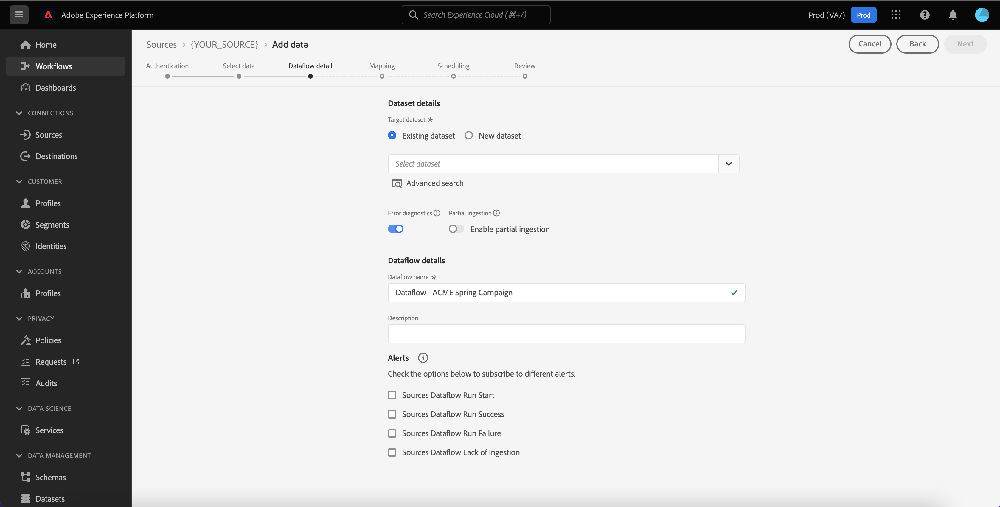
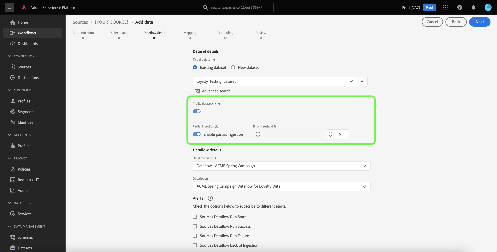

# UI でのプロトコルソースを使用したデータフローの作成

データフローは、ソースからAdobe Experience Platformのデータセットにデータを取得して取り込むスケジュール済みタスクです。 このチュートリアルでは、Platform UI を使用してプロトコルソースのデータフローを作成する手順を説明します。

>[!NOTE]
>
>データフローを作成するには、プロトコルソースを持つ認証済みアカウントが既に存在する必要があります。 UI で様々なプロトコルのソースアカウントを作成するためのチュートリアルのリストは、 [ソースの概要](../../../home.md#protocols).

## はじめに

このチュートリアルは、 Platform の次のコンポーネントを実際に利用および理解しているユーザーを対象としています。

* [ソース](../../../home.md):Platform を使用すると、様々なソースからデータを取り込みながら、 [!DNL Platform] サービス。
* [[!DNL Experience Data Model (XDM)] システム](../../../../xdm/home.md):Experience Platformが顧客体験データを整理する際に使用する標準化されたフレームワーク。
   * [スキーマ構成の基本](../../../../xdm/schema/composition.md)：スキーマ構成の主要な原則やベストプラクティスなど、XDM スキーマの基本的な構成要素について学びます。
   * [スキーマエディターのチュートリアル](../../../../xdm/tutorials/create-schema-ui.md)：スキーマエディター UI を使用してカスタムスキーマを作成する方法を説明します。
* [[!DNL Real-time Customer Profile]](../../../../profile/home.md)：複数のソースからの集計データに基づいて、統合されたリアルタイムの顧客プロファイルを提供します。
* [[!DNL Data Prep]](../../../../data-prep/home.md):データエンジニアが Experience Data Model(XDM) との間でデータのマッピング、変換、検証をおこなえるようにします。

## データの追加

プロトコルソースアカウントを作成した後、 **[!UICONTROL データを追加]** 手順が表示され、プロトコルソースアカウントのテーブル階層を調べるためのインターフェイスが提供されます。

* インターフェイスの左半分はブラウザーで、アカウントに含まれるデータテーブルのリストが表示されます。 また、このインターフェイスには、使用するソースデータをすばやく識別できる検索オプションも含まれています。
* インターフェイスの右半分はプレビューパネルで、最大 100 行のデータをプレビューできます。

>[!NOTE]
>
>「ソースデータを検索」オプションは、Adobe Analytics、 [!DNL Amazon Kinesis]、および [!DNL Azure Event Hubs].

ソースデータを見つけたら、テーブルを選択し、「 」を選択します。 **[!UICONTROL 次へ]**.

## データフローの詳細を入力

この [!UICONTROL データフローの詳細] ページでは、既存のデータセットと新しいデータセットのどちらを使用するかを選択できます。 この処理の間に、 [!UICONTROL プロファイルデータセット], [!UICONTROL エラー診断], [!UICONTROL 部分取り込み]、および [!UICONTROL アラート].

### 既存のデータセットを使用する

既存のデータセットにデータを取り込むには、「 」を選択します。 **[!UICONTROL 既存のデータセット]**. 既存のデータセットは、「[!UICONTROL 詳細検索]」オプションを使用するか、ドロップダウンメニュー内の既存のデータセットのリストをスクロールして取得することができます。データセットを選択したら、データフローの名前と説明を入力します。

### 新しいデータセットを使用

新しいデータセットに取り込むには、「 **[!UICONTROL 新しいデータセット]** 次に、出力データセット名とオプションの説明を入力します。 次に、「[!UICONTROL 詳細検索]」オプションを使用するか、ドロップダウンメニュー内の既存のスキーマのリストをスクロールすることで、マッピングするスキーマを選択します。スキーマを選択したら、データフローの名前と説明を指定します。

### 有効にする [!DNL Profile] およびエラー診断

次に、 **[!UICONTROL プロファイルデータセット]** をに切り替えて、データセットを有効にします。 [!DNL Profile]. これにより、エンティティの属性と動作の全体像を作成できます。 すべてのデータから [!DNL Profile]有効なデータセットは、 [!DNL Profile] および変更は、データフローを保存する際に適用されます。

[!UICONTROL エラー診断]は、データフローで発生するエラーレコードに対して、詳細なエラーメッセージ生成を有効にします。[!UICONTROL 部分取り込み]では、手動で定義した特定のしきい値に到達するまで、エラーを含むデータを取り込むことができます。詳しくは、[バッチ取り込みの概要](../../../../ingestion/batch-ingestion/partial.md)を参照してください。

### アラートを有効にする

アラートを有効にして、データフローのステータスに関する通知を受け取ることができます。 リストからアラートを選択して、データフローのステータスに関する通知を受け取るようサブスクライブします。 アラートの詳細については、 [UI を使用したソースアラートの購読](../alerts.md).

データフローへの詳細の指定が完了したら、「 」を選択します。 **[!UICONTROL 次へ]**.

## XDM スキーマへのデータフィールドのマッピング

この [!UICONTROL マッピング] 手順が表示され、ソーススキーマのソースフィールドをターゲットスキーマ内の適切なターゲット XDM フィールドにマッピングするためのインターフェイスが提供されます。

Platform は、選択したターゲットスキーマまたはデータセットに基づいて、自動マッピングされたフィールドに対するインテリジェントなレコメンデーションを提供します。 マッピングルールは、使用例に合わせて手動で調整できます。 必要に応じて、フィールドを直接マッピングするか、データ準備関数を使用してソースデータを変換し、計算値または計算値を導出できます。 マッパーインターフェイスと計算フィールドを使用した包括的な手順については、 [データ準備 UI ガイド](../../../../data-prep/ui/mapping.md).

ソースデータが正常にマッピングされたら、「 」を選択します。 **[!UICONTROL 次へ]**.

## 取り込み実行のスケジュール設定

この [!UICONTROL スケジュール] 手順が表示され、設定済みのマッピングを使用して選択したソースデータを自動的に取り込むように取り込むように、取り込みスケジュールを設定できます。 デフォルトでは、スケジュールはに設定されています。 `Once`. 取り込み頻度を調整するには、「 」を選択します **[!UICONTROL 頻度]** 次に、ドロップダウンメニューからオプションを選択します。

>[!TIP]
>
>1 回限りの取り込みでは、間隔とバックフィルは表示されません。

取り込み頻度を `Minute`, `Hour`, `Day`または `Week`を設定した場合は、取り込みのたびに設定時間枠を設定する間隔を設定する必要があります。 例えば、取り込み頻度を `Day` 間隔は `15` は、データフローが 15 日ごとにデータを取り込むようにスケジュールされていることを意味します。

この手順の間に、 **バックフィル** およびは、データの増分取り込みの列を定義します。 バックフィルは、履歴データを取り込むために使用されます。一方、増分取り込み用に定義する列では、新しいデータを既存のデータと区別することができます。

スケジュール設定について詳しくは、次の表を参照してください。

| フィールド | 説明 |
| --- | --- |
| 頻度 | 取り込みが発生する頻度。 選択可能な頻度には次のものが含まれます `Once`, `Minute`, `Hour`, `Day`、および `Week`. |
| 間隔 | 選択した頻度の間隔を設定する整数。 間隔の値は、ゼロ以外の整数で、15 以上に設定する必要があります。 |
| 開始時間 | 最初の取り込みがいつ行われるかを示す UTC タイムスタンプ。 開始時間は、現在の UTC 時間以上である必要があります。 |
| バックフィル | 最初に取り込まれるデータを決定する boolean 値です。 バックフィルが有効な場合、指定されたパス内の現在のファイルは、最初にスケジュールされた取り込み中にすべて取り込まれます。 バックフィルが無効になっている場合、取り込みの最初の実行から開始時刻までの間に読み込まれたファイルのみが取り込まれます。 開始時より前に読み込まれたファイルは取り込まれません。 |
| 増分データの読み込み基準 | フィルターされた一連のソーススキーマフィールド（タイプ、日付、時間）を含むオプション。 このフィールドは、新しいデータと既存のデータを区別するために使用されます。 増分データは、選択した列のタイムスタンプに基づいて取り込まれます。 |

## データフローの確認

この **[!UICONTROL レビュー]** 手順が表示され、新しいデータフローを作成する前に確認できます。 詳細は、次のカテゴリに分類されます。

* **[!UICONTROL 接続]**:ソースのタイプ、選択したソースファイルの関連パス、およびそのソースファイル内の列数を表示します。
* **[!UICONTROL データセットの割り当てとフィールドのマッピング]**:データセットが準拠するスキーマを含め、ソースデータの取り込み先のデータセットを示します。
* **[!UICONTROL スケジュール]**:取り込みスケジュールのアクティブな期間、頻度、間隔を表示します。

データフローをレビューしたら、「 」を選択します。 **[!UICONTROL 完了]** とは、データフローが作成されるまでしばらく時間をかけます。

## データフローの監視

データフローを作成したら、そのデータフローを通じて取り込まれるデータを監視して、取り込み率、成功、エラーに関する情報を確認できます。 データフローの監視方法の詳細については、 [UI でのアカウントとデータフローの監視](../monitor.md).

## データフローを削除

不要になったデータフローや、 **[!UICONTROL 削除]** 関数 **[!UICONTROL データフロー]** ワークスペース。 データフローの削除方法の詳細については、 [UI でのデータフローの削除](../delete.md).

## 次の手順

このチュートリアルに従うことで、データフローを作成し、プロトコルソースから Platform にデータを取り込むことができました。 受信データをダウンストリームで使用できるようになりました [!DNL Platform] 次のようなサービス： [!DNL Real-time Customer Profile] および [!DNL Data Science Workspace]. 詳しくは、次のドキュメントを参照してください。

* [[!DNL Real-time Customer Profile] の概要](../../../../profile/home.md)
* [[!DNL Data Science Workspace] の概要](../../../../data-science-workspace/home.md)

>[!WARNING]
>
> 次のビデオに示す Platform UI は最新ではありません。 最新の UI のスクリーンショットと機能については、上記のドキュメントを参照してください。
>
>[!VIDEO](https://video.tv.adobe.com/v/29711?quality=12&learn=on)