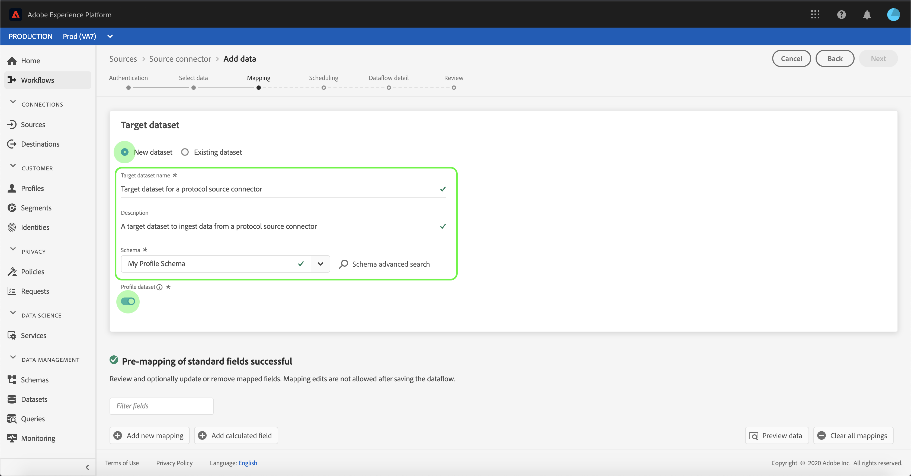
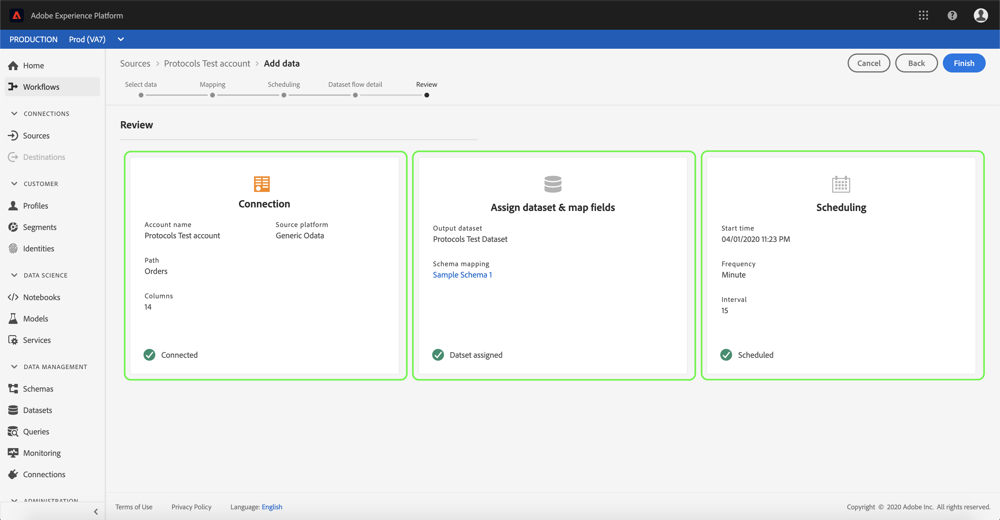
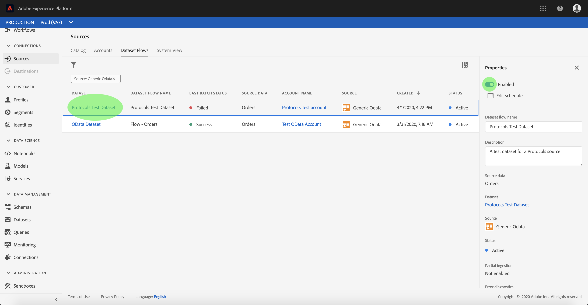

# UIでのプロトコルコネクタのデータフローの設定

データフローとは、ソースからAdobe Experience Platformデータセットにデータを取得し、取り込むスケジュール済みタスクです。 このチュートリアルでは、プロトコルアカウントを使用して新しいデータフローを構成する手順を説明します。

## はじめに

このチュートリアルは、Adobe Experience Platform の次のコンポーネントを実際に利用および理解しているユーザーを対象としています。

- [[!DNL Experience Data Model (XDM)] システム](../../../../xdm/home.md):顧客体験データを [!DNL Experience Platform] 整理する際に使用される標準化されたフレームワーク。
   - [スキーマ構成の基本](../../../../xdm/schema/composition.md)：スキーマ構成の主要な原則やベストプラクティスなど、XDM スキーマの基本的な構成要素について学びます。
   - [スキーマエディタのチュートリアル](../../../../xdm/tutorials/create-schema-ui.md):スキーマエディターのUIを使用してカスタムスキーマを作成する方法を説明します。
- [[!DNL Real-time Customer Profile]](../../../../profile/home.md):複数のソースからの集計データに基づいて、統合されたリアルタイムの消費者プロファイルを提供します。

また、このチュートリアルでは、既にプロトコルアカウントを作成している必要があります。 UIで異なるプロトコルコネクタを作成するためのチュートリアルのリストは、 [ソースコネクタの概要](../../../home.md)。

## データの選択

プロトコルのアカウントを作成すると、「 **[!UICONTROL データの選択]** 」の手順が表示され、ファイル階層を調べるためのインタラクティブインターフェイスが提供されます。

- インターフェイスの左半分はディレクトリブラウザーで、サーバーのファイルとディレクトリが表示されます。
- インターフェイスの右半分を使用すると、互換性のあるファイルから最大100行のデータをプレビューできます。

ページ上部の **[!UICONTROL 検索]** ・オプションを使用すると、使用するソース・データをすばやく特定できます。

>[!NOTE]
>
>「ソースデータの検索」オプションは、Analytics、分類、イベントハブおよびKinesisのコネクタを除く、すべての表形式ベースのソースコネクタで使用できます。

ソースデータを見つけたら、ディレクトリを選択し、「 **[!UICONTROL 次へ]**」をクリックします。

## データフィールドのXDMスキーマへのマッピング

「 **[!UICONTROL マッピング]** 」の手順が表示され、ソースデータをデータセットにマッピングするインタラクティブなインターフェイスが提供され [!DNL Platform] ます。

取り込む受信データのデータセットを選択します。 既存のデータセットを使用することも、新しいデータセットを作成することもできます。

### 既存のデータセットを使用する

既存のデータセットにデータを取り込むには、「 **[!UICONTROL Use existing dataset]**」を選択し、データセットアイコンをクリックします。

The **[!UICONTROL Select dataset]** dialog appears. 使用するデータセットを見つけて選択し、「 **[!UICONTROL 続行]**」をクリックします。

### 新しいデータセットの使用

データを新しいデータセットに取り込むには、「 **[!UICONTROL 新しいデータセットを]** 作成」を選択し、表示されるフィールドにデータセットの名前と説明を入力します。

スキーマフィールドを添付するには、[ **[!UICONTROL スキーマの]** 選択]検索バーにスキーマ名を入力します。 ドロップダウンアイコンを選択して、既存のスキーマのリストを表示することもできます。 または、「 **[!UICONTROL アドバンス検索]** 」を選択して、既存のスキーマの各詳細を含む画面にアクセスすることもできます。

この手順では、データセットを有効にし、エンティティの属性 [!DNL Real-time Customer Profile] と行動を総合的に表示できます。 すべての有効なデータセットのデータはに含まれ、データフローを保存する際 [!DNL Profile] に変更が適用されます。

ターゲットデータセットを有効にするには、 **[!UICONTROL プロファイルデータセット]** ボタンを切り替え [!DNL Profile]ます。

The **[!UICONTROL Select schema]** dialog appears. 新しいデータセットに適用するスキーマを選択し、「 **[!UICONTROL 完了]**」をクリックします。

必要に応じて、フィールドを直接マップするか、マッパー関数を使用してソースデータを変換し、計算値や計算値を抽出することができます。 データマッピングおよびマッパーの機能について詳しくは、CSVデータのXDMスキーマフィールドへの [マッピングに関するチュートリアルを参照してください](../../../../ingestion/tutorials/map-a-csv-file.md)。

>[!TIP]
>
>[!DNL Platform] 選択したターゲットスキーマまたはデータセットに基づいて、自動マップされたフィールドに高度な推奨機能を提供します。 使用事例に合わせて手動でマッピングルールを調整できます。

選択したデータセットから最大100行のサンプルデータのマッピング結果を表示するには、 **[!UICONTROL プレビューデータ]** (Data Select Data)を選択します。

マッピング結果を検証する際に必要な重要な情報なので、プレビュー時に、ID列が最初のフィールドとして優先付けされます。

ソースデータがマッピングされたら、「 **[!UICONTROL 閉じる]**」を選択します。

## インジェストのスケジュール設定

[ **[!UICONTROL スケジュール]** ]ステップが表示され、設定済みのマッピングを使用して選択したソースデータを自動的に取り込むように取り込みスケジュールを設定できます。 次の表に、スケジュール設定用の様々な設定可能フィールドの概要を示します。

| フィールド | 説明 |
| --- | --- |
| 頻度 | 選択可能な周波数 `Once`には、、、、、、、、、、が含ま `Minute`れ `Hour``Day``Week`ます。 |
| 間隔 | 選択した頻度の間隔を設定する整数。 |
| 開始時間 | 最初の取り込みがいつ行われるかを示すUTCタイムスタンプ。 |
| 埋め戻し | 最初に取り込まれるデータを決定するboolean値です。 [ **[!UICONTROL バックフィル]** ]を有効にすると、指定したパスにある現在のファイルは、最初にスケジュールされた取り込み中にすべて取り込まれます。 [ **[!UICONTROL バックフィル]** ]を無効にすると、最初の取り込み実行から開始時間の間に読み込まれたファイルのみが取り込まれます。 開始時間より前に読み込まれたファイルは取り込まれません。 |
| 差分列 | タイプ、日付または時間のフィルターされたソーススキーマフィールドセットを含むオプションです。 このフィールドは、新規データと既存データを区別するために使用します。 増分データは、選択した列のタイムスタンプに基づいて取り込まれます。 |

データフローは、スケジュールに基づいてデータを自動的に取り込むように設計されています。 開始するには、取り込み頻度を選択します。 次に、2つのフローの実行間隔を指定する間隔を設定します。 間隔の値は、0以外の整数で、15以上に設定する必要があります。

取り込みの開始時間を設定するには、開始時間ボックスに表示される日時を調整します。 または、カレンダーアイコンを選択して、開始時間の値を編集することもできます。 開始時刻は、現在のUTC時刻以上にする必要があります。

「 **[!UICONTROL Load incremental data by]** 」を選択して、delta列を割り当てます。 このフィールドは、新規データと既存データの区別を示します。

### 1回のみの取り込みデータフローの設定

1回のみの取り込みを設定するには、頻度ドロップダウン矢印を選択し、「 **[!UICONTROL 1回]**」を選択します。

>[!TIP]
>
>**[!UICONTROL 1回限りの取り込みでは]** 、Intervalと **[!UICONTROL Backfill]** は表示されません。

スケジュールに適切な値を入力したら、「 **[!UICONTROL 次へ]**」を選択します。

## データフローの詳細の指定

「 **[!UICONTROL Dataflow detail]** 」ステップが表示され、新しいデータフローに関する名前を付け、簡単な説明を入力できます。

このプロセス中に、 **[!UICONTROL 部分的な取り込み]** 、 **[!UICONTROL エラー診断も有効にできます]**。 Enabling **[!UICONTROL Partial ingestion]** provides the ability to ingest data containing errors up to a certain threshold. [ **[!UICONTROL 部分的な取り込み]** ]が有効になったら **[!UICONTROL 、[]** エラーしきい値%]ダイヤルをドラッグして、バッチのエラーしきい値を調整します。 または、入力ボックスを選択して手動でしきい値を調整することもできます。 詳しくは、 [部分的なバッチインジェストの概要を参照してください](../../../../ingestion/batch-ingestion/partial.md)。

データフローの値を指定し、「 **[!UICONTROL Next]**」を選択します。

## データフローの確認

「 **[!UICONTROL レビュー]** 」ステップが表示され、新しいデータフローを作成前に確認できます。 詳細は次のカテゴリに分類されます。

- **[!UICONTROL 接続]**:ソースの種類、選択したソースファイルの関連パス、およびそのソースファイル内の列数が表示されます。
- **[!UICONTROL データセットとマップのフィールドの割り当て]**:ソースデータが取り込まれるデータセット(データセットに従うスキーマなど)を示します。
- **[!UICONTROL スケジュール]**:取り込みスケジュールの有効期間、頻度、間隔を表示します。

データフローをレビューしたら、 **[!UICONTROL 「Finish]** 」をクリックし、データフローを作成するまでの時間を設定します。

## データフローの監視

データフローを作成したら、データフローを介して取り込まれるデータを監視し、取り込み率、成功、エラーに関する情報を確認できます。 データフローの監視方法の詳細については、「UIでのアカウントとデータフローの [監視に関するチュートリアル](../monitor.md)」を参照してください。

## データフローの削除

不要になったデータフローや誤って作成されたデータフローは、 **[!UICONTROL データフロー]** ・ワークスペースで使用可能な **[!UICONTROL 削除]** 機能を使用して削除できます。 データフローの削除方法の詳細については、UIでのデータフローの [削除に関するチュートリアルを参照してください](../delete.md)。

## 次の手順

このチュートリアルに従うと、マーケティング自動化システムからデータを取り込むためのデータフローが正しく作成され、監視データセットに関する洞察が得られます。 受信データは、やなどのダウンストリーム [!DNL Platform] サービスで使用でき [!DNL Real-time Customer Profile] るようになり [!DNL Data Science Workspace]ました。 詳しくは、次のドキュメントを参照してください。

- [[!DNL Real-time Customer Profile] 概要](../../../../profile/home.md)
- [[!DNL Data Science Workspace] 概要](../../../../data-science-workspace/home.md)

## 付録

以下の節では、ソースコネクタを使用する場合の追加情報について説明します。

### データフローの無効化

データフローが作成されると、そのデータはすぐにアクティブになり、指定されたスケジュールに従ってデータを取り込みます。 アクティブなデータフローは、次の手順に従っていつでも無効にできます。

[ **[!UICONTROL データフロー]** ]画面で、無効にするデータフローの名前を選択します。

「 **[!UICONTROL プロパティ]** 」列が画面の右側に表示されます。 このパネルには、「 **[!UICONTROL 有効]** 」切り替えボタンが含まれています。 切り替えボタンをクリックして、データフローを無効にします。 同じ切り替えを使用して、データフローを無効にした後で再び有効にできます。

### 母集団の受信データを有効にし [!DNL Profile] ます

ソースコネクタから受信するデータは、データの富化と埋め込みに使用でき [!DNL Real-time Customer Profile] ます。 データの入力について詳しくは、 [!DNL Real-time Customer Profile][プロファイルの入力に関するチュートリアルを参照してください](../profile.md)。