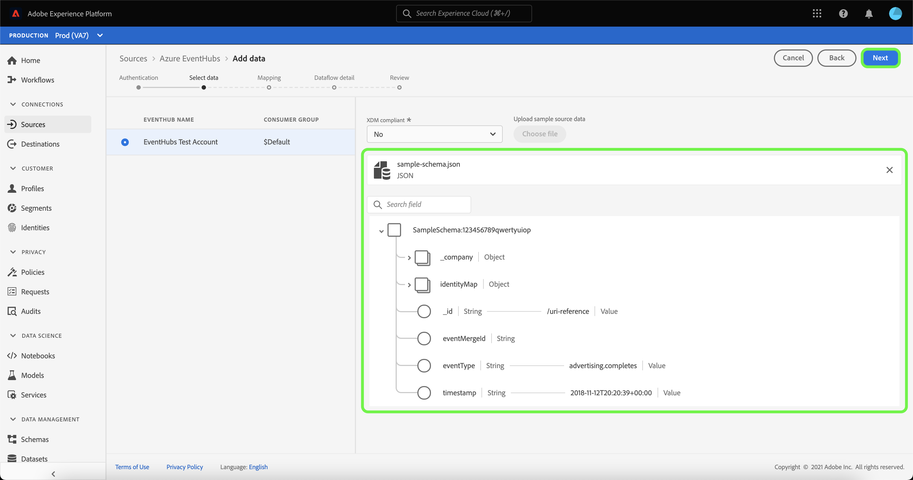

# UI でのクラウドストレージソースのストリーミングデータフローの作成

データフローは、ソースからAdobe Experience Platformデータセットにデータを取得して取り込むスケジュール済みタスクです。 このチュートリアルでは、UI でクラウドストレージソースのストリーミングデータフローを作成する手順を説明します。

このチュートリアルを試す前に、まずクラウドストレージアカウントと Platform の間に有効で認証済みの接続を確立する必要があります。 認証済みの接続がまだない場合は、次のチュートリアルのいずれかを参照して、ストリーミングクラウドストレージアカウントの認証に関する情報を確認してください。

- [[!DNL Amazon Kinesis]](../../../ui/create/cloud-storage/kinesis.md)
- [[!DNL Azure Event Hubs]](../../../ui/create/cloud-storage/eventhub.md)
- [[!DNL Google PubSub]](../../../ui/create/cloud-storage/google-pubsub.md)

## はじめに

このチュートリアルは、Adobe Experience Platform の次のコンポーネントを実際に利用および理解しているユーザーを対象としています。

- [データフロー](../../../../../dataflows/home.md)：データフローは、Platform 間でデータを移動するデータジョブを表します。データフローは、ソースから [!DNL Identity Service]、[!DNL Profile]、および [!DNL Destinations] まで、様々なサービスで設定されます。
- [Data Prep](../../../../../data-prep/home.md)：Data Prep を使用すると、データエンジニアはエクスペリエンスデータモデル（XDM）との間でデータのマッピング、変換、検証をおこなうことができます。Data Prep は、CSV 取得ワークフローなどのデータ取得プロセスで「マッピング」手順として表示されます。
- [[!DNL Experience Data Model (XDM)] システム](../../../../../xdm/home.md):顧客体験データを整理する際に使用す [!DNL Experience Platform] る標準化されたフレームワーク。
   - [スキーマ構成の基本](../../../../../xdm/schema/composition.md)：スキーマ構成の主要な原則やベストプラクティスなど、XDM スキーマの基本的な構成要素について学びます。
   - [スキーマエディターのチュートリアル](../../../../../xdm/tutorials/create-schema-ui.md):スキーマエディターの UI を使用してカスタムスキーマを作成する方法を説明します。
- [[!DNL Real-time Customer Profile]](../../../../../profile/home.md)：複数のソースからの集計データに基づいて、統合されたリアルタイムの顧客プロファイルを提供します。

## データの追加

認証するストリーミングクラウドストレージアカウントを作成した後、**[!UICONTROL データを選択]** 手順が表示され、Platform に取り込むデータストリームを選択するためのインターフェイスが表示されます。

- インターフェイスの左側は、アカウント内で使用可能なデータストリームを表示できるブラウザーです。
- インターフェイスの右側では、JSON ファイルから最大 100 行のデータをプレビューできます。

使用するデータストリームを選択し、「**[!UICONTROL ファイル]** を選択」を選択して、サンプルスキーマをアップロードします。

>[!TIP]
>
>データが XDM に準拠している場合は、サンプルスキーマのアップロードをスキップし、「**[!UICONTROL 次へ]**」を選択して次に進むことができます。

スキーマのアップロードが完了すると、プレビューのインターフェイスが更新され、アップロードしたスキーマのプレビューが表示されます。 プレビューインターフェイスを使用すると、ファイルの内容と構造を検査できます。 [!UICONTROL  検索フィールド ] ユーティリティを使用して、スキーマ内の特定の項目にアクセスすることもできます。

終了したら、「**[!UICONTROL 次へ]**」を選択します。

## マッピング

**[!UICONTROL マッピング]** 手順が表示され、ソースデータを Platform データセットにマッピングするためのインターフェイスが提供されます。

取り込む受信データのデータセットを選択します。 既存のデータセットを使用するか、新しく作成できます。

### 新しいデータセット

データを新しいデータセットに取り込むには、**[!UICONTROL New dataset]** を選択し、指定したフィールドにデータセットの名前と説明を入力します。 スキーマを追加するには、**[!UICONTROL スキーマを選択]** ダイアログボックスで既存のスキーマ名を入力します。 または、「**[!UICONTROL スキーマ詳細検索]**」を選択して、適切なスキーマを検索できます。

[!UICONTROL  スキーマを選択 ] ウィンドウが開き、選択可能なスキーマのリストが表示されます。 リストからスキーマを選択して、選択したスキーマに固有の詳細（スキーマが [!DNL Profile] に対して有効になっているかどうかに関する情報など）を表示するように右側のパネルを更新します。

使用するスキーマを特定して選択したら、「**[!UICONTROL 完了]**」を選択します。

[!UICONTROL Target データセット ] ページは、選択したスキーマがデータセットの一部として表示された状態で更新されます。 この手順の間に、[!DNL Profile] のデータセットを有効にし、エンティティの属性と動作の全体像を作成できます。 有効なすべてのデータセットのデータは [!DNL Profile] に含まれ、変更はデータフローの保存時に適用されます。

「**[!UICONTROL プロファイルデータセット]**」ボタンを切り替えて、[!DNL Profile] のターゲットデータセットを有効にします。

### 既存のデータセット

データを既存のデータセットに取り込むには、**[!UICONTROL 既存のデータセット]** を選択し、データセットのアイコンを選択します。

**[!UICONTROL データセットを選択]** ダイアログが表示され、選択できるデータセットのリストが表示されます。 リストからデータセットを選択し、選択したデータセットに固有の詳細（[!DNL Profile] に対してデータセットを有効にできるかどうかの情報など）を表示するように右側のパネルを更新します。

使用するデータセットを特定して選択したら、「**[!UICONTROL 完了]**」を選択します。

データセットを選択したら、[!DNL Profile] 切り替えを選択して [!DNL Profile] のデータセットを有効にします。

### 標準フィールドのマッピング

データセットとスキーマが確立されると、**[!UICONTROL 標準フィールドのマッピング]** インターフェイスが表示され、データのマッピングフィールドを手動で設定できます。

>[!TIP]
>
>Platform は、選択したターゲットスキーマまたはデータセットに基づいて、自動マッピングされたフィールドに対してインテリジェントな推奨事項を提供します。 マッピングルールは、使用例に合わせて手動で調整できます。

必要に応じて、フィールドを直接マッピングするか、データ準備関数を使用してソース・データを変換し、計算済値または計算済値を取得できます。 マッパー関数と計算フィールドの詳細については、『[ データ準備関数ガイド ](../../../../../data-prep/functions.md)』または『[ 計算フィールドガイド ](../../../../../data-prep/calculated-fields.md)』を参照してください。

ソースデータがマッピングされたら、「**[!UICONTROL 次へ]**」を選択します。

## データフローの詳細

**[!UICONTROL データフローの詳細]** 手順が表示され、新しいデータフローに名前を付け、簡単な説明を入力できます。

データフローの値を指定し、「**[!UICONTROL 次へ]**」を選択します。

### レビュー

「**[!UICONTROL レビュー]**」手順が表示され、新しいデータフローを作成前に確認できます。 詳細は、次のカテゴリに分類されます。

- **[!UICONTROL 接続]**:アカウント名、ソースのタイプ、および使用しているストリーミングクラウドストレージソースに固有のその他の情報が表示されます。
- **[!UICONTROL データセットとマップのフィールドの割り当て]**:データフローに使用しているターゲットデータセットとスキーマが表示されます。

データフローをレビューしたら、「**[!UICONTROL Finish]**」を選択し、データフローの作成に時間を割きます。

## データフローの監視と削除

ストリーミングクラウドストレージのデータフローを作成したら、そのデータフローを介して取り込まれるデータを監視できます。 ストリーミングデータフローの監視と削除の詳細については、[ ストリーミングデータフローの監視 ](../../monitor-streaming.md) に関するチュートリアルを参照してください。

## 次の手順

このチュートリアルに従って、クラウドストレージソースからデータをストリーミングするデータフローを正常に作成しました。 受信データは、[!DNL Real-time Customer Profile] や [!DNL Data Science Workspace] など、ダウンストリームの Platform サービスで使用できるようになりました。 詳しくは、次のドキュメントを参照してください。

- [[!DNL Real-time Customer Profile] の概要](../../../../../profile/home.md)
- [[!DNL Data Science Workspace] の概要](../../../../../data-science-workspace/home.md)