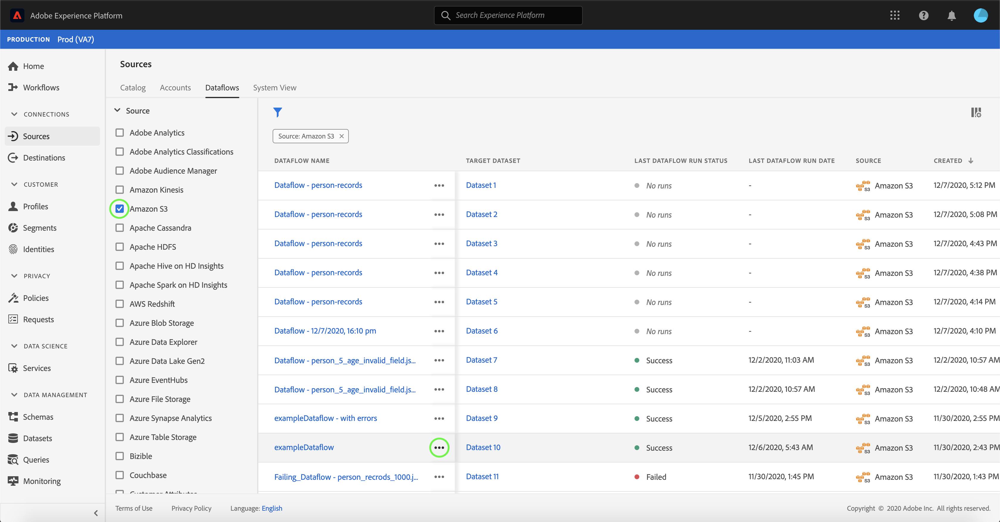

# UI でのデータフローの削除

「[!UICONTROL Sources]」ワークスペースでは、エラーを含む、または古くなった既存のバッチおよびストリーミングデータフローを削除できます。

このチュートリアルでは、[!UICONTROL Sources] ワークスペースを使用してデータフローを削除する手順を説明します。

## はじめに

このチュートリアルは、Adobe Experience Platform の次のコンポーネントを実際に利用および理解しているユーザーを対象としています。

- [ソース](../../home.md): [!DNL Experience Platform] を使用すると、様々なソースからデータを取り込みながら、サービスを使用して、受信データの構造化、ラベル付け、強化をおこなうことがで [!DNL Platform] きます。
- [サンドボックス](../../../sandboxes/home.md)：[!DNL Experience Platform] は、単一の [!DNL Platform] インスタンスを別々の仮想環境に分割して、デジタルエクスペリエンスアプリケーションの開発と発展を支援する仮想サンドボックスを提供します。

## データフローの削除

[Experience PlatformUI](https://platform.adobe.com) で、左のナビゲーションから「**[!UICONTROL Sources]**」を選択して [!UICONTROL Sources] ワークスペースにアクセスし、上部のヘッダーから「**[!UICONTROL Dataflows]**」を選択します。

**[!UICONTROL データフロー]** ページが表示されます。 このページには、表示可能なデータフローのリストがあります。このリストには、ターゲット・データセット、ソース、アカウント名、作成日に関する情報が含まれます。

左上のフィルターアイコン () を選択して、並べ替えパネルを起動します。

並べ替えパネルには、すべてのソースのリストが表示されます。 リストから複数のソースを選択して、選択した特定のソースに関連付けられたフィルタ選択のデータフローにアクセスできます。

既存のデータフローのリストを表示するために使用するソースを選択します。 削除するデータフローを特定したら、データフロー名の横にある省略記号 (`...`) を選択します。

ドロップダウン・メニューが表示され、データフローのスケジュールを編集、データフローを無効化、または完全に削除するオプションが表示されます。

「**[!UICONTROL 削除]**」を選択して、データフローを削除します。

最終的な確認ダイアログボックスが表示されます。 「**[!UICONTROL 削除]**」を選択してプロセスを完了します。

しばらくすると、画面の下部に、削除が正常に完了したことを確認する確認ボックスが表示されます。

## 次の手順

このチュートリアルでは、[!UICONTROL Sources] ワークスペースを使用して既存のデータフローを削除しました。

API 呼び出しを使用してこれらの操作をプログラムで実行する手順については、[ フローサービス API](../../tutorials/api/delete-dataflows.md) を使用したデータフローの削除に関するチュートリアルを参照してください。
